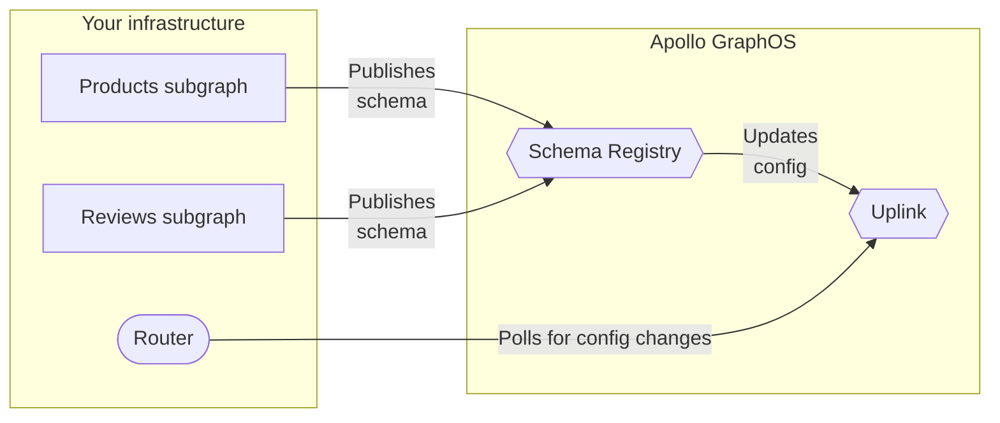

```mermaid
graph LR;
  subgraph "Your infrastructure"
  serviceA[Products subgraph];
  serviceB[Reviews subgraph];
  router([Router]);
  end
  subgraph "Apollo GraphOS"
  registry{{Schema Registry}};
  uplink{{Uplink}}
  end
  serviceA & serviceB -->|"Publishes<br/>schema"| registry;
  registry -->|"Updates<br/>config"| uplink;
  router -->|Polls for config changes| uplink;
  class registry secondary;
  class uplink secondary;
```
