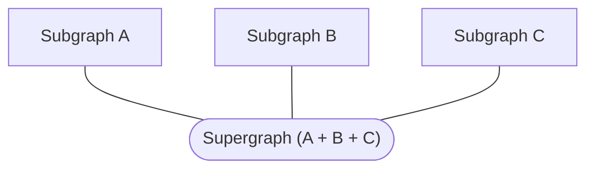
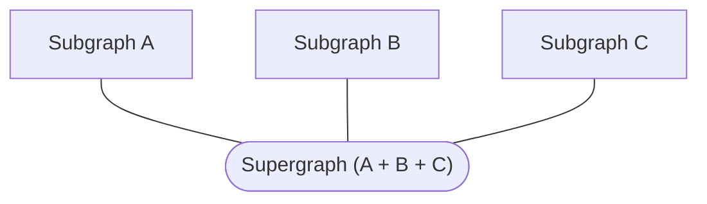

import {Button} from '@apollo/space-kit/Button';
import {Link} from 'gatsby';
import {ExpansionPanel} from 'gatsby-theme-apollo-docs';

Hello! This tutorial gets you up and running with Apollo Federation. It uses some Apollo tools and terminology that are still in **preview**, and therefore this content is not yet recommended for use in a production environment.

We expect these tools to leave preview soon, so this tutorial is a great way to begin learning about federation using upcoming best practices.

> **This tutorial requires Node.js version 12 or later.** 

## Federation concepts

In a federated architecture, multiple GraphQL APIs are **composed** into a single federated data graph. The individual APIs are called **subgraphs**, and they're composed into a **supergraph**:



Usually, each subgraph corresponds to a different service in your backend. The supergraph is then represented by a **gateway**, which routes each incoming query to the appropriate combination of subgraphs.

The supergraph's schema is the combination of each subgraph's schema, plus some special federation-specific directives. This architecture enables clients to query data from multiple subgraphs simultaneously, just by querying the supergraph.

## 1. Install the Rover CLI

**Rover** is Apollo's new CLI for managing data graphs, including federated ones. It is currently in preview.

<p><a href="https://www.apollographql.com/docs/rover/getting-started/#installation-methods" target="_blank">Install Rover</a></p>

After installing, run `rover` in your terminal with no arguments to confirm that it installed successfully. We'll use various Rover commands in later steps.

## 2. Create a gateway

> You can also [clone our example gateway on GitHub](https://github.com/apollographql/supergraph-demo)

As mentioned in the [preface](#preface-federated-architecture), your federated supergraph is represented by a **gateway** that routes queries to various subgraphs. For this tutorial, we'll use some Apollo-hosted example services as our subgraphs, and we'll set up our own gateway in front of them.

With the help of the `@apollo/gateway` library, [Apollo Server](https://www.apollographql.com/docs/apollo-server/) can act as our federated gateway.

In a new Node.js project, first install the required libraries:

```
npm install apollo-server @apollo/gateway
```

Then paste the following into an `index.js` file as a minimal (not-yet-functional) gateway implementation:

```js{4,7}:title=index.js
const { ApolloServer } = require('apollo-server');
const { ApolloGateway } = require('@apollo/gateway');

const supergraphSchema = ''; // TODO!

const gateway = new ApolloGateway({
  supergraphSdl: supergraphSchema
});

const server = new ApolloServer({
  gateway,
  // Subscriptions are not currently supported in Apollo Federation
  subscriptions: false
});

server.listen().then(({ url }) => {
  console.log(`🚀 Gateway ready at ${url}`);
}).catch(err => {console.error(err)});
```

This code demonstrates the basic flow for creating a gateway:

1. We initialize an `ApolloGateway` instance and pass it the complete composed schema for our supergraph.
    * _Note the `TODO`. We'll obtain the schema in the next section._

2. We initialize an `ApolloServer` instance and pass it our gateway via the `gateway` option.
    * _We also disable `subscriptions` because they aren't yet supported in Apollo Federation._

3. We call `listen` on our server instance to begin listening for incoming requests.

If we run this code as-is with `node index.js`, we get an error:

```
This data graph is missing a valid configuration. Syntax Error: Unexpected <EOF>.
```

That's because our `supergraphSchema` is currently empty! Next, we'll compose that schema.

## 3. Compose the supergraph schema

There are multiple ways to compose a supergraph schema from our subgraph schemas:

* On our local machine using the Rover CLI (we'll start with this)
* Via managed federation in Apollo Studio (we'll switch to this in a later section)

Using managed federation is strongly recommended for production environments. We'll start with local composition just to get up and running.

### Obtaining subgraph details

To compose our supergraph schema, we need the following information about each of our subgraphs:

* The subgraph's schema
* The URL of the subgraph's GraphQL endpoint (which must be accessible by the gateway)

Because we're using Apollo-hosted example services for our subgraphs, we know their endpoint URLs. We _don't_ have their schemas, however.

#### Fetching subgraph schemas

We can fetch a running subgraph's schema by executing an enhanced introspection query on it. The Rover CLI provides a command to do exactly that.

Run the following command in your terminal:

```shell
rover subgraph introspect https://7bssbnldib.execute-api.us-east-1.amazonaws.com/Prod/graphql
```

Rover introspects Apollo's example `products` service and outputs the following schema:

<ExpansionPanel title="Click to expand">

```graphql
enum CURRENCY_CODE {
  USD
}

type Department {
  category: ProductCategory
  url: String
}

type Money {
  amount: Float
  currencyCode: CURRENCY_CODE
}

"""Here are some helpful details about your type"""
type Price {
  cost: Money

  """A number between 0 and 1 signifying the % discount"""
  deal: Float
  dealSavings: Money
}

"""
This is an Entity, docs:https://www.apollographql.com/docs/federation/entities/
You will need to define a __resolveReference resolver for the type you define, docs: https://www.apollographql.com/docs/federation/entities/#resolving
"""
type Product @key(fields: "id") {
  id: ID!
  title: String
  url: String
  description: String
  price: Price
  salesRank(category: ProductCategory = ALL): Int
  salesRankOverall: Int
  salesRankInCategory: Int
  category: ProductCategory
  images(size: Int = 1000): [String]
  primaryImage(size: Int = 1000): String
}

enum ProductCategory {
  ALL
  GIFT_CARDS
  ELECTRONICS
  CAMERA_N_PHOTO
  VIDEO_GAMES
  BOOKS
  CLOTHING
}

extend type Query {
  bestSellers(category: ProductCategory = ALL): [Product]
  categories: [Department]
  product(id: ID!): Product
}
```

</ExpansionPanel>

Now from your project directory, run that same command, but this time append ` > products.graphql`. This writes the subgraph's schema to a file instead of printing it to your terminal.

Next, do the same thing for the _second_ subgraph (`reviews`), this time writing it to `reviews.graphql`:

```shell
rover subgraph introspect https://w0jtezo2pa.execute-api.us-east-1.amazonaws.com/Prod/graphql > reviews.graphql
```

Great! We now have the schemas for our two subgraphs.

### Providing subgraph details

After we obtain our subgraph schemas and URLs, we need to provide them to the Rover CLI. To do that, we add them to a YAML file in our project directory.

Create a file called `supergraph.yaml` and paste the following into it:

```yaml
subgraphs:
  products:
    routing_url: https://7bssbnldib.execute-api.us-east-1.amazonaws.com/Prod/graphql
    schema:
      file: ./products.graphql
  reviews:
    routing_url: https://w0jtezo2pa.execute-api.us-east-1.amazonaws.com/Prod/graphql
    schema:
      file: ./reviews.graphql
```

### Performing composition

Now that we have all of the information we need, we can compose our supergraph schema. To do that, we'll use another Rover command: `supergraph compose`.

Run the following from your project directory:

```shell
rover supergraph compose --config ./supergraph.yaml
```

This time, Rover outputs the following schema:

<ExpansionPanel title="Click to expand">

```graphql
schema
  @core(feature: "https://lib.apollo.dev/core/v0.1"),
  @core(feature: "https://lib.apollo.dev/join/v0.1")
{
  query: Query
}

directive @core(feature: String!) repeatable on SCHEMA

directive @join__field(graph: join__Graph, requires: join__FieldSet, provides: join__FieldSet) on FIELD_DEFINITION

directive @join__type(graph: join__Graph!, key: join__FieldSet) repeatable on OBJECT | INTERFACE

directive @join__owner(graph: join__Graph!) on OBJECT | INTERFACE

directive @join__graph(name: String!, url: String!) on ENUM_VALUE

enum CURRENCY_CODE {
  USD
}

type Department {
  category: ProductCategory
  url: String
}

scalar join__FieldSet

enum join__Graph {
  PRODUCTS @join__graph(name: "products" url: "https://7bssbnldib.execute-api.us-east-1.amazonaws.com/Prod/graphql")
  REVIEWS @join__graph(name: "reviews" url: "https://w0jtezo2pa.execute-api.us-east-1.amazonaws.com/Prod/graphql")
}

type Money {
  amount: Float
  currencyCode: CURRENCY_CODE
}

"""Here are some helpful details about your type"""
type Price {
  cost: Money

  """A number between 0 and 1 signifying the % discount"""
  deal: Float
  dealSavings: Money
}

"""
This is an Entity, docs:https://www.apollographql.com/docs/federation/entities/
You will need to define a __resolveReference resolver for the type you define, docs: https://www.apollographql.com/docs/federation/entities/#resolving
"""
type Product
  @join__owner(graph: PRODUCTS)
  @join__type(graph: PRODUCTS, key: "id")
  @join__type(graph: REVIEWS, key: "id")
{
  id: ID! @join__field(graph: PRODUCTS)
  title: String @join__field(graph: PRODUCTS)
  url: String @join__field(graph: PRODUCTS)
  description: String @join__field(graph: PRODUCTS)
  price: Price @join__field(graph: PRODUCTS)
  salesRank(category: ProductCategory = ALL): Int @join__field(graph: PRODUCTS)
  salesRankOverall: Int @join__field(graph: PRODUCTS)
  salesRankInCategory: Int @join__field(graph: PRODUCTS)
  category: ProductCategory @join__field(graph: PRODUCTS)
  images(size: Int = 1000): [String] @join__field(graph: PRODUCTS)
  primaryImage(size: Int = 1000): String @join__field(graph: PRODUCTS)
  reviews: [Review] @join__field(graph: REVIEWS)
  reviewSummary: ReviewSummary @join__field(graph: REVIEWS)
}

enum ProductCategory {
  ALL
  GIFT_CARDS
  ELECTRONICS
  CAMERA_N_PHOTO
  VIDEO_GAMES
  BOOKS
  CLOTHING
}

type Query {
  bestSellers(category: ProductCategory = ALL): [Product] @join__field(graph: PRODUCTS)
  categories: [Department] @join__field(graph: PRODUCTS)
  product(id: ID!): Product @join__field(graph: PRODUCTS)
}

"""
This is an Entity, docs:https://www.apollographql.com/docs/federation/entities/
You will need to define a __resolveReference resolver for the type you define, docs: https://www.apollographql.com/docs/federation/entities/#resolving
"""
type Review
  @join__owner(graph: REVIEWS)
  @join__type(graph: REVIEWS, key: "id")
{
  id: ID! @join__field(graph: REVIEWS)
  rating: Float @join__field(graph: REVIEWS)
  content: String @join__field(graph: REVIEWS)
}

type ReviewSummary {
  totalReviews: Int
  averageRating: Float
}
```

</ExpansionPanel>

As you can see, this composed schema includes all of the types and fields from our subgraph schemas, along with many additional directives to support our federated architecture.

Similar to what we did with our subgraph schemas, now append ` > supergraph.graphql` to the above command to write the composed schema to a file.

## 4. Start the gateway

We can now edit our `index.js` file to pull in our composed schema. Replace the file's contents with the following:

```js:title=index.js
const { ApolloServer } = require('apollo-server');
const { ApolloGateway } = require('@apollo/gateway');
const { readFileSync } = require('fs');

const supergraphSchema = readFileSync('./supergraph.graphql').toString();

const gateway = new ApolloGateway({
  supergraphSdl: supergraphSchema
});

const server = new ApolloServer({
  gateway,
  // Subscriptions are not currently supported in Apollo Federation
  subscriptions: false
});

server.listen().then(({ url }) => {
  console.log(`🚀 Gateway ready at ${url}`);
}).catch(err => {console.error(err)});
```

Now with our `supergraphSchema` properly populated, let's start up the gateway again with `node index.js`. This time, there's no error!

We can quickly open our browser to `localhost:4000` to view our composed schema in GraphQL Playground:

[Screenshot]

Nice job! Our supergraph gateway is running locally and communicating with Apollo-hosted subgraphs.

## 5. Move composition to Apollo Studio

## Authenticate Rover with Apollo Studio

After you install Rover, you need to authenticate it with Apollo Studio. To do this, you need an **API key**.

#### Obtain an API key

All Rover commands that communicate with [Apollo Studio](https://www.apollographql.com/docs/studio/) require an API key to do so. Studio supports two types of API keys: **personal API keys** and **graph API keys**.

* **On your local development machine,** use a personal API key.
* **In shared environments like CI,** use a graph API key.

> [Learn how to obtain an API key](https://www.apollographql.com/docs/studio/api-keys/)

#### Provide the API key to Rover

Run the following command:

```shell
rover config auth
```

Provide your API key to the command when prompted.


## 1. Sign in to Apollo Studio

If you don’t have an Apollo Studio account, create one with the following steps:

1. Go to [studio.apollographql.com](https://studio.apollographql.com/) and click **Create an account**.

    _You can sign up with either your GitHub identity or a username and password._

2. Complete the signup flow, which includes:

    * Creating an organization that you can invite teammates to

    * [Selecting a plan](https://www.apollographql.com/pricing/) for your organization (the Free plan is always free, and the Team plan provides a free trial of paid features)

## 2. Create a graph in Studio

In Studio, each **graph** corresponds to a data graph and its associated GraphQL schema.

1. Visit [studio.apollographql.com](https://studio.apollographql.com/) again. Now that you have an account, this opens Studio.

    _The list of organizations you belong to appears in the left column._

2. Select the organization that you want to add your graph to. Then, click **New Graph** in the upper right.

3. Specify a name for your graph and click **Next**.

    * A graph's name must be globally unique across all of Studio. We recommend using a consistent prefix across all of your organization's graphs.

4. Studio displays instructions for registering your schema, which is also covered in a later step. 


## 4. Register your subgraphs

Apollo Federation is all about composing multiple GraphQL services (**subgraphs**) into a single federated graph (or **supergraph**):



To enable managed federation with Apollo, you register _each_ of your subgraph schemas. You can use Rover's `subgraph publish` command to do this:

```
rover subgraph publish <GRAPH_REF> \
  --profile <profile-name> \
  --routing-url <routing-url> \
  --schema <schema> \
  --name <subgraph>
```

Repeat this for each subgraph you want to include in your supergraph.

[See the docs for `subgraph publish`](https://www.apollographql.com/docs/rover/subgraphs/#publishing-a-subgraph-schema-to-apollo-studio)

## 5. Configure and deploy your gateway
**TODO: we need to consolidate the substeps here.**

First, let's install the necessary packages:

```shell
npm install @apollo/gateway apollo-server graphql
```

The `@apollo/gateway` package includes the [`ApolloGateway` class](/api/apollo-gateway/). To configure Apollo Server to act as a gateway, you pass an instance of `ApolloGateway` to the `ApolloServer` constructor, like so:

```js
const { ApolloServer } = require('apollo-server');
const { ApolloGateway } = require('@apollo/gateway');

// Initialize an ApolloGateway instance and pass it an array of
// your implementing service names and URLs
const gateway = new ApolloGateway({
  serviceList: [
    { name: 'accounts', url: 'http://localhost:4001' },
    // Define additional services here
  ],
});

// Pass the ApolloGateway to the ApolloServer constructor
const server = new ApolloServer({
  gateway,

  // Disable subscriptions (not currently supported with ApolloGateway)
  subscriptions: false,
});

server.listen().then(({ url }) => {
  console.log(`🚀 Server ready at ${url}`);
});
```

In the above example, we provide the `serviceList` configuration option to the `ApolloGateway` constructor. This array specifies a `name` and `url` for each of our implementing services. You can specify any string value for `name`, which is used primarily for query planner output, error messages, and logging.

> In production, we recommend running the gateway in a **managed mode** with Apollo Studio, which relies on static files rather than introspection. For details, see [Setting up managed federation](https://www.apollographql.com/docs/studio/managed-federation/setup/).

On startup, the gateway fetches each implementing service's schema from its `url` and composes those schemas into a single federated data graph. It then begins accepting incoming requests and creates query plans for them that execute across one or more services.

> If there are any composition errors, the `new ApolloServer` call throws an exception
> with a list of [validation errors](/errors/).


**TODO: reconcile the gateway setup (above) w/ managed federation setup docs (below) into a from-scratch setup of a gateway with managed federation.**

### Modify the gateway

> This section assumes you are using Apollo Server with the `@apollo/gateway` library as your gateway.

If you've already set up Apollo Federation _without_ Apollo Studio, the constructor of your `ApolloGateway` instance probably includes a `serviceList` option, like this:

```js
const gateway = new ApolloGateway({
  serviceList: [
    { name: 'Products', url: 'http://products-graphql.svc.cluster.local:4001/' },
    // Additional services defined here
  ],
});
```

This option specifies the name and URL for each of your graph's implementing services. With managed federation, this information is no longer hardcoded in the gateway's constructor! Instead, the gateway regularly polls Apollo for this information. This enables you to add and remove implementing services from your graph _without_ needing to restart your gateway.

Remove the `serviceList` argument from your `ApolloGateway` constructor entirely:

```js
const gateway = new ApolloGateway();
```

### Connect the gateway to Studio

Like your implementing services, your gateway uses an API key to identify itself to Studio.

> **API keys are secret credentials.** Never share them outside your organization or commit them to version control. Delete and replace API keys that you believe are compromised.

1. Go to [studio.apollographql.com](https://studio.apollographql.com/) and click the graph you want to obtain an API key for.

2. **If a "Publish your Schema" dialog appears**, select the **From Apollo Server** tab. Copy the value that appears after `APOLLO_KEY=` in the instructions (it begins with `service:`), and you're all set.

    **Otherwise**, proceed to the next step.

2. Open your graph's Settings page and scroll down to the API Keys section. Either copy an existing key or click **Create New Key**.

3. Optionally click the `…` button to the right of the API key to give it a name, such as `Production`. This helps you keep track of each API key's use.

4. Copy the key's value.

Provide your API key to your gateway by setting it as the value of the `APOLLO_KEY` environment variable (`ENGINE_API_KEY` in `apollo-server` pre-2.13.0) in your gateway's environment. Apollo Server will automatically read this environment variable on startup.

Note that if you specify the API key in a `.env` file, the gateway does _not_ automatically read this file. Use a library such as [`dotenv`](https://www.npmjs.com/package/dotenv).

> When running your gateway in an environment where outbound traffic to the internet is restricted, consult the [directions for configuring a proxy](https://www.apollographql.com/docs/apollo-server/proxy-configuration/) within Apollo Server.

### Deploy the modified gateway

You can now deploy your modified gateway to begin fetching your federated schema from Studio instead of directly from your services.

On startup, your gateway will use its API key to access its federation config from Google Cloud Storage. After it completes schema composition based on the config, the gateway can begin executing operations across your implementing services.


## Step 6: Report metrics and operations from your subgraph servers.

To take advantage of Studio’s observability and delivery capabilities you must enable request tracing.

Apollo Studio can ingest operation **traces** from your GraphQL server to provide performance metrics for your data graph. A trace corresponds to the execution of a single GraphQL operation, including a breakdown of the timing and error information for each field that's resolved as part of the operation.

Trace reporting enables you to visualize:

* Which operations are being executed
* Which clients are executing which operations
* Which parts of the schema are used most
* Which of your resolvers in the server are acting as bottlenecks

### Pushing traces from Apollo Server

Apollo Server has built-in support for pushing traces to Apollo Studio. To set it up, you provide it a **graph API key** from Studio.

> **API keys are secret credentials.** Never share them outside your organization or commit them to version control. Delete and replace API keys that you believe are compromised.

1. Go to [studio.apollographql.com](https://studio.apollographql.com/) and click the graph you want to obtain an API key for.

2. **If a "Publish your Schema" dialog appears**, select the **From Apollo Server** tab. Copy the value that appears after `APOLLO_KEY=` in the instructions (it begins with `service:`), and you're all set.

    **Otherwise**, proceed to the next step.

2. Open your graph's Settings page and scroll down to the API Keys section. Either copy an existing key or click **Create New Key**.

3. Optionally click the `…` button to the right of the API key to give it a name, such as `Production`. This helps you keep track of each API key's use.

4. Copy the key's value.

After you obtain a graph API key, assign it to the `APOLLO_KEY` environment variable (`ENGINE_API_KEY` prior to version 2.13.0 of Apollo Server) in your production server's environment.

> Consult your production environment's documentation to learn how to set its environment variables.

Now the next time you start your production server, it will automatically begin pushing trace data to Studio:

</img>

You can also push trace data from environments besides production, such as a staging or beta server. To keep this data separate from your production data, learn how to [create variants of your graph](./org/graphs/#managing-variants).

For advanced configuration options, see [Metrics and logging](https://www.apollographql.com/docs/apollo-server/features/metrics/).

## Step 7: Test your graph with Explorer!
The Apollo Studio Explorer is a powerful web IDE for creating, running, and managing GraphQL operations.

https://www.youtube.com/watch?v=j8b0Bda_TIw

[*See more: Get started with Explorer*](https://www.apollographql.com/docs/studio/explorer/)

## Step 8: Test a change against actual traffic with Checks!

Now that your graph is live and serving traffic, you want to be careful about any changes you make - you don’t want to make a breaking change! This is why we offer Operation Checks.

> Schema checks require a [paid plan](https://www.apollographql.com/pricing).

Before you [publish subgraph schema changes to Apollo Studio](#publishing-a-subgraph-schema-to-apollo-studio), you can [check those changes](https://www.apollographql.com/docs/studio/schema-checks/) to confirm that you aren't introducing breaking changes to your application clients.

To do so, you can run the `subgraph check` command:


```shell
# using a schema file
rover subgraph check my-graph@my-variant --schema ./schema.graphql --name accounts

# using piped input to stdin
rover subgraph introspect http://localhost:4000 \
  | rover subgraph check my-graph@my-variant \
  --schema - --name accounts
```

As shown, arguments and options are similar to [`subgraph publish`](#publishing-a-subgraph-schema-to-apollo-studio).

## Step 9: Set up CI/CD integration

You can use Rover in any CI/CD environment that uses a Rover-supported operating system (Linux, MacOS, or Windows). Most commonly, this is to run [schema checks](https://www.apollographql.com/docs/studio/schema-checks/) with [`rover graph check`](./graphs/#checking-schema-changes) or [`rover subgraph check`](./subgraphs/#checking-subgraph-schema-changes).

Rover can be installed like many other CLI tools, but the installation method varies depending on which provider you're using. We've included instructions for two of the most common CI/CD providers, [CircleCI](https://circleci.com/) and [GitHub Actions](https://github.com/features/actions).


> If you're using Rover with a CI/CD provider not listed here, we'd love for you to share the steps by opening an [issue](https://github.com/apollographql/rover/issues/new/choose) or [pull request](https://github.com/apollographql/rover/compare)!

### CircleCI 

#### Linux jobs using the `curl` installer

Normally, when installing, Rover adds the path of its executable to your `$PATH`. CircleCI, however, doesn't use the `$PATH` variable between run `step`s, so if you were to just install Rover and try to run it in the next step, you'd get a `command not found: rover` error.

To fix this, you can modify the `$PATH` and append it to [`$BASH_ENV`](https://circleci.com/docs/2.0/env-vars/#setting-an-environment-variable-in-a-shell-command). `$BASH_ENV` is executed at the beginning of each step, allowing any changes added to it to be run across steps. You can add rover to your `$PATH` using `$BASH_ENV` like this:

```bash
echo 'export PATH=$HOME/.rover/bin:$PATH' >> $BASH_ENV
```

Once installed and the `$BASH_ENV` has been modified, rover should work like normal. Dont forget, since the `rover config auth` command is interactive, you'll need to [auth using an environment variable](./configuring#with-an-environment-variable) in your project settings.

##### Full example

```yaml
# Use the latest 2.1 version of CircleCI pipeline process engine. See: https://circleci.com/docs/2.0/configuration-reference
version: 2.1

jobs:
  build:
    docker:
      - image: cimg/node:15.11.0        
    steps:
      - run:
          name: Install
          command: |
            # download and install Rover
            curl -sSL https://raw.githubusercontent.com/apollographql/rover/v0.0.6/installers/binstall/scripts/nix/install.sh | sh
            
            # This allows the PATH changes to persist to the next `run` step
            echo 'export PATH=$HOME/.rover/bin:$PATH' >> $BASH_ENV
      - checkout
      # after rover is installed, you can run it just like you would locally!
      - run: rover graph check my-graph@prod --schema ./schema.graphql
```

### GitHub Actions

#### Linux/MacOS jobs using the `curl` installer

Normally, when installing, Rover adds the path of its executable to your `$PATH`. Github Actions, however, doesn't use the `$PATH` variable between `step`s, so if you were to just install Rover and try to run it in the next step, you'd get a `command not found: rover` error.

To fix this, you can append Rover's location to the [`$GITHUB_PATH`](https://docs.github.com/en/actions/reference/workflow-commands-for-github-actions#adding-a-system-path) variable. `$GITHUB_PATH` is similar to your system's `$PATH` variable, and things added to the `$GITHUB_PATH` can be used across multiple steps. You can modify it like this:

```bash
echo "$HOME/.rover/bin" >> $GITHUB_PATH
```

Because the `rover config auth` command is interactive, you'll need to [auth using an environment variable](./configuring#with-an-environment-variable) in your project settings. GitHub actions uses [project environments](https://docs.github.com/en/actions/reference/environments) to set up secret environment variables. In your action, you choose a `build.environment` by name and set `build.env` variables using the saved secrets.

The following example is full example script, showing how to choose an `apollo` environment, and set an `APOLLO_KEY` variable.


##### Full example

```yaml
# .github/workflows/check.yml

name: Check Schema

# Controls when the action will run. Triggers the workflow on push or pull request events
on: [push, pull_request]

# A workflow run is made up of one or more jobs that can run sequentially or in parallel
jobs:
  # This workflow contains a single job called "build"
  build:
    # The type of runner that the job will run on
    runs-on: ubuntu-latest

    # https://docs.github.com/en/actions/reference/environments
    environment: apollo

    # https://docs.github.com/en/actions/reference/encrypted-secrets
    # https://docs.github.com/en/actions/reference/workflow-syntax-for-github-actions#jobsjob_idstepsenv
    env:
      APOLLO_KEY: ${{ secrets.APOLLO_KEY }}

    # Steps represent a sequence of tasks that will be executed as part of the job
    steps:
      # Checks-out your repository under $GITHUB_WORKSPACE, so your job can access it
      - uses: actions/checkout@v2

      - name: Install Rover
        run: |
          curl -sSL https://raw.githubusercontent.com/apollographql/rover/v0.0.6/installers/binstall/scripts/nix/install.sh | sh
          
          # Add Rover to the $GITHUB_PATH so it can be used in another step
          # https://docs.github.com/en/actions/reference/workflow-commands-for-github-actions#adding-a-system-path
          echo "$HOME/.rover/bin" >> $GITHUB_PATH
      - name: Run check against prod
        run: |
          rover graph check my-graph@prod --schema ./test.graphql

```

### Using With `npm`/`npx`

If you're running in a Node.js workflow, it may be easier to just use the NPM distribution of [Rover](https://www.npmjs.com/package/@apollo/rover). The advantages of doing this are that you won't need to adjust the PATH at all to run Rover, and it may fit better into your existing workflow.

You can use Rover by adding it to your `package.json` dependencies using [these instructions](./getting-started#npm-installer) and then execute it using npm scripts, similar to other workflows you may already have. If you don't want to install rover as a dependency, you can run Rover with `npx` by using the `-p` flag:

```bash
npx -p @apollo/rover rover graph check my-graph@prod --schema=./schema.graphql
```

Since most commands require you be authenticated, see the above sections for instructions on how to add environment variables for your CI/CD provider.

## 10. Advanced configuration for checks

To configure the behavior of schema checks (such as the time range of past operations to check against), see the [documentation for schema checks](https://www.apollographql.com/docs/studio/check-configurations/#using-apollo-studio-recommended).

## 11. Check and push a change through GitHub!

**TODO: flesh this out**

Open a PR in GitHub -> check

See Checks in GH

View Checks in Studio

Merge PR -> push

View History in Studio
