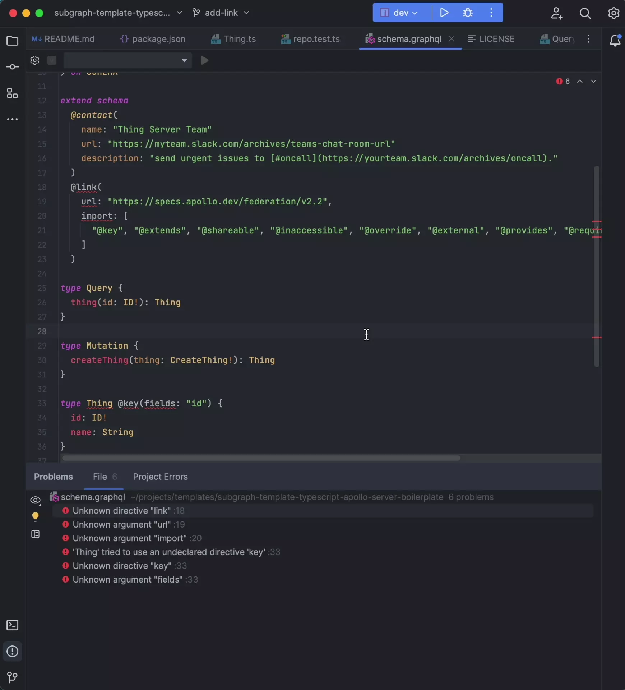

The [GraphQL Plugin for JetBrains](https://plugins.jetbrains.com/plugin/8097-graphql/) provides federation-specific development features, such as auto-complete for federation directives. **However**, you must _enable_ this federation support after installing the plugin. Otherwise, your IDE might display unexpected errors while you're working with a subgraph schema.

## Setup

To enable federation support, do the following in your IDE after installing the plugin:

1. Open your IDE's **Settings** window.
2. Expand the **Languages & Frameworks** section.
3. Click **GraphQL**.
4. Check the **Federation** checkbox.

This plugin supports all IntelliJ-based IDEs, including:

- IntelliJ IDEA
- PyCharm
- PhpStorm
- WebStorm
- CLion
- RubyMine
- Rider
- GoLand
