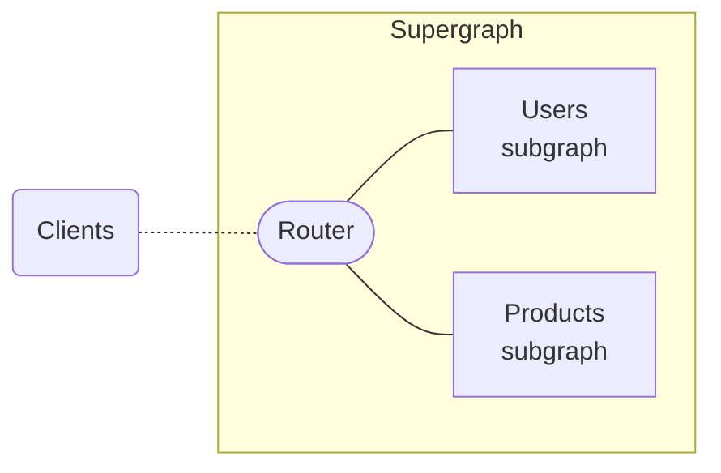

After you set up at least one federation-ready [subgraph](./subgraphs-overview/), you can configure a router to sit in front of your subgraphs. The router serves as the entry point to your supergraph, and it executes incoming operations across one or more of your subgraphs:

## Choosing a router library

Apollo actively supports the following options for your router:

- **The Apollo Router (recommended)**: This is a high-performance, precompiled Rust binary.

    - If you're getting started with federation, we recommend [creating a cloud supergraph](/graphos/quickstart/cloud/) with Apollo GraphOS. With a cloud supergraph, GraphOS provisions and manages your router for you.
    - You can also host your own Apollo Router instances. [See the Federation Quickstart](../quickstart/setup/) to get started.

- **Apollo Server**: Apollo Server can act as your router via the [`@apollo/gateway`](https://www.npmjs.com/package/@apollo/gateway) extension library.
    - [See how to set up Apollo Gateway](/apollo-server/using-federation/apollo-gateway-setup).

<Tip>

Apollo recommends starting with the Apollo Router. It's faster to configure, performant even under high request loads, and supports many enterprise features.

</Tip>

<ExpansionPanel title="When should I use Apollo Server?">

You might need to use Apollo Server for your router if your subgraphs use a custom authentication method that it's currently difficult to configure with the Apollo Router. Note that teams unfamiliar with Rust can still customize the Apollo Router's behavior using the [Rhai scripting language](/router/customizations/rhai).

Regardless of which library you start with, you can swap to the other without making any changes to other parts of your supergraph.

</ExpansionPanel>

If you'll use the Apollo Router, get started with the resources linked above. If you'll use Apollo Server, see [Setting up Apollo Gateway](/apollo-server/using-federation/apollo-gateway-setup).
