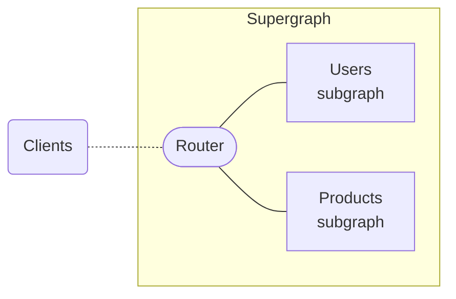

Every federated supergraph includes one or more _subgraphs_. Each subgraph is a separate GraphQL service that's responsible for a different portion of your supergraph's available data.

Here's a basic supergraph that includes two subgraphs (Users and Products):



You can implement different subgraphs using completely different programming languages and GraphQL server libraries!

## Choosing a subgraph library

Every subgraph in your supergraph should use a subgraph-compatible GraphQL server library. These are libraries that adhere to the Apollo Federation subgraph specification, which ensures that your supergraph can take full advantage of federation features like [entities](../entities/).

[See federation-compatible subgraph libraries.](./supported-subgraphs/)

After you select a subgraph library, consult its documentation to learn how to configure it to run as a subgraph.

<Note>

If you're using Apollo Server as your subgraph library, see [Implementing a subgraph with Apollo Server](/apollo-server/using-federation/apollo-subgraph-setup/).

</Note>

## Securing your subgraphs

Implement any necessary firewall rules, access control lists, or other security measures in your environment to ensure that only your supergraph's router can access your individual subgraphs.

Clients should never query a subgraph directly! Instead, clients should always query your router, which resolves those queries by communicating with your subgraphs.

There are many reasons for this:

- Subgraph libraries automatically add [powerful fields](#subgraph-specific-fields) to your schema that clients _should not_ have access to.
  - The router uses these fields to cross subgraph boundaries while resolving complex operations.
- Providing a single endpoint for your entire supergraph reduces its overall [attack surface](https://en.wikipedia.org/wiki/Attack_surface).

> In addition to the above security concerns, a significant benefit of _any_ GraphQL API is that clients only need to interact with one endpoint. This definitely holds true for a supergraph, especially one with tens or even hundreds of subgraphs!

For more information on securing your subgraphs with a GraphOS cloud supergraph, see [this article](/graphos/graphs/securing-a-subgraph).

### Disabling CORS

We recommend that subgraphs do not enable CORS (or at least, do not use the wildcard `access-control-allow-origin: *` header). This prevents attackers from exploiting a user's browser to access a subgraph directly.

For Apollo Server subgraphs, you need to disable the default wildcard CORS policy (this policy is appropriate for many monolithic public API servers, but _not_ for subgraphs). For details, see the [Apollo Server CORS documentation](/apollo-server/security/cors/#choosing-cors-options-for-your-project).

## Subgraph-specific fields

Subgraph-compatible server libraries automatically add some federation-specific definitions to your subgraph schema. In addition to directive definitions like `@key`, the most useful of these definitions for debugging are two fields of the `Query` type: `_service` and `_entities`:

```graphql
type Query {
  # ...your field definitions...

  # Added automatically
  _service: _Service!
  _entities(representations: [_Any!]!): [_Entity]!
}
```

### `Query._entities`

> [Learn about entities](../entities/) if you haven't yet.

This field takes a list of _entity representations_ and returns a list of corresponding entities.

> Whenever one subgraph references _another_ subgraph's entity, it uses an entity representation to do so. An entity representation is an object that includes _only_ the entity's `__typename` and the fields in the entity's `@key`.

```graphql
_entities(representations: [_Any!]!): [_Entity]!
```

* The `_Any` type is a special scalar that enables you to provide entity representations of any valid shape.
* The `_Entity` type is a generated [union type](/apollo-server/schema/unions-interfaces/#union-type) that includes every entity defined in your subgraph's schema.

You can query this field like so, providing a value for the `$representations` variable as shown:

```graphql title="Query"
query ($representations: [_Any!]!) {
  _entities(representations: $representations) {
    ... on User {
      id
      username
    }
  }
}
```

```json title="Variable"
{
  "representations": [
    {
      "__typename": "User",
      "id": "5"
    }
  ]
}
```

#### Using in tests and debugging

If you're writing integration tests for your subgraph, you can test the return value of the `_entities` field for various entity representations that your _other_ subgraphs use.

If you're developing your subgraph in your local environment, you can [mock the return value](/apollo-server/testing/mocking/) of the `_entities` field for your _other_ subgraphs so you don't have to connect those subgraphs to their respective data stores.


### `Query._service`

This field returns a `_Service` object with one field of its own: `sdl`. You can query it like so:

```graphql
query GetSubgraphSchema {
  _service {
    sdl
  }
}
```

The `sdl` field returns your subgraph's schema as an SDL string. This field has a couple of important differences from a standard [introspection query](https://graphql.org/learn/introspection/) that a tool like Apollo Sandbox uses:

* Unlike introspection, the `sdl` field is _not_ disabled by default in production environments (this is safe if you properly [secure your subgraph](#securing-your-subgraphs)).
* Unlike introspection, the `sdl` field's returned string includes federation-specific directives like `@key`.
