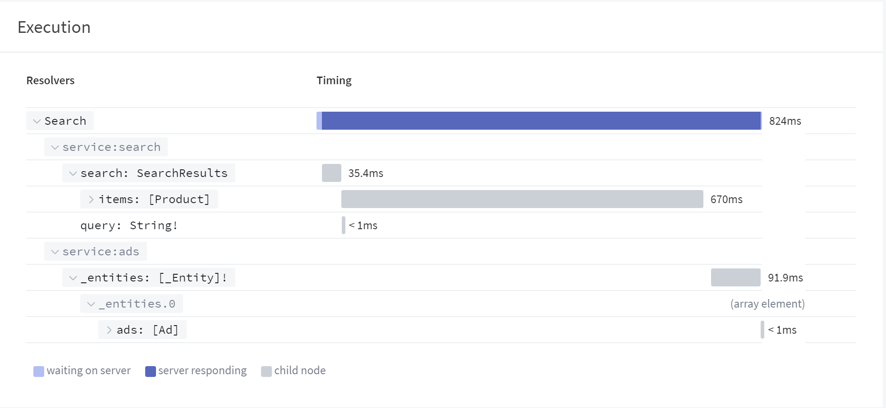
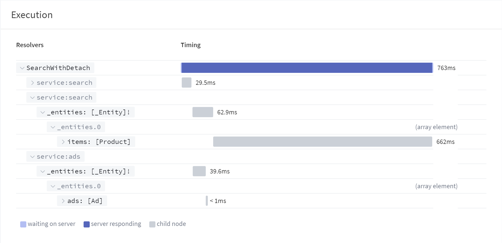
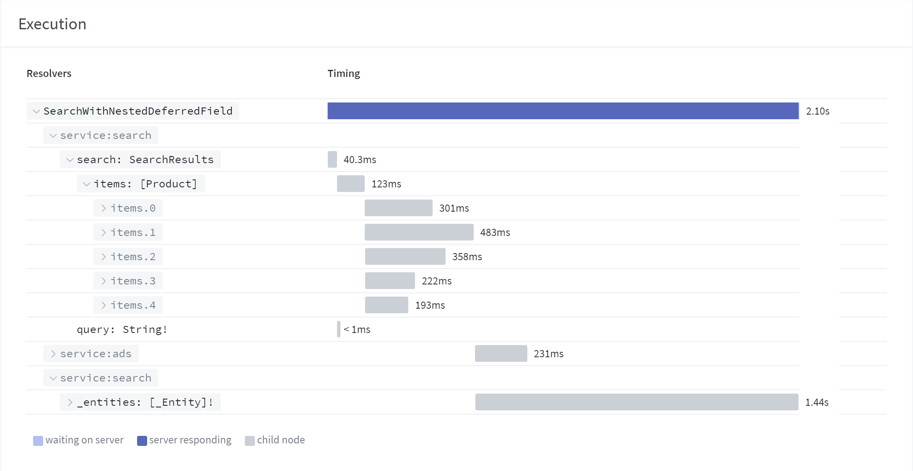

> Note this is a feature of the Enterprise edition of the Apollo Gateway. To learn more [contact us](https://www.apollographql.com/contact-sales)

## How federated execution works

When an operation is executed across a federated graph it is broken down into its required fetches from each service in the graph to form the overall response. We call this process *query planning* and it is what makes federation possible. The way that query planning works today is to prioritize time spent **in a service** and reduce network hops where possible. Federated execution is a specific implementation of [**normal** execution](http://spec.graphql.org/draft/#sec-Normal-and-Serial-Execution) that differs from most implementations found in the GraphQL ecosystem. Typically, “normal” GraphQL execution is implemented in a breadth first manner where the executor walks the tree of of the operation in parallel at each level and executes each field at the same time. This makes sense conceptually to most people and works for monolithic servers. Federated execution however uses a **service based depth first** approach to execution. However, in some specific scenarios this behavior can result in less than optimal response times when one field which is unusually slow is blocking other fields from being executed.

To illustrate this issue, suppose this example graph of two federated services:

```graphql
# search service
type Query {
  search(query: String!): SearchResults
}

type SearchResults @key(fields: "query") {
  query: String!
  items: [Product]
}

type Product {
  name: String
}
```

```graphql
# ads service
extend type SearchResults @key(fields: "query") {
  query: String! @external
  ads: [Ad]
}

type Ad {
  embed: String
}
```

Let’s look at an example where we run into this issue:

```graphql
query Search($query: String!) {
  search(query: $query) {
    items { # this lookup is really expensive
      name
    }
    ads {
      embed
    }
  }
}

```

In this query, `items` and `ads` are both requested under the `search` field. At first glance, it may look like they would be executed in parallel, but they actually are served by different services, which affects how a query plan is built for this operation. `items` belongs to the `search` service along with the `search` parent, while `ads` is served by the `ads` service.

Because query planning optimizes for the most time spent *in a single service*, the resulting fetches in this complete query plan would look like this:



> Notice how the final fetch to load the data from the `service:ads` has to wait until all of the fields from `service:search` have finished including the slow `items` field.


In other words, `items` is grouped with the parent `search` and resolved before kicking off a request to the `ads` service. Most of the time, this optimization is fine to make, since it saves on parsing work and data over-the-wire, but in this case, because loading all of the `items` is especially expensive this optimization adds to much time to the query’s total time to execute. This kind of behavior can cascade and, in complex queries, add up to quite a bit of unwanted overhead.

## Changing the flow of execution

Solving this problem involves changing the way the query planner optimizes for work done. Given the above operation, the most efficient optimization that could be done here is to execute `items` and `ads` in parallel, dependent on the response from `search`.



> Unlike the previous trace, the `service:ads` work begins as soon as the initial search work is done and finishes well in advance of the costly `items` field being executed.


Since this change is less efficient for most operations, as it requires additional fetches, network time, and GraphQL parsing, we’d like to be selective about when this split happens.

In essence, what we’re trying to do in plans like this is `detach` an expensive field from the rest of the query plan, and run it in parallel where possible. To accomplish this, we’re proposing adding a schema directive that service implementers would be responsible for adding called `@detach`.

```graphql
# Search service
// ... same as above
type SearchResults @key(fields: "query") {
  query: String!
  items: [Product] @detach
}
```

This is done through a new federation directive:

```graphql
directive @detach on FIELD_DEFINITION
```

In order to reduce the potential side effects of adding this directive, it is restricted to fields on entities instead of being applied on any field within the graph. This has two nice properties. First, it lets us reduce the impact of changing the current execution model to the smallest possible scope. For example:

```graphql
query SearchWithNestedDeferredField {
  search(query: "Coffee") {
    items{
      name
      price
      reviews {
        isHigestRatedReviewer # the slow field
      }
    }
    ads{
      embed
    }
  }
}
```

In this example, the `mostLikedReview` field is an expensive thing to calculate and can slow down loading `contentLayout`, however, `latestItems.{name,price}` aren’t expensive and would benefit from still being part of the initial fetch to the search service. Since `@detach` is contained to the parent entity, this fetch would be turned into this one:



> Due to the `@detach` directive, we can load as much as possible from the initial fetch to the `search` service, then load the `ads` and detached field of `mostLikedReview` in parallel preventing a blocking waterfall request.


In this case you have three fetches grouped into two fetch groups. The first loads from search everything it can to fulfill the client’s needs, the keys needed for `ads`, and the keys needed for every review to load `mostLikedReview`. Then, in a parallel group, one fetch is sent to the layout service while another single fetch is sent back to the search service with the array of reviews to load `mostLikedReview`. This lets us keep the beneficial behavior of reducing work done out of services while keeping the fine grained ability to change the flow of execution as needed. 

The other benefit of limiting this field to entities brings is with knowing how to offset the cost of having to re-enter the service to load the deferred field. Since entities have keys which act as primary keys, and are often cacheable, implementing something like Apollo Server’s `resolveReference` for an entity where `@detach` is applied helps to reduce the risk of an expensive path from causing unexpected harm on a service. The gateway will only ever send a request back to the service with the entities keys to load the deferred field, not try and load some ancestor data like re-fetching all of `search` again.

## Guide to using @detach

### When to use this directive

Used sparingly, the `@detach` directive is a powerful tool to customize the flow of execution in an Apollo Gateway. It is best used when you have monitored operation traces using Apollo Studio and noticed that a field is particularly expensive compared to the rest of the operation **and** it is blocking work that could be done in parallel in other services. When this is the case, add this directive to your schema and see how the change of execution flow impacts the overall timing for your clients request. 

### When not to use `@detach`

**Considering when `@detach` is useful is critical.** Since this directive alters the way the query planner and executor works fundamentally, it’s important to consider all possible ramifications of a change like this. As with any optimizations made in a query planner, enabling this has potential downfalls if used incorrectly, many of which have been hinted at previously.

In some service environments, network hops between services and data transfer time is negligible. But in the case of large operations or when interservice latency is higher, using `@detach` and triggering additional requests across the network could be more expensive than the original waterfall of requests you’re trying to avoid.

In addition to time over the network, the time spent parsing both the operation on subservices and the response at the gateway from multiple fetches adds up with the more fetches that are made.

Lastly, if entities aren’t cached in any meaningful way, the additional request to the subservice to resolve an entity could also end up being more expensive than the unaltered query plan.

These reasons add up a single warning: `@detach` is a hammer, and not all problems are nails. It should be used selectively as an optimization, not a catch-all for any field whose resolution time crosses a threshold.

### Rollout

The process for adding `@detach` to your service to impact execution should follow a data driven approach to optimization. Using a tool like Apollo Studio’s trace view, you want to monitor the execution timing of both the overall request time and individual fields. When you find situations where particular fields are slowing down the overall response **and** the actual data loading of those fields can’t be optimized, then `@detach` is a good solution to improve the performance of execution.

To do this you would add the `@detach` directive to the offending field and ensure that you have an optimized way to load the parent entity such as using Apollo Server’s [resolveReference.](https://www.apollographql.com/docs/apollo-server/api/apollo-federation/#__resolvereference)

Once this is added you can deploy your service using the Apollo CLI which will [validate the usage](https://www.apollographql.com/docs/studio/check-configurations/) of the `@detach` directive during composition. This will update your gateway with the latest graph with the new execution hints in place.

Now you should be able to watch in Apollo Studio as the traces for your operation change to reflect the new shape and see performance increase. Overtime if you are able to improve the performance of the offending field, you can then remove the `@detach` directive and go back to normal federated execution.
