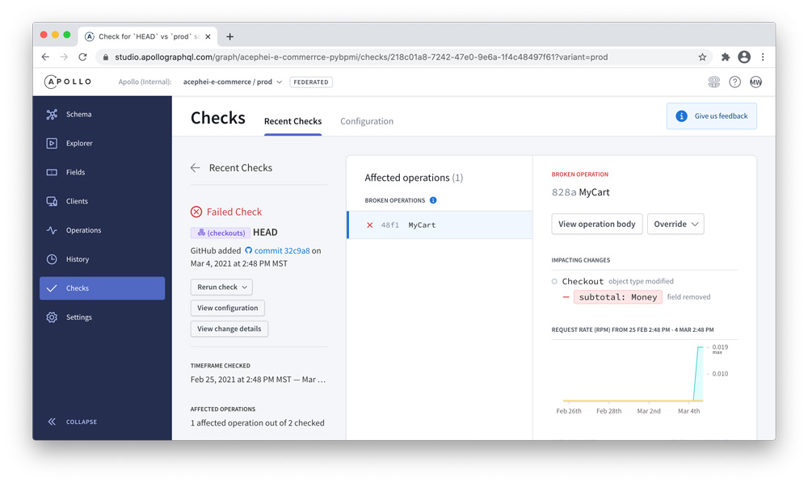
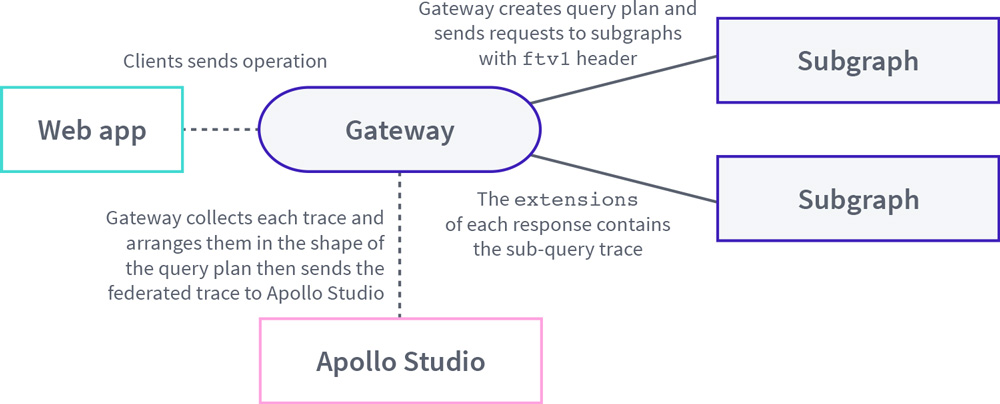
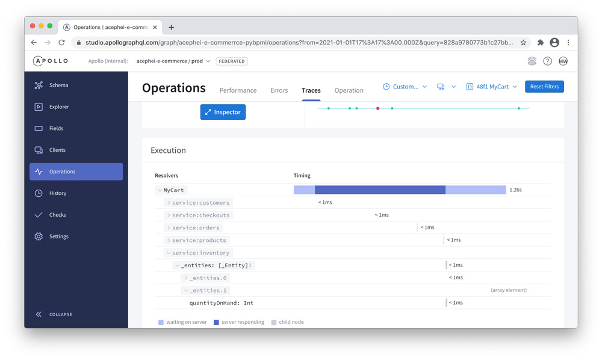
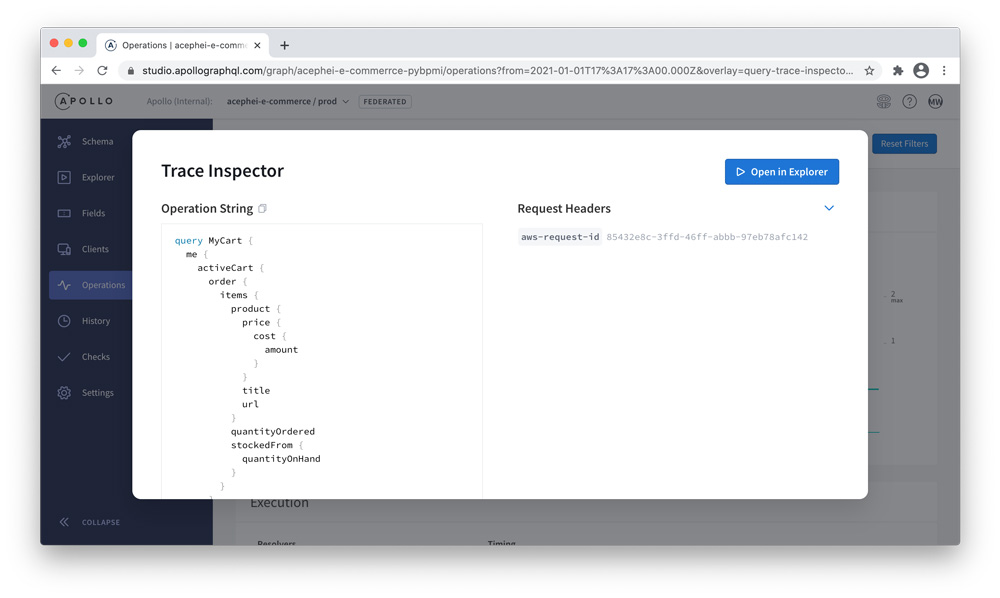

GraphQL was designed to allow your API to evolve continuously in response to new product requirements and client developer feedback, and without the overhead of versioning. In practice, such evolution requires insight into how your GraphQL API is used so that types, fields, and arguments may be safely modified without causing breaking changes for clients. With a federated graph, extra consideration is needed to ensure when one subgraph changes its schema that those updates won't cause unexpected breaking changes for the other subgraphs that rely on its entities.

A well-managed graph will help drive adoption and compound the network effects of the graph within a company. To realize this potential, there needs to be an iterative and repeatable process in place for managing and evolving the federated graph across teams once the graph has been deployed to production. That means that each team that owns a subgraph service needs tooling in place to support its ongoing contributions to the overall graph. These teams need to be assured that the changes they make won't break existing operations sent by clients and that they can evolve their portion of the schema without breaking the graph's composition.

Additionally, new scenarios for data consumption will arise as additional client teams are onboarded to the graph. As this happens, the right balance must be struck between flexibly accommodating these changes, maintaining the integrity of the graph, and managing access to it. You'll also want to ensure that the clients querying the graph identify themselves and that you have some mechanism for enforcing these usage rules.

As we can see, adopting a federated [One Graph](https://principledgraphql.com/integrity#1-one-graph) approach can inspire new levels of collaboration in a company's development efforts. Having the right tools and processes in place to support enterprise-scale graph evolution will increase the speed at which teams can ship updates to the broader graph, and in turn, the user interfaces that power product experiences. Throughout this section, we'll explore the workflows, developer tooling, observability tools, and governance practices that have served Apollo's enterprise customers in the management and continuous evolution of their graphs.

## Workflows

Teams that work on components of a distributed GraphQL architecture need workflows that support the iterative evolution of the graph, both at an initial conceptual stage and later when shipping changes that will impact the composition of the overall graph. At Apollo, we have observed and worked with customers to develop the following best practices for prototyping and deploying schema changes.

### Prototyping schemas

Whether embarking on an initial consolidation project or iterating subgraph schemas in an existing federated graph, teams need a way to prototype their type definitions with an understanding of how the types and fields in their portion of the schema will compose into the broader graph. They also need a way to experiment with referencing and extending entities from other subgraphs. These prototyping exercises are the starting point for all schema design workflows and they are instrumental in planning for the iterative evolution of a federated graph.

At Apollo, we have worked with teams that start this schema design process by handing a blank piece of paper to client developers and asking them to sketch out the ideal shape of a query response. Once the shape of the query is defined, it's used as starting point for rolling out the necessary service changes to support that query. There may be subsequent edits made to the draft query based on unavoidable constraints of the existing graph structure or the underlying data sources. After some amount of further iteration, the client developers can test out the new query and the schema update can be deployed.

There are many different variations of this schema design process, but one consistent theme is that there are unknowns that must be addressed before any change can be safely implemented in a schema that will be served in production. At a minimum, teams should be able to discover what is currently available in the schema beyond the subgraph that they own. This discovery helps teams leverage existing entities in a graph, avoid duplication, and help contribute to a more cohesive model of the company's data. Further, teams need to understand if their proposed changes compose into the overall graph *before* investing time in implementation.

To support and enhance our customer's schema design workflows, the Apollo solutions team designed the [Apollo Workbench VS Code extension](https://marketplace.visualstudio.com/items?itemName=apollographql.apollo-workbench). This extension allows developers to design and test federated schema design by modeling GraphQL operations and providing feedback about composition errors directly in VS Code. It also integrates with Apollo Studio's schema registry so that all subgraph schemas may be downloaded for a graph and modified in a non-destructive environment. The Apollo Workbench extension may be downloaded from the VS Code extension marketplace.

### Deploying changes into the graph

Once schema changes are ready to deploy, teams need a workflow for rolling out the changes to different environments and informing other teams of those changes. This is where a *schema registry* becomes essential. A centralized registry will be the source of truth for the company's graph, provides an overall view of the graph so team members can understand how their portion of the schema fits into the larger picture, allows developers to safely push changes to that graph, and can integrate with other developer tooling.

With a centralized registry in place, a gateway can reference the composed schema directly from the registry and schema change events can be used to drive updates to the configuration of an Apollo Gateway. In turn, referencing a schema configuration from a registry allows a federated graph's schema to be updated on the fly and without restarting the gateway service to force recomposition. Service owners can then incorporate schema pushes into their CI/CD pipelines once the artifact has been deployed and is ready to serve traffic.

Apollo Studio can serve as this centralized registry, and subsequently, unlock all of the capabilities of [managed federation](../managed-federation/overview/). Managed federation will create a new gateway configuration every time a schema is pushed to the registry by one of the subgraphs using the `rover subgraph publish` command from the [Rover CLI](/rover/), but only does so when those changes can be composed into the existing graph without breaking changes for other subgraphs and clients. Additionally, managed federation allows teams to create different *variants* of the graph that correspond to the different environments where the graph runs (such as staging and production). Each variant has its own GraphQL schema, which means schemas can differ between environments.

Ultimately, there will need to be controls in place to manage graph contributions and those controls will live in the schema registry. Each push of an updated subgraph schema to the registry is an opportunity to perform validation that flags breaking changes to the overall graph. At a minimum, a schema registry should be capable of determining if an update to a subgraph's schema can be safely composed back in, and then upon successful composition, drive the updated schema to the gateway service.

You can try out managed federation with Apollo Gateway today by signing up for [Apollo Studio](https://studio.apollographql.com/) to obtain an `APOLLO_KEY` and then pushing your subgraph schemas up to the registry using the Rover CLI. After adding the `APOLLO_KEY` as an environment variable, you can remove the `serviceList` or `supergraphSdl` option from the existing `ApolloGateway` configuration, restart the gateway service, and your graph will automatically start in managed mode. It will now serve the version of your schema configuration that has been stored by the Apollo Studio registry.

## Tooling for graph contributors

When multiple teams contribute to a graph, it's essential to have standards in place to ensure everyone can contribute to the graph as effectively as possible. The schema registry is the central point at which these individual contributions are collected and validated before incorporation into the overall graph. To use a schema registry, some tooling is required to add schema checks and publications into a team's existing deployment process.

### CI/CD pipelines for subgraph services

When a subgraph schema is published to the registry, Apollo Studio runs composition validation to ensure that the proposed change will compose with other registered subgraph schemas. Upon successful composition, a new gateway configuration is created. However, if a composition error occurs, then the error state of the new schema is staged in the registry until the subgraph publishes an updated version of its schema that may be properly composed into the graph.

Ideally, a subgraph's schema registration should be incorporated into a relevant CI/CD pipeline to automate this process. Further, the automated schema publish should happen when the subgraph service is ready to serve traffic, which would typically be after the service completes deployment and passes a health check. In a Kubernetes-based environment, it's common to publish a schema after the readiness probe passes. If Apollo Server is used to power the subgraph services, then you can use the `onHealthCheck` method to implement custom logic to verify that a service is ready to serve traffic (usually to ensure that downstream data sources are available). Once the health check passes, a CI/CD pipeline can register the schema.

### Schema validation

Confirming valid schema composition is only half of the battle when guarding against breaking changes in production—you'll also need to ensure that schema updates won't break existing operations currently used by clients. Nobody wants to deal with (or be the cause of) production downtime, and it has very real financial consequences for companies. For a large e-commerce application, a few minutes of downtime can have six-figure implications. Within a distributed GraphQL architecture that favors continual schema evolution, developers working on subgraph services should feel confident that they can release changes without doing unintended damage to client applications. For example, even something as simple as changing an existing field on an Object type from non-null to nullable can lead to breaking changes for clients that aren't prepared to handle a potentially null value.

This is where a schema registry provides even more value when combined with observability tools that collect tracing data on the operations performed against the schema. These tools allow you to perform analysis on a composed schema to verify if any proposed changes will affect existing traffic to the API. *Schema validation* is the process of performing static analysis of a schema against a set of known GraphQL operations for a given window of time. The period that you check against may need to be large if any mobile clients consume the graph (because you won't have as much control over upgrade cycles as with web-based clients).

Apollo Studio facilitates schema validation via the Rover CLI using `rover subgraph check` command. Teams can use this command in their deployment pipelines to ensure proposed schema changes don't adversely affect client traffic. If Apollo Studio detects a potentially dangerous change, then it will display information in its user interface about what the breaking change is, what clients are affected (by client name and version number), what operations are impacted, and the volume of traffic running against those operations. As a result, schema validation provides a scalable solution that supports safe, incremental graph evolution driven by multiple teams.



### Schema design

As noted above, [Apollo Workbench](https://marketplace.visualstudio.com/items?itemName=apollographql.apollo-workbench) is an essential tool for developers making ongoing contributions to the graph. It was created to help developers understand graph composition and execution details during the schema design phase in a mocked environment, rather than waiting until implementation time to discover that a schema addition or update doesn't compose into the graph as expected.

A typical Apollo Workbench-driven workflow for a developer updating a subgraph schema would begin by downloading the current representation of the entire federated schema from Apollo Studio into VS Code. A particular subgraph's schema can then be modified and new subgraph schemas may also be added to test composition with the overall graph. From within their local environment, developers can easily see what entities may be referenced or extended from other subgraphs as they work. And when composition errors occur, they are displayed in the Problems panel of VS Code. Both newly designed and known operations (pulled from Apollo Studio) may be tested against iterations of the composed schema with a view of the full query plan directly in the editor.

For more details on optimizing development workflows with Apollo Workbench, see the [GraphQL Summit 2021 keynote](https://youtu.be/XUocF2TLGMk?t=1165) or the [Apollo Workbench documentation](https://apollographql.github.io/apollo-workbench-vscode/).

## Tooling for graph consumers

GraphQL offers a client-centric approach to developing APIs, and this promise extends beyond designing queries that are purpose-built to meet client developer needs and drive product experiences. Both Apollo and members of the GraphQL community have created extensive client-side tooling for web and mobile to expedite development and help teams ship features faster. In turn, client developers can maximize the utility of the schema registry by adopting best practices when sending their requests to the graph.

### Consuming the graph

When a company shifts toward a consolidated graph, client developers who may have previously juggled multiple GraphQL endpoints or other point-to-point APIs no longer need to jump through client-side hoops to query all of the data needed to render a view in an application. That said, with a centralized schema registry in place, a common set of standards should be established to structure how clients make requests to the graph.

At a minimum, there should be basic controls on what operations are executed against the graph, and how those operations are structured. Tracing data becomes far more useful and actionable when clients include their names and versions as metadata. When using Apollo Client for web or mobile, you can specify `name` and `version` options that will automatically be translated into header values sent with every request  (specifically, the headers are called `apollographql-client-name` and `apollographql-client-version`, and they may be set manually for other GraphQL clients). Tools such as Apollo Studio can then use this operation trace metadata to help service developers conduct more effective schema validation.

In addition to identifying themselves by name and version, clients should use [named operations](https://spec.graphql.org/June2018/#sec-Named-Operation-Definitions) for each request to the graph. For example, at Apollo, we prepend `UI_` to the names of all operations sent from the Apollo Studio web application. Other teams go so far as to add linting rules to check the structure of client operations as a part of that client's deployment pipeline too.

While there isn't a single "best" way to structure operation names, the important takeaway here is to establish some operation-related standards, communicate those standards to teams, and then enforce them. Enforcement of these rules can take place within the Apollo Gateway, but adding runtime logic on a per-request basis should be approached with caution when rules may be checked statically in client code as part of the CI/CD process instead. However enforced, both client awareness and operation names are essential in providing the necessary visibility in observability tools to support a field deprecation and rollover strategy that prevents breaking changes for client developers as the graph evolves.

### Code generation

Codegen-related tooling can help facilitate client development for both web and mobile applications. To support modern, strongly-typed web development, the [GraphQL Code Generator](https://graphql-code-generator.com/) library can be used to generate types for operation results.

On the iOS side, the [Apollo CLI](https://www.apollographql.com/docs/ios/tutorial/tutorial-obtain-schema/#download-your-servers-schema) may be used to download the graph's schema and add it to a target's directory, and then subsequently generate code as a build step based on the operations saved in `.graphql` files. For Android, an Apollo Gradle plugin is available to download the schema and generate type-safe models and code from operations in `.graphql` files when built.

### Additional tools for client developers

Apollo provides additional tools to help support client development, including the [Apollo Client Devtools](https://www.apollographql.com/docs/react/development-testing/developer-tooling/#apollo-client-devtools) extensions for Chrome and Firefox, which includes an embedded GraphiQL IDE along with query, mutation, and cache inspectors. The [Apollo VS Code extension](https://www.apollographql.com/docs/devtools/editor-plugins/) also supports client development with GraphQL syntax highlighting, operation autocompletion, performance information, and more. For iOS, [Apollo Xcode Add-ons](https://github.com/apollographql/xcode-graphql) provides syntax highlighting for GraphQL query document files to Xcode.

## Observability

As more services are added to a federated graph and adoption spreads across client applications, it may grow challenging to reason about how a single request traverses the graph. Apollo Gateway undertakes a query planning process to optimize for the most time spent in a single service to reduce the number of network hops for a single request. Once calculated, the gateway will execute the query plan across the subgraphs required to fulfill the request. With managed federation and Apollo Studio, [federated traces](../metrics/) may be used to provide detailed insights into the GraphQL layer's performance and usage.

### Federated traces

With federated tracing enabled ([which happens by default](../metrics/#enabling-traces) when an `APOLLO_KEY` variable is present in the gateway's environment), the gateway will include an HTTP header of `apollo-federation-include-trace: ftv1` with each request to a subgraph. Each subgraph will then [construct its trace](../metrics/#how-traces-are-constructed-and-aggregated) and add this data to the `extensions` of its response. Apollo Gateway then constructs the overall trace for the request based on the shape of the query plan. This process may be visualized as follows:



The gateway will send this tracing data to Apollo Studio where it may be used for schema checks, tuning query performance, and debugging operation errors:



When Apollo Server is used to power subgraphs, this tracing data is provided out-of-the-box via the [inline trace plugin](/apollo-server/api/plugin/inline-trace/#using-the-plugin). Many [third-party federation libraries](../other-servers/) also expose federated tracing data. Note that not all third-party federation libraries will necessarily provide field-level tracing data in a response, but the gateway's aggregated trace will still show the total time spent in the service even though the detailed field resolver data won't be available for that portion of the query plan.

### Integration with other observability tools

Many teams use additional observability tools to monitor application performance and these tools may also be integrated with a federated graph. Apollo Studio connects directly with [DataDog](/studio/datadog-integration/) and many other integrations are possible too, either through a custom Apollo Server plugin in the gateway, a custom `RemoteGraphQLDataSource`, or by carrying specific headers throughout a request.

For example, when using AWS CloudWatch an `aws-request-id` header must is included with the request, but by default, Apollo Server's [usage reporting plugin](https://www.apollographql.com/docs/apollo-server/api/plugin/usage-reporting/) excludes all headers. However, the usage reporting plugin can be configured to include this header in its traces as follows:

```typescript
ApolloServerPluginUsageReporting({
  sendHeaders: { onlyNames: ['aws-request-id'] }
})
```

When tracing data is viewed in Apollo Studio, you will now have the `aws-request-id` available to help diagnose service-level performance issues in CloudWatch in relation to the federated traces.



As another example, your team may need to understand the relationship between an incoming request from a gateway to a subgraph service and the original operation name of the request to the gateway. For this case, a custom `RemoteGraphQLDataSource` can be used to include the operation name and a hashed representation of the original query can be used as the name of the query to the subgraph:

```js
class OperationNameForwarding extends RemoteGraphQLDataSource {
  willSendRequest({ context: { operationName }, request }) {
    if (request?.variables.representations) {
      let key = JSON.stringify(request.variables.representations);
      let keyHash = createHash('sha512').update(key).digest('hex');
      let newQuery = request.query.replace(
        'query($representations:',
        `query ${operationName}_${keyHash}($representations:`
      );
      request.query = newQuery;
    }
  }
}
```

These are just a few examples of what's possible for application performance monitoring of a federated graph with Apollo Studio and additional observability tools. A member of the Apollo solutions team can work with you to design custom observability integrations for your company.

## Governance

Initial GraphQL adoption often emerges either from within a single team or a small number of teams, and at that scale, managing governance concerns may be handled on an informal basis. However, the move toward a consolidated graph requires a more intentional approach. Given the evolutionary nature of a federated graph, strong governance practices are needed to help maintain its integrity while simultaneously driving its adoption across teams.

The establishment of a data governance group is an important factor in the success of any consolidation project. This group may be thought of as the "GraphQL Center of Excellence" within a company and it should represent a cross-section of key graph stakeholders. Ultimately, the governance of a federated graph is largely concerned with empowering the people who will contribute to and consume it with processes that will help them operate as good citizens of the graph. Once the graph governance group has been established, the work largely focuses on setting standards that help maintain the quality of the graph, facilitate its continuous evolution, support its operation, and enforce standards for client usage.

### Establishing the graph governance group

To set company-wide standards for the graph, a graph governance group should be established. This group acts as a cross-team, collaborative governing body for the graph. It also establishes best practices related to graph maintenance and administration and provides ongoing education for graph contributors and consumers.

At a minimum, the governance group should consist of one representative from each of these stakeholder categories (though ideally, each subgraph service and client team will have representation):

|Stakeholder|Role|Ownership|
|---|---|---|
|**Executive Sponsor**|Provides approval to help ensure the prioritization of the project|Owns resourcing for the overall initiative|
|**Graph Champion**|Is the driving force behind the initial consolidation project and is instrumental in obtaining executive sponsorship|Owns internal training and onboarding to the graph|
|**Subgraph Lead**|Represents a subgraph service (usually the team lead and may also be a Graph Champion)|Owns service boundary resources|
|**Product Manager**|Helps shape schema design within service boundaries|Owns the representation of the service boundary in the graph|
|**DevOps Representative**|Ensures consistent CI/CD pipelines for subgraphs|Owns CI/CD pipeline requirements and underlying infrastructure and tooling|
|**Client Developer Advocate**|Advocates for client consumption patterns in relation to schema design and evolution (representation from every client team is not required, though would be helpful)|Owns graph consumer tooling and SDKs (partners with a relevant Product Manager)|

Ideally, the graph governance group should be formed at the outset of a consolidation project. If a similar GraphQL Center of Excellence already exists, its composition should be evaluated to ensure that the key graph stakeholders that will be involved in the consolidation project have adequate representation within the group.

An appropriate meeting cadence for this governance group will vary by company needs and the complexity of the consolidation work at hand, though in most cases, the group members will likely need to meet on a more frequent basis at the outset of a consolidation project. Once a federated graph is running in production, a regular meeting cadence should still be maintained to help support graph evolution as well as expanding its adoption across teams.

### Setting standards for graph management

Once established, the graph governance group is responsible for setting best practices related to the company's consolidated graph, communicating and enforcing those practices, and evolving them as needed over time. Generally, these concerns may be categorized into three main areas: Graph Integrity, Graph Operation, and Graph Usage. Suggested practices for each area are outlined below.

#### Graph integrity

Reconciling naming conventions and how entities are conceptualized, referenced, and extended across domains can be a challenging aspect of an initial consolidation project. These concerns will require ongoing attention afterward too as the graph evolves and new subgraph services are incorporated into it. Documenting naming conventions, guidelines for entity and value type updates, as well as type and field migration workflows helps service owners make informed decisions about how they can evolve their portion of the schema. The governance group should also formalize a review process for proposed schema changes and an architectural review process for adding new subgraph services before they are incorporated into the broader graph.

Once changes are made to the graph, teams that contribute to and consume the API must be informed. Regular rhythms and processes should be established for synchronously and asynchronously communicating schema updates to internal teams, especially when rolling over deprecated fields. In addition, Apollo Studio can be configured to post schema change notifications directly in a Slack channel, and it also exposes a schema change webhook for general use with other services and tools.

#### Graph operation

Having the right observability tools in place is a key factor in maintaining smooth graph operations and minimizing mean time to recovery when something unexpected happens. As previously discussed, federated traces provide insight into API usage at the field, operation, and client levels in Apollo Studio and this data can be used to tune performance, debug errors, and support a safe rollover strategy for deprecated fields (and performance reports and alerts can also be pushed directly to a Slack channel from Apollo Studio).

The governance group should proactively establish performance best practices that support graph operation. For example, caching may happen at various levels in the stack—from the normalized cache in Apollo Client, to Automatic Persisted Queries that support edge caching with CDNs, to full response caching at the gateway or subgraph level—and service owners and client teams alike must be aware of what the standard practices are within the graph. Similar guidelines may be provided for areas such as using data loaders to batch requests to underlying data sources, providing minimal unit test coverage for subgraph resolvers, and running automated performance tests for known operations.

#### Graph usage

As previously discussed, it's a best practice for clients to identify themselves by name and version before querying data from the graph, and clients should also assign names to all of the operations they send to the API. Ideally, these operation names are defined using a shared naming scheme, so it will be the role of the graph governance group to set, communicate, and enforce these naming standards.

Additionally, the governance group may wish to set standards for using query variables instead of literals as operation arguments. This measure will help minimize operation cardinality and take advantage of some of Apollo Studio's reporting optimizations in the gateway. And to guard against potentially abusive operations, the governance group may also put appropriate mechanisms in place to limit query depth, breadth, and overall cost.

### Onboarding and supporting teams

When it comes to driving adoption of the graph, one of the most important functions a governance group can serve is supporting teams as they are onboarded to the graph, both as contributors and consumers. Similarly, the graph governance group can also help support ongoing education through the establishment of an company-wide "Community of Practice" for the unified graph, and GraphQL in general.

For an extensive list of links to learning materials to help support internal GraphQL training at your company, please see the [additional resources section](./additional-resources/) of this guide.

## Summary

In this section, we covered several important topics related to federated graph administration. We first described workflows for prototyping schema changes and how managed federation allows subgraph service owners to deploy updates without the fear of introducing breaking changes to graph composition or existing client operations. We then explored tooling that supports both graph contributors and consumers.

We also saw how federated traces and observability tools assist with monitoring graph performance and evolution. And lastly, we discussed the importance of establishing a graph governance group based on a representative cross-section of team members, and how the work of this group helps maintain the integrity of the graph, support its continuous evolution, and drive adoption by helping onboard new teams to the graph and supporting GraphQL education across the company.
