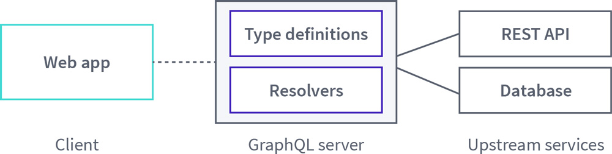
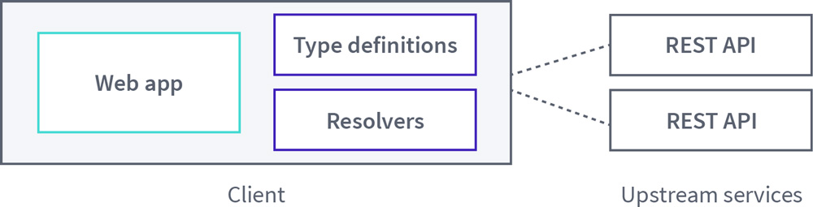
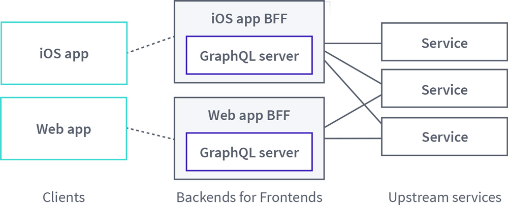
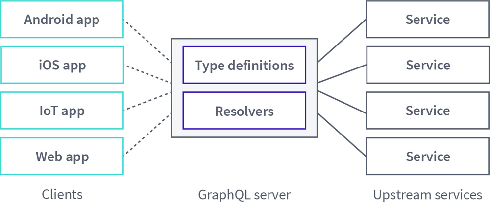
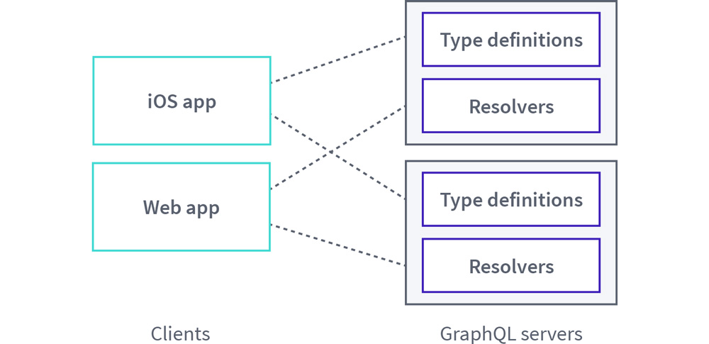
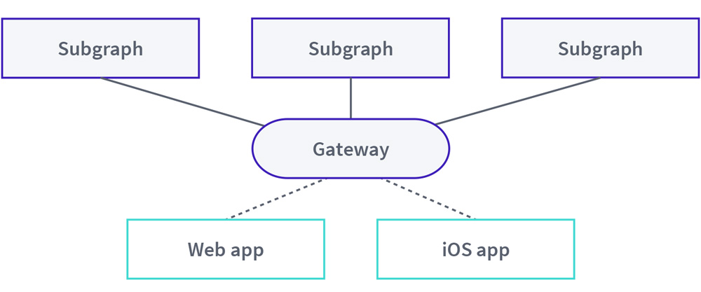

In this section, you'll learn about the advantages of a consolidated GraphQL architecture and how a common, federated graph allows you to realize those benefits. Based on our experience working with a variety of enterprises at Apollo, we'll also provide a framework for determining whether your organization is ready to consolidate its graph.

## Why consolidate your graph?

The GraphQL community and ecosystem of related software have grown at astonishing speed. During the years since its public release in 2015, this GraphQL has quickly matured to a point where it can be used as a component of nearly any application architecture.

Companies such as Airbnb, GitHub, and the New York Times have famously already adopted GraphQL in their tech stacks. With its strong type system and declarative approach to data-fetching, it's easy to see why teams across enterprises have been eager to embrace the many benefits of GraphQL. At Apollo, we see firsthand the enthusiasm teams have for GraphQL with over 1.5 million downloads of the Apollo Client packages every week, along with millions more weekly downloads of the Apollo Server, Federation, and Gateway packages.

Scanning the different teams in your company, you may quickly realize that many are already using GraphQL in production today. Having some top-level insight into how GraphQL is used across your company is the first step toward understanding whether those efforts can and should be consolidated.

### How GraphQL gains traction

When developers begin to experiment with GraphQL, they often begin with a foundational architecture where a client application queries a single GraphQL server. In turn, the server distributes those requests to backing data sources and returns the data in the client’s desired shape:

As different teams begin to adopt GraphQL, their approach will usually be adapted from this basic architecture, but the implementation details may vary from team to team. At Apollo, we've typically seen that those initial, unconsolidated efforts resemble one of the following four patterns.

### Pattern 1: Client-only graphQL

Client teams that are eager to reap the benefits of GraphQL's client-centric data-fetching capabilities may charge ahead and implement a GraphQL API within the context of their application. With these implementations, these teams are often motivated to adopt GraphQL for the convenience of wrapping existing APIs with a single GraphQL API endpoint.

To illustrate this approach, a client-only GraphQL architecture may look like this:

### Pattern 2: Backend for frontend

GraphQL may also be used as a solution for teams implementing the Backend for Frontend (BFF) pattern. BFFs attempt to solve the problem of requiring different clients (for example, web and iOS) to interact with a monolithic, general-purpose API. Alternatively, BFFs can save client applications from making requests to multiple backend services to obtain all of the data required to render a particular user interface view.

As a solution, BFFs add a new layer where each client has a dedicated BFF service that directly receives the client's requests and is tightly coupled to that user experience. For teams creating BFF services, GraphQL can be a natural fit for building out this intermediary, client-focused layer and adopting this pattern can be an important first step toward consolidating a graph.

In practice, the BFF pattern with GraphQL may look like this:

### Pattern 3: The monolith

The monolith pattern can take on two forms. In its first form, teams may share one codebase for a GraphQL server that is used by one or more clients. In some cases, client code may even live in the same repository as the GraphQL server. However the code is organized, the ownership of this graph is shared by the different developers who contribute to the graph.

In its alternative form, a single team may own a GraphQL API that is accessed by multiple client teams. This team would typically define a set of standards for the graph and champion its adoption throughout the organization.

As with GraphQL-based BFFs, maintaining a single, monolithic GraphQL API can help set the stage for effective consolidation of an organization’s GraphQL-focused efforts.

For either monolithic scenario, its high-level architecture looks like this:

### Pattern 4: Multiple overlapping graphs

Enterprise teams may also independently develop their own service-specific GraphQL APIs in tandem. With this approach, teams may delineate each service API based on types or use cases, but there will often be overlap between the graphs due to the interconnected nature of data.

An example of this architecture could look like this:

### Where do these patterns break down?

After taking stock of who uses GraphQL and how in your company, patterns implemented by various teams can provide insight into what kinds of problems they initially tried to solve. Similarly, these choices can help highlight what GraphQL pain points the teams currently face in their tech stacks.

#### Client-only graphQL

Teams that opt for client-only GraphQL approaches are motivated to improve their client development experience by layering GraphQL on top of REST endpoints or other legacy APIs that they have to work with. And while improved developer experience is a win, beneath this abstraction the client application will still incur performance costs as it maintains responsibility for making multiple requests to various services to gather all of the data required to render a view.

#### BFFs

Like client-only approaches, teams that use GraphQL with BFFs enjoy the advantage of improved developer experience, but they also manage to overcome the performance issues incurred by client-only approaches. BFFs accomplish this by providing a unified interface for a client application to send its requests while also handling the heavy lifting of querying multiple backend services on behalf of the client.

However, there's an inherent tradeoff in building and maintaining BFFs. When every client team is empowered to create a BFF to suit its needs, there will be inevitable duplication of effort across those teams. Alternatively, where BFFs are shared between seemingly similar clients in an effort to reduce duplication, then the GraphQL schema contained within can balloon in size and become confusing due to the lack of clear ownership.

#### Monoliths

The challenges that emerge from shared BFFs are intensified with monolithic GraphQL servers that have shared ownership. Portions of a graph may be well-designed to suit the needs of certain client teams only, while other clients must find workarounds or create overlapping types for their own use. At the same time, standardization becomes an issue because the shape of the graph evolves myopically on a client-by-client or a feature-by-feature basis.

Even in scenarios where a dedicated server team maintains ownership of the graph, challenges quickly arise when more than one graph definition is required for a single product in order to support the needs of multiple clients. A server team may also find itself burdened with the task of building and maintaining the necessary tooling to evolve the schema over time to meet new product needs without breaking compatibility for any clients that are actively consuming data from the graph.

#### Multiple overlapping graphs

Finally, when multiple graphs exist within an enterprise it often indicates that the organization was an early adopter of GraphQL, moved to production quickly, and invested more in GraphQL as time went on. As one potential outcome of this investment, an attempt to expand a monolithic GraphQL API across teams may have ultimately resulted in the graph being split into multiple pieces to accommodate the conflicting needs of each team. The inevitable result of this approach is a duplication of effort to manage these overlapping graphs and a subpar experience for client applications that no longer have a unified interface from which to request data.

Another possible reason an enterprise may have multiple overlapping graphs stems from a deliberate choice for teams to manage their GraphQL APIs independently, but then assemble them into a single GraphQL API using schema stitching. While schema stitching can simplify API usage from a client's perspective, the stitched API may require a considerable amount of imperative code to implement. What's more, it may not always be clear where to split types across services and it also necessitates the designation of an API gatekeeper who will manage the gateway and how the underlying schemas are composed into it.

#### Inconsistency: The common shortcoming

All of the previous patterns—whether client-only GraphQL, BFFs, monoliths, or multiple overlapping graphs—also have a shared shortcoming in that their implementations result in a **lack of consistency.** A more productive way forward for teams searching for better efficiency and understandability from their GraphQL-based architectures typically have two requirements:

1. **Consumers should be able to expect consistency in how they fetch data.** A single endpoint should be exposed to client applications and, regardless of what underlying services supply the data, clients should be able to use consistent workflows to consume the data.

2. **Providers should consistently represent common entities in a consumption-friendly way.** Teams may be empowered to use any underlying technology at the data layer, but access to this data should be consolidated through the GraphQL API and exposed in a way that compliments client use cases. Additionally, teams should be able to delineate service boundaries based on separation of concerns (as opposed to separation by types) without interfering with each other.

### How consolidation addresses these challenges

Consolidating your graph is the key to moving beyond these architectural pitfalls, achieving consistency, and realizing the full potential of GraphQL in an enterprise.

At a fundamental level, moving toward graph consolidation requires that your organization has **one unified graph** instead of multiple graphs created and managed by each team. However, the implementation of that common graph should be **federated across multiple teams**. These are the first two "integrity principles" outlined in [Principled GraphQL](https://principledgraphql.com/).

Specifically, moving toward this kind of consolidated graph allows teams across the enterprise to:

- **Scale GraphQL APIs effectively.** Implementing uniform practices allow the benefits of GraphQL to be realized at scale in a company. For example, teams will have a better understanding of the workflows and policies that they must follow to contribute to the graph. Similarly, they will also benefit from improved standardization when consuming data from the common graph.

- **Obtain a unified view of your data.** Your graph is a representation of the data of your product. Having a consolidated view of this data will provide you with fresh perspective into how that data is currently used, while also inspiring new creative uses for it in the future. Additionally, it will help you to enforce a measure of consistency on how client applications consume that data.

- **Leverage existing infrastructure.** GraphQL consolidation allows teams to reuse existing infrastructure in an organization and help eliminate duplicated efforts where teams interact with data. Consolidation also allows you to take a broad view of the practices and tooling developed by each team that touches your graph and leverages the best of those individual efforts across the company as a whole.

- **Ship code faster.** Companies adopt GraphQL to build and iterate on their products faster. As GraphQL gains traction across teams, these benefits may be partially offset by time spent developing tooling to help support that growth. Consolidation helps reclaim that lost momentum by providing a clearly defined set of practices for teams follow when contributing to or consuming data from the graph.

## What does a consolidated graph look like?

A consolidated, federation-driven GraphQL architecture consists of:

- A collection of **subgraph** services that each define a distinct GraphQL schema
- A **gateway** that composes the distinct schemas into a **federated graph** and executes queries across the services in the graph

Unlike other distributed GraphQL architectures such as schema stitching, federation uses a declarative programming model that enables each subgraph to implement *only* the part of your graph that for which it’s responsible. With this approach, your company can represent an enterprise-scale graph as a collection of separately maintained GraphQL services. What’s more, schema composition in federation is based on GraphQL primitives, unlike the imperative, implementation-specific approach required by schema-stitching.

Apollo Server provides open source libraries that allow it to act both as a subgraph and as a gateway, but these components can be implemented in any language and framework. Specifically, Apollo Server supports federation via two open-source extension libraries:

- [`@apollo/subgraph`](https://www.npmjs.com/package/@apollo/subgraph) provides primitives that your subgraphs use to make their individual GraphQL schemas composable
- [`@apollo/gateway`](https://www.npmjs.com/package/@apollo/gateway) enables you to set up an instance of Apollo Server as a gateway that distributes incoming GraphQL operations across one or more subgraphs

### Core principles of federation

A GraphQL architecture that has been consolidated with federation will adhere to these two core principles:

#### Core principle #1: Incremental adoption

Just as any GraphQL schema should be built up incrementally and evolved smoothly over time (as outlined in detail as one of the "Agility" principles in [Principled GraphQL](https://principledgraphql.com/agility)), a federated GraphQL architecture should be similarly rolled-out through a phased process.

For most teams, a "big bang" rewrite of all existing GraphQL APIs or all portions of a monolithic GraphQL schema may not be fruitful or even advisable. When adopting federation, we recommend that an enterprise identify a small but meaningful piece of their existing GraphQL implementation to isolate as the first subgraph (or a small number of subgraphs, if required). Taking an incremental approach to federating the graph will allow you to gradually define services boundaries, identify appropriate connection points between subgraphs, and learn as you go.

Additionally, whatever portion of the graph you scope into an initial subgraphs should have at least one client that actively continues to consume this data. From the client's perspective, the transition to federation can and should be as seamless as possible, and continued consumption of this data can help you validate assumptions, test out new federation tooling, and help you understand how to best delineate future subgraphs' boundaries.

#### Core principle #2: Separation of concerns

The second core principle is also one of its main architectural advantages of consolidating GraphQL APIs. Federation allows teams to partition the schema of the unified graph using **concern-based separation** rather than type-based separation. This distinction sets federation apart from other consolidation approaches like schema stitching and allows teams to collaborate on and contribute to the graph in a more organic and productive way.

While dividing a GraphQL schema across teams based on types may initially make sense, in practice, types will often contain fields that cannot be neatly encapsulated within a single service's boundaries. For example, where one team maintains a products service and another maintains a reviews services, how do you define the relationship that a list of reviews has to a given product or that a product has to a specific review in these portions of the schema?

In these instances, foreign key-like fields may find their way into the types, which reduces the expressiveness of relationships between nodes in the graph and exposes underlying implementation details instead of serving product use cases. Alternatively, a non-trivial amount of imperative code would be required to link the types together in a stitched schema.

Separation of concerns allows each service to define the types and fields that it is capable of (and should be responsible for) populating from its back-end data store. The boundaries that encompass these concerns that are related to team structure, geographic hosting, performance, governance and compliance, or some combination those. Other services may then directly **reference** and **extend** those types in their schemas with new fields backed by their data stores. The end result offers the best of both worlds: teams can maintain their respective portions of the graph with little-to-no friction, and client developers have access to a product-centric schema with rich types that align with the natural ways they would expect to consume the graph.

## When to consolidate your graph

At this point, you may have a sense that your company could benefit from consolidating its graph, so the next important question to answer is _when_ should it move toward consolidation?

GraphQL, from a pure engineering standpoint, is one means to achieve a common set of business goals: horizontal scalability, rapid product iteration, increased service delivery capacity, and reduced time-to-market. When placed in the hands of architects and engineering leaders, common questions emerge about how GraphQL can and will change the organization.

At a fundamental level, a conversation about consolidation can begin **as soon as it seems logical for multiple teams to manage different parts of the graph.** While each company may have unique considerations in answering the question of when and how to consolidate, Apollo has recognized patterns of success and failure when making this shift.

Historically at Apollo, we have seen that federation usually isn't a starting point for most enterprises in the early stages of adopting GraphQL. While it can be in some cases, implementing federation before running GraphQL in production with one of pre-consolidation patterns we previously discussed will likely require large-scale education and integration efforts for the teams who will be responsible for managing portions of the graph. It may also skew the focus of this process heavily toward data modelling across subgraphs instead of product delivery.

More often, as GraphQL's surface area expands across teams' tech stacks, pain points emerge as these teams attempt to scale within the various pre-consolidation patterns and perhaps even begin to experiment with other non-federated approaches to consolidation. Graph Champions within the organization emerge and drive the teams toward a federated architecture to unify the disconnected portions of the graph, increase developer velocity, and scale GraphQL APIs more effectively.

To help answer the "when" question for your company, we'll explore some common scenarios taken from real-world projects here at Apollo. To frame this decision-making process, we'll first examine the inherent strengths of adopting a federated graph.

### The strengths of a federated graph implementation

Just as network performance tuning is bound by the speed of light, the organizational optimizations offered by a federated GraphQL implementation is bound by some real-world constraints:

- **Consensus:**  A collective understanding of graph entities, tools, and quality
- **Responsibility:** Clear delineation of graph “ownership,” education, and support available to teams
- **Delivery:** Speed of infrastructure change and velocity of product delivery
- **Performance:** Impact to consumer-facing operation resolution for distributed operations

As we've already explored, a federated GraphQL implementation is an *optimization toward separation of concerns* (be they performance, team structure, delivery cadence, line-of-business alignment, or some combination of these) in exchange for a distributed system. The shift toward microservices also involved this tradeoff, but without a demand-driven, product-delivery orientation.

When deciding to break a monolithic graph into a federated one or when expanding a federated graph by adding new subgraphs and teams, a software architect should have a plan for addressing the above four areas of concern. The decision matrix below is annotated with each of these concerns and provides guidance in resolving any gaps in measuring, understanding, and addressing these concerns.

### Consolidation decision matrix

Whether you’re adding a new subgraph, splitting an existing service, or choosing to implement a federated graph for the first time, **a software architect’s most important responsibility is understanding the motivation for the change**.  At a strategic level, GraphQL adoption and evolution to a federated implementation can be measured reliably using a simple matrix. By answering these questions periodically, technology leaders will have a continuous evaluation of when, and how, their GraphQL consolidation efforts should proceed.

Our recommendation is to keep this exercise simple and stable. Practitioners should use the consolidation decision matrix below as a regular artifact to aid in a formal decision-making process.

If the answers to **all** of these questions are “yes,” then you should proceed to laying out a clear path to a successful implementation.

If the answers to **any** these questions are unclear or “no,” then leaders should take caution in evolving their GraphQL implementation to federation:

- Use each “no” to identify and monitor metrics and indicators that demonstrate change is necessary
- Approach each “no” with a desire to connect with the team(s) doing the work and understand how this becomes a “yes”

|Concern|Yes/No|Remediation/Guidance|
|---|---|---|
|Consensus|Are multiple teams contributing to your graph?|If this is an initial federated implementation, identify your "Graph Champions" and establish education, review, and governance processes.|
|Responsibility|Are contributions to your graph by multiple teams regularly causing conflicts with one another?|If teams are collaborating well together, consider the potential switching cost of dividing teams or adding new teams.|
|Delivery|Is there a measurable slowdown or downward trend in GraphQL service change delivery?|If there isn’t a measurable, negative impact to product or service delivery, consider the additional complexity and support for this change.|
|Delivery|Is there a concrete security, performance, or product development need to deliver portions of your existing schema by different teams or different services?|If consumers or internal stakeholders are not currently affected, consider revisiting the driving factors for this change.|
|Consensus|Is there a single source of governance for your GraphQL schema within the organization?|An initial Federated implementation, or an early expansion of Federation, are good opportunities to create support systems for education, consensus-building, governance, and quality control.|
|Consensus|Does your GraphQL governance process have a reasonably robust education component to onboard new teams?|Apollo has found that a robust education plan is a leading indicator of constant improvement and success.|
|Delivery|Is your existing GraphQL schema demand-oriented and driven by concrete product needs?|Changes driven by data-modelling or internal architectural requirements may not have an ROI when weighed against the costs of infrastructure and organizational change.|
|Responsibility|Do you have a strong GraphQL change management, observability, and discoverability story, and do providers and consumers know where to go for these tools?|Graph administration and tooling such as Apollo Studio are key elements in a successful, organization-wide GraphQL initiative.|
|Consensus|Is your existing GraphQL schema internally consistent, and are your GraphQL schema design patterns well-understood by providers and consumers?|Dividing responsibility or adding new schema to your Graph without strong governance may exacerbate existing friction or product/service delivery challenges.|
|Performance|Can you be reasonably sure that the cost of additional latency, complexity, and infrastructure management will have a positive ROI when bound by business timelines and objectives?|Ensure that the requirements for separating concerns have a performance and optimization budget.|

### Striving for constant improvement and success

The outcomes of a GraphQL consolidation project should be measured against the original, documented drivers for the transition to a federated graph. Aside from these measurements, certain actions and approaches must be undertaken to ensure that ongoing changes to the consolidated GraphQL architecture will be a success from a human and technology perspective.

For instance, teams may need to adopt new processes and practices to evolve shared types collaboratively and in such a way that provides consistency for current consumers of the graph. Additionally, while an incremental cost, the infrastructure impact should be explored and verified against reference architectures during the project.

Because GraphQL can be an organizationally transformative technology, care should be taken to involve all stakeholders during the planning and implementation process of a federated graph. As a result, education plays a key role in the success of federated implementations as well.

## Summary

Consolidating GraphQL APIs across the enterprise can help bring a much-needed measure of consistency to how this technology is implemented for both graph contributors and consumers alike. Moving toward a unified, federated approach allows a company to scale its GraphQL APIs, obtain new perspectives on its graph, reuse infrastructure, and enable teams to ship code faster. When the time is right to move toward a consolidated graph, enforcing proper separation of concerns in the underlying services will allow teams to continue to rapidly iterate while adhering to the constraints imposed by the federated implementation.
