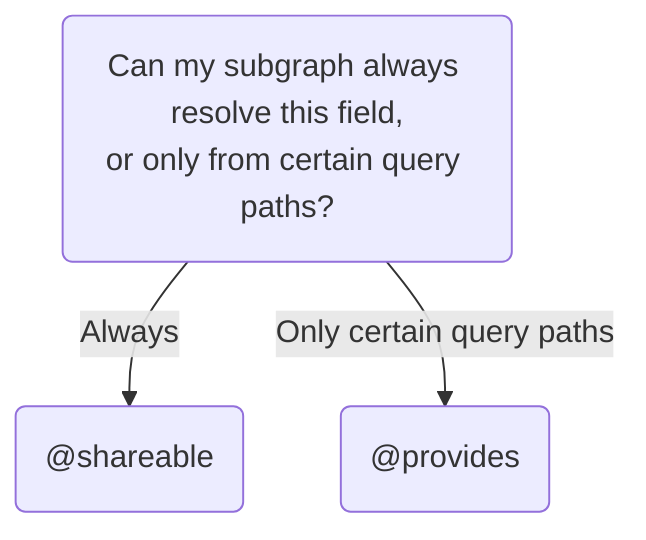

This article describes complex behaviors of federated entities beyond those covered in [entity basics](./entities/).

## Advanced `@key`s

A single entity can have multiple `@key`s. Additionally, a `@key` can include multiple fields, and even arbitrarily nested fields.

### Multiple `@key`s

You can define more than one `@key` for an entity, when applicable.

In this example, a `Product` entity can be uniquely identified by either its `id` _or_ its `sku`:

```graphql {1} title="Products subgraph"
type Product @key(fields: "id") @key(fields: "sku") {
  id: ID!
  sku: String!
  name: String!
  price: Int
}
```

This pattern is helpful when different subgraphs interact with different fields of an entity. For example, a `reviews` subgraph might refer to products by their ID, whereas an `inventory` subgraph might use SKUs.

A subgraph that [references an entity without contributing any fields](./entities/#referencing-an-entity-without-contributing-fields) can include the fields of any `@key` in its stub definition:

```graphql title="Reviews subgraph"
# Either:
type Product @key(fields: "id", resolvable: false) {
  id: ID!
}

# Or:
type Product @key(fields: "sku", resolvable: false) {
  sku: String!
}

```

### Compound `@key`s

A single `@key` can consist of multiple fields, and even _nested_ fields.

In this example, the `User` entity's primary key consists of both a user's `id` _and_ the `id` of that user's associated `Organization`:

```graphql {1} title="Users subgraph"
type User @key(fields: "id organization { id }") {
  id: ID!
  organization: Organization!
}

type Organization {
  id: ID!
}
```

## Migrating entities and fields

As your federated graph grows, you might decide that you want to move an entity's definition (or a particular _field_ of an entity) to a different subgraph. This section describes how to perform these migrations.

### Entity migration

Let's say our Payments subgraph defines a `Bill` entity:

<CodeColumns>

```graphql title="Payments subgraph"
type Bill @key(fields: "id") {
  id: ID!
  amount: Int!
}

type Payment {
  # ...
}
```

</CodeColumns>

Then, we add a dedicated Billing subgraph to our federated graph. It now makes sense to define the `Bill` entity there instead. When we're done migrating, we want our deployed subgraph schemas to look like this:

<CodeColumns>

```graphql title="Payments subgraph"
type Payment {
  # ...
}
```

```graphql title="Billing subgraph"
type Bill @key(fields: "id") {
  id: ID!
  amount: Int!
}
```

</CodeColumns>

The steps for this migration depend on how you perform schema composition:

<ExpansionPanel title="With Rover CLI composition">

1. In the Billing subgraph, define the `Bill` entity exactly as it's defined in the Payments subgraph:

    ```graphql title="Billing subgraph"
    type Bill @key(fields: "id") {
      id: ID!
      amount: Int!
    }
    ```

3. In the Billing subgraph, define resolvers for each field of `Bill` that are currently resolved in the Payments subgraph. These resolvers should behave identically to the resolvers in the Payments subgraph.

3. Deploy the updated Billing subgraph to your environment.

    * At this point, the Billing subgraph can successfully resolve `Bill` objects, but the router doesn't _know_ this yet because its supergraph schema hasn't been updated.

4. In the Payments subgraph, remove the `Bill` entity and its associated resolvers (**do not deploy this change yet**):

    <CodeColumns>

    ```graphql title="Payments subgraph"
    type Payment {
      # ...
    }
    ```

    ```graphql title="Billing subgraph"
    type Bill @key(fields: "id") {
      id: ID!
      amount: Int!
    }
    ```

    </CodeColumns>

5. Compose an updated supergraph schema with your usual configuration using `rover supergraph compose`.
    * This updated supergraph schema indicates that the Billing subgraph resolves `Bill` entities, and the Payments subgraph _doesn't_.

6. Assuming CI completes successfully, deploy an updated version of your _router_ with the new supergraph schema.
    * When this deployment completes, the router begins resolving `Bill` fields in the Billing subgraph _instead of_ the Payments subgraph.

7. Deploy an updated version of your Payments subgraph without the `Bill` entity.
    * At this point it's safe to remove this definition, because the router is never resolving `Bill` with the Payments subgraph.

We're done! `Bill` is now resolved in a new subgraph, and it was resolvable during each step of the migration process.

</ExpansionPanel>

<ExpansionPanel title="With managed federation">

1. In the Billing subgraph, define the `Bill` entity exactly as it's defined in the Payments subgraph:

    <CodeColumns>

    ```graphql title="Payments subgraph"
    type Bill @key(fields: "id") {
      id: ID!
      amount: Int!
    }

    type Payment {
      # ...
    }
    ```

    ```graphql title="Billing subgraph"
    type Bill @key(fields: "id") {
      id: ID!
      amount: Int!
    }
    ```

    </CodeColumns>

2. In the Billing subgraph, apply the `@override` directive to every field of `Bill`:

    <CodeColumns>

    ```graphql title="Payments subgraph"
    type Bill @key(fields: "id") {
      id: ID!
      amount: Int!
    }

    type Payment {
      # ...
    }
    ```

    ```graphql {2-3} title="Billing subgraph"
    type Bill @key(fields: "id") {
      id: ID! @override(from: "Payments")
      amount: Int! @override(from: "Payments")
    }
    ```

    </CodeColumns>

    The `@override` directive says, "Resolve this field in this subgraph _instead of_ in the Payments subgraph."

3. In the Billing subgraph, make sure your Federation 2 opt-in declaration includes the `@override` directive in its `import` array:

```graphql {3} title="Billing subgraph"
extend schema
  @link(url: "https://specs.apollo.dev/federation/v2.0",
        import: ["@key", "@shareable", "@override"])
```

4. In the Billing subgraph, define resolvers for each field of `Bill` that's currently resolved in the Payments subgraph. These resolvers should behave identically to the resolvers in the Payments subgraph.

5. Deploy the updated Billing subgraph to your environment.

    * This change is currently invisible to your router, which is not yet aware that the Billing subgraph defines the `Bill` entity.

6. Publish the updated Billing subgraph schema to Apollo.

    * When the router fetches its new supergraph schema, it detects that it should resolve the `Bill` entity in the Billing subgraph _instead of_ in the Payments subgraph.

7. In the Payments subgraph, _remove_ the `Bill` entity and its associated resolvers:

    <CodeColumns>

    ```graphql title="Payments subgraph"
    type Payment {
      # ...
    }
    ```

    ```graphql title="Billing subgraph"
    type Bill @key(fields: "id") {
      id: ID! @override(from: "Payments")
      amount: Int! @override(from: "Payments")
    }
    ```

    </CodeColumns>

8. Publish the updated Payments subgraph schema to Apollo.

    * When the router fetches its new supergraph schema, it continues resolving the `Bill` entity in the Billing subgraph. The `@override` directive has no effect if a field is defined in only one subgraph.

9. Deploy the updated Payments subgraph to your environment.

10. Remove all `@override` directives from the `Bill` entity in the Billing subgraph:

    <CodeColumns>

    ```graphql title="Payments subgraph"
    type Payment {
      # ...
    }
    ```

    ```graphql {2-3} title="Billing subgraph"
    type Bill @key(fields: "id") {
      id: ID!
      amount: Int!
    }
    ```

    </CodeColumns>

11. Publish the updated Billing subgraph schema to Apollo and deploy the updated Billing subgraph to your environment.

We're done! `Bill` now originates in a new subgraph, and it was resolvable during each step of the migration process.

</ExpansionPanel>

<ExpansionPanel title="With IntrospectAndCompose">

> ⚠️ We strongly recommend _against_ using `IntrospectAndCompose` in production. For details, see [Limitations of `IntrospectAndCompose`](./gateway/#limitations-of-introspectandcompose).

When you provide `IntrospectAndCompose` to `ApolloGateway`, it performs composition _itself_ on startup after fetching all of your subgraph schemas. If this runtime composition fails, the gateway fails to start up, resulting in downtime.

To minimize downtime for your graph, you need to make sure all of your subgraph schemas successfully compose whenever your gateway starts up. When migrating an entity, this requires a **coordinated deployment** of your modified subgraphs and a restart of the gateway itself.

1. In the Billing subgraph's schema, define the `Bill` entity exactly as it's defined in the Payments subgraph:

    <CodeColumns>

    ```graphql title="Payments subgraph"
    type Bill @key(fields: "id") {
      id: ID!
      amount: Int!
    }

    type Payment {
      # ...
    }
    ```

    ```graphql {1-4} title="Billing subgraph"
    type Bill @key(fields: "id") {
      id: ID!
      amount: Int!
    }
    ```

    </CodeColumns>

2. In the Billing subgraph, define resolvers for each field of `Bill` that are currently resolved in the Payments subgraph. These resolvers should behave identically to the resolvers in the Payments subgraph.

3. In the Payments subgraph's schema, remove the `Bill` entity and its associated resolvers:

    <CodeColumns>

    ```graphql title="Payments subgraph"
    type Payment {
      # ...
    }
    ```

    ```graphql title="Billing subgraph"
    type Bill @key(fields: "id") {
      id: ID!
      amount: Int!
    }
    ```

    </CodeColumns>

4. Bring down all instances of your gateway in your deployed environment. This downtime prevents inconsistent behavior during a rolling deploy of your subgraphs.

5. Deploy the updated Payments _and_ Billing subgraphs to your environment. When these deployments complete, bring your gateway instances back up and confirm that they start up successfully.

</ExpansionPanel>


### Field migration

The steps for migrating an individual field are nearly identical in form to the steps for [migrating an entire entity](#entity-migration).

**If you're using managed federation**, follow the steps in the **With managed federation** section above, but apply the `@override` directive to the _individual field_ you're migrating instead of _all_ fields.

If you're using local composition with Rover, see below for a field migration example.

#### Local composition example

Let's say our Products subgraph defines a `Product` entity, which includes the boolean field `inStock`:

<CodeColumns>

```graphql title="Products subgraph"
type Product @key(fields: "id") {
  id: ID!
  inStock: Boolean!
}
```

</CodeColumns>

Then, we add an Inventory subgraph to our federated graph. It now makes sense for the `inStock` field to originate in the Inventory subgraph instead, like this:

<CodeColumns>

```graphql title="Products subgraph"
type Product @key(fields: "id") {
  id: ID!
}
```

```graphql title="Inventory subgraph"
type Product @key(fields: "id") {
  id: ID!
  inStock: Boolean!
}
```

</CodeColumns>


We can perform this migration with the following steps (additional commentary on each step is provided in [Entity migration](#entity-migration)):

1. In the Inventory subgraph's schema, define the `Product` entity and include the `inStock` field:

    <CodeColumns>

    ```graphql title="Products subgraph"
    type Product @key(fields: "id") {
      id: ID!
      inStock: Boolean!
    }
    ```

    ```graphql title="Inventory subgraph"
    type Product @key(fields: "id") {
      id: ID!
      inStock: Boolean!
    }
    ```

    </CodeColumns>

2. In the Inventory subgraph, add a resolver for the `inStock` field. This subgraph should resolve the field with the exact same logic as the resolver in the Products subgraph.

3. Deploy the updated Inventory subgraph to your environment.

4. In the Products subgraph's schema, remove the `inStock` field and its associated resolver:

    <CodeColumns>

    ```graphql title="Products subgraph"
    type Product @key(fields: "id") {
      id: ID!
    }
    ```

    ```graphql title="Inventory subgraph"
    type Product @key(fields: "id") {
      id: ID!
      inStock: Boolean!
    }
    ```

    </CodeColumns>

5. Compose a new supergraph schema. Deploy a new version of your router that uses the updated schema.

6. Deploy the updated Products subgraph to your environment.

## Contributing computed entity fields

You can define fields of an entity that are computed based on the values of _other_ entity fields that are resolved by a _different_ subgraph.

For example, this Shipping subgraph adds a `shippingEstimate` field to the `Product` entity. This field is calculated based on the product's `size` and `weight`, which are defined in the Products subgraph:

```graphql {3-5} title="Shipping subgraph"
type Product @key(fields: "id") {
  id: ID!
  size: Int @external
  weight: Int @external
  shippingEstimate: String @requires(fields: "size weight")
}
```

As shown, you use the `@requires` directive to indicate which fields (and subfields) from _other_ subgraphs are required. You also need to _define_ the required fields and apply the `@external` directive to them. This directive tells the router, "This subgraph knows that these fields exist, but it _can't_ resolve them itself."

In the above example, if a query requests a product's `shippingEstimate`, the router does the following, in order:

1. It queries the Products subgraph for the product's `size` and `weight`.
2. It queries the Shipping subgraph for the product's `shippingEstimate`. The `size` and `weight` are included in the `Product` object passed to the resolver for `shippingEstimate`:

```js {4}
{
  Product: {
    shippingEstimate(product) {
      return computeShippingEstimate(product.id, product.size, product.weight);
    }
  }
}
```

### Using `@requires` with object subfields

If a computed field `@requires` a field that returns an object type, you also specify which _subfields_ of that object are required. You list those subfields with the following syntax:

```graphql {3-4} title="Shipping subgraph"
type Product @key(fields: "id") {
  id: ID!
  dimensions: ProductDimensions @external
  shippingEstimate: String @requires(fields: "dimensions { size weight }")
}
```

In this modification of the previous example, `size` and `weight` are now subfields of a `ProductDimensions` object. Note that the `ProductDimensions` type must be defined in both the Products _and_ Shipping subgraphs for this to be valid.

## Resolving another subgraph's field

By default, exactly one subgraph is responsible for resolving each field in your supergraph schema (with some exceptions, like entity `@key` fields). But sometimes, _multiple_ subgraphs are able to resolve a particular entity field, because all of those subgraphs have access to a particular data store. For example, an Inventory subgraph and a Products subgraph might both have access to the database that stores all product-related data.

You can enable multiple subgraphs to resolve a particular entity field. **This is a completely optional optimization.** When the router plans a query's execution, it looks at which fields are available from each subgraph. It can then attempt to optimize performance by executing the query across the fewest subgraphs needed to access all required fields.

You achieve this with one of the following directives:

* [`@shareable`](#using-shareable)
* [`@provides`](#using-provides)

Which directive you use depends on the following logic:



If you aren't sure whether your subgraph can always resolve a field, see [Using `@provides`](#using-provides) for an example of a subgraph that _can't_.

### Ensure resolver consistency

If multiple subgraphs can resolve a field, **make sure each subgraph's resolver for that field behaves identically.** Otherwise, queries might return inconsistent results to clients depending on which subgraph resolves the field.

This is especially important to keep in mind when making changes to an _existing_ resolver. If you don't make the resolver changes to each subgraph simultaneously, clients might observe inconsistent results.

Common inconsistent resolver behaviors to look out for include:

* Returning a different default value
* Throwing different errors in the same scenario

### Using `@shareable`

> ⚠️ Before using `@shareable`, see [Ensure resolver consistency](#ensure-resolver-consistency).

The `@shareable` directive indicates that a particular field can be resolved by more than one subgraph:

<CodeColumns>

```graphql {3} title="Products subgraph"
type Product @key(fields: "id") {
  id: ID!
  name: String! @shareable
  price: Int
}
```

```graphql {3} title="Inventory subgraph"
type Product @key(fields: "id") {
  id: ID!
  name: String! @shareable
  inStock: Boolean!
}
```

</CodeColumns>

In this example, both the Products and Inventory subgraphs can resolve `Product.name`. This means that a query that includes `Product.name` might be resolvable by fetching from fewer total subgraphs.

> If a field is marked `@shareable` in _any_ subgraph, it must be marked `@shareable` or `@external` in _every_ subgraph that defines it. Otherwise, composition fails.

### Using `@provides`

> ⚠️ Before using `@provides`, see [Ensure resolver consistency](#ensure-resolver-consistency).

The `@provides` directive indicates that a particular field can be resolved by a subgraph _at a particular query path_. Let's look at an example.

Here, our Products subgraph defines a `Product.name` field and marks it `@shareable` (this means other subgraphs are allowed to resolve it):

```graphql {3} title="Products subgraph"
type Product @key(fields: "id") {
  id: ID!
  name: String! @shareable
  price: Int
}
```

Meanwhile, our Inventory subgraph can _also_ resolve a product's name, but _only_ when that product is part of an `InStockCount`:

```graphql {2,8} title="Inventory subgraph"
type InStockCount {
  product: Product! @provides(fields: "name")
  quantity: Int!
}

type Product @key(fields: "id") {
  id: ID!
  name: String! @external
  inStock: Boolean!
}
```

Here we're using two directives in combination: `@provides` and `@external`.

* The `@provides` directive tells the router, "This subgraph can resolve the `name` of any `Product` object returned by `InStockCount.product`."
* The `@external` directive tells the router, "This subgraph _can't_ resolve the `name` of a `Product` object, _except_ wherever indicated by `@provides`."

#### Rules for using `@provides`

* If a subgraph `@provides` a field that it can't _always_ resolve, the subgraph must mark that field as `@external` and must _not_ mark it as `@shareable`.
  * Remember, a `@shareable` field can _always_ be resolved by a particular subgraph, which removes the need for `@provides`.
* To include a field in a `@provides` directive, that field must be marked as `@shareable` or `@external` in _every_ subgraph that defines it.

Violating any of these rules causes composition to fail.
