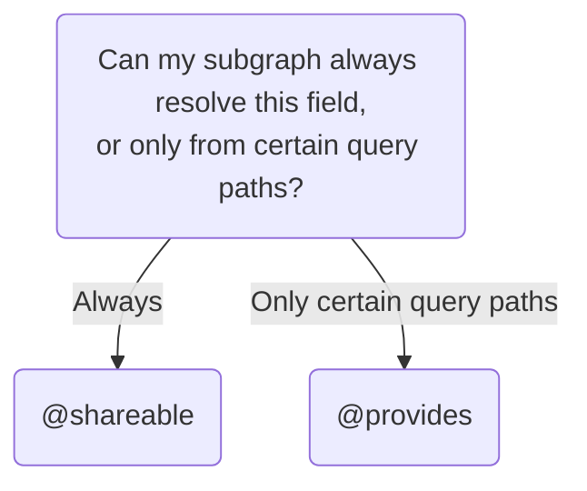

This article describes complex behaviors of federated entities beyond those covered in [entity basics](./entities/).

## Advanced `@key`s

A single entity can have multiple `@key`s. Additionally, a `@key` can include multiple fields, and even arbitrarily nested fields.

### Multiple `@key`s

You can define more than one `@key` for an entity, when applicable.

In this example, a `Product` entity can be uniquely identified by either its `id` _or_ its `sku`:

```graphql {1} title="Products subgraph"
type Product @key(fields: "id") @key(fields: "sku") {
  id: ID!
  sku: String!
  name: String!
  price: Int
}
```

This pattern is helpful when different subgraphs interact with different fields of an entity. For example, a Reviews subgraph might refer to products by their ID, whereas an Inventory subgraph might use SKUs.

A subgraph that [references an entity without contributing any fields](./entities/#referencing-an-entity-without-contributing-fields) can include the fields of any `@key` in its stub definition:

```graphql title="Reviews subgraph"
# Either:
type Product @key(fields: "id", resolvable: false) {
  id: ID!
}

# Or:
type Product @key(fields: "sku", resolvable: false) {
  sku: String!
}

```

### Compound `@key`s

A single `@key` can consist of multiple fields, and even _nested_ fields.

In this example, the `User` entity's primary key consists of both a user's `id` _and_ the `id` of that user's associated `Organization`:

```graphql {1} title="Users subgraph"
type User @key(fields: "id organization { id }") {
  id: ID!
  organization: Organization!
}

type Organization {
  id: ID!
}
```

### Differing `@key`s across subgraphs

An entity often has the exact same `@key` field(s) across subgraphs, but this isn't required. For example, you can define a `Product` entity shared between subgraphs, one with `sku` and `upc` as the `@key`s and one with only `upc` as the `@key` field:

<CodeColumns>

```graphql title="Products subgraph"
type Product @key(fields: "sku") @key(fields: "upc") {
  sku: ID!
  upc: String!
  name: String!
  price: Int
}
```

```graphql title="Inventory subgraph"
type Product @key(fields: "upc") {
  upc: String!
  inStock: Boolean!
}
```

</CodeColumns>

To merge entities between subgraphs, the entity must have at least one shared field between subgraphs. For example, you can't merge the `Product` entity defined in the following subgraphs because they don't share any fields specified in `@key` selection set:

<p style="margin-bottom: 0">❌</p>

<CodeColumns>

```graphql title="Products subgraph"
type Product @key(fields: "sku") {
  sku: ID!
  name: String!
  price: Int
}
```

```graphql title="Inventory subgraph"
type Product @key(fields: "upc") {
  upc: String!
  inStock: Boolean!
}
```

</CodeColumns>

The following would allow you to merge the `Product` entity since both subgraph schemas include the `upc` field, even if it's only the `@key` for one of them:

<CodeColumns>

```graphql title="Products subgraph"
type Product @key(fields: "sku") {
  sku: ID!
  upc: String!
  name: String!
  price: Int
}
```

```graphql title="Inventory subgraph"
type Product @key(fields: "upc") {
  upc: String!
  inStock: Boolean!
}
```

</CodeColumns>

If subgraphs share any fields—for example `upc` in the preceding example—it's best to use these shared field(s) as `@keys` for optimal [query planner](./entities#the-query-plan) performance.

<p style="margin-bottom: 0">✅</p>

<CodeColumns>

```graphql title="Products subgraph"
type Product @key(fields: "upc") {
  sku: ID!
  upc: String!
  name: String!
  price: Int
}
```

```graphql title="Inventory subgraph"
type Product @key(fields: "upc") {
  upc: String!
  inStock: Boolean!
}
```

</CodeColumns>

## Migrating entities and fields

As your supergraph grows, you might want to move parts of an entity to a different subgraph. This section describes how to perform these migrations safely.

### Incremental migration with `@override`

Let's say our Payments subgraph defines a `Bill` entity:

<CodeColumns>

```graphql title="Payments subgraph"
type Bill @key(fields: "id") {
  id: ID!
  amount: Int!
  payment: Payment
}

type Payment {
  # ...
}
```

</CodeColumns>

Then, we add a dedicated Billing subgraph to our supergraph. It now makes sense to move billing functionality there. When we're done migrating, we want our deployed subgraph schemas to look like this:

<CodeColumns>

```graphql title="Payments subgraph"
type Bill @key(fields: "id") {
  id: ID!
  payment: Payment
}

type Payment {
  # ...
}
```

```graphql title="Billing subgraph"
type Bill @key(fields: "id") {
  id: ID!
  amount: Int!
}
```

</CodeColumns>

The [`@override` directive](./federated-types/federated-directives#override) enables us to perform this migration incrementally with no downtime.

First, we deploy a new version of the Billing subgraph that defines _and_ resolves the `Bill` fields we want to move:

<CodeColumns>

  ```graphql title="Payments subgraph"
  type Bill @key(fields: "id") {
    id: ID!
    amount: Int!
    payment: Payment
  }

  type Payment {
    # ...
  }
  ```

  ```graphql {3} title="Billing subgraph"
  type Bill @key(fields: "id") {
    id: ID!
    amount: Int! @override(from: "Payments")
  }
  ```

</CodeColumns>

The `@override` directive says, "Resolve this field in this subgraph _instead of_ in the Payments subgraph."


<blockquote>

In any subgraph where you use `@override`, make sure to include it in your schema's `@link` imports (code-first subgraph libraries usually do this for you):

```graphql {3} title="Billing subgraph"
extend schema
  @link(url: "https://specs.apollo.dev/federation/v2.3",
        import: ["@key", "@shareable", "@override"])
```

</blockquote>

Next, we update our router's supergraph schema to include the updated Billing subgraph. If you're using managed federation, you do this by publishing the Billing subgraph's schema to GraphOS with [`rover subgraph publish`](/graphos/delivery/#subgraph-schemas).

When the router receives its updated supergraph schema, it immediately starts resolving the `Bill.amount` field from the Billing subgraph while continuing to resolve `Bill.payment` from the Payments subgraph.

> We can migrate as many entity fields as we want in a single change. To do so, we apply `@override` to every entity field we want to move. We can even migrate entire entities this way!

Now that `Bill.amount` is resolved in the Billing subgraph, we can safely _remove_ that field (and its resolver) from the Payments subgraph:

<CodeColumns>

  ```graphql {1-4} title="Payments subgraph"
  type Bill @key(fields: "id") {
    id: ID!
    payment: Payment
  }

  type Payment {
    # ...
  }
  ```

  ```graphql title="Billing subgraph"
  type Bill @key(fields: "id") {
    id: ID!
    amount: Int! @override(from: "Payments")
  }
  ```

</CodeColumns>

After making this change, we deploy our updated Payments subgraph and again update our router's supergraph schema.

> Because the router is already _ignoring_ `Bill.amount` in the Payments subgraph thanks to `@override`, we can safely publish our updated schema and deploy the subgraph in any order!

Finally, we can remove the `@override` directive from the Billing subgraph, because it no longer has any effect:

<CodeColumns>

  ```graphql title="Payments subgraph"
  type Bill @key(fields: "id") {
    id: ID!
    payment: Payment
  }

  type Payment {
    # ...
  }
  ```

  ```graphql {3} title="Billing subgraph"
  type Bill @key(fields: "id") {
    id: ID!
    amount: Int!
  }
  ```
</CodeColumns>

After we deploy the Billing subgraph and publish this final schema change, we're done! We've migrated `Bill.amount` to the Billing subgraph with zero downtime.

### Optimizing for fewer deploys with manual composition

> ⚠️ This method requires careful coordination between subgraph and router updates. Without strict control over the order of deployments and schema updates, you might cause an outage. For most use cases, we recommend using the [`@override` method above](#incremental-migration-with-override).

Using `@override` to migrate entity fields enables us to migrate fields incrementally with zero downtime. However, doing so requires three separate schema publishes. If you're using [manual composition](./federated-types/composition#manually-with-the-rover-cli), each schema change requires redeploying your router. With careful coordination, we can perform the same migration with only a _single_ router redeploy.

1. In the Billing subgraph, define the `Bill` entity, along with its corresponding resolvers. **These new resolvers should behave identically to the Payment subgraph resolvers they're replacing.**

    <CodeColumns>

      ```graphql title="Payments subgraph"
      type Bill @key(fields: "id") {
        id: ID!
        amount: Int!
        payment: Payment
      }

      type Payment {
        # ...
      }
      ```

      ```graphql title="Billing subgraph"
      type Bill @key(fields: "id") {
        id: ID!
        amount: Int!
      }
      ```

    </CodeColumns>

2. Deploy the updated Billing subgraph to your environment, but **do not publish the updated schema yet**.

    * At this point, the Billing subgraph can successfully resolve `Bill` objects, but the router doesn't _know_ this yet because its supergraph schema hasn't been updated. Publishing the schema would cause a composition error.

3. In the Payments subgraph, remove the migrated fields from the `Bill` entity and their associated resolvers (**do not deploy this change yet**):

    <CodeColumns>

    ```graphql title="Payments subgraph"
    type Bill @key(fields: "id") {
      id: ID!
      payment: Payment
    }

    type Payment {
      # ...
    }
    ```

    ```graphql title="Billing subgraph"
    type Bill @key(fields: "id") {
      id: ID!
      amount: Int!
    }
    ```

    </CodeColumns>

4. Compose an updated supergraph schema with your usual configuration using `rover supergraph compose`.
    * This updated supergraph schema indicates that the Billing subgraph resolves `Bill.amount`, and the Payments subgraph _doesn't_.

5. Assuming CI completes successfully, deploy an updated version of your _router_ with the new supergraph schema.
    * When this deployment completes, the router begins resolving `Bill` fields in the Billing subgraph _instead of_ the Payments subgraph.

    > ⚠️ While your new router instances are deploying, you will probably have active router instances resolving the `Bill.amount` field in two different ways (with older instances still resolving it from Payments). It's important that the two subgraphs resolve the field in **exactly the same way**, or your clients might see inconsistent data during this rollover.

6. Deploy the updated version of your Payments subgraph without the migrated field.
    * At this point it's safe to remove this definition, because your router instances are using the Billing subgraph exclusively.

We're done! The migrated fields have been moved to a new subgraph, and we only  redeployed our router once.

## Contributing computed entity fields

You can define fields of an entity that are computed based on the values of _other_ entity fields that are resolved by a _different_ subgraph.

For example, this Shipping subgraph adds a `shippingEstimate` field to the `Product` entity. This field is calculated based on the product's `size` and `weight`, which are defined in the Products subgraph:

```graphql {3-5} title="Shipping subgraph"
type Product @key(fields: "id") {
  id: ID!
  size: Int @external
  weight: Int @external
  shippingEstimate: String @requires(fields: "size weight")
}
```

As shown, you use the `@requires` directive to indicate which fields (and subfields) from _other_ subgraphs are required. You also need to _define_ the required fields and apply the `@external` directive to them. This directive tells the router, "This subgraph knows that these fields exist, but it _can't_ resolve them itself."

In the above example, if a query requests a product's `shippingEstimate`, the router does the following, in order:

1. It queries the Products subgraph for the product's `size` and `weight`.
2. It queries the Shipping subgraph for the product's `shippingEstimate`. The `size` and `weight` are included in the `Product` object passed to the resolver for `shippingEstimate`:

```js {4}
{
  Product: {
    shippingEstimate(product) {
      return computeShippingEstimate(product.id, product.size, product.weight);
    }
  }
}
```

### Using `@requires` with object subfields

If a computed field `@requires` a field that returns an object type, you also specify which _subfields_ of that object are required. You list those subfields with the following syntax:

```graphql {3-4} title="Shipping subgraph"
type Product @key(fields: "id") {
  id: ID!
  dimensions: ProductDimensions @external
  shippingEstimate: String @requires(fields: "dimensions { size weight }")
}
```

In this modification of the previous example, `size` and `weight` are now subfields of a `ProductDimensions` object. Note that the `ProductDimensions` type must be defined in both the Products _and_ Shipping subgraphs for this to be valid.

### Using `@requires` with fields that take arguments

> This functionality was introduced in Federation `v2.1.2`.

The `@requires` directive can include fields that take arguments, like so:

```graphql title="Shipping subgraph"
type Product @key(fields: "id") {
  id: ID!
  weight(units: String): Int @external
  #highlight-start
  shippingEstimate: String @requires(fields: "weight(units:\"KILOGRAMS\")")
  #highlight-end
}
```

- The router provides the specified values in its query to whichever subgraph defines the required field.
- Each specified argument value is _static_ (i.e., the router always provides the same value).
- You can omit values for nullable arguments. You _must_ provide values for non-nullable arguments.
- If you define your subgraph schema in an SDL file (instead of programmatically), you must escape quotes for string and enum values with backslashes (as shown above).

## Resolving another subgraph's field

By default, exactly one subgraph is responsible for resolving each field in your supergraph schema (with important exceptions, like entity `@key` fields). But sometimes, _multiple_ subgraphs are able to resolve a particular entity field, because all of those subgraphs have access to a particular data store. For example, an Inventory subgraph and a Products subgraph might both have access to the database that stores all product-related data.

You can enable multiple subgraphs to resolve a particular entity field. **This is a completely optional optimization.** When the router plans a query's execution, it looks at which fields are available from each subgraph. It can then attempt to optimize performance by executing the query across the fewest subgraphs needed to access all required fields.

You achieve this with one of the following directives:

* [`@shareable`](#using-shareable)
* [`@provides`](#using-provides)

Which directive you use depends on the following logic:



If you aren't sure whether your subgraph can _always_ resolve a field, see [Using `@provides`](#using-provides) for an example of a subgraph that _can't_.

### Ensure resolver consistency

If multiple subgraphs can resolve a field, **make sure each subgraph's resolver for that field behaves identically.** Otherwise, queries might return inconsistent results to clients depending on which subgraph resolves the field.

This is especially important to keep in mind when making changes to an _existing_ resolver. If you don't make the resolver changes to each subgraph simultaneously, clients might observe inconsistent results.

Common inconsistent resolver behaviors to look out for include:

* Returning a different default value
* Throwing different errors in the same scenario

### Using `@shareable`

> ⚠️ Before using `@shareable`, see [Ensure resolver consistency](#ensure-resolver-consistency).

The `@shareable` directive indicates that a particular field can be resolved by more than one subgraph:

<CodeColumns>

```graphql {3} title="Products subgraph"
type Product @key(fields: "id") {
  id: ID!
  name: String! @shareable
  price: Int
}
```

```graphql {3} title="Inventory subgraph"
type Product @key(fields: "id") {
  id: ID!
  name: String! @shareable
  inStock: Boolean!
}
```

</CodeColumns>

In this example, both the Products and Inventory subgraphs can resolve `Product.name`. This means that a query that includes `Product.name` might be resolvable by fetching from fewer total subgraphs.

> If a field is marked `@shareable` in _any_ subgraph, it must be marked `@shareable` or `@external` in _every_ subgraph that defines it. Otherwise, composition fails.

### Using `@provides`

> ⚠️ Before using `@provides`, see [Ensure resolver consistency](#ensure-resolver-consistency).

The `@provides` directive indicates that a particular field can be resolved by a subgraph _at a particular query path_. Let's look at an example.

Here, our Products subgraph defines a `Product.name` field and marks it `@shareable` (this means other subgraphs are allowed to resolve it):

```graphql {3} title="Products subgraph"
type Product @key(fields: "id") {
  id: ID!
  name: String! @shareable
  price: Int
}
```

Meanwhile, our Inventory subgraph can _also_ resolve a product's name, but _only_ when that product is part of an `InStockCount`:

```graphql {2,8} title="Inventory subgraph"
type InStockCount {
  product: Product! @provides(fields: "name")
  quantity: Int!
}

type Product @key(fields: "id") {
  id: ID!
  name: String! @external
  inStock: Boolean!
}
```

Here we're using two directives in combination: `@provides` and `@external`.

* The `@provides` directive tells the router, "This subgraph can resolve the `name` of any `Product` object returned by `InStockCount.product`."
* The `@external` directive tells the router, "This subgraph _can't_ resolve the `name` of a `Product` object, _except_ wherever indicated by `@provides`."

#### Rules for using `@provides`

* If a subgraph `@provides` a field that it can't _always_ resolve, the subgraph must mark that field as `@external` and must _not_ mark it as `@shareable`.
  * Remember, a `@shareable` field can _always_ be resolved by a particular subgraph, which removes the need for `@provides`.
* To include a field in a `@provides` directive, that field must be marked as `@shareable` or `@external` in _every_ subgraph that defines it.

Violating any of these rules causes composition to fail.

## Handling the N+1 problem

Most subgraph implementations use **reference resolvers** (sometimes known as entity resolvers) to handle the `Query._entities` field ergonomically. A reference resolver is passed a single key and returns the entity object that corresponds to that key.

Although this pattern is straightforward, it can diminish performance when a client operation requests fields from _many_ entities. To illustrate this, let's revisit an earlier example:

```graphql {6}
query GetReviewsWithProducts {
  latestReviews { # Defined in Reviews
    score
    product {
      id
      price # ⚠️ NOT defined in Reviews!
    }
  }
}
```

As mentioned in [The query plan](./entities#the-query-plan), the router executes two queries on its subgraphs to resolve the above operation:

1. It queries the Reviews subgraph to fetch all fields _except_ `Product.price`.
2. It queries the Products subgraph to fetch the `price` of each `Product` entity.

In the Products subgraph, the reference resolver for `Product` doesn't take a list of keys, but rather a _single_ key. Therefore, the subgraph library calls the reference resolver _once for each key_:

```js {4-6} title="resolvers.js"
// Products subgraph
const resolvers = {
  Product: {
    __resolveReference(productRepresentation) {
      return fetchProductByID(productRepresentation.id);
    }
  },
  // ...other resolvers...
}
```

A basic implementation of the `fetchProductByID` function might make a database call each time it's called. If we need to resolve `Product.price` for `N` different products, this results in `N` database calls. These calls are made _in addition to_ the call made by the Reviews subgraph to fetch the initial list of reviews (and the `id` of each product). This is where the "N+1" problem gets its name. If not prevented, this problem can cause performance problems or even enable denial-of-service attacks.

This problem is not limited to reference resolvers! In fact, it can occur with any resolver that fetches from a data store. To handle this problem, we strongly recommend using [the dataloader pattern](https://github.com/graphql/dataloader). Nearly every GraphQL server library provides a dataloader implementation, and you should use it in **every resolver**. This is true even for resolvers that _aren't_ for entities and that _don't_ return a list. These resolvers can _still_ cause N+1 issues via [batched requests](/enterprise-guide/graph-security/#batched-requests).
