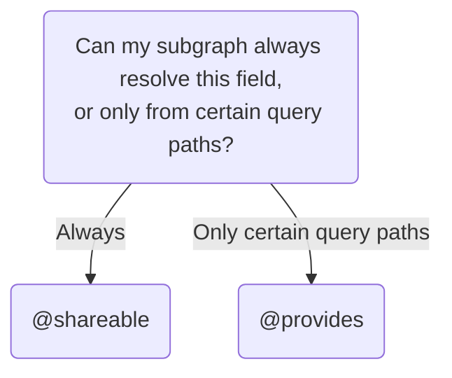

import ProgressiveOverrideEnterprise from '../shared/progressive-override-enterprise.mdx';

This article describes complex behaviors of federated entities beyond those covered in [entity basics](./entities/).

## Using advanced `@key`s

Depending on your entities' fields and usage, you may need to use more advanced `@key`s. For example, you may need to define a [compound `@key`](#compound-keys) if multiple fields are required to uniquely identify an entity. If different subgraphs interact with different fields an entity, you may need to define [multiple](#multiple-keys)&mdash;and sometimes [differing](#differing-keys-across-subgraphs)&mdash;`@key`s for the entity.

### Compound `@key`s

A single `@key` can consist of multiple fields, the combination of which uniquely identifies an entity. This is called a _compound_ or _composite key_. In the following example, the combination of both `username` and `domain` fields is required to uniquely identify the `User` entity:

```graphql {1} title="Users subgraph"
type User @key(fields: "username domain") {
  username: String!
  domain: String!
}
```

#### Nested fields in compound `@key`s

Nested fields are often used in compound keys.
In the following example, the `User` entity's `@key` consists of both a user's `id` and the `id` of that user's associated `Organization`:

```graphql {1} title="Users subgraph"
type User @key(fields: "id organization { id }") {
  id: ID!
  organization: Organization!
}

type Organization {
  id: ID!
}
```

<Note>

Though nested fields are most commonly used in compound keys, you can also use a nested field as a single `@key` field.

</Note>

### Multiple `@key`s

When different subgraphs interact with different fields of an entity, you may need to define multiple `@key`s for the entity. For example, a Reviews subgraph might refer to products by their ID, whereas an Inventory subgraph might use SKUs.

In the following example, the `Product` entity can be uniquely identified by either its `id` or its `sku`:

```graphql {1} title="Products subgraph"
type Product @key(fields: "id") @key(fields: "sku") {
  id: ID!
  sku: String!
  name: String!
  price: Int
}
```
<Note>

If you include multiple sets of `@key` fields, the query planner uses the most efficient set for entity resolution. For example, suppose you allow a type to be identified by `@key(fields: "id")` or `@key(fields: "id sku")`:

```graphql {1}
type Product @key(fields: "id") @key(fields: "id sku") {
  # ...
}
```

That means either `id` or (`id` and `sku`) is enough to uniquely identify the entity. Since `id` alone is enough, the query planner will use only that field to resolve the entity, and `@key(fields: "id sku")` is effectively ignored.

</Note>

#### Referencing entities with multiple keys

A subgraph that [references an entity without contributing any fields](./entities/#referencing-an-entity-without-contributing-fields) can use any `@key` fields in its stub definition. For example, if the Products subgraph defines the `Product` entity like this:

```graphql {1} title="Products subgraph"
type Product @key(fields: "id") @key(fields: "sku") {
  id: ID!
  sku: String!
  name: String!
  price: Int
}
```

Then, a Reviews subgraph can use either `id` or `sku` in the stub definition:

```graphql title="Reviews subgraph"
# Either:
type Product @key(fields: "id", resolvable: false) {
  id: ID!
}

# Or:
type Product @key(fields: "sku", resolvable: false) {
  sku: String!
}
```

When resolving a reference for an entity with multiple keys, you can determine how to resolve it based on which key is present. For example, if you're using [`@apollo/subgraph`](/apollo-server/using-federation/api/apollo-subgraph/), it could look like this:

```js title="resolvers.js"
// Products subgraph
const resolvers = {
  Product: {
    __resolveReference(productRepresentation) {
      if(productRepresentation.sku){
        return fetchProductBySku(productRepresentation.sku);
      } else {
        return fetchProductByID(productRepresentation.id);
      }
    }
  },
  // ...other resolvers...
}
```

### Differing `@key`s across subgraphs

Although an entity commonly uses the exact same `@key` field(s) across subgraphs, you can alternatively use different `@key`s with different fields. For example, you can define a `Product` entity shared between subgraphs, one with `sku` and `upc` as its `@key`s, and the other with only `upc` as the `@key` field:

```graphql title="Products subgraph"
type Product @key(fields: "sku") @key(fields: "upc") {
  sku: ID!
  upc: String!
  name: String!
  price: Int
}
```

```graphql title="Inventory subgraph"
type Product @key(fields: "upc") {
  upc: String!
  inStock: Boolean!
}
```

To merge entities between subgraphs, the entity must have at least one shared field between subgraphs. For example, operations can't merge the `Product` entity defined in the following subgraphs because they don't share any fields specified in the `@key` selection set:

<p style="margin-bottom: 0">❌</p>

<CodeColumns>

```graphql title="Products subgraph"
type Product @key(fields: "sku") {
  sku: ID!
  name: String!
  price: Int
}
```

```graphql title="Inventory subgraph"
type Product @key(fields: "upc") {
  upc: String!
  inStock: Boolean!
}
```

</CodeColumns>

#### Operations with differing `@key`s

Differing keys across subgraphs affect which of the entity's fields can be resolved from each subgraph. Requests can resolve fields if there is a traversable path from the root query to the fields.

Take these subgraph schemas as an example:

<CodeColumns>

```graphql title="Products subgraph"
type Product @key(fields: "sku") {
  sku: ID!
  upc: String!
  name: String!
  price: Int
}

type Query {
  product(sku: ID!): Product
  products: [Product!]!
}

```

```graphql title="Inventory subgraph"
type Product @key(fields: "upc") {
  upc: String!
  inStock: Boolean!
}
```
</CodeColumns>

The queries defined in the Products subgraph can always resolve all product fields because the product entity can be joined via the `upc` field present in both schemas.

On the other hand, queries added to the Inventory subgraph can't resolve fields from the Products subgraph:

<CodeColumns>

```graphql title="Products subgraph"
type Product @key(fields: "sku") {
  sku: ID!
  upc: String!
  name: String!
  price: Int
}
```

```graphql title="Inventory subgraph"
type Product @key(fields: "upc") {
  upc: String!
  inStock: Boolean!
}

type Query {
  productsInStock: [Product!]!
}
```

</CodeColumns>

The `productsInStock` query can't resolve fields from the Products subgraph since the Products subgraph's `Product` type definition doesn't include `upc` as a key field, and `sku` isn't present in the Inventory subgraph.

If the Products subgraph includes `@key(fields: "upc")`, all queries from the Inventory subgraph can resolve all product fields:

```graphql title="Products subgraph"
type Product @key(fields: "sku") @key(fields: "upc") {
  sku: ID!
  upc: String!
  name: String!
  price: Int
}
```

```graphql title="Inventory subgraph"
type Product @key(fields: "upc") {
  upc: String!
  inStock: Boolean!
}

type Query {
  productsInStock: [Product!]!
}
```

## Migrating entity fields and root fields

As your supergraph grows, you might want to move parts of one subgraph to another subgraph. This section describes how to migrate entity and root fields safely.

### Using the `@override` directive

You can migrate between subgraphs all at once with `@override`.

<Tip>

We recommend organizations with an Enterprise license to migrate gradually with progressive `@override`. See the guide [Incremental migration with progressive `@override`](#incremental-migration-with-progressive-override).

</Tip>

Let's say the Payments subgraph defines a `Bill` entity:

<CodeColumns>

```graphql title="Payments subgraph"
type Bill @key(fields: "id") {
  id: ID!
  amount: Int!
  payment: Payment
}

type Payment {
  # ...
}
```

</CodeColumns>

As your graph evolves, you decide to add a dedicated Billing subgraph to your supergraph. It makes sense to move billing functionality there, including the amount of a bill. You want the deployed subgraph schemas to look like this:

<CodeColumns>

```graphql title="Payments subgraph"
type Bill @key(fields: "id") {
  id: ID!
  payment: Payment
}

type Payment {
  # ...
}
```

```graphql title="Billing subgraph"
type Bill @key(fields: "id") {
  id: ID!
  amount: Int!
}
```

</CodeColumns>

The [`@override` directive](./federated-types/federated-directives#override) enables you to incrementally migrate between subgraphs with no downtime.

Follow these steps to use the `@override` directive:

1. If the `@override` directive isn't already imported, include it in your schema's `@link` imports:

    ```graphql {3} title="Billing subgraph"
    extend schema
      @link(url: "https://specs.apollo.dev/federation/v2.7",
            import: ["@key", "@shareable", "@override"])
    ```

2. Deploy a new version of the Billing subgraph that both defines and resolves the `Bill` fields you want to move:

    <CodeColumns>

      ```graphql title="Payments subgraph"
      type Bill @key(fields: "id") {
        id: ID!
        amount: Int!
        payment: Payment
      }

      type Payment {
        # ...
      }
      ```

      ```graphql {3} title="Billing subgraph"
      type Bill @key(fields: "id") {
        id: ID!
        amount: Int! @override(from: "Payments") #highlight-line
      }
      ```

    </CodeColumns>

      Applying the `@override` directive tells the router to resolve the `amount` field in the Billing subgraph instead of the Payments subgraph.


3. Update your router's supergraph schema to migrate to the updated Billing subgraph. If you're using managed federation, you do this by publishing the Billing subgraph's schema to GraphOS with [`rover subgraph publish`](/graphos/delivery/#subgraph-schemas).

When the router receives its updated supergraph schema, it immediately starts resolving the `Bill.amount` field from the Billing subgraph while continuing to resolve `Bill.payment` from the Payments subgraph.

<Note>

We can migrate as many entity fields as we want in a single change. To do so, we apply `@override` to every entity field we want to move. We can even migrate entire entities this way.

</Note>

Now that `Bill.amount` is resolved in the Billing subgraph, we can safely remove that field (and its resolver) from the Payments subgraph:

<CodeColumns>

  ```graphql {1-4} title="Payments subgraph"
  type Bill @key(fields: "id") {
    id: ID!
    payment: Payment
  }

  type Payment {
    # ...
  }
  ```

  ```graphql title="Billing subgraph"
  type Bill @key(fields: "id") {
    id: ID!
    amount: Int! @override(from: "Payments")
  }
  ```

</CodeColumns>

After making this change, we deploy our updated Payments subgraph and again update our router's supergraph schema.

<Note>

Because the router is already ignoring `Bill.amount` in the Payments subgraph thanks to `@override`, we can safely publish our updated schema or deploy the subgraph in any order.

</Note>

4. Remove the `@override` directive from the Billing subgraph, because it no longer has any effect:

    <CodeColumns>

      ```graphql title="Payments subgraph"
      type Bill @key(fields: "id") {
        id: ID!
        payment: Payment
      }

      type Payment {
        # ...
      }
      ```

      ```graphql {3} title="Billing subgraph"
      type Bill @key(fields: "id") {
        id: ID!
        amount: Int!
      }
      ```
    </CodeColumns>

After we deploy the Billing subgraph and publish this final schema change, we're done. We've migrated `Bill.amount` to the Billing subgraph with zero downtime.

<MinVersion version="2.7">

### Incremental migration with progressive `@override`

</MinVersion>

You can migrate between subgraphs gradually with progressive `@override`.

<ProgressiveOverrideEnterprise/>

Let's say the Payments subgraph defines a `Bill` entity:

<CodeColumns>

```graphql title="Payments subgraph"
type Bill @key(fields: "id") {
  id: ID!
  amount: Int!
  payment: Payment
}

type Payment {
  # ...
}
```

</CodeColumns>

As your graph evolves, you decide to add a dedicated Billing subgraph to your supergraph. It makes sense to move billing functionality there, including the amount of a bill. You want the deployed subgraph schemas to look like this:

<CodeColumns>

```graphql title="Payments subgraph"
type Bill @key(fields: "id") {
  id: ID!
  payment: Payment
}

type Payment {
  # ...
}
```

```graphql title="Billing subgraph"
type Bill @key(fields: "id") {
  id: ID!
  amount: Int!
}
```

</CodeColumns>

The [`@override` directive](./federated-types/federated-directives#override) enables you to incrementally migrate between subgraphs with no downtime.

Follow these steps to use the `@override` directive:

1. If the `@override` directive isn't already imported, include it in your schema's `@link` imports:

    ```graphql {3} title="Billing subgraph"
    extend schema
      @link(url: "https://specs.apollo.dev/federation/v2.7",
            import: ["@key", "@shareable", "@override"])
    ```

2. Deploy a new version of the Billing subgraph that both defines and resolves the `Bill` fields you want to move:

    <CodeColumns>

      ```graphql title="Payments subgraph"
      type Bill @key(fields: "id") {
        id: ID!
        amount: Int!
        payment: Payment
      }

      type Payment {
        # ...
      }
      ```

      ```graphql {3} title="Billing subgraph"
      type Bill @key(fields: "id") {
        id: ID!
        amount: Int! @override(from: "Payments", label: "percent(1)") #highlight-line
      }
      ```

    </CodeColumns>

      Applying the `@override` directive tells the router to resolve the `amount` field in the Billing subgraph instead of the Payments subgraph. 

      Adding a `label` argument to the `@override` directive sets the percentage of traffic to direct to the Billing subgraph. Start with a small percentage. Setting `label: "percent(1)"` means that 1 percent of the requests for `amount` are resolved by the Billing subgraph, while the remaining 99 percent are resolved by the Payments subgraph. 

3. Update your router's supergraph schema to begin the migration to the updated Billing subgraph.

When the router receives its updated supergraph schema, it starts resolving the `Bill.amount` field from the Billing subgraph approximately 1% of the time, while continuing to resolve it from the Payments subgraph the other 99%.

<Note>

We can migrate as many entity fields as we want in a single change. To do so, we apply `@override` to every entity field we want to move. We can even migrate entire entities this way.

</Note>

4. Gradually and iteratively increase the percent of traffic directed to the Billing subgraph, update your router's supergraph schema, and validate the performance of the Billing subgraph. Continue until the migration is completed with `label: "percent(100)"` and all traffic is resolved by the Billing subgraph.

    ```graphql title="Billing subgraph"
    type Bill @key(fields: "id") {
      id: ID!
      amount: Int! @override(from: "Payments", label: "percent(100)") #highlight-line
    }
      ``` 

5. Now that `Bill.amount` is resolved in the Billing subgraph, we can safely remove that field (and its resolver) from the Payments subgraph:

<CodeColumns>

  ```graphql {1-4} title="Payments subgraph"
  type Bill @key(fields: "id") {
    id: ID!
    payment: Payment
  }

  type Payment {
    # ...
  }
  ```

  ```graphql title="Billing subgraph"
  type Bill @key(fields: "id") {
    id: ID!
    amount: Int! @override(from: "Payments")
  }
  ```

</CodeColumns>

After making this change, we deploy our updated Payments subgraph and again update our router's supergraph schema.

<Note>

Because the router is already ignoring `Bill.amount` in the Payments subgraph thanks to `@override`, we can safely publish our updated schema and deploy the subgraph in any order.

</Note>

6. Remove the `@override` directive from the Billing subgraph because it no longer has any effect:

    <CodeColumns>

      ```graphql title="Payments subgraph"
      type Bill @key(fields: "id") {
        id: ID!
        payment: Payment
      }

      type Payment {
        # ...
      }
      ```

      ```graphql {3} title="Billing subgraph"
      type Bill @key(fields: "id") {
        id: ID!
        amount: Int!
      }
      ```
    </CodeColumns>

After we deploy the Billing subgraph and publish this final schema change, we're done. We've migrated `Bill.amount` to the Billing subgraph with zero downtime.

#### Safe usage of progressive `@override`

When using progressive `@override`, a single operation can now result in multiple query plans. Query plans are cached by the router, with the set of unique, overridden labels contributing to the cache key. 

Prior to progressive `@override`, only a single query plan was generated for a given operation. With progressive `@override`, the number of query plans doubles for each unique label in the operation's "path". 

A few strategies to mitigate this concern:

1. Don't leave progressive `@override` in place indefinitely. Migrate the field and remove the `label` argument from the `@override` directive as soon as reasonably possible.
2. Share labels across fields that are being migrated together. For example, if you are migrating `Bill.amount` and `Bill.payment` together, use the same label for both fields. This will ensure that the number of query plans does not increase as a result of the migration.
3. Use a small, known set of labels (for example `percent(5)`, `percent(25)`, `percent(50)`).

#### Customizing progressive `@override` behavior with a feature flag service

Out of the box, the router supports the `percent(x)` syntax for resolving labels based on a given percentage. Unfortunately, updating this number requires a subgraph publish and router redeploy. To avoid this, you can use a feature flag service to dynamically update the label value.

The router provides an interface for coprocessors and rhai scripts to resolve arbitrary labels. This allows you to dial up or disable a label's rollout status without requiring a subgraph publish. A coprocessor or rhai script that implements this should take the following steps:
1. Implement the [`SupergraphService`](/router/customizations/rhai/#supergraphservice)
2. Inspect the `apollo_override::unresolved_labels` context key to determine which labels exist in the schema that haven't been resolved by the router.
3. Resolve the labels using your feature flag service (or any other mechanism).
4. Add the resolved labels to the `apollo_override::labels_to_override` context key.

<Note>

The unresolved labels are all labels in the schema that haven't been resolved by the router. They may not all pertain to the incoming operation. As a final step, the router will filter the resolved labels to only those that are relevant to the operation in order to minimize the set of labels contributing to the query plan cache key. It is expected that a coprocessor or rhai script will resolve all labels in the schema, not just those relevant to the operation.

</Note>

For an example implementation of a coprocessor that resolves labels using LaunchDarkly, see [the example](https://github.com/apollographql/router/tree/main/examples/coprocessor-override-launchdarkly/README.md) in the router repo.

### Optimizing for fewer deploys with manual composition

<Caution>

This method requires careful coordination between subgraph and router updates. Without strict control over the order of deployments and schema updates, you might cause an outage. For most use cases, we recommend using the [`@override` method above](#incremental-migration-with-override).

</Caution>

Using `@override` to migrate entity fields enables us to migrate fields incrementally with zero downtime. However, doing so requires three separate schema publishes. If you're using [manual composition](./federated-types/composition#manually-with-the-rover-cli), each schema change requires redeploying your router. With careful coordination, we can perform the same migration with only a single router redeploy.

1. In the Billing subgraph, define the `Bill` entity, along with its corresponding resolvers. These new resolvers should behave identically to the Payment subgraph resolvers they're replacing.

    <CodeColumns>

      ```graphql title="Payments subgraph"
      type Bill @key(fields: "id") {
        id: ID!
        amount: Int!
        payment: Payment
      }

      type Payment {
        # ...
      }
      ```

      ```graphql title="Billing subgraph"
      type Bill @key(fields: "id") {
        id: ID!
        amount: Int!
      }
      ```

    </CodeColumns>

2. Deploy the updated Billing subgraph to your environment, but do not publish the updated schema yet.

    - At this point, the Billing subgraph can successfully resolve `Bill` objects, but the router doesn't know this yet because its supergraph schema hasn't been updated. Publishing the schema would cause a composition error.

3. In the Payments subgraph, remove the migrated fields from the `Bill` entity and their associated resolvers (do not deploy this change yet):

    <CodeColumns>

    ```graphql title="Payments subgraph"
    type Bill @key(fields: "id") {
      id: ID!
      payment: Payment
    }

    type Payment {
      # ...
    }
    ```

    ```graphql title="Billing subgraph"
    type Bill @key(fields: "id") {
      id: ID!
      amount: Int!
    }
    ```

    </CodeColumns>

4. Compose an updated supergraph schema with your usual configuration using `rover supergraph compose`.
    - This updated supergraph schema indicates that the Billing subgraph resolves `Bill.amount`, and the Payments subgraph doesn't.

5. Assuming CI completes successfully, deploy an updated version of your router with the new supergraph schema.
    - When this deployment completes, the router begins resolving `Bill` fields in the Billing subgraph instead of the Payments subgraph.

    - While your new router instances are deploying, you will probably have active router instances resolving the `Bill.amount` field in two different ways (with older instances still resolving it from Payments). It's important that the two subgraphs resolve the field in exactly the same way, or your clients might see inconsistent data during this rollover.

6. Deploy the updated version of your Payments subgraph without the migrated field.
    - At this point it's safe to remove this definition, because your router instances are using the Billing subgraph exclusively.

We're done! The migrated fields have been moved to a new subgraph, and we only  redeployed our router once.

## Contributing computed entity fields

You can define fields of an entity that are computed based on the values of other entity fields that are resolved by a different subgraph.

For example, this Shipping subgraph adds a `shippingEstimate` field to the `Product` entity. This field is calculated based on the product's `size` and `weight`, which are defined in the Products subgraph:

```graphql {3-5} title="Shipping subgraph"
type Product @key(fields: "id") {
  id: ID!
  size: Int @external
  weight: Int @external
  shippingEstimate: String @requires(fields: "size weight")
}
```

As shown, you use the `@requires` directive to indicate which fields (and subfields) from other subgraphs are required. You also need to define the required fields and apply the `@external` directive to them. This directive tells the router, "This subgraph knows that these fields exist, but it can't resolve them itself."

In the above example, if a query requests a product's `shippingEstimate`, the router does the following, in order:

1. It queries the Products subgraph for the product's `size` and `weight`.
2. It queries the Shipping subgraph for the product's `shippingEstimate`. The `size` and `weight` are included in the `Product` object passed to the resolver for `shippingEstimate`:

```js {4}
{
  Product: {
    shippingEstimate(product) {
      return computeShippingEstimate(product.id, product.size, product.weight);
    }
  }
}
```

### Using `@requires` with object subfields

If a computed field `@requires` a field that returns an object type, you also specify which subfields of that object are required. You list those subfields with the following syntax:

```graphql {3-4} title="Shipping subgraph"
type Product @key(fields: "id") {
  id: ID!
  dimensions: ProductDimensions @external
  shippingEstimate: String @requires(fields: "dimensions { size weight }")
}
```

In this modification of the previous example, `size` and `weight` are now subfields of a `ProductDimensions` object. Note that the `ProductDimensions` type must be defined in both the Products and Shipping subgraphs for this to be valid.

<MinVersion version="2.1.2">

### Using `@requires` with fields that take arguments

</MinVersion>

Starting in Federation v2.1.2, the `@requires` directive can include fields that take arguments, like so:

```graphql title="Shipping subgraph"
type Product @key(fields: "id") {
  id: ID!
  weight(units: String): Int @external
  #highlight-start
  shippingEstimate: String @requires(fields: "weight(units:\"KILOGRAMS\")")
  #highlight-end
}
```

- The router provides the specified values in its query to whichever subgraph defines the required field.
- Each specified argument value is static (i.e., the router always provides the same value).
- You can omit values for nullable arguments. You must provide values for non-nullable arguments.
- If you define your subgraph schema in an SDL file (instead of programmatically), you must escape quotes for string and enum values with backslashes (as shown above).

## Resolving another subgraph's field

By default, exactly one subgraph is responsible for resolving each field in your supergraph schema (with important exceptions, like entity `@key` fields). But sometimes, multiple subgraphs are able to resolve a particular entity field, because all of those subgraphs have access to a particular data store. For example, an Inventory subgraph and a Products subgraph might both have access to the database that stores all product-related data.

You can enable multiple subgraphs to resolve a particular entity field. This is a completely optional optimization. When the router plans a query's execution, it looks at which fields are available from each subgraph. It can then attempt to optimize performance by executing the query across the fewest subgraphs needed to access all required fields.

You achieve this with one of the following directives:

- [`@shareable`](#using-shareable)
- [`@provides`](#using-provides)

Which directive you use depends on the following logic:



If you aren't sure whether your subgraph can always resolve a field, see [Using `@provides`](#using-provides) for an example of a subgraph that can't.

### Ensure resolver consistency

If multiple subgraphs can resolve a field, make sure each subgraph's resolver for that field behaves identically. Otherwise, queries might return inconsistent results to clients depending on which subgraph resolves the field.

This is especially important to keep in mind when making changes to an existing resolver. If you don't make the resolver changes to each subgraph simultaneously, clients might observe inconsistent results.

Common inconsistent resolver behaviors to look out for include:

- Returning a different default value
- Throwing different errors in the same scenario

### Using `@shareable`

<Note>

Before using `@shareable`, see [Ensure resolver consistency](#ensure-resolver-consistency).

</Note>

The `@shareable` directive indicates that a particular field can be resolved by more than one subgraph:

<CodeColumns>

```graphql {3} title="Products subgraph"
type Product @key(fields: "id") {
  id: ID!
  name: String! @shareable
  price: Int
}
```

```graphql {3} title="Inventory subgraph"
type Product @key(fields: "id") {
  id: ID!
  name: String! @shareable
  inStock: Boolean!
}
```

</CodeColumns>

In this example, both the Products and Inventory subgraphs can resolve `Product.name`. This means that a query that includes `Product.name` might be resolvable by fetching from fewer total subgraphs.

<Note>

If a field is marked `@shareable` in any subgraph, it must be marked `@shareable` or `@external` in every subgraph that defines it. Otherwise, composition fails.

</Note>

### Using `@provides`

<Note>

Before using `@provides`, see [Ensure resolver consistency](#ensure-resolver-consistency).

</Note>

The `@provides` directive indicates that a particular field can be resolved by a subgraph at a particular query path. Let's look at an example.

Here, our Products subgraph defines a `Product.name` field and marks it `@shareable` (this means other subgraphs are allowed to resolve it):

```graphql {3} title="Products subgraph"
type Product @key(fields: "id") {
  id: ID!
  name: String! @shareable
  price: Int
}
```

Meanwhile, our Inventory subgraph can also resolve a product's name, but only when that product is part of an `InStockCount`:

```graphql {2,8} title="Inventory subgraph"
type InStockCount {
  product: Product! @provides(fields: "name")
  quantity: Int!
}

type Product @key(fields: "id") {
  id: ID!
  name: String! @external
  inStock: Boolean!
}
```

Here we're using two directives in combination: `@provides` and `@external`.

- The `@provides` directive tells the router, "This subgraph can resolve the `name` of any `Product` object returned by `InStockCount.product`."
- The `@external` directive tells the router, "This subgraph can't resolve the `name` of a `Product` object, except wherever indicated by `@provides`."

#### Rules for using `@provides`

- If a subgraph `@provides` a field that it can't always resolve, the subgraph must mark that field as `@external` and must not mark it as `@shareable`.
  - Remember, a `@shareable` field can always be resolved by a particular subgraph, which removes the need for `@provides`.
- To include a field in a `@provides` directive, that field must be marked as `@shareable` or `@external` in every subgraph that defines it.

Violating any of these rules causes composition to fail.

## Handling the N+1 problem

Most subgraph implementations use _reference resolvers_ (sometimes known as _entity resolvers_) to handle the `Query._entities` field ergonomically. A reference resolver is passed a single key and returns the entity object that corresponds to that key.

Although this pattern is straightforward, it can diminish performance when a client operation requests fields from many entities. To illustrate this, let's revisit an earlier example:

```graphql {6}
query GetReviewsWithProducts {
  latestReviews { # Defined in Reviews
    score
    product {
      id
      price # ⚠️ NOT defined in Reviews!
    }
  }
}
```

As mentioned in [The query plan](./entities#the-query-plan), the router executes two queries on its subgraphs to resolve the above operation:

1. It queries the Reviews subgraph to fetch all fields except `Product.price`.
2. It queries the Products subgraph to fetch the `price` of each `Product` entity.

In the Products subgraph, the reference resolver for `Product` doesn't take a list of keys, but rather a single key. Therefore, the subgraph library calls the reference resolver once for each key:

```js {4-6} title="resolvers.js"
// Products subgraph
const resolvers = {
  Product: {
    __resolveReference(productRepresentation) {
      return fetchProductByID(productRepresentation.id);
    }
  },
  // ...other resolvers...
}
```

A basic implementation of the `fetchProductByID` function might make a database call each time it's called. If we need to resolve `Product.price` for `N` different products, this results in `N` database calls. These calls are made in addition to the call made by the Reviews subgraph to fetch the initial list of reviews (and the `id` of each product). This is where the "N+1" problem gets its name. If not prevented, this problem can cause performance problems or even enable denial-of-service attacks.

This problem is not limited to reference resolvers. In fact, it can occur with any resolver that fetches from a data store. To handle this problem, we strongly recommend using [the dataloader pattern](https://github.com/graphql/dataloader). Nearly every GraphQL server library provides a dataloader implementation, and you should use it in every resolver. This is true even for resolvers that aren't for entities and that don't return a list. These resolvers can still cause N+1 issues via [batched requests](/technotes/TN0021-graph-security/#batched-requests).

<MinVersion version="2.8">

## Using contexts to share data along type hierarchies

</MinVersion>

<EnterpriseFeature>

The `@context` and `@fromContext` directives are [Enterprise features](/router/enterprise-features) of the Apollo Router and require an organization with a [GraphOS Enterprise plan](https://www.apollographql.com/pricing/). If your organization doesn't have an Enterprise plan, you can test it out by signing up for a free [Enterprise trial](/graphos/org/plans/#enterprise-trials).

</EnterpriseFeature>

Use the `@context` and `@fromContext` directives to set and get a _context_ to share data between types in a subgraph. Contexts provide a way for a subgraph to share data between types of a nested-type hierarchy without overloading entity keys with extraneous fields. Contexts also preserve the separation of concerns between different subgraphs.  

In an entity, a nested object may have a dependency on an ancestor type and thus need access to that ancestor's field(s).

To enable a descendant to access an ancestor's field, you could add it as a `@key` field to every entity along the chain of nested types, but that can become problematic. Deeply nested types can change the `@key` fields of many entities. The added field may be irrelevant to the entities it's added to. Most importantly, overloading `@key` fields often breaks the separation of concerns between different subgraphs.

The `@context` and `@fromContext` directives enable a subgraph to share fields without overloading `@key` fields. You can use these directives to define one or more contexts in a subgraph.

### Using one context

As an example of a single context, the subgraph below tracks the last financial transaction made per user. The `Transaction` type is a child of the `User` type. Each transaction depends on the associated user's currency to calculate the transaction amount in the user's currency. That dependency—the `currencyCode` argument of a `Transaction` depending on the `userCurrency { isoCode } ` of a `User`— is defined with a context. The `@context` directive on `User` sets the context, and `@fromContext` on `currencyCode` gets the contextual data.  

```graphql title="Example: using @context and @fromContext"
scalar CurrencyCode;

type Currency {
   id: ID!
   isoCode: CurrencyCode!
}

type User @key(fields: "id") @context(name: "userContext") {
   id: ID!
   lastTransaction: Transaction!
   userCurrency: Currency!
}

type Transaction @key(fields: "id") {
  id: ID!
  currency: Currency!
  amount: Int!
  amountInUserCurrency(
    currencyCode: CurrencyCode
        @fromContext(field: "$userContext { userCurrency { isoCode } }")
  ): Int!
}
```

<Note>

An argument of `@fromContext` doesn't appear in the API schema. Instead, it's populated automatically by the router.

In the example above, the argument `currencyCode: CurrencyCode!` wouldn't appear in the API schema.

</Note>

### Using type conditions in @fromContext 

In this example, note how the `@fromContext` directive uses a series of type condition to select the desired field when accessing `Child.prop1`. A type condition is not required if all possible contexts have a field present as is the case for `Child.prop2`.

```graphql title="Example: using multiple contexts"
type Query {
  a: A!
  b: B!
  c: C!
}

type A @key(fields: "id") @context(name: "context_1"){
  id: ID!
  field: String!
  someField: String!
  child: Child!
} 

type B @key(fields: "id") @context(name: "context_1"){
  id: ID!
  field: String!
  someField: String!
  child: Child!
} 

type C @key(fields: "id") @context(name: "context_1") {
  id: ID!
  field: String!
  someOtherField: String!
  child: Child!
} 

type Child @key(fields: "id") {
  id: ID!
  prop1(
    arg: String! 
        @fromContext(field: "$context_1 ... on A { someField } ... on B { someField } ... on C { someOtherField }")
  ): Int!
  prop2(
    arg: String! 
        @fromContext(field: "$context_1 { field }")
  ): Int!
}
```

When the same contextual value is set in multiple places—as in the example with the `Child.prop1` and `Child.prop2` `args`—the `FieldValue` must resolve all types from each place into a single value that matches the parameter type.

<Note>

Federation doesn't guarantee which context will be used if a field is reachable via multiple contexts.

</Note>

### Disambiguating contexts

When multiple ancestor entities in the type hierarchy could fulfill a set context, the nearest ancestor is chosen. For example, if both the parent and grandparent of a type can provide the value of a context, the parent is chosen because it's the closer ancestor.

In the following example, given nested types `A`, `B`, and `C`, with `C` referencing a context that either `A` or `B` could provide, `C` uses the value from `B` because it's a closer ancestor to `C` than `A`:

```graphql
type Query { 
  a: A!
}

type A @key(fields: "id") @context(name: "context_1") {
  id: ID!
  field: String!
  b: B!
} 

type B @key(fields: "id") @context(name: "context_1") {
  id: ID!
  field: String!
  c: C!
} 

type C @key(fields: "id") {
  id: ID!
  prop(
    arg: String! @fromContext(field: "$context_1 { field }")
  ): Int!
} 
```

In a more complex graph, a field could be reachable via multiple paths, and a different field could be used to resolve the `prop` depending on which path was used.

### Referencing fields across subgraphs

The definition of context scopes can only exist in one subgraph schema. The `@fromContext` directive can't reference a `@context` defined in another subgraph. However, you can use contexts to share data across subgraphs using the `@external` reference.

Reusing the [`Transaction` example](#using-one-context), imagine a subgraph responsible for the `User` and `Currency` types:

```graphql
scalar CurrencyCode

type Currency @shareable {
   id: ID!
   isoCode: CurrencyCode!
}

type User @key(fields: "id") {
   id: ID!
   userCurrency: Currency!
}
```

If you want to reference those fields from another subgraph, you can use the `@external` directive to pass data across subgraph boundaries:

```graphql
scalar CurrencyCode

type Currency @shareable {
   id: ID!
   isoCode: CurrencyCode!
}

type User @key(fields: "id") @context(name: "userContext") {
   id: ID!
   
  # This is a reference to the field resolved elsewhere
   userCurrency: Currency! @external
   
   # We add this field to our type here
   lastTransaction: Transaction! 
}

type Transaction @key(fields: "id") {
  id: ID!
  currency: Currency!
  amount: Int!
  amountInUserCurrency(
    currencyCode: CurrencyCode 
        @fromContext(field: "$userContext { userCurrency { isoCode } }")
  ): Int!
}
``` 
