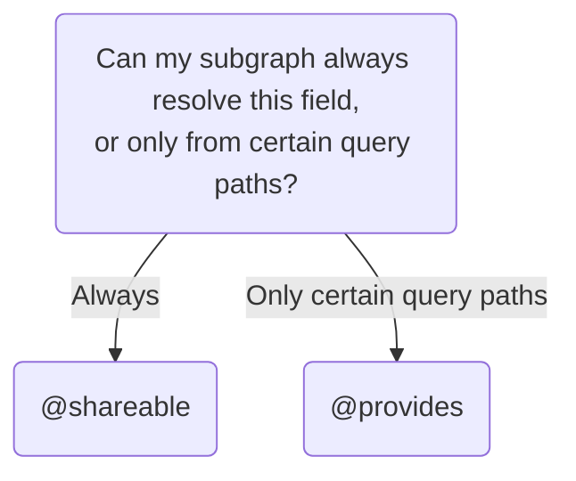

## Advanced primary keys

### Multiple primary keys

You can define more than one primary key for an entity, when applicable.

In this example, a `Product` entity can be uniquely identified by either its `id` _or_ its `sku`:

```graphql{2}
# Products subgraph
type Product @key(fields: "id") @key(fields: "sku") {
  id: ID!
  sku: String!
  name: String!
  price: Int
}
```

This pattern is helpful when different subgraphs interact with different fields of an entity. For example, a `reviews` subgraph might refer to products by their ID, whereas an `inventory` subgraph might use SKUs.

A subgraph that [references an entity](./entities/#referencing-an-entity) without extending it can include the fields of any valid `@key` in its stub definition:

```graphql
# Reviews subgraph

# Either:
type Product {
  id: ID!
}

# Or:
type Product {
  sku: String!
}

```

### Compound primary keys

A single primary key can consist of multiple fields, and even _nested_ fields.

In this example, the `User` entity's primary key consists of both a user's `id` _and_ the `id` of that user's associated `Organization`:

```graphql{1}:title=directory
type User @key(fields: "id organization { id }") {
  id: ID!
  organization: Organization!
}

type Organization {
  id: ID!
}
```

## Migrating entities and fields

As your federated graph grows, you might decide that you want an entity (or a particular field of an entity) to originate in a different subgraph. This section describes how to perform these migrations.

### Entity migration

Let's say our Payments subgraph defines a `Bill` entity:

<CodeColumns>

```graphql
# Payments subgraph
type Bill @key(fields: "id") {
  id: ID!
  amount: Int!
}

type Payment {
  # ...
}
```

</CodeColumns>

Then, we add a dedicated Billing subgraph to our federated graph. It now makes sense for the `Bill` entity to originate in the Billing subgraph instead. When we're done migrating, we want our deployed subgraph schemas to look like this:

<CodeColumns>

```graphql
# Payments subgraph
type Payment {
  # ...
}
```

```graphql
# Billing subgraph
type Bill @key(fields: "id") {
  id: ID!
  amount: Int!
}
```

</CodeColumns>

The exact steps depend on how you perform schema composition:

<ExpansionPanel title="With Rover CLI composition">

1. In the Billing subgraph's schema, define the `Bill` entity just as it's defined in the Payments subgraph (do _not_ extend it):

    <CodeColumns>

    ```graphql
    # Payments subgraph
    type Bill @key(fields: "id") {
      id: ID!
      amount: Int!
    }

    type Payment {
      # ...
    }
    ```

    ```graphql{2-5}
    # Billing subgraph
    type Bill @key(fields: "id") {
      id: ID!
      amount: Int!
    }
    ```

    </CodeColumns>

    * Note that if you perform composition at this point, it produces an error because the `Bill` entity can't originate in more than one subgraph. That's okay! We aren't running composition yet, and we'll resolve this error in a couple of steps.

2. In the Billing subgraph, define resolvers for each field of `Bill` that currently originates in the Payments subgraph. This subgraph should resolve those fields with the exact same logic as the resolvers in the Payments subgraph.

3. Deploy the updated Billing subgraph to your environment.

    * Again, this technically deploys a composition error. However, your gateway isn't aware of this! It's still using the original supergraph schema, which indicates that `Bill` originates only in the Payments subgraph.

4. In the Payments subgraph, remove the `Bill` entity and its associated resolvers (**do not deploy this change yet**):

    <CodeColumns>

    ```graphql
    # Payments subgraph
    type Payment {
      # ...
    }
    ```

    ```graphql
    # Billing subgraph
    type Bill @key(fields: "id") {
      id: ID!
      amount: Int!
    }
    ```

    </CodeColumns>

    * This takes care of the composition error in your local environment.

5. Compose an updated supergraph schema with your usual configuration using `rover supergraph compose`.
    * This updated supergraph schema indicates that `Bill` originates in the Billing subgraph.

6. Assuming CI completes successfully, deploy an updated version of your _gateway_ with the new supergraph schema.
    * When this deployment completes, the gateway begins resolving `Bill` fields in the Billing subgraph _instead of_ the Payments subgraph.

7. Deploy an updated version of your Payments subgraph without the `Bill` entity.
    * At this point it's safe to remove this definition, because the gateway is never resolving `Bill` with the Payments subgraph.

We're done! `Bill` now originates in a new subgraph, and it was resolvable during each step of the migration process.

</ExpansionPanel>

<ExpansionPanel title="With managed federation">

1. In the Billing subgraph's schema, define the `Bill` entity just as it's defined in the Payments subgraph (do _not_ extend it):

    <CodeColumns>

    ```graphql
    # Payments subgraph
    type Bill @key(fields: "id") {
      id: ID!
      amount: Int!
    }

    type Payment {
      # ...
    }
    ```

    ```graphql{2-5}
    # Billing subgraph
    type Bill @key(fields: "id") {
      id: ID!
      amount: Int!
    }
    ```

    </CodeColumns>

2. Publish the updated Billing subgraph schema to Apollo.

    * Note that you're publishing a composition error, because the `Bill` entity now originates in more than one subgraph. This creates a failed [launch](https://www.apollographql.com/docs/studio/launches/) in Apollo Studio. That's okay! Apollo Uplink continues to serve the most recent _valid_ supergraph schema to your gateway.

3. In the Billing subgraph, define resolvers for each field of `Bill` that currently originates in the Payments subgraph. This subgraph should resolve those fields with the exact same logic as the resolvers in the Payments subgraph.

4. Deploy the updated Billing subgraph to your environment.

    * This change is invisible to your gateway, which is not yet aware that the Billing subgraph defines the `Bill` entity.

5. In the Payments subgraph, remove the `Bill` entity and its associated resolvers:

    <CodeColumns>

    ```graphql
    # Payments subgraph
    type Payment {
      # ...
    }
    ```

    ```graphql
    # Billing subgraph
    type Bill @key(fields: "id") {
      id: ID!
      amount: Int!
    }
    ```

    </CodeColumns>

6. Deploy the updated Payments subgraph to your environment.

    * This resolves the composition error, because `Bill` now originates in a single subgraph. Apollo composes an updated supergraph schema, which your gateway automatically obtains when it polls the Apollo Uplink.

We're done! `Bill` now originates in a new subgraph, and it was resolvable during each step of the migration process.

</ExpansionPanel>

<ExpansionPanel title="With `IntrospectAndCompose`">

> ⚠️ We strongly recommend _against_ using `IntrospectAndCompose` in production. For details, see [Limitations of `IntrospectAndCompose`](./gateway/#limitations-of-introspectandcompose).

When you provide `IntrospectAndCompose` to `ApolloGateway`, it performs composition _itself_ on startup after fetching all of your subgraph schemas. If this runtime composition fails, the gateway fails to start up, resulting in downtime.

To minimize downtime for your graph, you need to make sure all of your subgraph schemas successfully compose whenever your gateway starts up. When migrating an entity, this requires a **coordinated deployment** of your modified subgraphs and a restart of the gateway itself.

1. In the Billing subgraph's schema, define the `Bill` entity just as it's defined in the Payments subgraph (do _not_ extend it):

    <CodeColumns>

    ```graphql
    # Payments subgraph
    type Bill @key(fields: "id") {
      id: ID!
      amount: Int!
    }

    type Payment {
      # ...
    }
    ```

    ```graphql{2-5}
    # Billing subgraph
    type Bill @key(fields: "id") {
      id: ID!
      amount: Int!
    }
    ```

    </CodeColumns>

2. In the Billing subgraph, define resolvers for each field of `Bill` that currently originates in the Payments subgraph. This subgraph should resolve those fields with the exact same logic as the resolvers in the Payments subgraph.

3. In the Payments subgraph's schema, remove the `Bill` entity and its associated resolvers:

    <CodeColumns>

    ```graphql
    # Payments subgraph
    type Payment {
      # ...
    }
    ```

    ```graphql
    # Billing subgraph
    type Bill @key(fields: "id") {
      id: ID!
      amount: Int!
    }
    ```

    </CodeColumns>

4. Bring down all instances of your gateway in your deployed environment. This downtime prevents inconsistent behavior during a rolling deploy of your subgraphs.

5. Deploy the updated Payments _and_ Billing subgraphs to your environment. When these deployments complete, bring your gateway instances back up and confirm that they start up successfully.

</ExpansionPanel>


### Field migration

The steps for migrating an individual field are nearly identical in form to the steps for [migrating an entire entity](#entity-migration).

Let's say our Products subgraph defines a `Product` entity, which includes the boolean field `inStock`:

<CodeColumns>

```graphql
# Products subgraph
type Product @key(fields: "id") {
  id: ID!
  inStock: Boolean!
}
```

</CodeColumns>

Then, we add an Inventory subgraph to our federated graph. It now makes sense for the `inStock` field to originate in the Inventory subgraph instead, like this:

<CodeColumns>

```graphql
# Products subgraph
type Product @key(fields: "id") {
  id: ID!
}
```

```graphql
# Inventory subgraph
extend type Product @key(fields: "id") {
  id: ID! @external
  inStock: Boolean!
}
```

</CodeColumns>


We can perform this migration with the following steps (additional commentary on each step is provided in [Entity migration](#entity-migration)):

1. In the Inventory subgraph's schema, [extend](#extending-entities) the `Product` entity to add the `inStock` field:

    <CodeColumns>

    ```graphql
    # Products subgraph
    type Product @key(fields: "id") {
      id: ID!
      inStock: Boolean!
    }
    ```

    ```graphql
    # Inventory subgraph
    extend type Product @key(fields: "id") {
      id: ID! @external
      inStock: Boolean!
    }
    ```

    </CodeColumns>

    * If you're using managed federation, register this schema change with Apollo.

2. In the Inventory subgraph, add a resolver for the `inStock` field. This subgraph should resolve the field with the exact same logic as the resolver in the Products subgraph.

3. Deploy the updated Inventory subgraph to your environment.

4. In the Products subgraph's schema, remove the `inStock` field and its associated resolver:

    <CodeColumns>

    ```graphql
    # Products subgraph
    type Product @key(fields: "id") {
      id: ID!
    }
    ```

    ```graphql
    # Inventory subgraph
    extend type Product @key(fields: "id") {
      id: ID! @external
      inStock: Boolean!
    }
    ```

    </CodeColumns>

    * If you're using managed federation, register this schema change with Studio.

5. **If you're using Rover composition,** compose a new supergraph schema. Deploy a new version of your gateway that uses the updated schema.

    * Skip this step if you're using managed federation.

5. Deploy the updated Products subgraph to your environment.

## Extending an entity with computed fields

When you [extend an entity](#extending-entities), you can define fields that depend on fields in the entity's originating subgraph. For example, a `shipping` subgraph might extend the `Product` entity with a `shippingEstimate` field, which is calculated based on the product's `size` and `weight`:

```graphql{5}:title=shipping
extend type Product @key(fields: "sku") {
  sku: ID! @external
  size: Int @external
  weight: Int @external
  shippingEstimate: String @requires(fields: "size weight")
}
```

As shown, you use the `@requires` directive to indicate which fields (and subfields) from the entity's originating subgraph are required.

>You **cannot** require fields that are defined in a subgraph besides the entity's originating subgraph.

In the above example, if a client requests a product's `shippingEstimate`, the gateway will first obtain the product's `size` and `weight` from the `products` subgraph, then pass those values to the `shipping` subgraph. This enables you to access those values directly from your resolver:

```js{4}
{
  Product: {
    shippingEstimate(product) {
      return computeShippingEstimate(product.sku, product.size, product.weight);
    }
  }
}
```

### Using `@requires` with object subfields

If a computed field `@requires` a field that returns an object type, you also specify which _subfields_ of that object are required. You list those subfields with the following syntax:

```graphql{4}:title=shipping
extend type Product @key(fields: "sku") {
  sku: ID! @external
  dimensions: ProductDimensions @external
  shippingEstimate: String @requires(fields: "dimensions { size weight }")
}
```

In this modification of the previous example, `size` and `weight` are now subfields of a `ProductDimensions` object. Note that the `ProductDimensions` object must be defined in both the entity's extending subgraph _and_ its originating subgraph, either as an entity or as a [value type](./value-types/).

## Resolving another subgraph's field

By default, exactly one subgraph is responsible for resolving each field in your supergraph schema (with a few exceptions, like `@key` fields). But sometimes, _multiple_ subgraphs are able to resolve a particular entity field, because all of those subgraphs have access to a particular data store. For example, an Inventory subgraph and a Products subgraph might both have access to the database that stores all product-related data.

You can enable multiple subgraphs to resolve a particular entity field with one of the following directives:

* [`@shareable`](#using-shareable)
* [`@provides`](#using-provides)

Which directive you use depends on the following logic:



> If you aren't sure whether your subgraph can always resolve a field, see [Using `@provides`](#using-provides) for an example of a subgraph that _can't_.

### Using `@shareable`

TODO

### Using `@provides`

When you [extend an entity](./entities/#extending-an-entity) in this case, you can specify that the extending subgraph `@provides` the field, like so:

```graphql{4,10-11}:title=inventory
# Inventory subgraph

type InStockCount {
  product: Product! @provides(fields: "name price")
  quantity: Int!
}

extend type Product @key(fields: "sku") {
  sku: String! @external
  name: String @external
  price: Int @external
}
```

**This is a completely optional optimization.** When the gateway plans a query's execution, it looks at which fields are available from each subgraph. It can then attempt to optimize performance by executing the query across the fewest subgraphs needed to access all required fields.

Keep the following in mind when using the `@provides` directive:

* Each subgraph that `@provides` a field must also define a resolver for that field. **That resolver's behavior must match the behavior of the resolver in the field's originating subgraph.**
* When an entity's field can be fetched from multiple subgraphs, there is no guarantee as to _which_ subgraph will resolve that field for a particular query.
* If a subgraph `@provides` a field, it must still list that field as `@external`, because the field originates in another subgraph.
