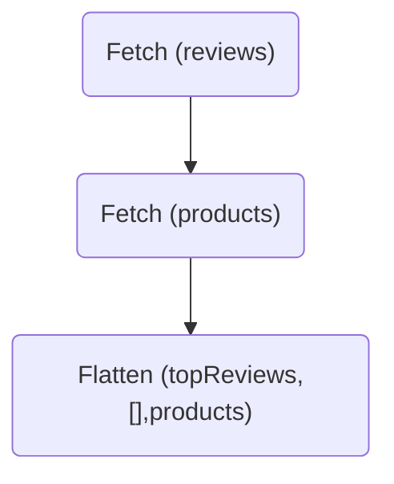

GraphQL developers often encounter the "N+1 query problem" with operations that return a list.
Consider this `TopReviews` query:

```graphql disableCopy showLineNumbers=false
query TopReviews {
  topReviews(first: 10) {
    id
    rating
    product {
      name
      imageUrl
    }
  }
}
```

In a monolithic GraphQL server, the execution engine takes these steps:

1. Resolve the `Query.topReviews` field, which returns a list of `Review`s.
2. For each `Review`, resolve the `Review.product` field.

If `Query.topReviews` returns ten reviews, then the executor resolves `Review.product` field ten times.
If the `Reviews.product` field makes a database or REST query for a single `Product`, then there are ten unique calls to the data source.
This is suboptimal for the following reasons:

- Fetching all products in a single query is more efficient—for example, `SELECT * FROM products WHERE id IN (<product ids>)`.
- If any reviews refer to the same product, then resources are wasted fetching data that was already retrieved.

## The N+1 problem in a federated graph

Consider the same `TopReviews` operation with the `Product` type as an entity defined in Reviews and Products subgraphs.

<CodeColumns>

```graphql title="Reviews subgraph" disableCopy
type Query {
  topReviews(first: Int): [Review]
}

type Review {
  id: ID
  rating: Int
  product: Product
}

type Product @key(fields: "id") {
  id: ID
}
```

```graphql title="Products subgraph" disableCopy
type Product @key(fields: "id") {
  id: ID!
  name: String
  imageUrl: String
}
```

</CodeColumns>


Most subgraph implementations use _reference resolvers_ to returns the entity object corresponding to akey.
Although this pattern is straightforward, it can diminish performance when a client operation requests fields from many entities.
Recall the `topReviews` query, now in the context of a federated graph:

```graphql disableCopy showLineNumbers=false
query TopReviews {
  topReviews(first: 10) { # Defined in Reviews subgraph
    id
    rating
    product { # ⚠️ NOT defined in Reviews subgraph
      name
      imageUrl
    }
  }
}
```

The router executes two queries:

1. Fetch all fields except `Product.name` and `Product.imageURL` from the Reviews subgraph.
2. Fetch each product's `name` and `imageURL` from the Products subgraph.


In the Products subgraph, the reference resolver for `Product` doesn't take a list of keys but rather a single key.
Therefore, the subgraph library calls the reference resolver once for each key:

```js {4-6} title="resolvers.js" disableCopy
// Products subgraph
const resolvers = {
  Product: {
    __resolveReference(productRepresentation) {
      return fetchProductByID(productRepresentation.id);
    }
  },
  // ...other resolvers...
}
```

A basic `fetchProductByID` function might make a database call each time it's called.
If you need to resolve `Product.name` for `N` different products, this results in `N` database calls.
These calls are made in addition to the call made by the Reviews subgraph to fetch the initial list of reviews and the `id` of each product.
This problem can cause performance problems or even enable denial-of-service attacks.

## How query planning handles N+1 queries

By default, the router's query planner handles N+1 queries for entities like the `Product` type.
The query plan for the `TopReviews` operation works like this:

1. First, the router fetches the list of `Review`s from the Reviews subgraph using the root field `Query.topReviews`. The router also asks for the `id` of each associated product.
2. Next, the router extracts the `Product` entity references and fetches them in a batch to the Products subgraph's `Query._entities` root field.
3. After the router gets back the `Product` entities, it merges them into the list of `Review`s, indicated by the `Flatten` step.



<ExpansionPanel title="Click to expand query plan">

```
QueryPlan {
  Sequence {
    Fetch(service: "reviews") {
      {
        topReviews(first: 10) {
          id
          rating
          product {
            __typename
            id
          }
        }
      }
    },
    Flatten(path: "reviews.@") {
      Fetch(service: "products") {
        {
          ... on Product {
            __typename
            id
          }
        } =>
        {
          ... on Product {
            name
            imageUrl
          }
        }
      },
    },
  },
}
```

</ExpansionPanel>

Most subgraph implementations (including [`@apollo/subgraph`](/apollo-server/using-federation/api/apollo-subgraph/)) don't write the [`Query._entities` resolver](./building-supergraphs/subgraphs-overview/#query_entities) directly.
Instead, they use the [reference resolver API](./#2-define-a-reference-resolver) for resolving an individual entity reference:

```js
const resolvers = {
  Product: {
    __resolveReference(productRepresentation) {
      return fetchProductByID(productRepresentation.id);
    },
  },
};
```

The motivation for this API relates to a subtle, critical aspect of the [subgraph specification](/federation/subgraph-spec):
the order of resolved entities must match the order of the given entity references.
If the entities are returned in the wrong order, those fields are merged with the wrong entities, leading to incorrect results.
To avoid this issue, most subgraph libraries handle entity order for you.

Because order matters, it reintroduces the N+1 query problem: in the example above, `fetchProductByID` gets called once for each entity reference.

## The dataloader pattern solution

The solution for the N+1 problem—whether for federated or monolithic graphs—is the [dataloader](https://github.com/graphql/dataloader) pattern.
For example, in an Apollo Server implementation, using dataloaders could look like this:

```js
const resolvers = {
  Product: {
    __resolveReference(product, context) {
      return context.dataloaders.products(product.id);
    },
  },
};
```

With dataloaders, when the query planner calls the Products subgraph with a batch of `Product` entities, the router makes a single batched request to the Products data source.

Nearly every GraphQL server library provides a dataloader implementation, and Apollo recommends using it in every resolver, even those that aren't for entities or don't return a list.
