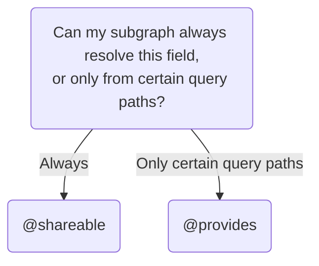

## Resolving another subgraph's field

By default, exactly one subgraph is responsible for resolving each field in your supergraph schema (with important exceptions, like entity `@key` fields). But sometimes, multiple subgraphs are able to resolve a particular entity field, because all of those subgraphs have access to a particular data store. For example, an Inventory subgraph and a Products subgraph might both have access to the database that stores all product-related data.

You can enable multiple subgraphs to resolve a particular entity field. This is a completely optional optimization. When the router plans a query's execution, it looks at which fields are available from each subgraph. It can then attempt to optimize performance by executing the query across the fewest subgraphs needed to access all required fields.

You achieve this with one of the following directives:

- [`@shareable`](#using-shareable)
- [`@provides`](#using-provides)

Which directive you use depends on the following logic:



If you aren't sure whether your subgraph can always resolve a field, see [Using `@provides`](#using-provides) for an example of a subgraph that can't.

### Ensure resolver consistency

If multiple subgraphs can resolve a field, make sure each subgraph's resolver for that field behaves identically. Otherwise, queries might return inconsistent results to clients depending on which subgraph resolves the field.

This is especially important to keep in mind when making changes to an existing resolver. If you don't make the resolver changes to each subgraph simultaneously, clients might observe inconsistent results.

Common inconsistent resolver behaviors to look out for include:

- Returning a different default value
- Throwing different errors in the same scenario

### Using `@shareable`

<Note>

Before using `@shareable`, see [Ensure resolver consistency](#ensure-resolver-consistency).

</Note>

The `@shareable` directive indicates that a particular field can be resolved by more than one subgraph:

<CodeColumns>

```graphql {3} title="Products subgraph"
type Product @key(fields: "id") {
  id: ID!
  name: String! @shareable
  price: Int
}
```

```graphql {3} title="Inventory subgraph"
type Product @key(fields: "id") {
  id: ID!
  name: String! @shareable
  inStock: Boolean!
}
```

</CodeColumns>

In this example, both the Products and Inventory subgraphs can resolve `Product.name`. This means that a query that includes `Product.name` might be resolvable by fetching from fewer total subgraphs.

<Note>

If a field is marked `@shareable` in any subgraph, it must be marked `@shareable` or `@external` in every subgraph that defines it. Otherwise, composition fails.

</Note>

### Using `@provides`

<Note>

Before using `@provides`, see [Ensure resolver consistency](#ensure-resolver-consistency).

</Note>

The `@provides` directive indicates that a particular field can be resolved by a subgraph at a particular query path. Let's look at an example.

Here, our Products subgraph defines a `Product.name` field and marks it `@shareable` (this means other subgraphs are allowed to resolve it):

```graphql {3} title="Products subgraph"
type Product @key(fields: "id") {
  id: ID!
  name: String! @shareable
  price: Int
}
```

Meanwhile, our Inventory subgraph can also resolve a product's name, but only when that product is part of an `InStockCount`:

```graphql {2,8} title="Inventory subgraph"
type InStockCount {
  product: Product! @provides(fields: "name")
  quantity: Int!
}

type Product @key(fields: "id") {
  id: ID!
  name: String! @external
  inStock: Boolean!
}
```

Here we're using two directives in combination: `@provides` and `@external`.

- The `@provides` directive tells the router, "This subgraph can resolve the `name` of any `Product` object returned by `InStockCount.product`."
- The `@external` directive tells the router, "This subgraph can't resolve the `name` of a `Product` object, except wherever indicated by `@provides`."

#### Rules for using `@provides`

- If a subgraph `@provides` a field that it can't always resolve, the subgraph must mark that field as `@external` and must not mark it as `@shareable`.
  - Remember, a `@shareable` field can always be resolved by a particular subgraph, which removes the need for `@provides`.
- To include a field in a `@provides` directive, that field must be marked as `@shareable` or `@external` in every subgraph that defines it.

Violating any of these rules causes composition to fail.
