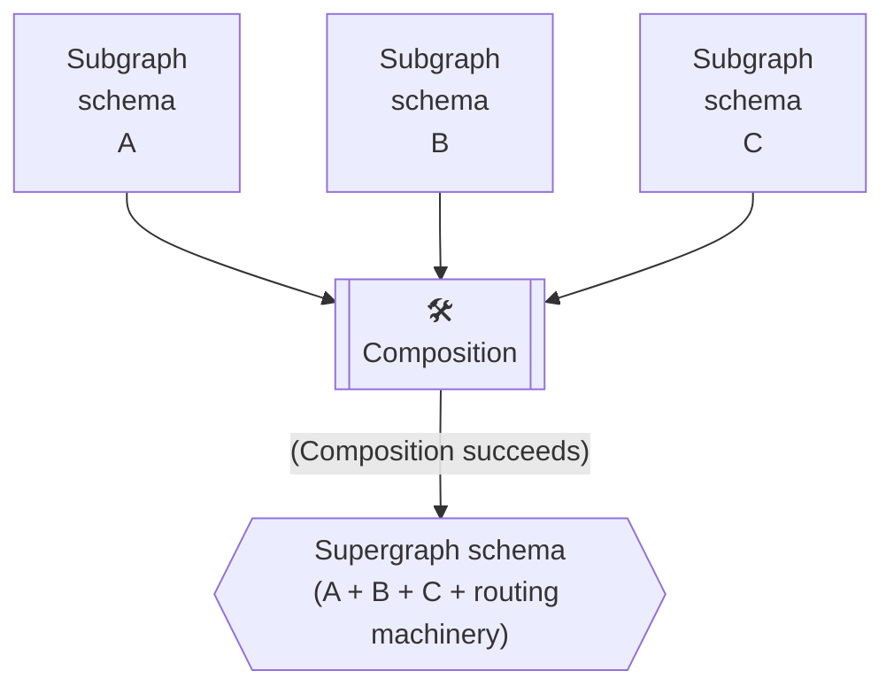
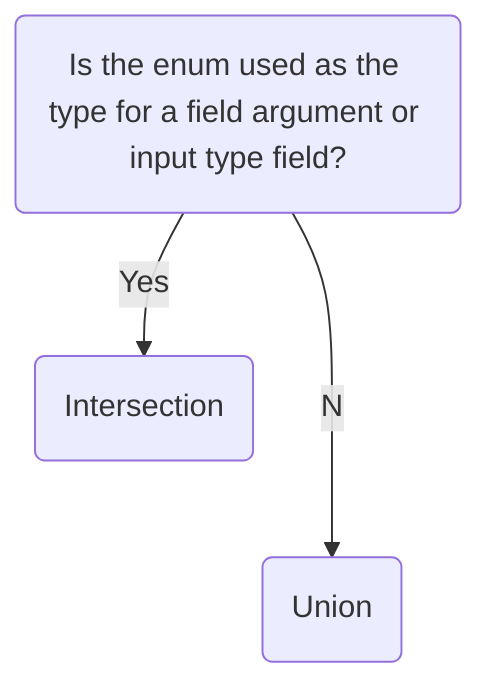

In Apollo Federation, **composition** is the process of combining a set of [subgraph schemas](./overview/#subgraph-schemas) into a [supergraph schema](./overview/#supergraph-schema):



The supergraph schema includes all of the type and field definitions from your subgraph schemas. It's what enables your gateway to intelligently route incoming GraphQL operations across all of your different subgraphs.

## Supported methods

You can perform schema composition with any of the following methods:

### Manually with the Rover CLI

The [Rover CLI](https://www.apollographql.com/docs/rover/) supports a `supergraph compose` command that you can use to compose a supergraph schema from a collection of subgraph schemas:

```bash
rover supergraph compose --config ./supergraph-config.yaml
```

> ⚠️ **Important:** To perform Federation 2 composition with Rover, the YAML `--config` file you provide must include the following line:
>
> ```yaml title="supergraph-config.yaml"
> federation_version: 2
> ```
>
> Otherwise, Rover uses Federation 1 composition.

To learn how to install Rover and use this command, see the [Quickstart](../quickstart/setup/#1-install-the-rover-cli).

### Automatically with managed federation

With [managed federation](../managed-federation/overview/), Apollo performs composition automatically whenever one of your subgraphs updates its registered schema. This enables your running gateway to dynamically fetch an updated supergraph schema from Apollo as soon as it's available:


To learn how to perform composition with managed federation, see the [Quickstart](../quickstart/studio-composition/).

## Breaking composition

Sometimes, your subgraph schemas might _conflict_ in a way that causes composition to fail. This is called **breaking composition**.

For example, take a look at these two subgraph schemas:

<p style="margin-bottom: 0">❌</p>
<CodeColumns>

```graphql {2} title="Subgraph A"
type Event {
  timestamp: String!
}
```

```graphql {2} title="Subgraph B"
type Event {
  timestamp: Int!
}
```

</CodeColumns>

One subgraph defines `Event.timestamp` as a `String`, and the other defines it as an `Int`. Composition doesn't know which type to use, so it fails.

> For examples of _valid_ inconsistencies in field return types, see [Differing shared field return types](./sharing-types/#return-types).

Breaking composition is a helpful feature of federation! Whenever a team modifies their subgraph schema, those changes might conflict with _another_ subgraph. But that conflict won't affect your gateway, because composition fails to generate a new supergraph schema. It's like a compiler error that prevents you from running invalid code.

## Rules of composition
In Federation 2, your subgraph schemas must follow **all** of these rules to successfully compose into a supergraph schema:

* Multiple subgraphs can't define the same field on an object type, _unless_ that field is [shareable](./sharing-types/#using-shareable).
* A shared field must have both a compatible return type _and_ compatible argument types across each defining subgraph.
    * For examples of compatible and incompatible differences between subgraphs, see [Differing shared fields](./sharing-types/#differing-shared-fields).
* If multiple subgraphs define the same type, each field of that type must be **resolvable** by _every valid GraphQL operation that includes it_.
    * This rule is the most complex and the most essential to Federation 2. [Let's look at it more closely.](#unresolvable-field-example)

### Unresolvable field example

This example presents a field of a shared type that is _not_ always resolvable (and therefore [breaks composition](#breaking-composition)).

Consider these subgraph schemas:

<p style="margin-bottom: 0">❌</p>

<CodeColumns>

```graphql title="Subgraph A"
type Query {
  positionA: Position!
}

type Position @shareable {
  x: Int!
  y: Int!
}
```

```graphql title="Subgraph B"
type Query {
  positionB: Position!
}

type Position @shareable {
  x: Int!
  y: Int!
  z: Int!
}
```


</CodeColumns>

Note the following about these two subgraphs:

* They both define a shared `Position` type.
* They both define a top-level `Query` field that returns a `Position`.
* Subgraph B's `Position` includes a `z` field, whereas Subgraph A's definition only includes shared `x` and `y` fields.

Individually, these subgraph schemas are perfectly valid. However, if they're combined, **they break composition**. Why?

The composition process attempts to merge inconsistent type definitions into a _single_ definition for the supergraph schema. In this case, the resulting definition for `Position` exactly matches Subgraph B's definition:

<p style="margin-bottom: 0">❌</p>

```graphql title="Hypothetical supergraph schema"
type Query {
  # From A
  positionA: Position!
  # From B
  positionB: Position!
}

type Position {
  # From A+B
  x: Int!
  y: Int!
  # From B
  z: Int!
}
```

Based on this hypothetical supergraph schema, the following query _should_ be valid:

```graphql {5}
query GetPosition {
  positionA {
    x
    y
    z # ⚠️ Can't be resolved! ⚠️
  }
}
```

**Here's our problem.** Only Subgraph A can resolve `Query.positionA`, because Subgraph B doesn't define the field. But Subgraph A _doesn't_ define `Position.z`!

If the gateway sent this query to Subgraph A, it would return an error. And without extra configuration, Subgraph B can't resolve a `z` value for a `Position` in Subgraph A. Therefore, `Position.z` is **unresolvable** for this query.

Composition recognizes this potential issue, and it fails. The hypothetical supergraph schema above would never actually be generated.

`Position.z` is an example of a field that is _not_ always resolvable. So now, how do we make sure that such a field _is_ always resolvable?

### Solutions for unresolvable fields

There are multiple solutions for making sure that a field of a shared type is always resolvable. Choose a solution based on your use case:

#### Define the field in every subgraph that defines the type.

If every subgraph that defines a type _could_ resolve every field of that type without introducing complexity, a straightforward solution is to define and resolve all fields in all of those subgraphs:

<p style="margin-bottom: 0">✅</p>

<CodeColumns>

```graphql {4} title="Subgraph A"
type Position @shareable {
  x: Int!
  y: Int!
  z: Int
}
```

```graphql title="Subgraph B"
type Position @shareable {
  x: Int!
  y: Int!
  z: Int!
}
```

</CodeColumns>

In this case, if Subgraph A only cares about the `x` and `y` fields, its resolver for `z` can always return `null`.

This is a useful solution for shared types that encapsulate simple scalar data.

> You can use the `@inaccessible` directive to incrementally add a value type field to multiple subgraphs _without_ breaking composition. [Learn more.](./sharing-types/#adding-new-shared-fields)

#### Make the shared type an entity.

<p style="margin-bottom: 0">✅</p>

<CodeColumns>

```graphql title="Subgraph A"
type User @key(fields: "id") {
  id: ID!
  name: String!
}
```

```graphql title="Subgraph B"
type User @key(fields: "id") {
  id: ID!
  age: Int!
}
```

</CodeColumns>

If you make a shared type an [entity](../entities/), different subgraphs can define any number of different fields for that type, as long as they all define **key fields** for it.

This is a useful solution when a type corresponds closely to an entry in a data store that one or more of your subgraphs has access to (e.g., a `Users` database).

## Merging types from multiple subgraphs

If a particular GraphQL type is defined _differently_ by different subgraphs, composition uses one of two strategies to merge those definitions: **union** or **intersection**.

* **Union**: The supergraph schema includes _all_ parts of _all_ subgraph definitions for the type. 
* **Intersection:** The supergraph schema includes _only_ the parts of the type that are present in _every_ subgraph that defines the type.

The merging strategy that composition uses for a particular type depends on the type, as described below.

### Object, union, and interface types

Composition _always_ uses the union strategy to merge object, union, and interface types.

Consider the following subgraph schema excerpts:

<CodeColumns>

```graphql title="Subgraph A"
type User @key(fields: "id") {
  id: ID!
  name: String!
  email: String!
}

union Media = Book | Movie

interface BookDetails {
  title: String!
  author: String!
}
```

```graphql title="Subgraph B"
type User @key(fields: "id") {
  id: ID!
  age: Int!
}

union Media = Book | Podcast

interface BookDetails {
  title: String!
  numPages: Int
}
```

<></>

</CodeColumns>

When these subgraph schemas are composed, the composition process merges the three corresponding types using the union strategy. This results in the following type definitions in the supergraph schema:

```graphql title="Supergraph schema"
type User {
  id: ID!
  age: Int!
  name: String!
  email: String!
}

union Media = Book | Movie | Podcast

interface BookDetails {
  title: String!
  author: String!
  numPages: Int
}
```

Because composition uses the union strategy for these types, subgraphs can contribute distinct parts and guarantee that those parts will appear in the composed supergraph schema.

> Note that if different subgraphs contribute different fields to an interface type, any object types that _implement_ that interface must define _all_ contributed fields from _all_ subgraphs. Otherwise, composition fails.

### Input types and field arguments

Composition _always_ uses the intersection strategy to merge input types and field arguments. This makes sure that the gateway never passes an argument to a subgraph that doesn't define that argument.

Consider the following subgraph schemas:

<CodeColumns>

```graphql title="Subgraph A"
input UserInput {
  name: String!
  age: Int
}

type Library @shareable {
  book(title: String, author: String): Book
}
```

```graphql title="Subgraph B"
input UserInput {
  name: String!
  email: String
}

type Library @shareable {
  book(title: String, section: String): Book
}

```

</CodeColumns>

These subgraphs define different fields for the `UserInput` input type, and they define different arguments for the `Library.book` field. After composition uses the intersection strategy, the supergraph schema definitions look like this:

```graphql title="Supergraph schema"
input UserInput {
  name: String!
}

type Library {
  # field arguments are composed via the intersection merging strategy
  findBook(title: String): Book
}
```

As you can see, the supergraph schema includes only the input fields and arguments that _both_ subgraphs define.

> ⚠️ **Important:** If the intersection strategy would omit an input field or argument that is _non-nullable_, **composition fails**. This is because at least one subgraph _requires_ that field or argument, and the gateway can't provide it if it's omitted from the supergraph schema.
>
> When defining input types and field arguments in multiple subgraphs, make sure that every non-nullable field and argument is consistent in _every subgraph_. For examples, see [Arguments](sharing-types#arguments).


### Enums

Composition might use the union strategy _or_ the intersection strategy when merging enum type definitions, _depending on how the enum is used_. 



If your enum is **not** used as the type of a field argument or input type field, then composition uses the [union merging strategy](#merging-types-from-multiple-subgraphs).

Consider the following subgraph schema excerpts:

<CodeColumns>

```graphql title="Subgraph A"
enum Color {
  RED
  GREEN
  BLUE
}
```

```graphql title="Subgraph B"
enum Color {
  RED
  CYAN
  MAGENTA
  YELLOW
}
```

</CodeColumns>

When these subgraph schemas are composed, composition merges the `Color` enum using the union strategy. This results in the following type definition in the supergraph schema:

```graphql title="Supergraph schema"
enum Color {
  RED
  GREEN
  BLUE
  CYAN
  MAGENTA
  YELLOW
}
```

If you use an enum as _either_ a field argument or an input field's return type in at least one of your subgraphs, composition uses the [intersection merging strategy](#merging-types-from-multiple-subgraphs). 

Let's say we add a new field to "Subgraph A" that uses our `Color` enum as a field argument:

```graphql title="Subgraph A"
enum Color {
  RED
  GREEN
  BLUE
}

type ColorQuery {
  avatar(borderColor: Color): String
}
```

When the "Subgraph A" and "Subgraph B" schemas are composed, composition now uses the _intersection_ strategy to merge the `Color` enum:

```graphql title="Supergraph schema"
enum Color {
  RED
}

type ColorQuery {
  avatar(borderColor: Color): String
}
```

If you are using an enum as either a field argument or an input field return type and you want to include _all_ of its values in the supergraph schema, ensure _every_ subgraph's type definition for that enum is identical:

<CodeColumns>

```graphql title="Subgraph A"
enum Color {
  RED
  GREEN
  BLUE
  CYAN
  MAGENTA
  YELLOW
}

type ColorQuery {
  avatar(borderColor: Color): String
}
```

```graphql title="Subgraph B"
enum Color {
  RED
  GREEN
  BLUE
  CYAN
  MAGENTA
  YELLOW
}
```

</CodeColumns>

When these subgraph schemas are composed, the resulting supergraph schema will look like this:

```js title="Supergraph Schema"
enum Color {
  RED
  GREEN
  BLUE
  CYAN
  MAGENTA
  YELLOW
}

type ColorQuery {
  avatar(borderColor: Color): String
}
```