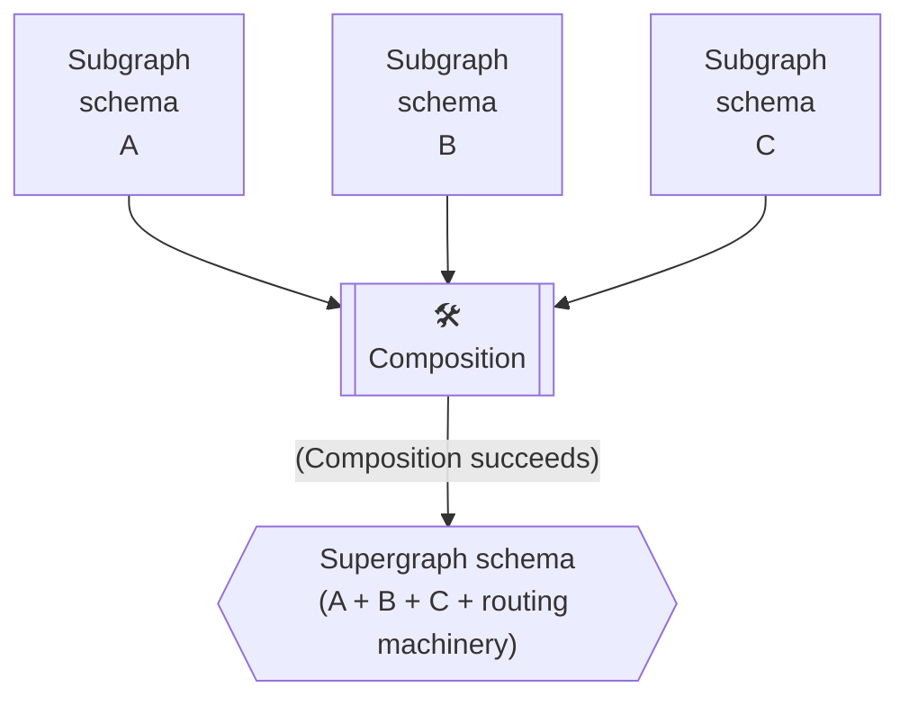
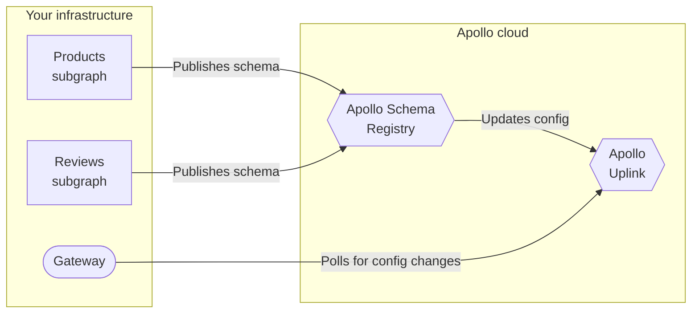

import { CodeColumns } from 'gatsby-theme-apollo-docs';

In Apollo Federation, **composition** is the process of combining a set of [subgraph schemas](./overview/#subgraph-schemas) into a [supergraph schema](./overview/#supergraph-schema):



The supergraph schema includes all of the type and field definitions from your subgraph schemas. It's what enables your gateway to intelligently route incoming GraphQL operations across all of your different subgraphs.

## Supported methods

You can perform schema composition with any of the following methods:

### Manually with the Rover CLI

The [Rover CLI](https://www.apollographql.com/docs/rover/) supports a `fed2 supergraph compose` command that you can use to compose a supergraph schema from a collection of subgraph schemas:

```bash
rover fed2 supergraph compose --config ./supergraph.yaml
```

To learn how to install Rover and use this command, see the [Quickstart](../quickstart/setup/#1-install-the-rover-cli).

### Automatically with managed federation

With [managed federation](../managed-federation/overview/), Apollo performs composition automatically whenever one of your subgraphs updates its registered schema. This enables your running gateway to dynamically fetch an updated supergraph schema from Apollo as soon as it's available:



To learn how to perform composition with managed federation, see the [Quickstart](../quickstart/studio-composition/).

## Breaking composition

Sometimes, your subgraph schemas might _conflict_ in a way that causes composition to fail. This is called **breaking composition**.

For example, take a look at these two subgraph schemas:

<CodeColumns>

```graphql{3}
# Subgraph A
type Event {
  timestamp: String!
}
```

```graphql{3}
# Subgraph B
type Event {
  timestamp: Int!
}
```

</CodeColumns>

One subgraph defines `Event.timestamp` as a `String`, and the other defines it as an `Int`. Composition doesn't know which type to use, so it fails.

> For examples of _valid_ inconsistencies in field return types, see [Varying shared field return types](./sharing-types/#varying-shared-object-fields).

Breaking composition is a helpful feature of federation! Whenever a team modifies their subgraph schema, those changes might conflict with _another_ subgraph. But that conflict won't affect your gateway, because composition fails to generate a new supergraph schema. It's like a compiler error that prevents you from running invalid code.

## Rules of composition
In Federation 2, your subgraph schemas must follow **all** of these rules to successfully compose into a supergraph schema:

* Multiple subgraphs can't define the same field on an object type, _unless_ that field is [shareable](./sharing-types/#using-shareable).
* A shared field must have both a compatible return type _and_ compatible argument types across each defining subgraph.
    * For examples of compatible and incompatible field return types, see [Varying shared fields](./sharing-types/#varying-shared-object-fields).
* If multiple subgraphs define the same type, each field of that type must be **resolvable** by _every valid GraphQL operation that includes it_.
    * This rule is the most complex and the most essential to Federation 2. [Let's look at it more closely.](#unresolvable-field-example)

### Unresolvable field example

This example presents a field of a shared type that is _not_ always resolvable (and therefore [breaks composition](#breaking-composition)).

Consider these subgraph schemas:

<p style="margin-bottom: 0">❌</p>

<CodeColumns>

```graphql
# Subgraph A
type Query {
  positionA: Position!
}

type Position @shareable {
  x: Int!
  y: Int!
}
```

```graphql
# Subgraph B
type Query {
  positionB: Position!
}

type Position @shareable {
  x: Int!
  y: Int!
  z: Int!
}
```


</CodeColumns>

Note the following about these two subgraphs:

* They both define a shared `Position` type.
* They both define a top-level `Query` field that returns a `Position`.
* Subgraph B's `Position` includes a `z` field, whereas Subgraph A's definition only includes shared `x` and `y` fields.

Individually, these subgraph schemas are perfectly valid. However, if they're combined, **they break composition**. Why?

The composition process attempts to merge inconsistent type definitions into a _single_ definition for the supergraph schema. In this case, the resulting definition for `Position` exactly matches Subgraph B's definition:

<p style="margin-bottom: 0">❌</p>

```graphql
# Hypothetical supergraph schema
type Query {
  # From A
  positionA: Position!
  # From B
  positionB: Position!
}

type Position {
  # From A+B
  x: Int!
  y: Int!
  # From B
  z: Int!
}
```

Based on this hypothetical supergraph schema, the following query _should_ be valid:

```graphql{5}
query GetPosition {
  positionA {
    x
    y
    z # ⚠️ Can't be resolved! ⚠️
  }
}
```

**Here's our problem.** Only Subgraph A can resolve `Query.positionA`, because Subgraph B doesn't define the field. But Subgraph A _doesn't_ define `Position.z`!

If the gateway sent this query to Subgraph A, it would return an error. And without extra configuration, Subgraph B can't resolve a `z` value for a `Position` in Subgraph A. Therefore, `Position.z` is **unresolvable** for this query.

Composition recognizes this potential issue, and it fails. The hypothetical supergraph schema above would never actually be generated.

`Position.z` is an example of a field that is _not_ always resolvable. So now, how do we make sure that such a field _is_ always resolvable?

### Solutions for unresolvable fields

There are multiple solutions for making sure that a field of a shared type is always resolvable. Choose a solution based on your use case:

#### Define the field in every subgraph that defines the type.

If every subgraph that defines a type _could_ resolve every field of that type without introducing complexity, a straightforward solution is to define and resolve all fields in all of those subgraphs:

<p style="margin-bottom: 0">✅</p>

<CodeColumns>

```graphql{5}
# Subgraph A
type Position @shareable {
  x: Int!
  y: Int!
  z: Int
}
```

```graphql
# Subgraph B
type Position @shareable {
  x: Int!
  y: Int!
  z: Int!
}
```

</CodeColumns>

In this case, if Subgraph A only cares about the `x` and `y` fields, its resolver for `z` can always return `null`.

This is a useful solution for shared types that encapsulate simple scalar data.

#### Make the shared type an entity.

<p style="margin-bottom: 0">✅</p>

<CodeColumns>

```graphql
# Subgraph A
type User @key(fields: "id") {
  id: ID!
  name: String!
}
```

```graphql
# Subgraph B
type User @key(fields: "id") {
  id: ID!
  age: Int!
}
```

</CodeColumns>

If you make a shared type an [entity](../entities/), different subgraphs can define any number of different fields for that type, as long as they all define **key fields** for it.

This is a useful solution when a type corresponds closely to an entry in a data store that one or more of your subgraphs has access to (e.g., a `Users` database).
