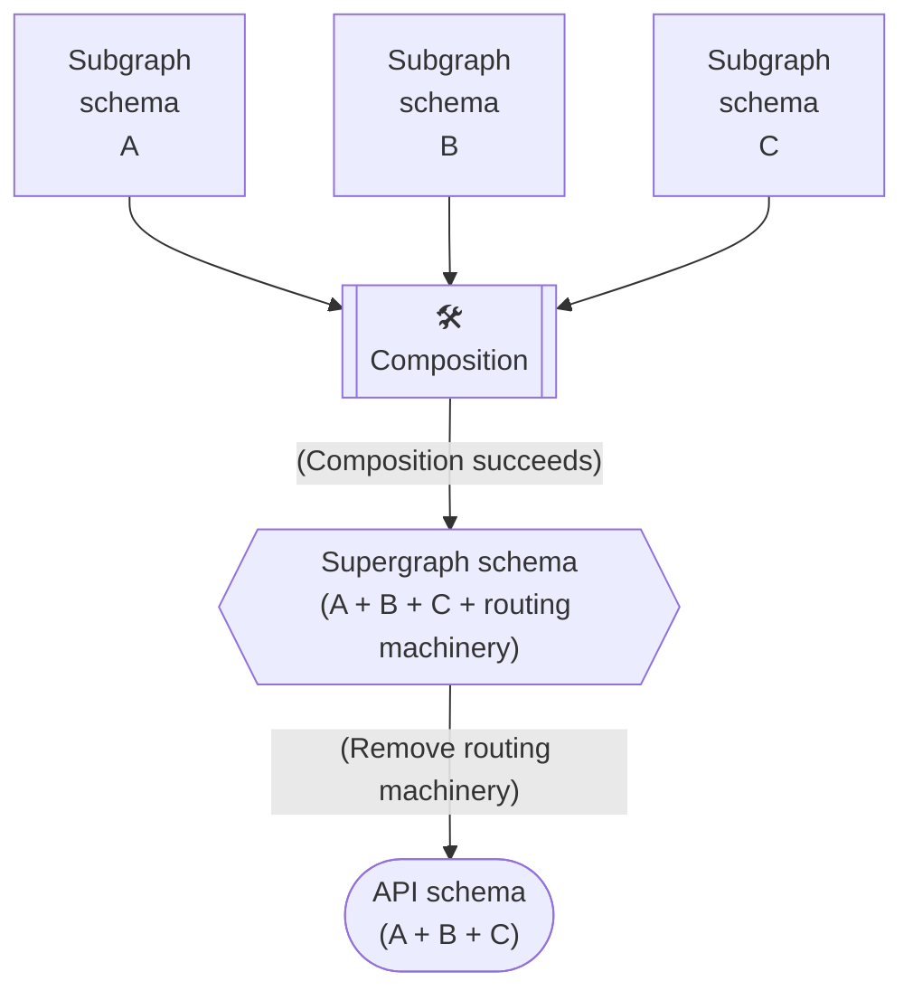

A federated graph uses multiple "types" of GraphQL schemas:



* **Subgraph schemas.** Each **subgraph** has a distinct schema that indicates _which_ types and fields of your composed **supergraph** it can resolve.
    * These are the only schemas that your teams define manually.
* **Supergraph schema.** This schema combines all of the types and fields from your subgraph schemas, _plus_ some Federation-specific information that tells your gateway which subgraphs can resolve which fields.
    * This schema is the result of performing [composition](./composition/) on your collection of subgraph schemas.
* **API schema.** This schema is like the supergraph schema, but it _omits_ types, fields, and directives that are considered "machinery" and are not part of your public API (this includes Federation-specific information).
    * This is the schema that your gateway exposes to clients, who don't need to know internal implementation details about your graph.

Let's look at an example!

## Subgraph schemas

Below are the schemas for three subgraphs in a basic e-commerce application. Each subgraph is implemented as a separate GraphQL API:

<CodeColumns cols="3">

```graphql title="Users"
type Query {
  me: User
}

type User @key(fields: "id") {
  id: ID!
  username: String!
}

# (Subgraph schemas include
# this to opt in to
# Federation 2 features.)
extend schema
  @link(url: "https://specs.apollo.dev/federation/v2.0",
        import: ["@key", "@shareable"])
```

```graphql title="Products"
type Query {
  topProducts(first: Int = 5): [Product]
}

type Product @key(fields: "upc") {
  upc: String!
  name: String!
  price: Int
}

extend schema
  @link(url: "https://specs.apollo.dev/federation/v2.0",
        import: ["@key", "@shareable"])
```

```graphql title="Reviews"
type Review {
  body: String
  author: User @provides(fields: "username")
  product: Product
}

type User @key(fields: "id") {
  id: ID!
  username: String! @external
  reviews: [Review]
}

type Product @key(fields: "upc") {
  upc: String!
  reviews: [Review]
}

# (This subgraph uses additional
# federated directives)
extend schema
  @link(url: "https://specs.apollo.dev/federation/v2.0",
        import: ["@key", "@shareable", "@provides", "@external"])
```

</CodeColumns>

As these schemas show, multiple subgraphs can contribute unique fields to a single type. For example, the Products subgraph and the Reviews subgraph both contribute fields to the `Product` type.

## Supergraph schema

The supergraph schema is the output of [schema composition](./composition/). It serves the following purposes:

* It provides your gateway with the name and endpoint URL for each of your subgraphs.
* It includes all types and fields defined by all of your subgraphs.
* It tells your gateway which of your subgraphs can resolve which GraphQL fields.

Here's the supergraph schema composed with [the subgraph schemas above](#subgraph-schemas):

<ExpansionPanel title="Click to expand">

```graphql
schema
  @core(feature: "https://specs.apollo.dev/core/v0.2"),
  @core(feature: "https://specs.apollo.dev/join/v0.1", for: EXECUTION)
{
  query: Query
}

directive @core(feature: String!, as: String, for: core__Purpose) repeatable on SCHEMA

directive @join__field(graph: join__Graph, requires: join__FieldSet, provides: join__FieldSet) on FIELD_DEFINITION

directive @join__type(graph: join__Graph!, key: join__FieldSet) repeatable on OBJECT | INTERFACE

directive @join__owner(graph: join__Graph!) on OBJECT | INTERFACE

directive @join__graph(name: String!, url: String!) on ENUM_VALUE

enum core__Purpose {
  EXECUTION
  SECURITY
}

scalar join__FieldSet

enum join__Graph {
  USERS @join__graph(name: "users" url: "http://localhost:4001")
  PRODUCTS @join__graph(name: "products" url: "http://localhost:4002")
  REVIEWS @join__graph(name: "reviews" url: "http://localhost:4003")
}

type Product
  @join__owner(graph: PRODUCTS)
  @join__type(graph: PRODUCTS, key: "upc")
  @join__type(graph: REVIEWS, key: "upc")
{
  name: String! @join__field(graph: PRODUCTS)
  price: Int @join__field(graph: PRODUCTS)
  reviews: [Review] @join__field(graph: REVIEWS)
  upc: String! @join__field(graph: PRODUCTS)
}

type Query {
  me: User @join__field(graph: USERS)
  topProducts(first: Int = 5): [Product] @join__field(graph: PRODUCTS)
}

type Review {
  author: User @join__field(graph: REVIEWS, provides: "username")
  body: String
  product: Product
}

type User
  @join__owner(graph: USERS)
  @join__type(graph: USERS, key: "id")
  @join__type(graph: REVIEWS, key: "id")
{
  id: ID! @join__field(graph: USERS)
  reviews: [Review] @join__field(graph: REVIEWS)
  username: String! @join__field(graph: USERS)
}
```

</ExpansionPanel>

As you can see, the supergraph schema includes a lot of Federation-specific additions! These additions are used only by the gateway, and you'll never need to add them manually.

## API schema

The gateway uses its [supergraph schema](#supergraph-schema) to produce an **API schema**, which it exposes to clients as your actual GraphQL API. This schema cleanly and logically represents the combination of your [subgraph schemas](#subgraph-schemas):

```graphql
type Product {
  name: String!
  price: Int
  reviews: [Review]
  upc: String!
}

type Query {
  me: User
  topProducts(first: Int = 5): [Product]
}

type Review {
  author: User
  body: String
  product: Product
}

type User {
  id: ID!
  reviews: [Review]
  username: String!
}
```

Unlike the supergraph schema, this schema hides the fact that your GraphQL API is composed of _multiple distinct_ GraphQL APIs.
