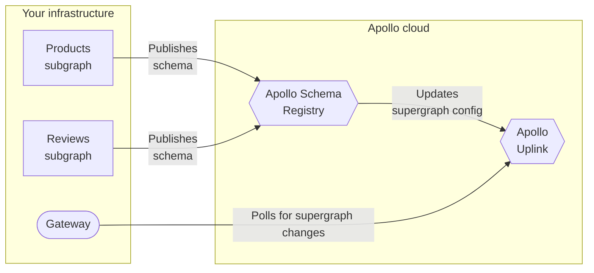

> ⚠️ **Until Federation 2 is generally available, do not move business-critical graphs to Federation 2.** [Learn about release stages.](https://www.apollographql.com/docs/resources/release-stages/#open-source-release-stages)

This article describes how to move an existing federated graph to Apollo Federation 2. If you haven't yet, [see what's new in Federation 2.](./new-in-federation-2/)

Moving a federated graph to Apollo Federation 2 requires very few changes. Moving _back_ to Federation 1 is more complex if you then make incompatible changes to your subgraphs, so we recommend starting with a test instance of your graph.

## 1. Update `@apollo/gateway`

Update your gateway's `@apollo/gateway` library to version `2.0.0-alpha.6` or later. This enables your gateway to interact with supergraph schemas composed with Federation 2.

You can install the _latest_ Federation 2 gateway with the following command:

```bash
npm install @apollo/gateway@latest-2
```

These updated versions of `@apollo/gateway` continue to support Federation 1, so you can deploy this update without breaking your existing graph.

## 2. Use new composition logic

Federation 2 uses [more flexible rules](./new-in-federation-2/#more-flexible-composition) for schema composition. Moving to Federation 2 primarily involves switching to use this logic. Follow the instructions for your current composition method:

* [Using the Rover CLI](#using-the-rover-cli)
* [Using managed federation](#using-managed-federation)

### Using the Rover CLI

If you perform composition with the Rover CLI, do the following:

1. Install the latest version of Rover using the appropriate command for your system:

    > ⚠️ If you already have Rover globally installed and you installed it with `npm`, first _uninstall_ that version with `npm uninstall`.

    ```bash
    # MacOS / Unix-like
    curl -sSL https://rover.apollo.dev/nix/latest | sh
    ```

    ```bash
    # Windows
    iwr 'https://rover.apollo.dev/win/latest' | iex
    ```

2. Install the Federation 2 plugin for Rover using the appropriate command for your system:

    ```bash
    # MacOS / Unix-like
    curl https://rover.apollo.dev/plugins/rover-fed2/nix/latest | sh
    ```

    ```bash
    # Windows
    iwr https://rover.apollo.dev/plugins/rover-fed2/win/latest | iex
    ```

> ⚠️ During the Federation 2 preview, your installed versions of Rover and its Federation 2 plugin must be _identical_. If you encounter an error when using the plugin, try updating _both_ binaries to their latest version.

That's it! You can now use the Federation 2 version of Rover's `supergraph compose` command anywhere you currently perform composition:

```bash
rover fed2 supergraph compose --config ./supergraph.yaml
```

This command's requirements, options, and output format are all identical to those of [`supergraph compose`](https://www.apollographql.com/docs/rover/supergraphs/#composing-a-supergraph-schema). It just uses Federation 2 composition logic instead of Federation 1.

### Using managed federation

If you're using [managed federation](../managed-federation/overview/), you move individual variants of your graph to Federation 2 in the Apollo Studio UI.

Go to your graph's Settings page and open the Variants section:


Click **Edit Build Configuration** for the variant you want to move to Federation 2. The following dialog appears:


In the Federation Version dropdown, select **Federation 2** and click **Save**.

Studio automatically begins composing your supergraph schema using Federation 2 composition logic. Your updated managed gateway automatically fetches the updated schema when it next polls Apollo:



## 3. Modify your subgraphs

Congratulations, your federated graph is now using Federation 2! The natural next question is, "What does this change about my graph's behavior?" And at this point, the answer is: nothing!

Currently, your subgraph schemas are probably fully compatible with both Federation 1 _and_ 2. You could switch back and forth between Federation 1 and Federation 2, and everything would work as expected.

> If your graph does _not_ successfully compose with Federation 2, see [Breaking changes](./backward-compatibility/#breaking-changes) for the most common causes.

To get the most out of Federation 2, you modify your subgraph schemas to take advantage of flexible composition rules that help your teams work independently.

> [Learn more about more flexible composition in Federation 2!](./new-in-federation-2/#more-flexible-composition)
