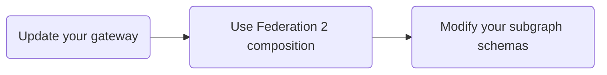

> 📣 If you haven't yet, [see what's new in Federation 2.](./new-in-federation-2/)

You can move your Apollo Federation 1 supergraph to Federation 2 **incrementally**, one component at a time. Your supergraph will work as you expect at each step in the process, even if some (or all!) of your subgraphs continue using Federation 1 schemas.

Each individual step of moving your supergraph has benefits, so it's useful to complete however many steps your team is ready to. You can always complete the rest later.

Here are the three steps for moving to Federation 2:



1. Update your gateway to a version that supports Federation 2 (or swap out your gateway for the [Apollo Router](/router/)).
2. Begin composing your supergraph schema with Federation 2 composition logic.
3. Modify your subgraph schemas to convert them to true Federation 2 subgraph schemas.

Steps 1 and 2 are quick, and it's straightforward to reverse them if you need to for any reason. Step 3 requires schema changes that _remove_ backward compatibility with Federation 1. Because of this, we recommend first completing it with a test instance of your graph.

## Step 1: Update `@apollo/gateway`

The `@apollo/gateway` library supports Federation 2 supergraph schemas in version `2.0.0` and later. You can install the latest version in your gateway project with the following command:

```bash
npm install @apollo/gateway
```

Alternatively, you can _swap out_ your supergraph's gateway for the **Apollo Router**, a high-performance graph router implemented in Rust. [See the docs.](/router/migrating-from-gateway/)

> Both `@apollo/gateway` v2.x _and_ the Apollo Router support Federation 1! You can update to either without making any other changes, and your Federation 1 supergraph will work as expected.

## Step 2: Configure your composition method

Federation 2 uses a completely new method to compose supergraph schemas. This method is backward compatible with Federation 1 subgraph schemas, and it outputs [helpful hints](../hints/) when schema definitions are inconsistent between your subgraphs.

Follow the instructions below to configure whichever composition method(s) you currently use:

<ExpansionPanel title="Managed federation with Apollo Studio">

If you're using [managed federation](../managed-federation/overview/), you move individual variants of your graph to Federation 2 in the Apollo Studio UI.

Go to your graph's Settings page and open the Variants section:


Click **Edit Build Configuration** for the variant you want to move to Federation 2. The following dialog appears:


In the Federation Version dropdown, select **Federation 2** and click **Save**.

Studio automatically begins composing your supergraph schema using Federation 2 composition logic. Your updated managed gateway automatically fetches the updated schema when it next polls Apollo:


</ExpansionPanel>

<ExpansionPanel title="The Rover CLI">

If you perform composition with the Rover CLI, do the following:

1. Install the latest version of Rover (must be `0.5.0` or later) using the appropriate command for your system:

    ```bash title="MacOS / Unix-like"
    curl -sSL https://rover.apollo.dev/nix/latest | sh
    ```

    ```bash title="Windows"
    iwr 'https://rover.apollo.dev/win/latest' | iex
    ```

2. Open the YAML `--config` file you provide to `rover supergraph compose` and add the following line to the top:

    ```yaml title="supergraph-config.yaml"
    federation_version: 2
    ```

That's it! You can now perform Federation 2 composition with the same command you've used for Federation 1:

```bash
rover supergraph compose --config ./supergraph.yaml
```

</ExpansionPanel>

After you configure these changes, make sure your gateway is using your newly created Federation 2 supergraph schema. (If you're using managed federation, your gateway will fetch the new schema from Apollo automatically.)

Your Federation 1 subgraphs are now composed using Federation 2 composition! The natural next question is, "What does this change about the behavior of those subgraphs?" And until the next step, the answer is: nothing!

> If your supergraph is _not_ successfully composing with Federation 2, see [Breaking changes](./backward-compatibility/#breaking-changes) for the most common causes.

## Step 3: Update individual subgraph schemas

If you want to take full advantage of Federation 2 features like improved control for type sharing, you now need to make some changes to your subgraph schemas. These changes are **backward incompatible** with Federation 1, which means you won't be able to use Federation 1 composition anymore unless you revert the changes.

**You can update your subgraph schemas one at a time!** The steps below describe how to modify a single subgraph schema for Federation 2, and you can perform these steps for a given subgraph whenever's convenient for your team.

### Opt in to Federation 2

First, add the following definition to your subgraph schema:

```graphql
extend schema
  @link(url: "https://specs.apollo.dev/federation/v2.0",
        import: ["@key", "@shareable"])
```

This definition identifies a schema as a true Federation 2 schema, and it `import`s any federation-specific directives that the schema uses.

> **Important:** Most subgraph schemas use the `@key` and `@shareable` directives, so we've included them in the snippet above. Depending on your schema, you might need to add other federated directives to the `import` array, such as `@external` or `@provides`.
>
> [See all Federation-specific directives.](../federated-types/federated-directives/)

_Without_ the above definition, the composition process assumes a subgraph schema is a Federation 1 schema, and it applies intelligent defaults to support backward compatibility.

#### Update `@apollo/subgraph`

If your subgraphs use Apollo Server and the `@apollo/subgraph` library, also update `@apollo/subgraph` to version `2.0.0` or later:

```bash
npm install @apollo/subgraph
```

This adds built-in support for new federation directives, such as `@shareable`.

### Add schema definitions to non-Apollo subgraphs

Currently, only Apollo Server using `@apollo/subgraph` adds some required definitions to your subgraph schemas automatically. If you're using any other [supported subgraph libraries](../other-servers/), you need to add the following definitions to those subgraph schemas:

<ExpansionPanel title="Click to expand">

```graphql
directive @shareable on FIELD_DEFINITION | OBJECT

scalar link__Import

directive @link(
  url: String!,
  import: [link__Import],
) repeatable on SCHEMA
```

</ExpansionPanel>

We'll be working with library maintainers to help automatically add these schema definitions in libraries besides `@apollo/subgraph`.

### Mark all value types as `@shareable`

By default in Federation 2, most schema fields are resolvable by only a _single subgraph_. In Federation 1, this is _not_ true for [value types](https://www.apollographql.com/docs/federation/value-types/):

<p style="margin-bottom: 0;"><strong>Fed. 1</strong> (invalid in Fed. 2)</p>

<CodeColumns>

```graphql title="Subgraph A"
type Position {
  x: Int!
  y: Int!
}
```

```graphql title="Subgraph B"
type Position {
  x: Int!
  y: Int!
}
```

</CodeColumns>

For both subgraphs to resolve the above fields in Federation 2, the `@shareable` directive is required in both schemas:

<p style="margin-bottom: 0; font-weight: bold;">Fed. 2</p>

<CodeColumns>

```graphql {2-3} title="Subgraph A"
type Position {
  x: Int! @shareable
  y: Int! @shareable
}
```

```graphql {2-3} title="Subgraph B"
type Position {
  x: Int! @shareable
  y: Int! @shareable
}
```

</CodeColumns>

> You can also apply `@shareable` directly to a type definition (such as `Position` above). This is equivalent to applying `@shareable` to _all_ of that type's fields.

For more details, see [Value types](../federated-types/sharing-types/).

### Update entity definitions

Federation 2 introduces subtle but powerful changes to [entities](../entities/). These changes require corresponding updates to their definitions in your subgraph schemas.

#### Remove unnecessary syntax

In Federation 1, an entity originates in _one_ subgraph, and then other subgraphs _extend_ the entity to add fields:

<p style="margin-bottom: 0;"><strong>Fed. 1</strong></p>

<CodeColumns>

```graphql title="Products (originating)"
type Product @key(fields: "id") {
  id: ID!
  name: String!
  price: Int
}
```

```graphql title="Inventory (extending)"
extend type Product @key(fields: "id") {
  id: ID! @external
  inStock: Boolean!
}
```

</CodeColumns>

In Federation 2, entities no longer have an originating subgraph. Instead, each subgraph can define an entity and contribute fields to it:

<p style="margin-bottom: 0;"><strong>Fed. 2</strong></p>

<CodeColumns>

```graphql title="Products"
type Product @key(fields: "id") {
  id: ID!
  name: String!
  price: Int
}
```

```graphql {1-2} title="Inventory"
type Product @key(fields: "id") {
  id: ID!
  inStock: Boolean!
}
```

</CodeColumns>

Note the following in the Federation 2 subgraphs above:

* The Inventory subgraph no longer `extend`s the `Product` entity.
* The Inventory subgraph no longer marks the `Product.id` field as `@external`.
    * The `@external` directive is no longer required for `@key` fields, but it _is_ still required for [`@requires`](../entities-advanced/#contributing-computed-entity-fields) and [`@provides`](../entities-advanced/#using-provides).
* Both subgraphs can resolve `Product.id`, even though it isn't marked as `@shareable`!
    * Unlike most fields, `@key` fields such as `Product.id` are `@shareable` by default. This is necessary for `@key` fields, because the gateway uses them to associate data from different subgraphs with the same object.

#### Mark `@provides` fields as `@shareable`

The `@provides` directive enables a subgraph to resolve a particular field _only_ for specific query paths. It's supported in Federation 2 as it is in Federation 1.

However, if a subgraph `@provides` a particular field, that field must be marked as `@shareable` in each subgraph where it's _always_ resolvable:

<p style="margin-bottom: 0;"><strong>Fed. 2</strong></p>

<CodeColumns>

```graphql {3} title="Products"
type Product @key(fields: "id") {
  id: ID!
  name: String! @shareable
  price: Int
}
```

```graphql {3,8} title="Inventory"
type Product @key(fields: "id") {
  id: ID!
  name: String! @external
  inStock: Boolean!
}

type Query {
  outOfStockProducts: [Product!]! @provides(fields: "name")
}
```

</CodeColumns>

Here, `Query.outOfStockProducts` in the Inventory subgraph `@provides` the `Product.name` field. Therefore, that field must be marked as `@shareable` in the Products subgraph (and `@external` in the Inventory subgraph, as in Federation 1). Otherwise, a composition error occurs.

#### Modify `@key`s for entity stubs

In certain cases, a subgraph _references_ an entity without contributing any fields to it. In Federation 1, these cases look like the following:

<p style="margin-bottom: 0;"><strong>Fed. 1</strong></p>

<CodeColumns>

```graphql title="Products"
type Product @key(fields: "id") {
  id: ID!
  name: String!
  price: Int
}
```

```graphql {1-3,6} title="Reviews"
type Product @key(fields: "id") {
  id: ID!
}

type Review {
  product: Product!
  score: Int!
}
```

</CodeColumns>

The Reviews subgraph above uses `Product` as the return type of the `Review.product` field, so it needs to define a "stub" of the `Product` entity. This stub includes just enough information to identify a unique instance.

In Federation 2, stubs like `Product` should include `resolvable: false` in their `@key` arguments, like so:

<p style="margin-bottom: 0;"><strong>Fed. 2</strong></p>

<CodeColumns>

```graphql title="Products"
type Product @key(fields: "id") {
  id: ID!
  name: String!
  price: Int
}
```

```graphql {1} title="Reviews"
type Product @key(fields: "id", resolvable: false) {
  id: ID!
}

type Review {
  product: Product!
  score: Int!
}
```

</CodeColumns>

Setting `resolvable: false` tells the gateway that a subgraph doesn't define a reference resolver for a particular entity. This is most common when [referencing an entity without contributing fields to it](../entities/#referencing-an-entity-without-contributing-fields).
