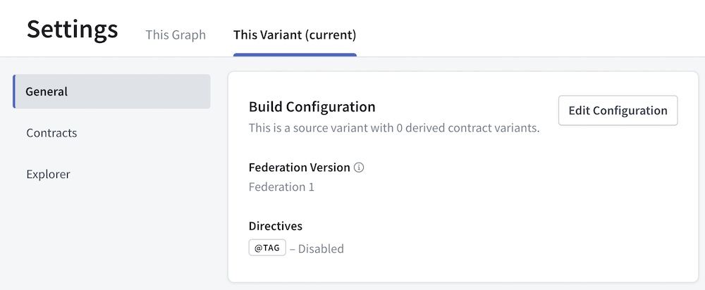

> 📣 If you haven't yet, [see what's new in Federation 2.](./new-in-federation-2/)

You can (and should!) move your Apollo Federation 1 supergraph to Federation 2 incrementally, one component at a time. Your supergraph will work as expected after each step in the process, even while some of your subgraphs continue using Federation 1 schemas.

Each individual step of moving your supergraph has its own benefits, so it's useful to complete as many steps as you're ready to complete. You can always finish the rest later.

Here are the three steps for moving to Federation 2:


1. Upgrade your gateway to support Federation 2.

    You can upgrade to either of the following:

    - [The GraphOS Router](/router/), a high-performance precompiled executable (recommended)
    - Version 2.x of the `@apollo/gateway` library, along with version 4.x of Apollo Server
2. Begin composing your supergraph schema with Federation 2 composition logic.
3. Update your individual subgraphs to use Federation 2 features and directives.

As with all infrastructure changes, we strongly recommend completing each of these steps with a test instance of your supergraph before performing them in production.

<Note>

If you encounter an issue while moving your supergraph to Federation 2, please describe the issue in the [community forums](https://community.apollographql.com/).

</Note>

## Step 1: Upgrade your gateway

For your Federation 1 supergraph to support Federation 2, you first need to upgrade its gateway to one of the following:

- The GraphOS Router. This is a high-performance, precompiled executable that provides many benefits over the Node.js-based gateway.
    - We recommend moving to the GraphOS Router unless you've extended your Node.js gateway with functionality that the GraphOS Router doesn't currently support (this is uncommon).
- Version 2.x of the `@apollo/gateway` library, with version 4.x of Apollo Server

<Note>

Both the GraphOS Router and `@apollo/gateway` v2.x support Federation 1. You can upgrade to either without making any other changes to your Federation 1 supergraph, and it will work as expected.

</Note>

### Moving to the GraphOS Router

- To get started running the GraphOS Router, see the [quickstart](/router/quickstart/).
- For guidance on moving to the GraphOS Router from your Node.js-based gateway, see [this article](/router/migrating-from-gateway).

### Upgrading `@apollo/gateway` and Apollo Server

The `@apollo/gateway` library supports Federation 2 supergraph schemas in version `2.0.0` and later. These versions of `@apollo/gateway` require version `16.0.0` or later of the `graphql` library.

You can install updated versions of these libraries in your gateway project with the following command:

```bash
npm install @apollo/gateway graphql
```

Apollo Server 3.x supports these updated library versions, however Apollo Server 3.x is deprecated. Therefore, we strongly recommend also upgrading your gateway to Apollo Server 4.

- [Learn how to migrate to Apollo Server 4.](/apollo-server/migration)
- If you're still using Apollo Server 2.x, we recommend [migrating to v3.x ](/apollo-server/v3/migration) and then migrating to 4.x.

## Step 2: Configure your composition method

Federation 2 uses a completely new method to compose supergraph schemas. This method is backward compatible with Federation 1 subgraph schemas, and it provides the following benefits even for Federation 1 subgraphs:

- Helpful [composition hints](../hints/) when schema definitions are inconsistent between your subgraphs
- Support for interfaces implementing other interfaces (which Federation 1 composition doesn't support)

Follow the instructions below to configure whichever composition method(s) you currently use:

<ExpansionPanel title="Managed federation with GraphOS">

If you're using [managed federation](../managed-federation/overview/), you move individual variants of your graph to Federation 2 via the GraphOS Studio UI.

Open the Settings page for the variant you want to move to Federation 2, then select the **This Variant** tab:



Click **Edit Configuration**. The following dialog appears:


In the Federation Version dropdown, select **Federation 2** and click **Save**.

Studio automatically begins composing your supergraph schema using Federation 2 composition logic. Your updated managed gateway automatically fetches the updated schema when it next polls Apollo:


</ExpansionPanel>

<ExpansionPanel title="The Rover CLI">

If you perform composition with the Rover CLI, do the following:

1. Install the latest version of Rover using the appropriate command for your system:

    ```bash title="MacOS / Unix-like"
    curl -sSL https://rover.apollo.dev/nix/latest | sh
    ```

    ```bash title="Windows"
    iwr 'https://rover.apollo.dev/win/latest' | iex
    ```

2. Open the YAML `--config` file you provide to `rover supergraph compose` and add the following line to the top:

    ```yaml title="supergraph-config.yaml"
    federation_version: 2
    ```

That's it! You can now perform Federation 2 composition with the same command you've used for Federation 1:

```bash
rover supergraph compose --config ./supergraph.yaml
```

</ExpansionPanel>

After you configure these changes, make sure your router is using your newly created Federation 2 supergraph schema. (If you're using managed federation, your router will fetch the new schema from Apollo automatically.)

Your Federation 1 subgraphs are now composed using Federation 2 composition. The natural next question is, "What does this change about the behavior of those subgraphs?" And until the next step, the answer is: nothing!

<Note>

If your supergraph is not successfully composing with Federation 2, see [Breaking changes](./backward-compatibility/#breaking-changes) for the most common causes.

</Note>

## Step 3: Update individual subgraphs

<Note>

You can update your subgraphs one at a time. The steps below describe how to modify a single subgraph for Federation 2, and you can perform these steps for a given subgraph whenever's convenient for your team.

</Note>

Federation 2 provides powerful new features that require making some changes to your subgraphs. These features include:

- Selectively sharing types and fields across subgraphs with [`@shareable`](../federated-types/federated-directives#shareable)
- Safely migrating fields from one subgraph to another with [`@override`](../federated-types/federated-directives#override)
- Hiding internal routing fields from graph consumers with [`@inaccessible`](../federated-types/federated-directives#inaccessible)

The schema changes you make are backward incompatible with Federation 1, which means you won't be able to use Federation 1 composition anymore unless you revert those changes.

### Update your subgraph library

To use new Federation 2 features and their associated directives, it's helpful to update your subgraph library to a version that automatically supports those directives.

- If your subgraph uses Apollo Server and the `@apollo/subgraph` library, update `@apollo/subgraph` to version `2.0.0` or later like so:

    ```bash
    npm install @apollo/subgraph
    ```

- If your subgraph uses another server library, check the [compatibility table](../building-supergraphs/supported-subgraphs/) to see whether it supports Federation 2 directives yet. If it does, consult that library's documentation to determine which version you need to update to.
    - If your library doesn't support Federation 2 directives yet, you can still use that library with Federation 2 if the library lets you add custom directive definitions to your schema!

### Opt in to Federation 2

Add the following definition to your subgraph schema:

```graphql
extend schema
  @link(url: "https://specs.apollo.dev/federation/v2.0",
        import: ["@key", "@shareable"])
```

This definition identifies a schema as a Federation 2 schema, and it `import`s any federation-specific directives that the schema uses. Without this `@link` definition, composition considers a schema to be a Federation 1 schema, and it applies certain default settings for backward compatibility.

<Note>

Depending on your schema, you might need to add other federated directives to the `import` array, such as `@external` or `@provides`.

[See all Federation-specific directives.](../federated-types/federated-directives/)

</Note>

### Add directive definitions if needed

Currently, not all [subgraph libraries](../building-supergraphs/supported-subgraphs/) provide built-in support for Federation 2 directives (such as `@shareable`). If your library doesn't provide this support, you need to add the following directive definitions to your subgraph schema:

<ExpansionPanel title="Click to expand">

```graphql
# Required for all subgraph schemas
scalar link__Import

directive @link(
  url: String!,
  import: [link__Import],
) repeatable on SCHEMA

# Required if the corresponding directive is used
directive @shareable on FIELD_DEFINITION | OBJECT
```

</ExpansionPanel>

<Note>

Some subgraph libraries are "code-first" (they dynamically generate their schema from code) instead of "schema-first" (they use a static schema file). For code-first libraries, manually adding these directive definitions is less straightforward. If you encounter this with your library, please let us know by [submitting an issue](https://github.com/apollographql/apollo-federation-subgraph-compatibility/issues).

</Note>

Definitions for all Federation 2 directives are available in [this article](../federated-types/federated-directives/). We work with library maintainers to help automatically add these schema definitions in as many subgraph libraries as possible.

### Mark all value types as `@shareable`

By default in Federation 2, most schema fields are resolvable by only a single subgraph. In Federation 1, this is not true for [value types](https://www.apollographql.com/docs/federation/value-types/):

<p style="margin-bottom: 0;"><strong>Fed. 1</strong> (invalid in Fed. 2)</p>

<CodeColumns>

```graphql title="Subgraph A"
type Position {
  x: Int!
  y: Int!
}
```

```graphql title="Subgraph B"
type Position {
  x: Int!
  y: Int!
}
```

</CodeColumns>

For both subgraphs to resolve the above fields in Federation 2, the `@shareable` directive is required in both schemas:

<p style="margin-bottom: 0; font-weight: bold;">Fed. 2</p>

<CodeColumns>

```graphql {2-3} title="Subgraph A"
type Position {
  x: Int! @shareable
  y: Int! @shareable
}
```

```graphql {2-3} title="Subgraph B"
type Position {
  x: Int! @shareable
  y: Int! @shareable
}
```

</CodeColumns>

<Note>

You can also apply `@shareable` directly to a type definition (such as `Position` above). This is equivalent to applying `@shareable` to all of that type's fields.

</Note>

For more details, see [Value types](../federated-types/sharing-types/).

### Update entity definitions

Federation 2 introduces subtle but powerful changes to [entities](../entities/). These changes require corresponding updates to their definitions in your subgraph schemas.

#### Remove unnecessary syntax

In Federation 1, an entity originates in one subgraph, and then other subgraphs extend the entity to add fields:

<p style="margin-bottom: 0;"><strong>Fed. 1</strong></p>

<CodeColumns>

```graphql title="Products (originating)"
type Product @key(fields: "id") {
  id: ID!
  name: String!
  price: Int
}
```

```graphql title="Inventory (extending)"
extend type Product @key(fields: "id") {
  id: ID! @external
  inStock: Boolean!
}
```

</CodeColumns>

In Federation 2, entities no longer have an originating subgraph. Instead, each subgraph can define an entity and contribute fields to it:

<p style="margin-bottom: 0;"><strong>Fed. 2</strong></p>

<CodeColumns>

```graphql title="Products"
type Product @key(fields: "id") {
  id: ID!
  name: String!
  price: Int
}
```

```graphql {1-2} title="Inventory"
type Product @key(fields: "id") {
  id: ID!
  inStock: Boolean!
}
```

</CodeColumns>

Note the following in the Federation 2 subgraphs above:

- The Inventory subgraph no longer `extend`s the `Product` entity.
- The Inventory subgraph no longer marks the `Product.id` field as `@external`.
    - The `@external` directive is no longer required for `@key` fields, but it is still required for [`@requires`](../entities-advanced/#contributing-computed-entity-fields) and [`@provides`](../entities-advanced/#using-provides).
- Both subgraphs can resolve `Product.id`, even though it isn't marked as `@shareable`!
    - Unlike most fields, `@key` fields such as `Product.id` are `@shareable` by default. This is necessary for `@key` fields, because the gateway uses them to associate data from different subgraphs with the same object.

#### Mark `@provides` fields as `@shareable`

The `@provides` directive enables a subgraph to resolve a particular field only for specific query paths. It's supported in Federation 2 as it is in Federation 1.

However, if a subgraph `@provides` a particular field, that field must be marked as `@shareable` in each subgraph where it's always resolvable:

<p style="margin-bottom: 0;"><strong>Fed. 2</strong></p>

<CodeColumns>

```graphql {3} title="Products"
type Product @key(fields: "id") {
  id: ID!
  name: String! @shareable
  price: Int
}
```

```graphql {3,8} title="Inventory"
type Product @key(fields: "id") {
  id: ID!
  name: String! @external
  inStock: Boolean!
}

type Query {
  outOfStockProducts: [Product!]! @provides(fields: "name")
}
```

</CodeColumns>

Here, `Query.outOfStockProducts` in the Inventory subgraph `@provides` the `Product.name` field. Therefore, that field must be marked as `@shareable` in the Products subgraph (and `@external` in the Inventory subgraph, as in Federation 1). Otherwise, a composition error occurs.

#### Modify `@key`s for entity stubs

In certain cases, a subgraph references an entity without contributing any fields to it. In Federation 1, these cases look like the following:

<p style="margin-bottom: 0;"><strong>Fed. 1</strong></p>

<CodeColumns>

```graphql title="Products"
type Product @key(fields: "id") {
  id: ID!
  name: String!
  price: Int
}
```

```graphql {1-3,6} title="Reviews"
type Product @key(fields: "id") {
  id: ID!
}

type Review {
  product: Product!
  score: Int!
}
```

</CodeColumns>

The Reviews subgraph above uses `Product` as the return type of the `Review.product` field, so it needs to define a "stub" of the `Product` entity. This stub includes just enough information to identify a unique instance.

In Federation 2, stubs like `Product` should include `resolvable: false` in their `@key` arguments, like so:

<p style="margin-bottom: 0;"><strong>Fed. 2</strong></p>

<CodeColumns>

```graphql title="Products"
type Product @key(fields: "id") {
  id: ID!
  name: String!
  price: Int
}
```

```graphql {1} title="Reviews"
type Product @key(fields: "id", resolvable: false) {
  id: ID!
}

type Review {
  product: Product!
  score: Int!
}
```

</CodeColumns>

Setting `resolvable: false` tells the gateway that a subgraph doesn't define a reference resolver for a particular entity. This is most common when [referencing an entity without contributing fields to it](../entities/#referencing-an-entity-without-contributing-fields).

---

You're done! You should now have a Federation 2 supergraph that composes successfully and takes full advantage of new federation features. If you encounter an issue, please let us know in the [community forums](https://community.apollographql.com/).
