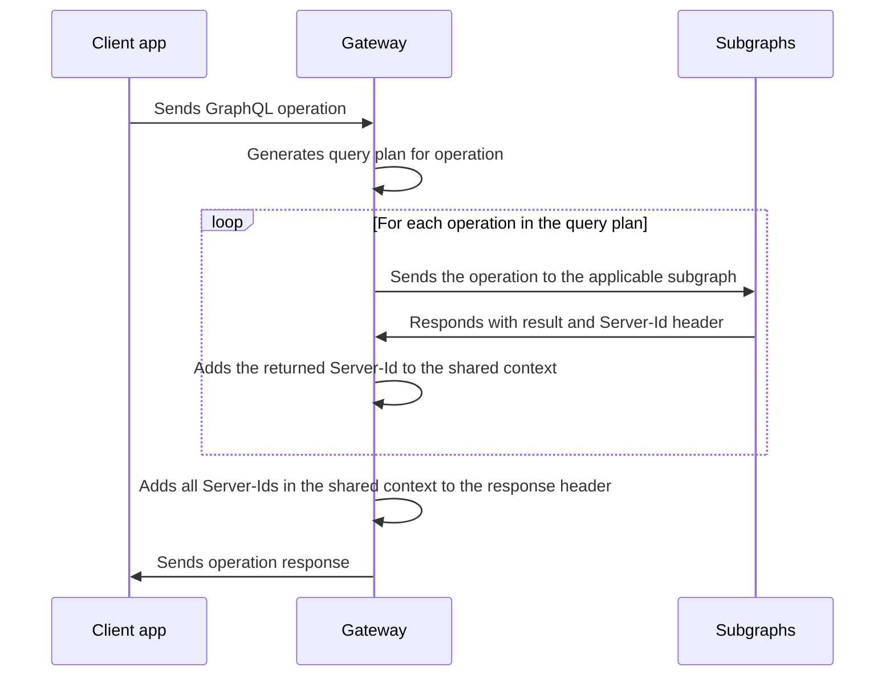

import {
  ExpansionPanel,
} from 'gatsby-theme-apollo-docs/src/components/expansion-panel';

After you set up at least one federation-ready [subgraph](./subgraphs/), you can configure a **gateway** to sit in front of your subgraphs. The gateway executes incoming operations across those subgraphs.

The `@apollo/gateway` package extends Apollo Server's functionality, enabling it to act as a gateway for an Apollo Federation architecture.

> We recommend against running your gateway in a serverless environment (such as AWS Lambda), because schema composition increases Apollo Server's startup time. If you _do_ run your gateway in a serverless environment, set your function's timeout to at least 10 seconds to prevent unexpected errors.

## Setup

First, let's install the necessary packages:

```shell
npm install @apollo/gateway apollo-server graphql
```

The `@apollo/gateway` package includes the [`ApolloGateway` class](/api/apollo-gateway/). To configure Apollo Server to act as a gateway, you pass an instance of `ApolloGateway` to the `ApolloServer` constructor, like so:

```js:title=index.js
const { ApolloServer } = require('apollo-server');
const { ApolloGateway } = require('@apollo/gateway');
const { readFileSync } = require('fs');

const supergraphSdl = readFileSync('./supergraph.graphql').toString();

// Initialize an ApolloGateway instance and pass it
// the supergraph schema
const gateway = new ApolloGateway({
  supergraphSdl
});

// Pass the ApolloGateway to the ApolloServer constructor
const server = new ApolloServer({
  gateway
});

server.listen().then(({ url }) => {
  console.log(`🚀 Server ready at ${url}`);
});
```

### Composing the supergraph schema

In the above example, we provide the `supergraphSdl` option to the `ApolloGateway` constructor. This is the string representation of our [supergraph schema](./#federated-schemas), which is composed from all of our subgraph schemas.

To learn how to compose your supergraph schema with the Rover CLI, see the [Federation quickstart](./quickstart/#3-compose-the-supergraph-schema).

> In production, we strongly recommend running the gateway in a **managed mode** with Apollo Studio, which enables your gateway to update its configuration without a restart. For details, see [Setting up managed federation](https://www.apollographql.com/docs/studio/managed-federation/setup/).

On startup, the gateway processes your `supergraphSdl`, which includes routing information for your subgraphs. It then begins accepting incoming requests and creates query plans for them that execute across one or more subgraphs.

### Composing with `serviceList`

> We strongly recommend _against_ using `serviceList`. For details, [see below](#limitations-of-servicelist).

Alternatively, you can provide a `serviceList` array to the `ApolloGateway` constructor, like so:

```js:title=index.js
const gateway = new ApolloGateway({
  serviceList: [
    { name: 'accounts', url: 'http://localhost:4001' },
    { name: 'products', url: 'http://localhost:4002' },
    // ...additional subgraphs...
  ]
});
```

Each item in the array is an object that specifies the `name` and `url` of one of your subgraphs. You can specify any string value for `name`, which is used primarily for query planner output, error messages, and logging.

On startup, the gateway fetches each subgraph's schema from its `url` and composes those schemas into a supergraph schema. It then begins accepting incoming requests and creates query plans for them that execute across one or more subgraphs.

However, the `serviceList` option has important [limitations](#limitations-of-servicelist).

#### Limitations of `serviceList`

The `serviceList` option can sometimes be helpful for local development, but it is strongly discouraged for any other environment. Here are some reasons why:

* **Composition might fail.** With `serviceList`, your gateway performs composition dynamically on startup, which requires network communication with each subgraph. If composition fails, your gateway [throws errors](./errors/) and experiences unplanned downtime.
    * With `supergraphSdl`, you instead provide a supergraph schema that has _already_ been composed successfully. This prevents composition errors and enables faster startup.
* **Gateway instances might differ.** If you deploy multiple instances of your gateway _while_ deploying updates to your subgraphs, your gateway instances might fetch different schemas from the _same_ subgraph. This can result in sporadic composition failures or inconsistent supergraph schemas between instances.
    * When you deploy multiple instances with `supergraphSdl`, you provide the exact same static artifact to each instance, enabling more predictable behavior.

> **We hope to deprecate the `serviceList` option in the coming months**, but we'd love to hear from you if it enables an important use case that either `supergraphSdl` or [managed federation](./managed-federation/overview/) currently doesn't.
>
> Please let us know by [creating an issue](https://github.com/apollographql/federation/issues/new/choose) or [replying to this forum topic](https://community.apollographql.com/t/1053).

## Updating the gateway

> Before updating your gateway's version, check the [changelog](https://github.com/apollographql/federation/blob/main/gateway-js/CHANGELOG.md) for potential breaking changes.
>
> We strongly recommend updating your gateway in local and test environments before deploying updates to staging or production.

You can confirm the currently installed version of the `@apollo/gateway` library with the `npm list` command:

```bash
npm list @apollo/gateway
```

To update the library, use the [`npm update`](https://docs.npmjs.com/cli/v7/commands/npm-update) command:

```bash
npm update @apollo/gateway
```

This updates the library to the most recent version allowed by your `package.json` file. [Learn more about dependency constraints.](https://docs.npmjs.com/cli/v7/commands/npm-update#example)

To update to a particular version (including a version that _exceeds_ your dependency constraints), use `npm install` instead:

```bash
npm install @apollo/gateway@0.34.0
```

## Customizing requests and responses

The gateway can modify the details of an incoming request before executing it across your subgraphs. For example, your subgraphs might all use the same authorization token to associate an incoming request with a particular user. The gateway can add that token to each operation it sends to your subgraphs.

Similarly, the gateway can modify the details of its response to a client, based on the result returned by each subgraph.

### Customizing requests

In the following example, each incoming request to the gateway includes an `Authorization` header. The gateway sets the shared `context` for an operation by pulling the value of that header and using it to fetch the associated user's ID.

After adding the `userId` to the shared `context` object, the gateway can then add that value to a header that it includes in its requests to each subgraph.

<ExpansionPanel title="Expand example">

```javascript{4-10,17-19,28-35}
const { ApolloServer } = require('apollo-server');
const { ApolloGateway, RemoteGraphQLDataSource } = require('@apollo/gateway');
const { readFileSync } = require('fs');

const supergraphSdl = readFileSync('./supergraph.graphql').toString();

class AuthenticatedDataSource extends RemoteGraphQLDataSource {
  willSendRequest({ request, context }) {
    // Pass the user's id from the context to each subgraph
    // as a header called `user-id`
    request.http.headers.set('user-id', context.userId);
  }
}

const gateway = new ApolloGateway({
  supergraphSdl,
  buildService({ name, url }) {
    return new AuthenticatedDataSource({ url });
  },
});

const server = new ApolloServer({
  gateway,

  context: ({ req }) => {
    // Get the user token from the headers
    const token = req.headers.authorization || '';
    // Try to retrieve a user with the token
    const userId = getUserId(token);
    // Add the user ID to the context
    return { userId };
  },
});

server.listen().then(({ url }) => {
  console.log(`🚀 Server ready at ${url}`);
});
```

</ExpansionPanel>

> The fields of the object passed to your `context` function differ if you're using middleware besides Express. [See the API reference for details.](https://www.apollographql.com/docs/apollo-server/api/apollo-server/#middleware-specific-context-fields)

The `buildService` function enables us to customize the requests that are sent to our subgraphs. In this example, we return a custom `RemoteGraphQLDataSource`. The datasource allows us to modify the outgoing request with information from the Apollo Server `context` before it's sent. Here, we add the `user-id` header to pass an authenticated user ID to downstream services.

### Customizing responses

Let's say that whenever a subgraph returns an operation result to the gateway, it includes a `Server-Id` header in the response. The value of the header uniquely identifies the subgraph in our graph.

When the gateway then responds to a client, we want _its_ `Server-Id` header to include the identifier for _every_ subgraph that contributed to the response. In this case, we can tell the gateway to aggregate the various server IDs into a single, comma-separated list.

The flow for processing a single operation from a client application then looks like this:



To implement this flow, we can use the `didReceiveResponse` callback of the `RemoteGraphQLDataSource` class to inspect each subgraph's result as it comes in. We can add the `Server-Id` to the shared `context` in this callback, then pull the full list from the `context` when sending the final response to the client.

<ExpansionPanel title="Expand example">

```javascript
const { ApolloServer } = require('apollo-server');
const { ApolloGateway, RemoteGraphQLDataSource } = require('@apollo/gateway');
const { readFileSync } = require('fs');

const supergraphSdl = readFileSync('./supergraph.graphql').toString();

class DataSourceWithServerId extends RemoteGraphQLDataSource {
  // highlight-start
  async didReceiveResponse({ response, request, context }) {
    // Parse the Server-Id header and add it to the array on context
    const serverId = response.http.headers.get('Server-Id');
    if (serverId) {
      context.serverIds.push(serverId);
    }

    // Return the response, even when unchanged.
    return response;
  }
  // highlight-end
}

const gateway = new ApolloGateway({
  supergraphSdl,
  // highlight-start
  buildService({ url }) {
    return new DataSourceWithServerId({ url });
  }
  // highlight-end
});

const server = new ApolloServer({
  gateway,
  context() {
    return { serverIds: [] };
  },
  plugins: [
    // highlight-start
    {
      requestDidStart() {
        return {
          willSendResponse({ context, response }) {
            // Append our final result to the outgoing response headers
            response.http.headers.set(
              'Server-Id',
              context.serverIds.join(',')
            );
          }
        };
      }
    }
    // highlight-end
  ]
});

server.listen().then(({ url }) => {
  console.log(`🚀 Server ready at ${url}`);
});
```

</ExpansionPanel>

> In this example, multiple calls to `didReceiveResponse` are `push`ing a value onto the shared `context.serverIds` array. The order of these calls cannot be guaranteed. If you write logic that modifies the shared `context` object, make sure that modifications are not destructive, and that the order of modifications doesn't matter.

To learn more about `buildService` and `RemoteGraphQLDataSource`, see the [API docs](/api/apollo-gateway/).

## Custom directive support

The `@apollo/gateway` library supports the use of custom [directives](https://www.apollographql.com/docs/apollo-server/schema/directives/) in your subgraph schemas. This support differs depending on whether a given directive is a **type system directive** or an **executable directive**.

### Type system directives

Type system directives are directives that are applied to one of [these locations](http://spec.graphql.org/June2018/#TypeSystemDirectiveLocation). These directives are _not_ used within operations, but rather are applied to locations within the schema itself.

The `@deprecated` directive below is an example of a type system directive:

```graphql
directive @deprecated(
  reason: String = "No longer supported"
) on FIELD_DEFINITION | ENUM_VALUE

type ExampleType {
  newField: String
  oldField: String @deprecated(reason: "Use `newField`.")
}
```

At composition time, `ApolloGateway` strips all definitions _and_ uses of type system directives from your composed schema. This has no effect on your subgraph schemas, which retain this information.

Effectively, the gateway supports type system directives by _ignoring_ them, making them the responsibility of the subgraphs that define them.

### Executable directives

Executable directives are directives that are applied to one of [these locations](http://spec.graphql.org/June2018/#ExecutableDirectiveLocation). These directives are _defined_ in your schema, but they're _used_ in operations that are sent by clients.

>**Although the `@apollo/gateway` library supports executable directives, Apollo Server itself does not**. This guidance is provided primarily for architectures that use the `@apollo/gateway` library in combination with subgraphs that do _not_ use Apollo Server.

Here's an example of an executable directive definition:

```graphql
# Uppercase this field's value (assuming it's a string)
directive @uppercase on FIELD
```

And here's an example of a query that uses that directive:

```graphql
query GetUppercaseUsernames {
  users {
    name @uppercase
  }
}
```

At composition time, `ApolloGateway` makes sure that **all of your subgraphs define the exact same set of executable directives**. If any service is missing a definition, or if definitions differ in their locations, arguments, or argument types, a composition error occurs.

> It's strongly recommended that all of your subgraphs also use the exact same _logic_ for a given executable directive. Otherwise, operations might produce inconsistent or confusing results for clients.
