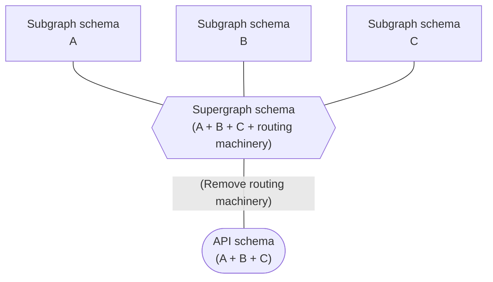

import FederationArchitecture from '../shared/diagrams/federation-architecture.mdx';

> 📣 **Apollo Federation 2 is available in public preview.** [View the Federation 2 docs.](https://www.apollographql.com/docs/federation/v2/)

To get the most out of GraphQL, your organization should expose a [single graph](https://principledgraphql.com/integrity#1-one-graph) that provides a unified interface for querying any combination of your backing data sources. However, it can be challenging to represent an enterprise-scale graph with a single, monolithic GraphQL server.

To remedy this, you can use **Apollo Federation** to divide your graph's implementation across multiple back-end services (called **subgraphs**):

<FederationArchitecture />

Unlike other distributed GraphQL architectures (such as schema stitching), Apollo Federation uses a declarative programming model that enables each subgraph to implement _only_ the part of your composed **supergraph** that it's responsible for.

Apollo Federation also supports a free [managed mode with Apollo Studio](https://www.apollographql.com/docs/studio/managed-federation/overview/), which enables you to add, remove, and refactor your subgraphs without requiring any downtime for your production graph.

## Architecture

An Apollo Federation architecture consists of:

* A collection of **subgraphs** (usually represented by different back-end services) that each define a distinct GraphQL schema
* A **gateway** that uses a **supergraph schema** (composed from all subgraph schemas) to execute queries across multiple subgraphs

Apollo Server provides libraries for acting both as a subgraph and as a gateway, but these components can be implemented in any language and framework.

> Apollo Federation does not currently support [GraphQL subscription operations](https://www.apollographql.com/docs/react/data/subscriptions/).

The following presentation by [Mandi Wise](https://twitter.com/mandiwise) further describes the architecture of Apollo Federation and walks through implementing a federated graph:

<YouTube youTubeId="v_1bn2sHdk4" />

## Design principles

### Incremental adoption

Like the rest of the Apollo platform, Apollo Federation can (and should) be
adopted **incrementally**:

* If you currently use a monolithic GraphQL server, you can break its functionality out one service at a time.
* If you currently use a different federated architecture (such as schema stitching), you can [add federation support to your existing services one at a time](./migrating-from-stitching/).

In both of these cases, all of your clients will continue to work throughout your incremental migration. In fact, clients have no way to distinguish between different graph implementations.

### Separation of concerns

Apollo Federation encourages a design principle called [separation of concerns](https://en.wikipedia.org/wiki/Separation_of_concerns). This enables different teams to work on different products and features within a single graph, without interfering with each other.

#### Limitations of type-based separation

When considering how to split a single GraphQL schema across multiple subgraphs, it seems straightforward to divide schemas up by type. For example, a `users` subgraph would define the entirety of a `User` type, the `products` subgraph would define a `Product` type, and so on:

</img>

Although this separation looks clean, it quickly causes issues. Specifically, a particular feature (or concern) usually spans multiple types.

Consider the `recentPurchases` field of the `User` type in the above schema. Even though this field is a member of the `User` type, a list of `Product`s should probably be populated by the `products` subgraph, _not_ the `users` subgraph.

By defining the `recentPurchases` field in the `products` subgraph instead:

* The subgraph that defines the field is also the subgraph that knows how to populate the field. The `users` subgraph might not even have access to the back-end data store that contains product data.
* The team that manages product data can contain all product-related logic in a single subgraph that they own unilaterally.

#### Concern-based separation

The following schema uses Apollo Federation to divide the same set of types and fields across the same three subgraphs:

</img>

The difference is that now, each subgraph defines the types and fields that it is capable of (and _should_ be responsible for) populating from its back-end data store.

The result is the best of both worlds: an implementation that keeps all the code for a given feature in a single subgraph and separated from unrelated concerns, and a product-centric schema with rich types that reflects the natural way an application developer would want to consume the graph.

## Federated schemas

A federated graph uses multiple "types" of GraphQL schemas:

* **Subgraph schemas.** Each of your **subgraphs** has a distinct schema that indicates _which_ types and fields of your composed **supergraph** it's responsible for resolving.
* **Supergraph schema.** This schema is the result of performing **composition** on your collection of subgraph schemas. It combines all of the types and fields from your subgraph schemas, _plus_ some federation-specific directives that tell your gateway which subgraphs are responsible for resolving which fields.
* **API schema.** This schema is like the supergraph schema, but it _omits_ types, fields, and directives that are considered "machinery" and are not part of your public API (this includes federation-specific directives).
    * This is the schema that your gateway exposes to your GraphQL API's consumers, who don't need to know any internal implementation details about your graph.



Let's look at an example!

### Subgraph schemas

Below, we define the schemas for three subgraphs in a basic e-commerce application. Each subgraph is implemented as a standalone back-end service:

```graphql:title=accounts
extend type Query {
  me: User
}

type User @key(fields: "id") {
  id: ID!
  username: String!
}
```

```graphql:title=products
extend type Query {
  topProducts(first: Int = 5): [Product]
}

type Product @key(fields: "upc") {
  upc: String!
  name: String!
  price: Int
}
```

```graphql:title=reviews
type Review {
  body: String
  author: User @provides(fields: "username")
  product: Product
}

extend type User @key(fields: "id") {
  id: ID! @external
  username: String! @external
  reviews: [Review]
}

extend type Product @key(fields: "upc") {
  upc: String! @external
  reviews: [Review]
}
```

These subgraph schemas illustrate several important conventions of Apollo Federation:

* A subgraph can reference a type that's defined by
_another_ subgraph. For example, the `Review` type includes a
`product` field of type `Product`, even though the `Product` type is defined in a different subgraph.

* A subgraph can also _extend_ a type that's defined by another
subgraph. For example, the `reviews` subgraph extends the `User`
type by adding a `reviews` field to it.

* A subgraph must add the `@key` directive to an object type's definition in order for _other_ subgraphs to be able to reference or extend that type. This directive makes an object type an [entity](./entities/).

### Supergraph schema

To create our supergraph schema, we perform **composition** on our collection of [subgraph schemas](#subgraph-schemas). With [managed federation](./managed-federation/overview/), Apollo performs composition automatically whenever one of your subgraphs registers an updated schema.

We can also perform composition manually with the Rover CLI:

```bash
rover supergraph compose --config ./supergraph.yaml
```

> For an example configuration file, [see the Rover docs](https://www.apollographql.com/docs/rover/supergraphs/#composing-a-supergraph-schema).

This outputs the following supergraph schema that our gateway can use to route queries to the correct subgraphs:

<ExpansionPanel title="Click to expand">

```graphql
schema
  @core(feature: "https://specs.apollo.dev/core/v0.2"),
  @core(feature: "https://specs.apollo.dev/join/v0.1", for: EXECUTION)
{
  query: Query
}

directive @core(feature: String!, as: String, for: core__Purpose) repeatable on SCHEMA

directive @join__field(graph: join__Graph, requires: join__FieldSet, provides: join__FieldSet) on FIELD_DEFINITION

directive @join__type(graph: join__Graph!, key: join__FieldSet) repeatable on OBJECT | INTERFACE

directive @join__owner(graph: join__Graph!) on OBJECT | INTERFACE

directive @join__graph(name: String!, url: String!) on ENUM_VALUE

enum core__Purpose {
  EXECUTION
  SECURITY
}

scalar join__FieldSet

enum join__Graph {
  ACCOUNTS @join__graph(name: "accounts" url: "http://localhost:4001")
  PRODUCTS @join__graph(name: "products" url: "http://localhost:4002")
  REVIEWS @join__graph(name: "reviews" url: "http://localhost:4003")
}

type Product
  @join__owner(graph: PRODUCTS)
  @join__type(graph: PRODUCTS, key: "upc")
  @join__type(graph: REVIEWS, key: "upc")
{
  name: String! @join__field(graph: PRODUCTS)
  price: Int @join__field(graph: PRODUCTS)
  reviews: [Review] @join__field(graph: REVIEWS)
  upc: String! @join__field(graph: PRODUCTS)
}

type Query {
  me: User @join__field(graph: ACCOUNTS)
  topProducts(first: Int = 5): [Product] @join__field(graph: PRODUCTS)
}

type Review {
  author: User @join__field(graph: REVIEWS, provides: "username")
  body: String
  product: Product
}

type User
  @join__owner(graph: ACCOUNTS)
  @join__type(graph: ACCOUNTS, key: "id")
  @join__type(graph: REVIEWS, key: "id")
{
  id: ID! @join__field(graph: ACCOUNTS)
  reviews: [Review] @join__field(graph: REVIEWS)
  username: String! @join__field(graph: ACCOUNTS)
}
```

</ExpansionPanel>

As you can see, the supergraph schema includes a lot of federation-specific additions! These additions are used only by the gateway, and you'll never need to add them manually.

### API schema

The gateway uses its [supergraph schema](#supergraph-schema) to produce an _API schema_, which is what's exposed to clients as your actual GraphQL API. This schema cleanly and logically represents the combination of your [subgraph schemas](#subgraph-schemas):

<ExpansionPanel title="Click to expand">

```graphql
type Product {
  name: String!
  price: Int
  reviews: [Review]
  upc: String!
}

type Query {
  me: User
  topProducts(first: Int = 5): [Product]
}

type Review {
  author: User
  body: String
  product: Product
}

type User {
  id: ID!
  reviews: [Review]
  username: String!
}
```

</ExpansionPanel>

## Gateway example

You provide a composed [supergraph schema](#supergraph-schema) to the `ApolloGateway` constructor, like so:

```js{1,4}
const supergraphSdl = readFileSync('./supergraph.graphql').toString();

const gateway = new ApolloGateway({
  supergraphSdl
});

const server = new ApolloServer({ gateway });
server.listen();
```

That’s it! With Apollo Federation, resolvers live in your subgraphs. The gateway serves only to plan and execute GraphQL operations across those subgraphs.

Now we can execute GraphQL operations against our gateway just as if it were implemented as a single, monolithic GraphQL server:

```graphql
# A query that the gateway resolves by calling all three services
query GetCurrentUserReviews {
  me {
    username
    reviews {
      body
      product {
        name
        upc
      }
    }
  }
}
```

### Managed federation

In addition to providing its supergraph schema on startup, Apollo Gateway can operate in **managed federation** mode, where [Apollo Studio](https://www.apollographql.com/docs/studio/) acts as the source of truth for each subgraph's schema.

This mode enables multiple teams working on a graph to coordinate when and how underlying subgraphs change. It's recommended for all federated graphs. For more information, read [Managed federation overview](https://www.apollographql.com/docs/studio/managed-federation/overview/).

## Apollo Server libraries

Apollo Server supports Apollo Federation via two open-source extension libraries:

* [`@apollo/subgraph`](./api/apollo-subgraph/) provides primitives that subgraphs use to make their individual GraphQL schemas composable.
* [`@apollo/gateway`](./api/apollo-gateway) enables you to set up an instance of Apollo Server as a **gateway** that distributes incoming GraphQL operations across one or more subgraphs.

---

Ready to try out Apollo Federation? Jump into the [Quickstart](./quickstart/)!
