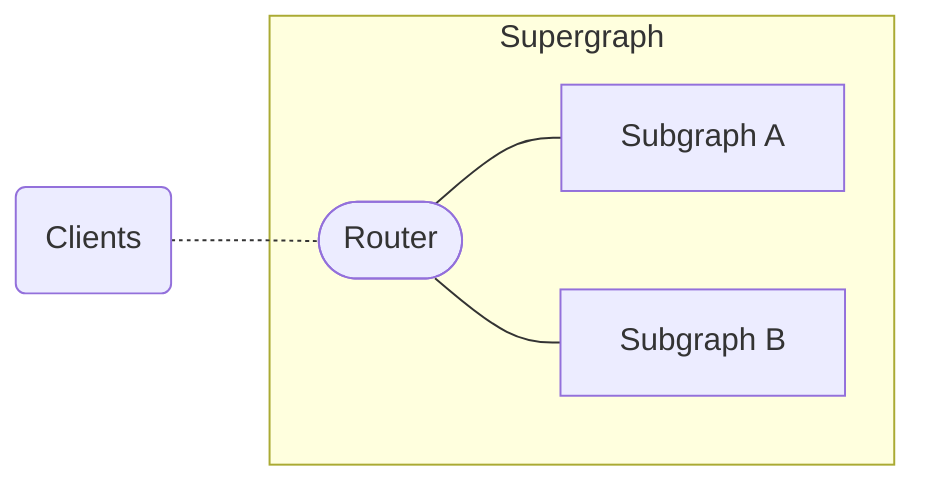
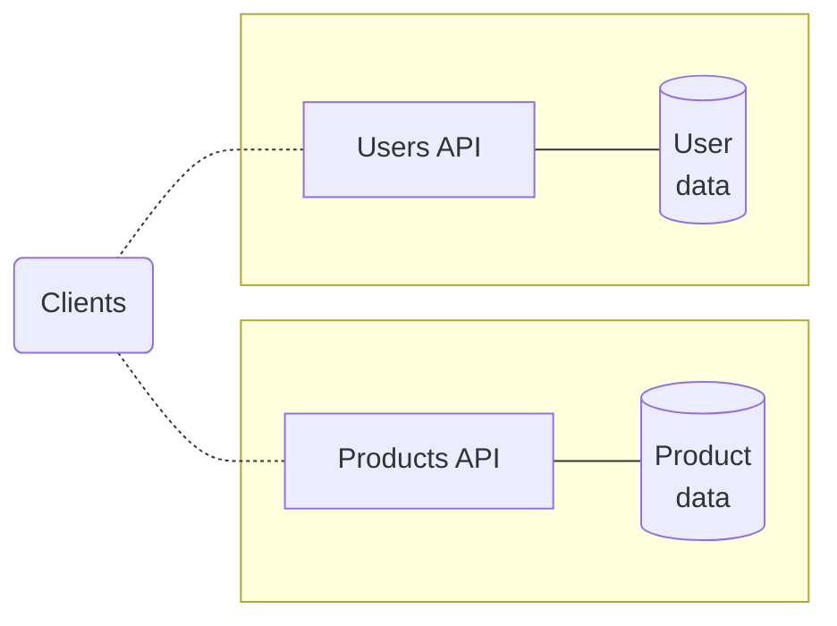
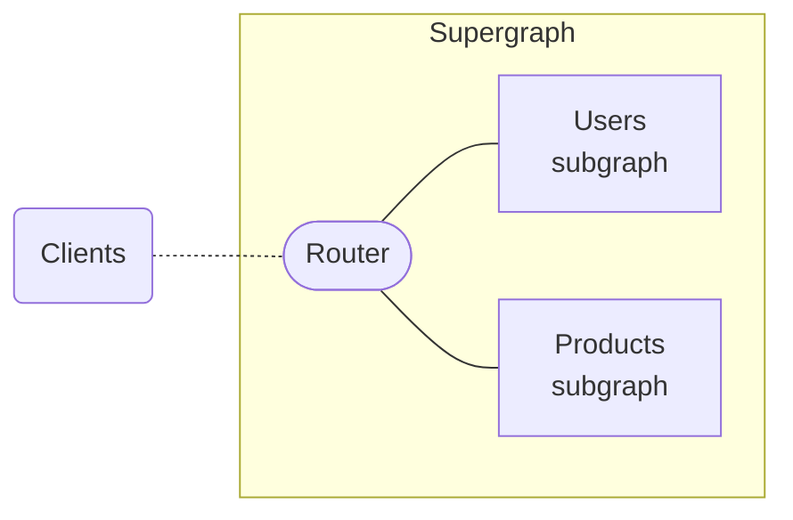
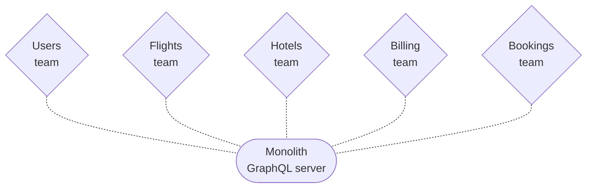
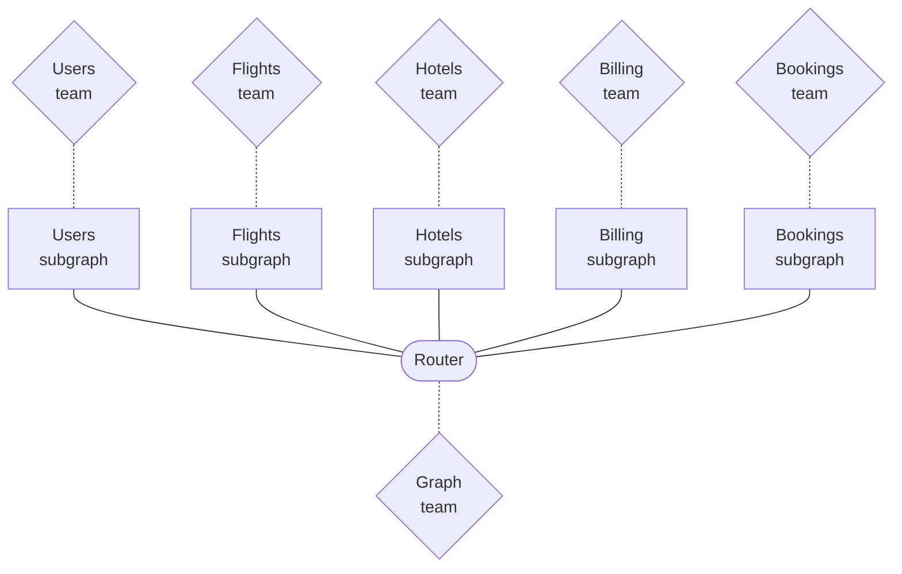

<blockquote>

This page covers:
- What Apollo Federation is
- The benefits of using Apollo Federation
- The resources you can use to learn about federation

</blockquote>

## What is Apollo Federation?

**Apollo Federation** is a microservices architecture that combines multiple GraphQL APIs.
In this federated architecture, your individual GraphQL APIs are called **subgraphs** and they're combined into a **supergraph**.

Subgraphs can each use any [subgraph-compatible GraphQL server library](./building-supergraphs/supported-subgraphs/). This includes Apollo Server using special extensions from the [`@apollo/subgraph`](/apollo-server/using-federation/api/apollo-subgraph) library. Different subgraphs in the same supergraph can use different server libraries.

A supergraph consists of more than just subgraphs—it also includes a **router** that acts as an API gateway for your subgraphs.
By querying your supergraph's router, clients can fetch data from all of your subgraphs with a single request:



The router serves as the public access point for your supergraph. Each subgraph is queried _only_ by the router. It receives incoming GraphQL operations and intelligently routes them across your subgraphs. The router receives responses from the subgraphs and returns a single response to the client. **For clients, this looks exactly the same as querying any other GraphQL server.** No client-side configuration is required.

**The router** is one of the following:

- [The Apollo Router](https://www.apollographql.com/docs/router/) (recommended): a high-performance, precompiled Rust executable
    - If you're getting started with federation, we recommend [creating a **cloud supergraph**](/graphos/quickstart/cloud/) with Apollo GraphOS. With a cloud supergraph, GraphOS provisions and manages your router for you!
- [To-do]() Other routers in the ecosystem.

<Note>

- An instance of Apollo Server using special extensions from the [`@apollo/gateway`](/apollo-server/using-federation/api/apollo-gateway) library

</Note>


## Benefits of federation

### Unify your graph

Often when an organization first adopts GraphQL, multiple teams do so independently. Each team sets up a GraphQL server that provides the data used by that team:

<p style="margin-bottom: 0">❌</p>



But with an architecture like this, a client might need to communicate with _multiple_ APIs to fetch all of the data it needs. This diminishes a powerful advantage of GraphQL over traditional REST APIs.

Instead, your organization should expose a [unified supergraph](https://principledgraphql.com/integrity) that lets clients fetch _all_ of the data that they need from a single endpoint:

<p style="margin-bottom: 0">✅</p>



By unifying your supergraph with Apollo Federation, teams can continue to own and develop their subgraphs independently, and clients can fetch data from _all_ of those subgraphs with a single query.

### Break up monolithic code

It can be challenging to represent an entire enterprise-scale graph with a monolithic GraphQL server. Performance might degrade as your users and features increase, and teams across your organization are all committing changes to the same application:

<p style="margin-bottom: 0">❌</p>



With a supergraph, you can reduce performance _and_ productivity bottlenecks simultaneously. Each team can maintain their own subgraph(s) independently, and your supergraph's router serves primarily to _route_ incoming operations, not to resolve each of them completely.

<p style="margin-bottom: 0">✅</p>



In this structure, the "graph team" might be a separate team that's dedicated to maintaining your router as part of back-end infrastructure, or it might be a "meta team" that includes representatives from other teams that maintain subgraphs.

### Adopt incrementally

As with the rest of the Apollo platform, you can (and should) adopt Apollo Federation **incrementally**:

* If you currently use a monolithic GraphQL server, you can break its functionality out one subgraph at a time.
* If you currently use a different federated architecture (such as schema stitching), you can [add federation support to your existing services one at a time](./migrating-from-stitching/).

In both of these cases, all of your clients continue to work throughout your incremental adoption. In fact, clients have no way to distinguish between different graph implementations.

### Separation of concerns

Apollo Federation encourages a design principle called [separation of concerns](https://en.wikipedia.org/wiki/Separation_of_concerns). This enables different teams to work on different products and features within a single graph, without interfering with each other.

#### Limitations of type-based separation

When thinking about how to divide your graph's functionality across subgraphs, it might initially seem logical for each subgraph to own a completely distinct set of types. For example, a Users subgraph would define the entirety of a `User` type, the Products subgraph would define a `Product` type, and so on:

<p style="margin-bottom: 0">❌</p>

<CodeColumns cols="3">

```graphql title="Users subgraph"
type User {
  id: ID!
  name: String
  reviews: [Review]
  purchases: [Product]
}
```

```graphql title="Products subgraph"
type Product {
  id: ID!
  name: String
  price: String
  reviews: [Review]
}
```

```graphql title="Reviews subgraph"
type Review {
  id: ID!
  body: String
  author: User
  product: Product
}
```

</CodeColumns>

Although this separation looks clean, it quickly causes issues. Most commonly, a particular feature (or _concern_) usually spans _multiple_ types, which might belong to different subgraphs.

Consider the `User.purchases` field above. Even though this field belongs to the `User` type, a list of `Product`s should probably be populated by the Products subgraph, _not_ the Users subgraph.

By defining the `User.purchases` field in the Products subgraph instead:

* The subgraph that defines the field is also the subgraph that knows how to populate the field. The Users subgraph might not even have access to the back-end data store that contains product data!
* The team that manages product data can contain all product-related logic in a single subgraph that they are responsible for.

#### Concern-based separation

The following schema uses Apollo Federation to divide the same set of types and fields across the same three subgraphs:

> Some federation-specific syntax is omitted here for clarity. For details, see [Entities](./entities/).

<p style="margin-bottom: 0">✅</p>

<CodeColumns cols="3">

```graphql title="Users subgraph"
type User {
  id: ID!
  name: String
}
```

```graphql title="Products subgraph"
type Product {
  id: ID!
  name: String
  price: String
}

type User {
  id: ID!
  purchases: [Product]
}
```

```graphql title="Reviews subgraph"
type Review {
  id: ID!
  body: String
  author: User
  product: Product
}

type User {
  id: ID!
  reviews: [Review]
}

type Product {
  id: ID!
  reviews: [Review]
}
```

</CodeColumns>

The difference is that now, each subgraph _mostly_ defines types and fields that it is capable of (and _should_ be responsible for) populating from its back-end data store.

> You'll notice some exceptions to this, such as `Review.product` (which is still defined in the Reviews subgraph even though it requires data from the Products subgraph). Exceptions like this improve data encapsulation (the Products subgraph doesn't really need to know about the `Review` type), and we handle them with powerful federated types called [entities](./entities/).

These resulting schemas provide the best of both worlds:

* An implementation that keeps the code for a given feature in a single subgraph and separated from unrelated concerns
* A product-centric schema with rich types that reflect the natural way an application developer wants to consume the graph

### Managed federation

Your router can operate in **managed federation** mode, where [Apollo GraphOS](/graphos/) acts as the source of truth for your supergraph's configuration:


This mode helps multiple teams working on a supergraph to coordinate when and how to change individual subgraphs. It's recommended for all supergraphs. For more information, read [Managed federation overview](./managed-federation/overview/).

---

Ready to try out Apollo Federation? [Jump into the Quickstart](./quickstart/setup/)!
