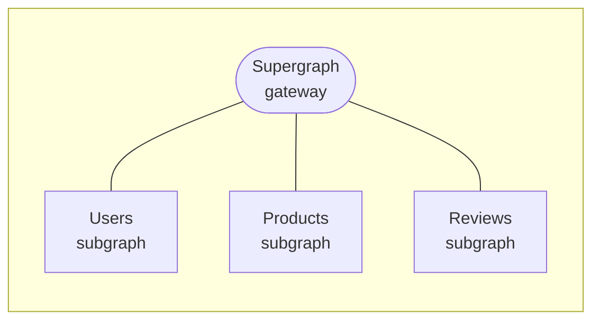
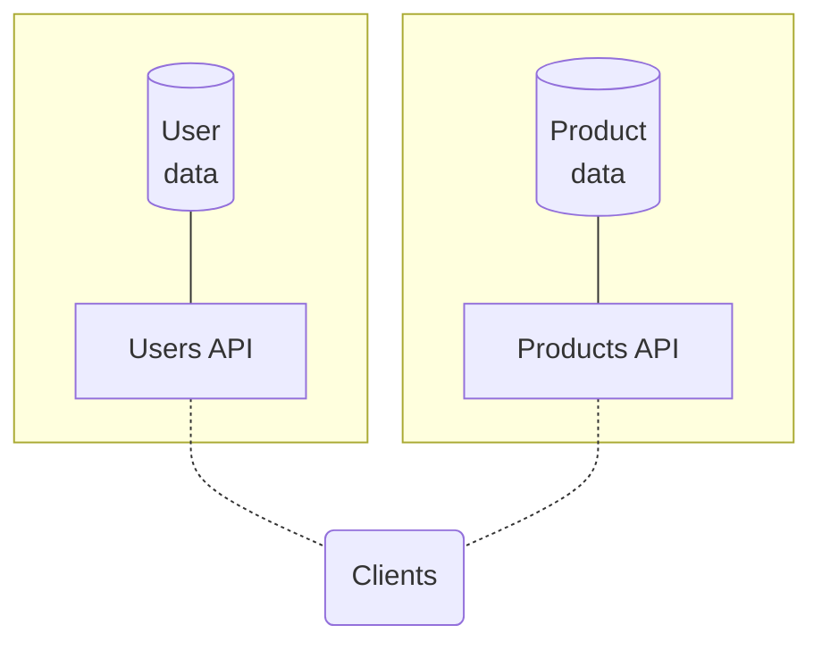
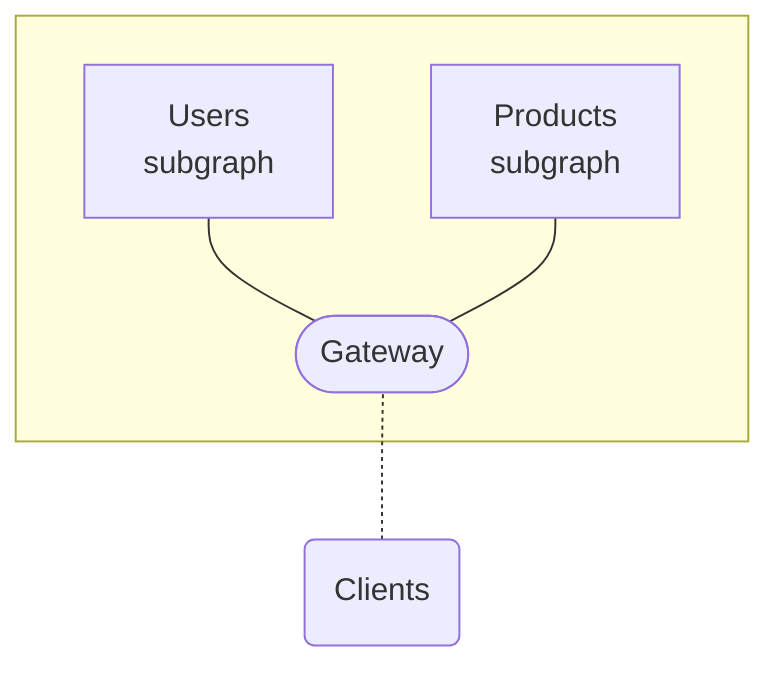
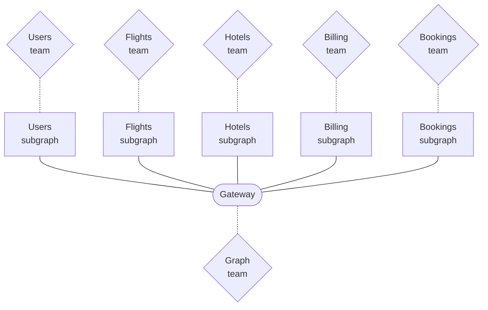

import FederationArchitecture from '../shared/diagrams/federation-architecture.mdx';
import { Button } from '@apollo/space-kit/Button';
import { Link } from 'gatsby';
import { colors } from 'gatsby-theme-apollo-core';
import { CodeColumns } from 'gatsby-theme-apollo-docs';

> 📣 **Apollo Federation 2 is in public preview.**
>
> * [See what's new!](./federation-2/new-in-federation-2/)
> * [Move a test graph over](./federation-2/moving-to-federation-2)
>
> Unchanged portions of the [Federation 1 docs](https://www.apollographql.com/docs/federation/) docs are omitted for clarity.

**Apollo Federation** is a powerful open-source architecture that helps you create a **unified graph** that combines multiple GraphQL APIs:



With federation, you can responsibly share ownership of your graph across any number of teams.  And even if you currently only have _one_ GraphQL API, Apollo Federation is essential for scaling that API as you grow your features, user base, and organization.

Federation also supports a free managed mode with Apollo Studio, which helps you modify and grow your graph without any downtime.

<p>
  <Button
    color={colors.primary}
    as={<Link to="https://www.apollographql.com/docs/federation/v2/quickstart/setup/" />}
    style={{marginRight: 16, marginBottom: 16}}
  >
    Get started with Federation
  </Button>

  <Button
    as={<Link to="#how-it-works" />}
  >
    Learn more
  </Button>
</p>

## How it works

In a federated architecture, your individual GraphQL APIs are called **subgraphs**, and they're composed into a **supergraph**. By querying your supergraph, clients can query all of your subgraphs _at the same time:_


A **gateway** serves as the public access point for your supergraph. It receives incoming GraphQL operations and intelligently distributes them across your subgraphs. To clients, this looks exactly the same as querying any other GraphQL server—no special configuration is required.

> Apollo Federation does not currently support [GraphQL subscription operations](https://www.apollographql.com/docs/react/data/subscriptions/).

### Combining subgraph schemas

Every subgraph has its own schema (just like any other GraphQL API):

<CodeColumns>

```graphql
# Users subgraph
type User {
  id: ID!
  name: String!
}
```

```graphql
# Products subgraph
type Product {
  upc: String!
  inStock: Boolean!
}
```

</CodeColumns>

To communicate with all of your subgraphs, the gateway uses a special **supergraph schema** that _combines_ these subgraph schemas.

To create a supergraph schema, Apollo Federation uses a special process called **composition**. Composition takes all of your subgraph schemas and intelligently combines them into _one_ schema for your gateway:

```graphql
# Supergraph schema (simplified)
type User {
  id: ID!
  name: String!
}

type Product {
  upc: String!
  inStock: Boolean!
}
```

> A real supergraph schema includes additional information that tells your gateway _which_ subgraph is responsible for _which_ types and fields. [Learn more about composition.](./federated-types/composition/)

### Server instances

In a federated architecture, each subgraph instance has its own GraphQL server, and _so does the gateway_. External clients query the gateway, and the gateway then queries individual subgraphs to obtain and return results:


* The gateway runs Apollo Server using special extensions from the [`@apollo/gateway`](./api/apollo-gateway) library.
    * Alternatively, the gateway can run [the Apollo Router](https://www.apollographql.com/docs/router/), a highly performant Rust-based graph router that is currently in public pre-alpha.
* Subgraphs can run Apollo Server using special extensions from the [`@apollo/subgraph`](./api/apollo-subgraph) library, _or_ they can run any other [subgraph-compatible GraphQL server](./other-servers/). Different subgraphs can even use different server libraries.


## Benefits of federation

### Unify your graph

Often when an organization first adopts GraphQL, multiple teams do so independently. Each team sets up a GraphQL server that provides the data used by that team:

<p style="margin-bottom: 0">❌</p>



But with an architecture like this, a client might need to communicate with _multiple_ APIs to fetch all of the data it needs. This diminishes a powerful advantage of GraphQL over REST.

Instead, your organization should expose a [unified graph](https://principledgraphql.com/integrity#1-one-graph) that lets clients fetch _all_ of the data that they need from a single endpoint:

<p style="margin-bottom: 0">✅</p>



By unifying your graph with Apollo Federation, teams can continue to own and develop their subgraphs independently, and clients can fetch data from _all_ of those subgraphs with a single query.

### Break up monolithic code

It can be challenging to represent an entire enterprise-scale graph with a monolithic GraphQL server. Performance might degrade as your users and features increase, and teams across your organization are all committing changes to the same application:

<p style="margin-bottom: 0">❌</p>


By federating your graph, you can reduce performance _and_ productivity bottlenecks simultaneously. Each team can maintain their own subgraph(s) independently, and your graph's gateway serves primarily to _route_ incoming operations, not to resolve each of them completely.

<p style="margin-bottom: 0">✅</p>



In this structure, the "graph team" might be a separate team that's dedicated to maintaining your gateway as part of back-end infrastructure, or it might be a "meta team" that includes representatives from other teams that maintain subgraphs.

### Adopt incrementally

As with the rest of the Apollo platform, you can (and should) adopt Apollo Federation **incrementally**:

* If you currently use a monolithic GraphQL server, you can break its functionality out one subgraph at a time.
* If you currently use a different federated architecture (such as schema stitching), you can [add federation support to your existing services one at a time](/migrating-from-stitching/).

In both of these cases, all of your clients continue to work throughout your incremental adoption. In fact, clients have no way to distinguish between different graph implementations.

### Separation of concerns

Apollo Federation encourages a design principle called [separation of concerns](https://en.wikipedia.org/wiki/Separation_of_concerns). This enables different teams to work on different products and features within a single graph, without interfering with each other.

#### Limitations of type-based separation

When thinking about how to divide your graph's functionality across subgraphs, it might seem straightforward that each subgraph would own a completely distinct set of types. For example, a Users subgraph would define the entirety of a `User` type, the Products subgraph would define a `Product` type, and so on:

<p style="margin-bottom: 0">❌</p>

<CodeColumns cols="3">

```graphql
# Users subgraph
type User {
  name: String
  reviews: [Review]
  purchases: [Product]
}
```

```graphql
# Products subgraph
type Product {
  name: String
  price: String
  reviews: [Review]
}
```

```graphql
# Reviews subgraph
type Review {
  body: String
  author: User
  product: Product
}
```

</CodeColumns>

Although this separation looks clean, it quickly causes issues. Most commonly, a particular feature (or _concern_) usually spans _multiple_ types, which might belong to different subgraphs.

Consider the `purchases` field of the `User` type above. Even though this field is a member of the `User` type, a list of `Product`s should probably be populated by the Products subgraph, _not_ the Users subgraph.

By defining the `User.purchases` field in the Products subgraph instead:

* The subgraph that defines the field is also the subgraph that knows how to populate the field. The Users subgraph might not even have access to the back-end data store that contains product data!
* The team that manages product data can contain all product-related logic in a single subgraph that they are responsible for.

#### Concern-based separation

The following schema uses Apollo Federation to divide the same set of types and fields across the same three subgraphs:

<p style="margin-bottom: 0">✅</p>

<CodeColumns cols="3">

```graphql
# Users subgraph
type User {
  name: String
}
```

```graphql
# Products subgraph
type Product {
  name: String
  price: String
  reviews: [Review]
}

type User {
  purchases: [Product]
}
```

```graphql
# Reviews subgraph
type Review {
  body: String
  author: User
  product: Product
}

type User {
  reviews: [Review]
}

type Product {
  reviews: [Review]
}
```

</CodeColumns>

The difference is that now, each subgraph defines the types and fields that it is capable of (and _should_ be responsible for) populating from its back-end data store.

The result provides the best of both worlds:

* An implementation that keeps the code for a given feature in a single subgraph and separated from unrelated concerns
* A product-centric schema with rich types that reflect the natural way an application developer wants to consume the graph

### Managed federation

A federated gateway can operate in **managed federation** mode, where [Apollo Studio](https://www.apollographql.com/docs/studio/) acts as the source of truth for your supergraph's configuration:


This mode helps multiple teams working on a graph to coordinate when and how to change individual subgraphs. It's recommended for all federated graphs. For more information, read [Managed federation overview](./managed-federation/overview/).

---

Ready to try out Apollo Federation? [Jump into the Quickstart](./quickstart/setup/)!
