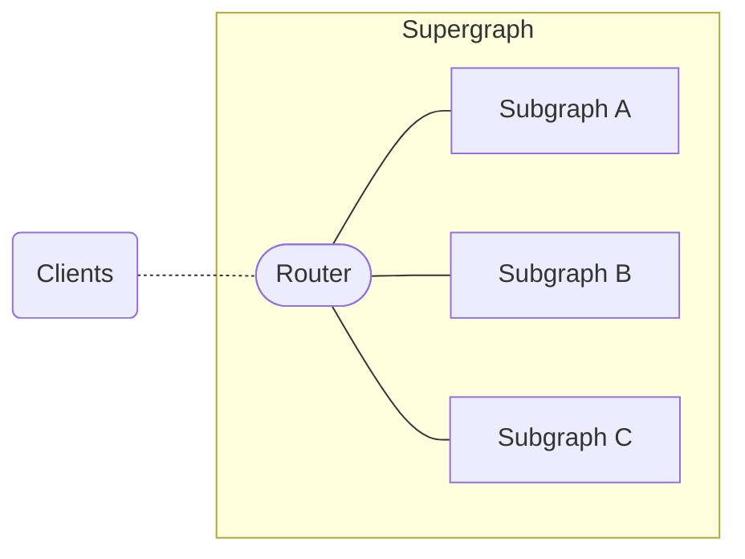
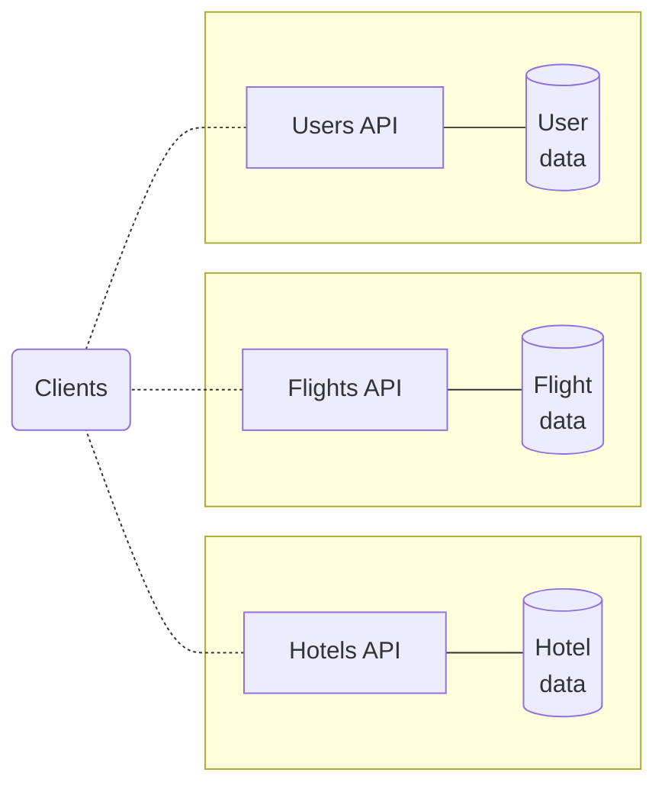
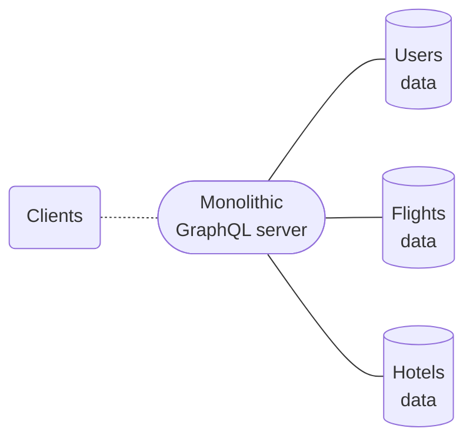

## What is Apollo Federation?

**Apollo Federation** is an open standard to combine multiple GraphQL APIs.
In a federated architecture, your individual GraphQL APIs are called **subgraphs**, and they're combined into a **supergraph**.

Different subgraphs in the same supergraph can use different server libraries, as long as they are [federation-compatible](./building-supergraphs/supported-subgraphs/). This includes Apollo Server using special extensions from the [`@apollo/subgraph`](/apollo-server/using-federation/api/apollo-subgraph) library.

<Tip>

Learn more about [choosing subgraph libraries](./building-supergraphs/subgraphs-overview#choosing-a-subgraph-library).

</Tip>

### The role of the router

A supergraph consists of more than just subgraphs. It also includes a **router** that acts as an API gateway for your subgraphs.
The router is a separate service that exposes a GraphQL endpoint to external clients.

Clients can fetch data from all your subgraphs with a single request to the router. The router receives incoming GraphQL operations from clients and intelligently routes them across your subgraphs. The router then receives subgraph responses and returns a single response to the client.

Clients only query the router—never subgraphs directly—and only the router queries subgraphs.  **For clients, the request and response cycle of querying the router looks exactly the same as querying any other GraphQL server.**  No client-side configuration is required.

<Tip>

Learn more about [your router options](./building-supergraphs/router).

</Tip>

## Benefits of federation

As a GraphQL-native microservices architecture, Apollo Federation draws on both paradigms' benefits.
Federated architecture imparts some unique additional benefits by combining GraphQL and microservices frameworks.
Continue reading to learn more.

<Tip>

- Learn more about the [considerations and benefits of GraphQL](/intro/benefits/).
- Learn more about the [considerations and benefits of microservices architecture](https://aws.amazon.com/compare/the-difference-between-monolithic-and-microservices-architecture/).

</Tip>

### Challenges of separate services

Sometimes, when an organization adopts GraphQL, multiple teams do so independently. Each team sets up a GraphQL services that provides the data used by that team. For example, a travel app may have separate GraphQL servicess for users, flights, and hotels:

But with an architecture like this, a client might need to communicate with _multiple_ APIs to fetch all the data it needs. This diminishes a powerful advantage of GraphQL over traditional REST APIs.

To counter this, some organizations "stitch" schemas together. Schema stitching links types across services and provides the client with one endpoint to query. The ever-growing complexity of schema stitching can be [challenging to manage](https://www.apollographql.com/blog/announcement/expedia-improved-performance-by-moving-from-schema-stitching-to-apollo-federation/) though.

### Challenges of monoliths

Alternatively, some organizations adopting GraphQL may start with a monolithic GraphQL server, allowing clients to fetch all necessary data with one request.

Representing an entire enterprise-scale graph as a monolith has its own challenges. Performance might degrade as your users and features increase. Developer productivity can lag due to the coordination challenges of different teams committing changes to the same application.

### A non-monolithic unifed graph

With a [unified supergraph](https://principledgraphql.com/integrity), you can reduce performance and productivity bottlenecks, without the additional complexity of schema stitching. Each team can own and develop their subgraph(s) independently because your supergraph's router serves primarily to route incoming operations, not to resolve each of them completely. This allows clients to fetch data from all subgraphs with a single query without the drawbacks of monolithic architecture or schema stitching.

#### Incremental adoption

As with the rest of the Apollo platform, you can (and should) adopt Apollo Federation **incrementally**:

* If you currently use a different federated architecture (such as schema stitching), you can [add federation support to your existing services one at a time](./migrating-from-stitching/).
* If you currently use a monolithic GraphQL server, you can break its functionality out one subgraph at a time.

In both cases, all your clients continue to work throughout your incremental adoption.

## Next steps

Depending on your goals, you have several options for learning more about federation. Apollo's docs offer these sections:

- A [Quickstart tutorial](./quickstart/setup/) that walks you through setting up an Apollo Federation supergraph
- Details on [subgraphs](./building-supergraphs/subgraphs-overview) and [routers](./building-supergraphs/router) in **Building Your Supergraph**
- A conceptual overview of writing [**Federated Schemas**](./federated-types/)
- A [guide on using Apollo GraphOS](./managed-federation) to automate and manage deployments of your federated schemas (this is also known as **Managed Federation**)
- Reference materials for:
  - [**Performance** considerations](./performance/caching)
  - [**Debugging and metrics**](./errors)
  - [Subgraph specifications](./building-supergraphs/router) for federation-compatibility
- A [migration guide from Federation 1 to Federation 2](/federation-2/moving-to-federation-2)

### Additional resources

Outside of the docs, Apollo offers these resources for learning more about federation:

- A general [overview of federated architecture](https://graphql.com/learn/federated-architecture/)
- An [interactive course](https://www.apollographql.com/tutorials/voyage-part1) focused on Apollo Federation
- A [demo app](https://github.com/apollographql/supergraph-demo-fed2) that you can fork and tinker with
- The [overview video](https://youtu.be/wRExDdgs6JU) embedded below:

<YouTube youTubeId="wRExDdgs6JU" />

