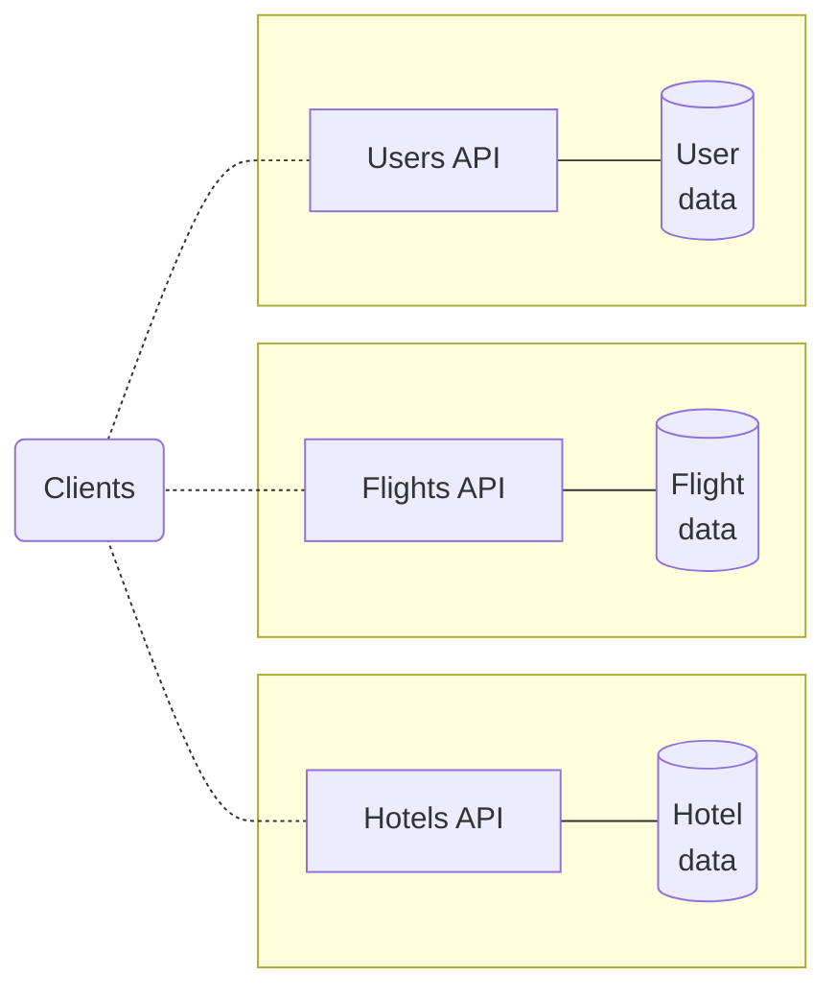
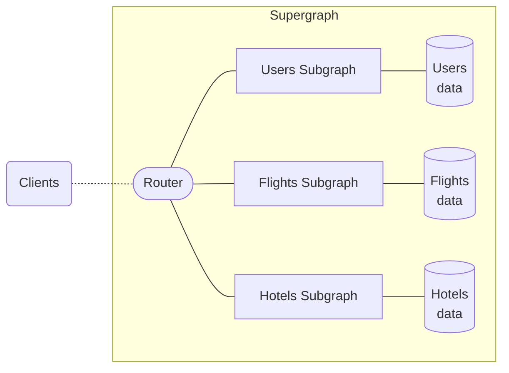

## What is Apollo Federation?

**Apollo Federation** is an open standard for managing GraphQL APIs across any number of services and teams. Federation allows you to combine multiple GraphQL APIs into a single federated graph called a **supergraph**. In a supergraph, the individual GraphQL APIs are called **subgraphs**.

### More about subgraphs

Different subgraphs in the same supergraph can use different server libraries as long as they are [federation-compatible](./building-supergraphs/supported-subgraphs/). This includes Apollo Server using special extensions from the [`@apollo/subgraph`](/apollo-server/using-federation/api/apollo-subgraph) library.

<Tip>

Learn more about [choosing subgraph libraries](./building-supergraphs/subgraphs-overview#choosing-a-subgraph-library).

</Tip>

### The role of the router

A supergraph consists of more than just subgraphs. It also includes a **router** that acts as an API gateway for your subgraphs.
The router is a separate service that exposes a GraphQL endpoint to external clients.

Clients can fetch data from all your subgraphs with a single request to the router. The router receives incoming GraphQL operations from clients and intelligently routes them across your subgraphs. The router then receives subgraph responses and returns a single response to the client.

Clients only query the router—never subgraphs directly—and only the router queries subgraphs.  **For clients, the request and response cycle of querying the router looks exactly the same as querying any other GraphQL server.**  No client-side configuration is required.

<Tip>

Learn more about [your router options](./building-supergraphs/router).

</Tip>

## Benefits of federation

Apollo Federation offers all the benefits of GraphQL and a [microservices architecture](https://www.atlassian.com/microservices/microservices-architecture/microservices-vs-monolith). Understanding these concepts can help you get the most out of federation.

<Tip>

- Learn more about the [considerations and benefits of GraphQL](/intro/benefits/).
- Learn more about the [considerations and benefits of microservices architecture](https://aws.amazon.com/compare/the-difference-between-monolithic-and-microservices-architecture/).

</Tip>

Beyond the generic benefits of using GraphQL and microservices architecture, Apollo Federation offers the following additional benefits.

### Preserved client performance

Sometimes, when an organization adopts GraphQL, multiple teams do so independently. Each team sets up a GraphQL service that provides the data used by that team. For example, a travel app may have separate GraphQL services for users, flights, and hotels:

But if you expose multiple GraphQL APIs to clients, a client might need to communicate with _multiple_ APIs to fetch all the data it needs. With a single supergraph, you preserve one of the most powerful features of GraphQL: the ability to fetch all the data you need in a single request.

This is possible because the supergraph's router serves primarily to route incoming operations, not to resolve each of them completely. 

### Design the schema you want

Some alternative approaches to combining GraphQL APIs impose limits on your schema, like adding namespaces or representing relationships with IDs instead of types. With these approaches, your subgraph schemas may look unchanged—but the resulting federated schema that clients interact with is more complex. Subsequently, it requires you to make frontend as well as backend changes.

With Apollo Federation, clients can interact with the composed supergraph schema as if it were a monolith. Consumers of your API shouldn't know or care that it's implemented as microservices.

### Maintain a single API

With federation, every team maintaining a subgraph contributes directly to the overall supergraph schema. Instead of every team needing to manage its own graph layer, each team can be responsible for its slice of the API. When your entire organization contributes to the same graph, each team doesn't need to worry about maintaining its unique API.

In this structure, the "graph team" might be a separate team that's dedicated to maintaining your router as part of backend infrastructure, or it might be a "meta team" that includes representatives from other teams that maintain subgraphs.

## Next steps

Depending on your goals, you have several options for learning more about federation. Apollo's docs offer these sections:

- A [Quickstart tutorial](./quickstart/setup/) that walks you through setting up an Apollo Federation supergraph
- Details on [subgraphs](./building-supergraphs/subgraphs-overview) and [routers](./building-supergraphs/router) in **Building Your Supergraph**
- A conceptual overview of writing [**Federated Schemas**](./federated-types/)
- A [guide on using Apollo GraphOS](./managed-federation) to automate and manage deployments of your federated schemas (this is also known as **Managed Federation**)
- Reference materials for:
  - [**Performance** considerations](./performance/caching)
  - [**Debugging and metrics**](./errors)
  - [Subgraph specifications](./building-supergraphs/router) for federation-compatibility
- A [migration guide from Federation 1 to Federation 2](./federation-2/moving-to-federation-2)

### Additional resources

Outside of the docs, Apollo offers these resources for learning more about federation:

- A general [overview of federated architecture](https://graphql.com/learn/federated-architecture/)
- An [interactive course](https://www.apollographql.com/tutorials/voyage-part1) focused on Apollo Federation
- A [demo app](https://github.com/apollographql/supergraph-demo-fed2) that you can fork and tinker with
- The [overview video](https://youtu.be/wRExDdgs6JU) embedded below:

<YouTube youTubeId="wRExDdgs6JU" />

