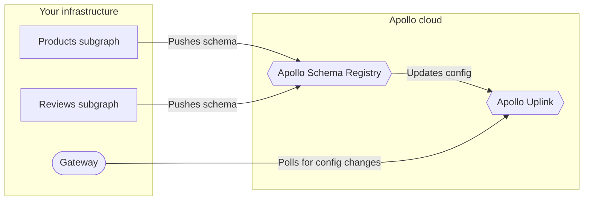

Apollo provides free **managed federation** support for graphs that use Apollo Federation.

With managed federation, your [gateway](../gateway/) is no longer responsible for fetching schemas from your [subgraphs](../subgraphs/) on startup. Instead, your subgraphs push their schemas to the Apollo schema registry, which verifies that they successfully **compose** into a federated schema.

On composition success, Studio updates your graph's latest configuration, which is available at a special endpoint (called the **uplink**) that your gateway regularly polls for updates:

## Benefits of managed federation

Managed federation helps your organization safely validate, coordinate, deploy, and monitor changes to your graph. It provides:

### Gateway stability

You can modify subgraph schemas (and even add or remove entire subgraphs from your graph) _without_ needing to modify or redeploy your gateway. As the point of entry to your entire graph, your gateway should maximize its uptime.

### Composition stability

Whenever your gateway obtains an updated configuration from Studio, it knows that the updated set of schemas will compose, because the configuration includes the latest composed supergraph schema.

The gateway _also_ knows that your subgraphs are prepared to handle operations against the updated set of schemas. This is because your subgraphs should register their updated schemas as part of their deployment, meaning they're definitely running by the time the gateway is aware of the configuration change.

And whenever a subgraph accidentally pushes a schema change that _doesn't_ compose, Studio continues to provide the most recent _valid_ configuration to your gateway.

### Schema flexibility

By using a configuration manager that's external to your gateway, you help ensure the safety of certain schema changes. For example, if you want to migrate a type or field from one subgraph's schema to another, you can perform this migration safely _only_ if you externalize your configuration.

Ready to try it out? Continue to [Setup](./setup/).
