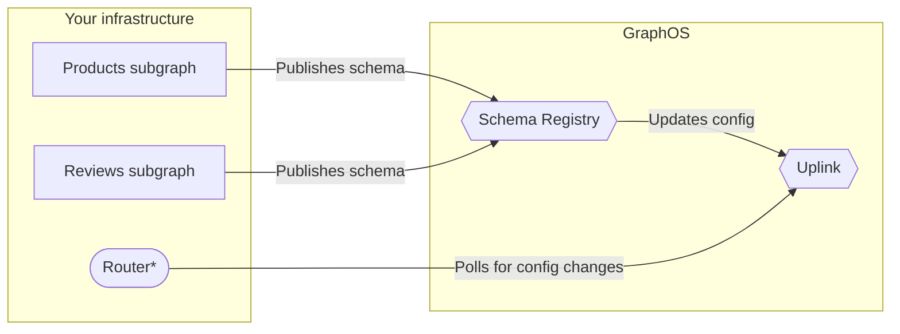

Apollo GraphOS provides free **managed federation** support for federated supergraphs.

With managed federation, your subgraphs each publish their schemas to GraphOS, which verifies that those subgraph schemas successfully [compose](../federated-types/composition/) into a supergraph schema.

On composition success, GraphOS updates your supergraph's latest configuration, which is available at a special endpoint (called the **uplink**) that your router regularly polls for updates:

*GraphOS can provision and host your supergraph's router if you create a [cloud supergraph](/studio/org/graphs/#cloud-supergraphs).

## Benefits of managed federation

Managed federation helps your organization safely validate, coordinate, deploy, and monitor changes to your supergraph. It provides:

### Router stability

You can modify your subgraph schemas (and even add or remove entire subgraphs) _without_ needing to modify or redeploy your router. Your router is the point of entry to your entire supergraph, and you should maximize its uptime.

### Composition stability

Whenever your router obtains new configuration from GraphOS, it knows that your updated set of subgraphs is valid. This is because the configuration is updated only if supergraph schema composition succeeds.

The router _also_ knows that your subgraphs are prepared to handle operations against the updated supergraph schema. This is because your subgraphs should publish their updated schemas as part of their deployment, which means they're definitely running by the time the gateway is aware of the configuration change.

And whenever you accidentally publish a subgraph schema change that _doesn't_ compose, GraphOS continues to provide the most recent _valid_ configuration to your router.

### Schema flexibility

By using a configuration manager that's external to your gateway, you help ensure the safety of certain schema changes. For example, if you want to migrate a type or field from one subgraph's schema to another, you can perform this migration safely _only_ if you externalize your configuration.

## Manual composition

**Managed federation is strongly recommended for all production environments.** For non-production environments (such as local development), it can be helpful instead to [manually compose the supergraph schema](/technotes/TN0006-unmanaged-federation/).

Ready to try out managed federation? Continue to [Setup](./setup/).
