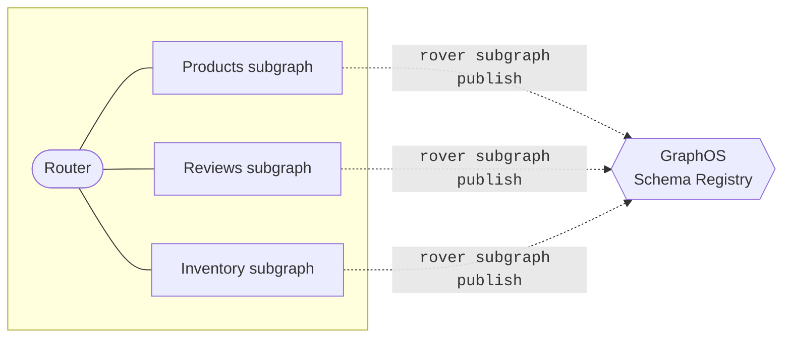

import ObtainGraphApiKey from '../../shared/obtain-graph-api-key.mdx';

This article describes how to connect your supergraph to [Apollo GraphOS](/graphos/) to enable managed federation features.

> As with all changes, you should first set up managed federation in a non-production environment, such as staging. To support this, you can create multiple [variants](/graphos/graphs/#variants) of your supergraph in GraphOS Studio. Each variant represents a distinct version of the same graph for different environments.

## 1. Get started

First, complete the **Set up Apollo tools** step from [this tutorial](/graphos/quickstart/self-hosted#1-set-up-apollo-tools), including:

- Creating an Apollo account
- Creating a graph in Studio
- Installing and authenticating the Rover CLI

## 2. Publish all subgraph schemas

In a supergraph architecture, each of your [subgraphs](../building-supergraphs/subgraphs-overview/) uses the Rover CLI to publish its schema to GraphOS:



**Do the following for each of your subgraphs**:

1. Obtain the following values, which are required for the `rover subgraph publish` command:

    * The name that uniquely identifies the subgraph within your graph (e.g., `products`).
    * The URL that your router will use to communicate with the subgraph (e.g., `http://products-graphql.svc.cluster.local:4001/`).

2. Run the `rover subgraph publish` command, providing it your subgraph's schema in one of the ways shown:

    ```bash
    # Provide a local .graphql file path
    rover subgraph publish my-graph@my-variant --name products --routing-url http://products-graphql.svc.cluster.local:4001/ --schema ./schema.graphql 

    # Provide an introspection result via stdin
    rover subgraph introspect http://localhost:4000 | rover subgraph publish my-graph@my-variant --name products --routing-url http://products-graphql.svc.cluster.local:4001/ --schema -
    ```

As you register your subgraph schemas, the schema registry attempts to **compose** their latest versions into a single **supergraph schema**. Whenever composition succeeds, your managed router can fetch the latest supergraph schema from GraphOS.

You can also manually fetch your latest supergraph schema with the `rover supergraph fetch` command, or retrieve it from your graph's **Schema > SDL** tab in GraphOS Studio.

## 3. Modify your router's startup command

<ExpansionPanel title="Using Apollo Gateway?">

If you've already set up Apollo Federation _without_ connecting your gateway to GraphOS, the constructor of your `ApolloGateway` instance probably includes a `supergraphSdl` option, like this:

```js {2}
const gateway = new ApolloGateway({
  supergraphSdl
});
```

This option is specific to _non_-managed federation, in which supergraph schema composition is performed via the Rover CLI.

With managed federation, composition can instead be performed by _GraphOS_, where the gateway regularly polls for an updated schema. This enables you to add, remove, and modify your subgraphs _without_ needing to restart your gateway.

To use managed federation, ensure your `ApolloGateway` constructor doesn't include the `supergraphSdl` argument:

```js
const gateway = new ApolloGateway();
```

When running your gateway in an environment where outbound traffic to the internet is restricted, consult the [directions for configuring a proxy](/apollo-server/security/proxy-configuration) within Apollo Server.

</ExpansionPanel>

If you've already set up Apollo Federation _without_ connecting your router to GraphOS, you're probably passing the [`--supergraph` (or `-s`) option](/router/configuration/overview/#-s----supergraph) to the Apollo Router's startup command:

```sh
./router --config ./router.yaml --supergraph ./your-local-supergraph.graphql
```

The `--supergraph` option applies in scenarios where the router doesn't retrieve the supergraph schema by polling Apollo Uplink. These include:

* **Enabling different deployment environments to refer to a single graph variant**, for example, for [blue-green deployment](./deployment/#example-blue-green-deployment): Use a workflow with the [Platform API](/graphos/platform-api/) to compose and retrieve the supergraph schema for each environment. This enables each environment's router to use the environment's supergraph schema, and then a single graph variant can capture and analyze the operations and traffic of either environment when deployed.

* **Unmanaged federation**: The Rover CLI composes the supergraph schema and passes the schema's file path to the router via the `--supergraph` option.

For other scenarios where the router retrieves the supergraph schema from Apollo Uplink, _remove_ the `--supergraph` option (but leave `--config` if it's present):

```sh
./router --config ./router.yaml
```

With federation managed by GraphOS, composition is performed when subgraph schemas are published, and the router regularly polls for an updated supergraph schema from Apollo Uplink. This enables you to add, remove, and modify your subgraphs _without_ needing to restart your router.


## 4. Connect your router to GraphOS

Like your subgraphs, your router uses a graph API key to identify itself to GraphOS.

<ObtainGraphApiKey />

After obtaining your graph API key, you set the following environment variables in your router's environment:

- `APOLLO_KEY` (set this to your graph API key)
- `APOLLO_GRAPH_REF`
    - This variable tells the router which variant of which graph to use (for example, `docs-example-graph@production`). You can find your variant's graph ref at the very top of its README page in GraphOS Studio.

## 5. Deploy the modified router

You can now deploy your modified router, which can either fetch its supergraph schema from GraphOS on startup or specify its supergraph schema for deployment in a particular environment. It can then begin executing operations across your subgraphs.
