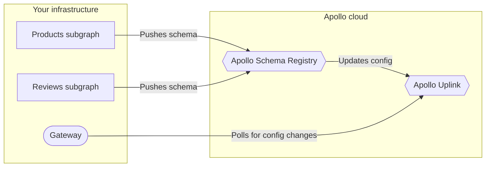

When using [managed federation](./overview/), your federated gateway regularly polls an endpoint called **Apollo Uplink** for its latest supergraph schema and other configuration:



To maximize uptime, Uplink is hosted simultaneously at _two_ endpoints, one in GCP and one in AWS:

* GCP: `https://uplink.api.apollographql.com/`
* AWS: `https://aws.uplink.api.apollographql.com/`

By default in versions of `@apollo/gateway` v0.45.0 and later, your gateway polls the GCP URL at a regular interval. Whenever a poll request fails, the gateway retries that request with the AWS URL. It continues swapping between the two URLs until the request succeeds, or until reaching the maximum number of retries.

Even if a poll request fails all retries, the gateway continues polling at the next interval, and it continues using its most recently obtained configuration.

> Verisons of `@apollo/gateway` prior to v0.45.0 don't support multiple Uplink endpoints and only use the GCP URL by default.

## Configuring polling behavior

You can configure the list of Uplink URLs your gateway uses, along with the number of retries it performs for a failed poll request.

### Uplink URLs

You can provide a custom list of URLs for the gateway to use when polling Uplink. For example, you can prioritize the AWS URL or omit one of the URLs entirely.

You can provide this list either in the `ApolloGateway` constructor or as an environment variable.

#### `ApolloGateway` constructor

Provide a custom list of Uplink URLs to the `ApolloGateway` constructor like so:

```js
const { ApolloGateway } = require('@apollo/gateway');

// ...

const gateway = new ApolloGateway({
  uplinkEndpoints: [
    'https://aws.uplink.api.apollographql.com/',
    'https://uplink.api.apollographql.com/'
  ]
});
```

This example swaps the priority of the two Uplink URLs, which means the gateway polls the AWS URL first.

Note that if you _also_ provide a list of endpoints via [environment variable](#environment-variable), the environment variable takes precedence.

#### Environment variable

You can provide a comma-separated list of Uplink URLs as the value of the `APOLLO_SCHEMA_CONFIG_DELIVERY_ENDPOINT` environment variable in your gateway's environment:

```bash
APOLLO_SCHEMA_CONFIG_DELIVERY_ENDPOINT=https://aws.uplink.api.apollographql.com/,https://uplink.api.apollographql.com/
```

This example swaps the priority of the two Uplink URLs, which means the gateway polls the AWS URL first.

### Retry limit

You can configure how many times your gateway retries a single failed poll request like so:

```js
const { ApolloGateway } = require('@apollo/gateway');

// ...

const gateway = new ApolloGateway({
  uplinkMaxRetries: 2
});
```

By default, the gateway retries a single poll request a number of times equal to three times the number of [Uplink URLs](#uplink-urls).

> Even if a poll request fails all retries, the gateway continues polling at the next interval, and it continues using its most recently obtained configuration.
