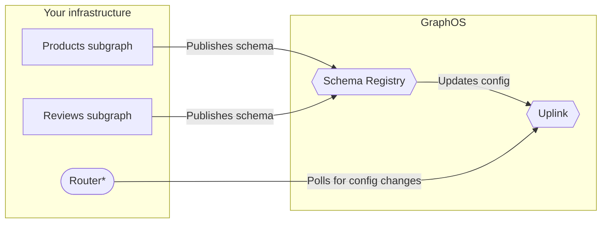

When using [managed federation](./overview/), your supergraph's router regularly polls an endpoint called **Apollo Uplink** for its latest supergraph schema and other configuration:



<p><sup>


*GraphOS can provision and host your supergraph's router if you create a [cloud supergraph](/studio/org/graphs/#cloud-supergraphs).

</sup></p>

To maximize uptime, Uplink is hosted simultaneously at _two_ endpoints, one in GCP and one in AWS:

* GCP: `https://uplink.api.apollographql.com/`
* AWS: `https://aws.uplink.api.apollographql.com/`

## Default polling behavior

By default, managed instances of the Apollo Router and `@apollo/gateway` poll Uplink every ten seconds. Every time your router polls, it cycles through Uplink endpoints in round-robin fashion.

Even if a particular poll request fails, the router continues polling as usual at the next interval. In the meantime, the router uses its most recent successfully obtained configuration.

> Versions of `@apollo/gateway` prior to v0.45.0 don't support multiple Uplink endpoints and only use the GCP endpoint by default.

## Configuring polling behavior

You can configure the following aspects of your router's polling behavior:

* The interval at which your router polls
* The number of retries your router performs for a failed poll request (`@apollo/gateway` only)
* The list of Uplink URLs your router uses

> You can't currently configure polling behavior for [cloud supergraphs](/studio/org/graphs/#cloud-supergraphs).

### Poll interval

#### With the Apollo Router

Provide the [`--apollo-uplink-poll-interval` command-line option](/router/configuration/overview#--apollo-uplink-poll-interval) on router startup.

#### With `@apollo/gateway`

You can configure the interval at which your gateway polls Apollo Uplink like so:

```js {6}
const { ApolloGateway } = require('@apollo/gateway');

// ...

const gateway = new ApolloGateway({
  pollIntervalInMs: 15000 // 15 seconds
});
```

The `pollIntervalInMs` option specifies the polling interval in milliseconds. This value must be at least `10000` (which is also the default value).

### Retry limit

#### With the Apollo Router

The Apollo Router does not retry Uplink poll requests that fail. Instead, it continues polling as usual at the next interval.

#### With `@apollo/gateway`

Whenever an Uplink poll request fails, the `@apollo/gateway` library can retry that request (cycling through Uplink URLs in round-robin fashion). The gateway continues retrying until one of the following occurs:

- A poll request succeeds. 
- The gateway reaches its defined maximum number of retries.

You can configure how many times your gateway retries a single failed poll request like so:

```js {6}
const { ApolloGateway } = require('@apollo/gateway');

// ...

const gateway = new ApolloGateway({
  uplinkMaxRetries: 2
});
```

By default, the gateway retries a single poll request a number of times equal to three times the number of [Uplink URLs](#uplink-urls-advanced) (this is almost always `6` times).

> Even if a particular poll request fails _all_ of its retries, the gateway continues polling as usual at the next interval (with its own set of retries if needed). In the meantime, the gateway continues using its most recently obtained configuration.

### Uplink URLs (advanced)

> ⚠️ Most routers never need to configure their list of Apollo Uplink URLs. Consult this section only if advised to do so.

You can provide a custom list of URLs for your router to use when polling Uplink.

#### With the Apollo Router

Provide the [`--apollo-uplink-endpoints` command-line option](/router/configuration/overview#--apollo-uplink-endpoints) on router startup.

#### With `@apollo/gateway`

You can provide this list either in the `ApolloGateway` constructor or as an environment variable.

##### `ApolloGateway` constructor

Provide a custom list of Uplink URLs to the `ApolloGateway` constructor like so:

```js {6-9}
const { ApolloGateway } = require('@apollo/gateway');

// ...

const gateway = new ApolloGateway({
  uplinkEndpoints: [
    // Omits AWS endpoint
    'https://uplink.api.apollographql.com/'
  ]
});
```

This example omits the AWS endpoint, which means it's never polled.

Note that if you _also_ provide a list of endpoints via [environment variable](#environment-variable), the environment variable takes precedence.

##### Environment variable

You can provide a comma-separated list of Uplink URLs as the value of the `APOLLO_SCHEMA_CONFIG_DELIVERY_ENDPOINT` environment variable in your gateway's environment:

```bash
APOLLO_SCHEMA_CONFIG_DELIVERY_ENDPOINT=https://aws.uplink.api.apollographql.com/,https://uplink.api.apollographql.com/
```

## Schema size limit

Supergraph schemas provided by Uplink cannot exceed 6MB in size. The _vast_ majority of supergraph schemas are significantly below this limit.

If your supergraph schema _does_ exceed 6MB, you can set up a [build status webhook](/studio/build-status-notification/) for your graph. Whenever you're notified of a successful supergraph schema composition, your webhook can fetch the latest supergraph schema via the Rover CLI.
