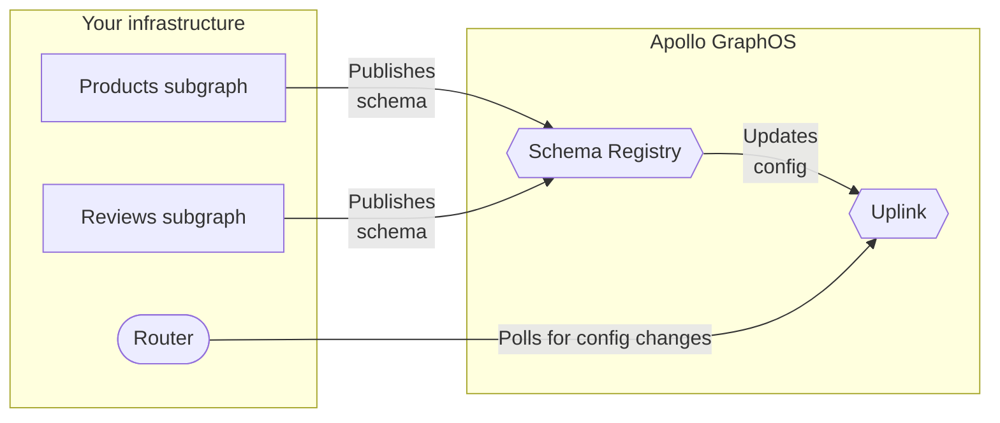

When using [managed federation](./overview/), your supergraph's router regularly polls an endpoint called **Apollo Uplink** for its latest supergraph schema and other configuration:



> Uplink also serves your router's **entitlement** if you're using [Enterprise features](/router/enterprise-features/).

To maximize uptime, Uplink is hosted simultaneously at _two_ endpoints, one in GCP and one in AWS:

- GCP: `https://uplink.api.apollographql.com/`
- AWS: `https://aws.uplink.api.apollographql.com/`

## Default polling behavior

### Apollo Router

If you use the Apollo Router with managed federation, by default it polls Uplink every ten seconds. Every time it does so, it cycles through Uplink endpoints in round-robin fashion.

Whenever a poll request times out or otherwise fails (the default timeout is thirty seconds), the router continues polling as usual at the next interval. In the meantime, it continues using its most recent successfully obtained configuration.

### `@apollo/gateway`

If you use the `@apollo/gateway` library with managed federation, by default your gateway polls Uplink every ten seconds. Every time it does so, it cycles through Uplink endpoints in round-robin fashion.

> Versions of `@apollo/gateway` prior to v0.45.0 don't support multiple Uplink endpoints and only use the GCP endpoint by default.

Whenever a poll request fails, the gateway retries that request (again, using round robin). It continues retrying until a request succeeds, or until reaching the defined maximum number of retries.

Even if a particular poll request fails _all_ of its retries, the gateway continues polling as usual at the next interval (with its own set of retries if needed). In the meantime, the gateway continues using its most recent successfully obtained configuration.

## Configuring polling behavior

You can configure the following aspects of your router's Uplink polling behavior:

- The interval at which your router polls (minimum ten seconds)
- The list of Uplink URLs your router uses
- The request timeout for each poll request (Apollo Router only)
  - For `@apollo/gateway`, this value is always thirty seconds.
- The number of retries performed for a failed poll request (`@apollo/gateway` only)
  - The Apollo Router does not perform retries for a failed poll request. It continues polling at the next interval.

### Apollo Router

You configure Uplink polling for the Apollo Router by providing certain command-line options when running the router executable. These options all start with `--apollo-uplink`.

[See the Apollo Router docs](/router/configuration/overview#--apollo-uplink-endpoints).

### `@apollo/gateway`

#### Retry limit

You can configure how many times your gateway retries a single failed poll request like so:

```js {6}
const { ApolloGateway } = require('@apollo/gateway');

// ...

const gateway = new ApolloGateway({
  uplinkMaxRetries: 2
});
```

By default, the gateway retries a single poll request a number of times equal to three times the number of [Uplink URLs](#uplink-urls-advanced) (this is almost always `6` times).

> Even if a particular poll request fails _all_ of its retries, the gateway continues polling as usual at the next interval (with its own set of retries if needed). In the meantime, the gateway continues using its most recently obtained configuration.

#### Poll interval

You can configure the interval at which your gateway polls Apollo Uplink like so:

```js {6}
const { ApolloGateway } = require('@apollo/gateway');

// ...

const gateway = new ApolloGateway({
  pollIntervalInMs: 15000 // 15 seconds
});
```

The `pollIntervalInMs` option specifies the polling interval in milliseconds. This value must be at least `10000` (which is also the default value).

#### Uplink URLs (advanced)

> ⚠️ Most gateways never need to configure their list of Apollo Uplink URLs. Consult this section only if advised to do so.

You can provide a custom list of URLs for the gateway to use when polling Uplink. You can provide this list either in the `ApolloGateway` constructor or as an environment variable.

##### `ApolloGateway` constructor

Provide a custom list of Uplink URLs to the `ApolloGateway` constructor like so:

```js {6-9}
const { ApolloGateway } = require('@apollo/gateway');

// ...

const gateway = new ApolloGateway({
  uplinkEndpoints: [
    // Omits AWS endpoint
    'https://uplink.api.apollographql.com/'
  ]
});
```

This example omits the AWS endpoint, which means it's never polled.

Note that if you _also_ provide a list of endpoints via [environment variable](#environment-variable), the environment variable takes precedence.

##### Environment variable

You can provide a comma-separated list of Uplink URLs as the value of the `APOLLO_SCHEMA_CONFIG_DELIVERY_ENDPOINT` environment variable in your gateway's environment:

```bash
APOLLO_SCHEMA_CONFIG_DELIVERY_ENDPOINT=https://aws.uplink.api.apollographql.com/,https://uplink.api.apollographql.com/
```

## Schema size limit

Supergraph schemas provided by Uplink cannot exceed 6MB in size. The _vast_ majority of supergraph schemas are well below this limit.

If your supergraph schema _does_ exceed 6MB, you can set up a [build status webhook](/graphos/notifications/build-status-notification/) for your graph. Whenever you're notified of a successful supergraph schema composition, your webhook can fetch the latest supergraph schema [via the Rover CLI](/rover/commands/supergraphs#supergraph-fetch).
