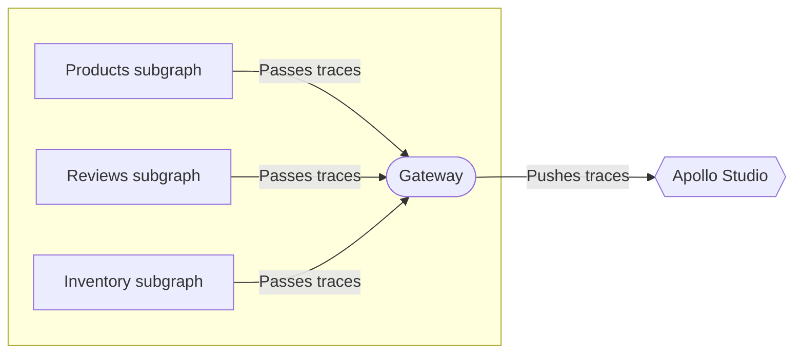

As with any distributed architecture, a federated graph introduces more complexity than its monolithic counterpart. To help address this complexity and improve reliability, you should make sure that your federated graph has proper observability, monitoring, and automation in place.

This article describes Apollo managed federation features that help you monitor and debug your graph.

## Metrics and observability

Federated graphs can push operation metrics to Apollo Studio to enable many powerful tools, including:

* Operation performance dashboards
* [Schema checks](https://www.apollographql.com/docs/studio/schema-checks/)
* [Performance alerts](https://www.apollographql.com/docs/studio/performance-alerts/) (paid and experimental)

With a federated graph, your subgraphs pass _trace data_ (timing and error information for each resolved schema field) to the gateway for every operation. The gateway then pushes that data to Studio:



> Individual subgraphs do _not_ push trace data directly to Studio.

Traces are displayed in Studio in the shape of the query plan, with each unique fetch to a subgraph reporting timing and error data.

Operation-level statistics are still collected for operations sent by clients, and those operations are validated as part of schema checks.

### Setup

To enable federated tracing, you [set the `APOLLO_KEY` environment variable](/apollo-server/monitoring/metrics/#connecting-to-graphos) in your _gateway's_ environment. Do not set this environment variable for your subgraph servers.

> If _other_ features require you to set `APOLLO_KEY` in your subgraph servers, [disable usage reporting](/apollo-server/api/plugin/usage-reporting/#disabling-the-plugin) in those servers.

Also ensure that all instances of Apollo Server in your graph are using an up-to-date version of the `@apollo/server` library.

## Inspecting your subgraphs

View basic details for the subgraphs that make up your federated graph with the [Rover CLI](https://www.apollographql.com/docs/rover/)'s `rover subgraph list` command:

```
$ rover subgraph list docs-example-graph@production

Listing subgraphs for docs-example-graph@production using credentials from the default profile.
┌──────────┬───────────────────────────────┬────────────────────────────┐
│  Name    │          Routing Url          │        Last Updated        │
├──────────┼───────────────────────────────┼────────────────────────────┤
│ products │ http://localhost:4001/graphql │ 2020-12-18 10:29:14 -08:00 │
├──────────┼───────────────────────────────┼────────────────────────────┤
│ reviews  │ http://localhost:4002/graphql │ 2020-12-18 10:28:59 -08:00 │
└──────────┴───────────────────────────────┴────────────────────────────┘

View full details at https://studio.apollographql.com/graph/docs-example-graph/service-list
```

This command includes a link to an Apollo Studio page that provides additional information about your subgraphs.

> If you're using the [Apollo CLI](https://www.apollographql.com/docs/devtools/cli/), run `apollo service:list` instead.
