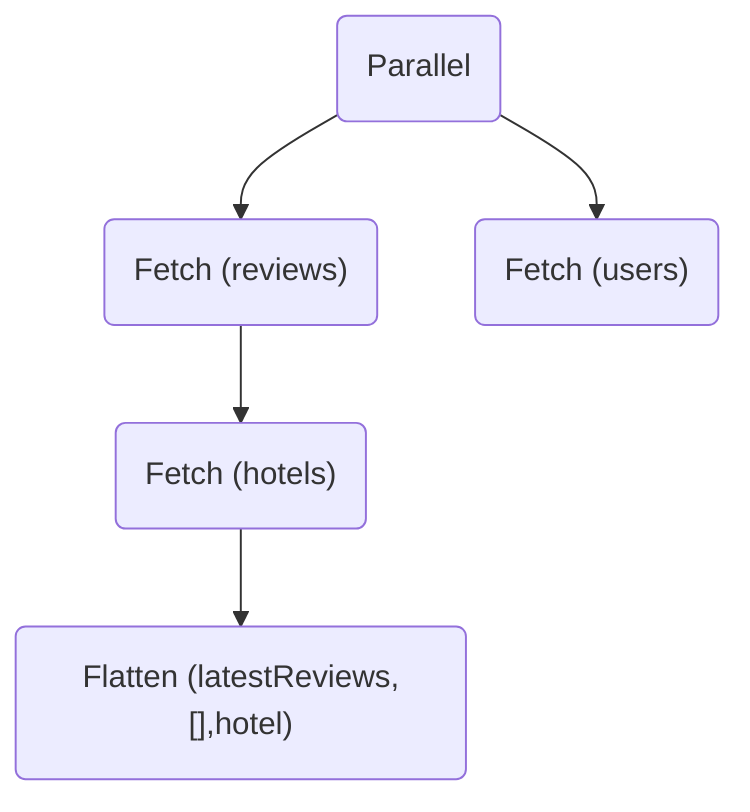

<Note>

Learn about query plans to help you debug advanced use cases of Apollo Federation.

Whenever your router receives an incoming GraphQL operation, it needs to figure out how to use your subgraphs to populate data for each of that operation's fields. To do this, the router generates a _query plan_:



A query plan is a blueprint for dividing a single incoming operation into one or more operations that are each resolvable by a single subgraph. Some of these operations depend on the results of other operations, so the query plan also defines any required ordering for their execution.

## Example graph

Let's say our federated supergraph includes these subgraphs:

<CodeColumns>

```graphql title="Hotels subgraph"
type Hotel @key(fields: "id") {
  id: ID!
  address: String!
}

type Query {
  hotels: [Hotel!]!
}
```

```graphql title="Reviews subgraph"
type Hotel @key(fields: "id") {
  id: ID! @external
  reviews: [Review!]!
}

type Review {
  id: ID!
  rating: Int!
  description: String!
}
```

</CodeColumns>

Based on these subgraphs, clients can execute the following query against our router:

```graphql
query GetHotels {
  hotels { # Resolved by Hotels subgraph
    id
    address
    reviews { # Resolved by Reviews subgraph
      rating
    }
  }
}
```

This query includes fields from both the Hotels subgraph and the Reviews subgraph. Therefore, the router needs to send at least one query to each subgraph to populate all requested fields.

Take a look at the router's query plan for this query:

<ExpansionPanel title="Click to expand">

```graphql
# Top-level definition
QueryPlan {
  # Indicates child nodes must be executed serially in order
  Sequence {
    # Execute the contained operation on the `hotels` subgraph
    Fetch(service: "hotels") {
      {
        hotels {
          id
          address
          __typename
        }
      }
    },
    # Merge the data from this contained Fetch with earlier data
    # from this Sequence, at the position indicated by `path`
    # (The @ path element indicates the previous element returns a list)
    Flatten(path: "hotels.@") {
      # Execute this operation on the `reviews` subgraph
      Fetch(service: "reviews") {
        # Use these fields as the representation of a Hotel entity
        {
          ... on Hotel {
            __typename
            id
          }
        } => # Populate these additional fields for the corresponding Hotel
        {
          ... on Hotel {
            reviews {
              rating
            }
          }
        }
      },
    },
  },
}
```

</ExpansionPanel>

This syntax probably looks confusing. 🤔 Let's break it down.

## Structure of a query plan

A query plan is defined as a hierarchy of _nodes_ that looks like a JSON or GraphQL document when serialized.

At the top level of every query plan is the `QueryPlan` node:

```graphql
QueryPlan {
  ...
}
```

Each node defined inside the `QueryPlan` node is one of the following:

| Node | Description |
|------|-------------|
| [`Fetch`](#fetch-node) | Tells the gateway to execute a particular operation on a particular subgraph. |
| [`Parallel`](#parallel-node) | Tells the gateway that the node's immediate children can be executed in parallel. |
| [`Sequence`](#sequence-node) | Tells the gateway that the node's immediate children must be executed serially in the order listed. |
| [`Flatten`](#flatten-node) | Tells the gateway to merge the data returned by this node's child `Fetch` node with data previously returned in the current `Sequence`. |

Each of these is described in further detail below.

### `Fetch` node

A `Fetch` node tells the router to execute a particular GraphQL operation on a particular subgraph. Every query plan includes at least one `Fetch` node.

```graphql
# Executes the query shown on the "books" subgraph
Fetch(service: "books") {
  {
    books {
      title
      author
    }
  }
},
```

The node's body is the operation to execute, and its `service` argument indicates which subgraph to execute the operation against.

In our [example graph](#example-graph) above, the following query requires data only from the Hotels subgraph:

```graphql
query GetHotels {
  hotels {
    id
    address
  }
}
```

Because this operation doesn't require orchestrating operations across multiple subgraphs, the entire query plan contains just a single `Fetch` node:

```graphql
QueryPlan {
  Fetch(service: "hotels") {
    {
      hotels {
        id
        address
      }
    }
  },
}
```

The `Fetch` node uses a special syntax when it's resolving a reference to an entity across subgraphs. For details, see [Resolving references with `Flatten`](#resolving-references-with-flatten).

### `Parallel` node

A `Parallel` node tells the router that all of the node's immediate children can be executed in parallel. This node appears in query plans whenever the router can execute completely independent operations on different subgraphs.

```graphql
Parallel {
  Fetch(...) {
    ...
  },
  Fetch(...) {
    ...
  },
  ...
}
```

For example, let's say our federated graph has a Books subgraph and a Movies subgraph. And let's say a client executes the following query to fetch separate lists of books and movies:

```graphql
query GetBooksAndMovies {
  books {
    id
    title
  }
  movies {
    id
    title
  }
}
```

In this case, the data returned by each subgraph does not depend on the data returned by any other subgraph. Therefore, the router can query both subgraphs in parallel.

The query plan for the operation looks like this:

<ExpansionPanel title="Click to expand">

```graphql {2}
QueryPlan {
  Parallel {
    Fetch(service: "books") {
      {
        books {
          id
          title
        }
      }
    },
    Fetch(service: "movies") {
      {
        movies {
          id
          title
        }
      }
    },
  },
}
```

</ExpansionPanel>

### `Sequence` node

A `Sequence` node tells the router that the node's immediate children must be executed serially in the order listed.

```graphql
Sequence {
  Fetch(...) {
    ...
  },
  Flatten(...) {
    Fetch(...) {
      ...
    }
  },
  ...
}
```

This node appears in query plans whenever one subgraph's response depends on data that first must be returned by another subgraph. This occurs most commonly when a query requests fields of an [entity](./entities/) that are defined across multiple subgraphs.

As an example, we can return to the `GetHotels` query from our [example graph](#example-graph):

```graphql
query GetHotels {
  hotels { # Resolved by Hotels subgraph
    id
    address
    reviews { # Resolved by Reviews subgraph
      rating
    }
  }
}
```

In our example graph, the `Hotel` type is an entity. `Hotel.id` and `Hotel.address` are resolved by the Hotels subgraph, but `Hotel.reviews` is resolved by the Reviews subgraph. And our Hotels subgraph needs to resolve first, because otherwise the Reviews subgraph doesn't know which hotels to return reviews for.

The query plan for the operation looks like this:

<ExpansionPanel title="Click to expand">

```graphql {2}
QueryPlan {
  Sequence {
    Fetch(service: "hotels") {
      {
        hotels {
          id
          address
          __typename
        }
      }
    },
    Flatten(path: "hotels.@") {
      Fetch(service: "reviews") {
        {
          ... on Hotel {
            __typename
            id
          }
        } =>
        {
          ... on Hotel {
            reviews {
              rating
            }
          }
        }
      },
    },
  },
}
```

</ExpansionPanel>

As shown, this query plan defines a `Sequence` that executes a `Fetch` on the Hotels subgraph before executing one on the Reviews subgraph. (We'll cover the `Flatten` node and the second `Fetch`'s special syntax next.)

### `Flatten` node

A `Flatten` node always appears inside a `Sequence` node, and it always contains a `Fetch` node. It tells the router to merge the data returned by its `Fetch` node with data that was previously `Fetch`ed during the current `Sequence`:

```graphql
Flatten(path: "hotels.@") {
  Fetch(service: "reviews") {
    ...
  }
}
```

The `Flatten` node's `path` argument tells the router at what position to merge the newly returned data with the existing data. An `@` element in a `path` indicates that the immediately preceding path element returns a list.

In the snippet above, the data returned by the `Flatten`'s `Fetch` is added to the `Sequence`'s existing data within the objects contained in the `hotels` list field.

#### Expanded example

Once again, let's return to the `GetHotels` query on our [example graph](#example-graph):

```graphql
query GetHotels {
  hotels { # Resolved by Hotels subgraph
    id
    address
    reviews { # Resolved by Reviews subgraph
      rating
    }
  }
}
```

The query plan for this operation first instructs the router to execute this query on the Hotels subgraph:

```graphql
{
  hotels {
    id
    address
    __typename # The router requests this to resolve references (see below)
  }
}
```

At this point, we still need review-related information for each hotel. The query plan next instructs the router to query the Reviews subgraph for a list of `Hotel` objects that each have this structure:

```graphql
{
  reviews {
    rating
  }
}
```

Now, the router needs to know how to merge these `Hotel` objects with the data it already fetched from the Hotels subgraph. The `Flatten` node's `path` argument tells it exactly that:

```graphql
Flatten(path: "hotels.@") {
  ...
}
```

In other words, "Take the `Hotel` objects returned by the Reviews subgraph and merge them with the `Hotel` objects in the top-level `hotels` field returned by the first query."

When the router completes this merge, the resulting data exactly matches the structure of the client's original query:

```graphql
{
  hotels {
    id
    address
    reviews {
      rating
    }
  }
}
```

#### Resolving references with `Flatten`

Like `Sequence` nodes, `Flatten` nodes appear whenever one subgraph's response depends on data that first must be returned by another subgraph. This almost always involves resolving entity fields that are defined across multiple subgraphs.

In these situations, the `Flatten` node's `Fetch` needs to resolve a reference to an entity before fetching that entity's fields. When this is the case, the `Fetch` node uses a special syntax:

```graphql
Flatten(path: "hotels.@") {
  Fetch(service: "reviews") {
    {
      ... on Hotel {
        _typename
        id
      }
    } =>
    {
      ... on Hotel {
        reviews {
          rating
        }
      }
    }
  },
}
```

Instead of containing a GraphQL operation, this `Fetch` node contains two GraphQL fragments, separated by `=>`.

- The first fragment is a representation of the entity being resolved (in this case, `Hotel`). [Learn more about entity representations](./entities/#2-define-a-reference-resolver).
- The second fragment contains the entity fields and subfields that the router needs the subgraph to resolve (in this case, `Hotel.reviews` and `Review.rating`).

When the router sees this special `Fetch` syntax, it knows to query a subgraph's [`Query._entities` field](./building-supergraphs/subgraphs-overview/#query_entities). This field is what enables a subgraph to provide direct access to any available fields of an entity.

Now that you've learned about each query plan node, take another look at the example query plan in [Example graph](#example-graph) to see how these nodes work together in a complete query plan.

## Viewing query plans

You can view the query plan for a particular operation in any of the following ways:

- [In the GraphOS Studio Explorer](/graphos/explorer/additional-features#query-plans-for-supergraphs)
    - Note that you must [register your federated graph](./managed-federation/setup/) with GraphOS to view query plans in the Explorer.
- As direct output from the `@apollo/gateway` library (see below)

### Outputting query plans with headers

With [the Apollo Router](/router/) v0.16.0+ and [`@apollo/gateway`](/apollo-server/using-federation/api/apollo-gateway/) v2.5.4+, you can pass the following headers to return the query plans in the GraphQL response extensions:

- Including the `Apollo-Query-Plan-Experimental` header returns the query plan in the response extensions
- Additionally including the `Apollo-Query-Plan-Experimental-Format` header with one of the supported options changes the output format:
  - A value of `prettified` returns a human-readable string  of the query plan
  - A value of `internal` returns a JSON representation of the query plan

### Outputting query plans with `@apollo/gateway`

Your gateway can output the query plan for each incoming operation as it's calculated. To do so, add the following to the file where you initalize your `ApolloGateway` instance:

1. Import the `serializeQueryPlan` function from the `@apollo/query-planner` library:

    ```js
    const {serializeQueryPlan} = require('@apollo/query-planner');
    ```

2. Add the `experimental_didResolveQueryPlan` option to the object you pass to your `ApolloGateway` constructor:

    ```js {2-6}
    const gateway = new ApolloGateway({
      experimental_didResolveQueryPlan: function(options) {
        if (options.requestContext.operationName !== 'IntrospectionQuery') {
          console.log(serializeQueryPlan(options.queryPlan));
        }
      }
    });
    ```

    The value you provide for this option is a function that's called every time the gateway generates a query plan. The example function above logs the generated query plan for every operation except for introspection queries (such as those sent periodically by tools like the GraphOS Studio Explorer). You can define any logic you want to log query plans or otherwise interact with them.

    For all available options passed to your function, [see the source](https://github.com/apollographql/federation/blob/21ea8d5e028050a546bfca3c8dd092be44b1aa07/gateway-js/src/config.ts#L16-L28).
