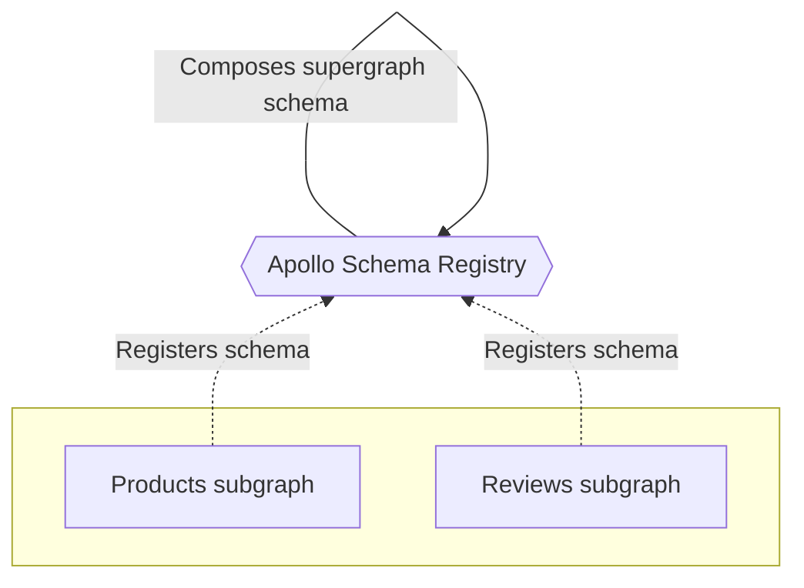
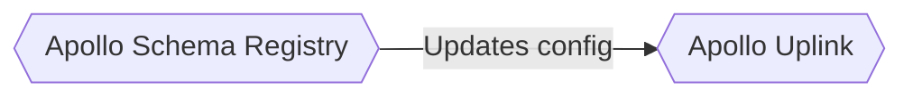
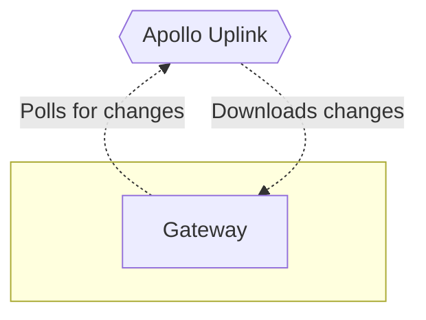

[Back in Part 1](./quickstart/), we created a federated gateway and used the Rover CLI to compose a supergraph schema for it based on two subgraphs. Next, we'll move that composition process into the cloud.

Our gateway currently loads its composed supergraph schema from a file on startup. This means that whenever the schema _changes_, the gateway needs to restart to load the new version.

We can avoid this downtime by instead composing our supergraph schema with **managed federation**, a free cloud-based service that's part of Apollo Studio.

## Managed federation basics

With managed federation, each of our subgraphs registers its schema with Apollo. Whenever a subgraph schema changes, Apollo composes a new supergraph schema.



Whenever composition succeeds, Apollo pushes an updated supergraph schema to the **uplink**, a special endpoint that gateways use to fetch their configuration:



Meanwhile, our gateway regularly polls the uplink for changes to its supergraph schema:



Whenever an update is available, the gateway downloads it and automatically begins using the new supergraph schema, _without_ requiring a restart.

We strongly recommended managed federation for reducing downtime in your production supergraph. Let's set it up!

## 1. Sign up for Apollo Studio

If you don't have an Apollo Studio account yet, let's create one.

Complete the first two steps of <a href="https://www.apollographql.com/docs/studio/getting-started/" target="_blank">Get started with Apollo Studio</a> (**Create your account** and **Create your first graph**), then return here.

> For future steps, you'll need the name of the graph you just created in Apollo Studio. Make sure to have it available.

## 2. Authenticate Rover with Apollo Studio

The Rover CLI includes commands for registering and fetching subgraph schemas from Apollo. To use these commands, you need to authenticate Rover with Apollo Studio.

Complete the first two steps of <a href="https://www.apollographql.com/docs/rover/configuring/" target="_blank">Configuring Rover</a> (**Obtain an API key** and **Provide the API key to Rover**), then return here.


## 3. Register subgraph schemas

Let's return to our Node.js project. We can now use Rover's `subgraph publish` command to register our subgraph schemas with Apollo.

Run the following from your project directory, **substituting your Studio graph's name where indicated**:

```shell
rover subgraph publish <GRAPH_NAME> \
  --routing-url https://rover.apollo.dev/quickstart/products/graphql \
  --schema ./products.graphql \
  --name products
```

> Technically, you don't provide the graph's _name_, but rather its **graph ref**. [Learn more.](https://www.apollographql.com/docs/rover/conventions/#graph-refs)

If the command is successful, you'll see output like the following:

```
A new subgraph called 'products' for the 'docs-example-graph' graph was created
The gateway for the 'docs-example-graph' graph was updated with a new schema, composed from the updated 'products' subgraph
```

Nice! If you open your graph's details in Studio now, you'll see types and fields from our `products` subgraph listed in the Schema tab.

Now, let's do the same thing for our `reviews` service, **again substituting your graph's name where indicated**:

```shell
rover subgraph publish <GRAPH_NAME> \
  --routing-url https://rover.apollo.dev/quickstart/reviews/graphql \
  --schema ./reviews.graphql \
  --name reviews
```

If you refresh the Schema tab in Studio, you'll now see types and fields from our `reviews` service as well.

Our supergraph schema has now been generated automatically by Apollo, but our _gateway_ doesn't know how to poll for it yet. Let's tackle that next.

## 4. Authenticate the gateway with Apollo Studio

Right now in `index.js`, we're providing our supergraph schema to our `ApolloGateway` via the `supergraphSdl` option. We don't need to do this anymore!

Replace the contents of `index.js` with the following:

```js title="index.js"
const { ApolloServer } = require('apollo-server');
const { ApolloGateway } = require('@apollo/gateway');

const gateway = new ApolloGateway();

const server = new ApolloServer({
  gateway,
});

server.listen().then(({ url }) => {
  console.log(`🚀 Gateway ready at ${url}`);
}).catch(err => {console.error(err)});
```

So now, how do we connect and authenticate our gateway with Apollo Studio? With a **graph API key** that we set as the value of an **environment variable**.

> **API keys are secret credentials.** Never share them outside your organization or commit them to version control. Delete and replace API keys that you believe are compromised.

1. Obtain a graph API key for your Studio graph by <a href="https://www.apollographql.com/docs/studio/api-keys/#graph-api-keys" target="_blank">following these steps</a>.  Copy its value.

    _If you have an Enterprise plan, set the API key's role to `Contributor`._

2. Create a new file named `.env` in your Node.js project folder.

3. Paste the following into `.env` and replace `YOUR_API_KEY` with your graph API key:

    ```shell
    APOLLO_KEY=YOUR_API_KEY
    ```

4. Add the `dotenv` Node.js library to your project:

    ```shell
    npm install dotenv
    ```

    This library takes care of reading environment variable values from your `.env` file.

5. Add the following line to the _very top_ of `index.js`:

  ```js
  require('dotenv').config()
  ```

6. Start up your gateway with `node index.js`. You'll see some extra output now:

    ```
    No graph variant provided. Defaulting to `current`.
    🚀 Gateway ready at http://localhost:4000/
    Apollo usage reporting starting! See your graph at https://studio.apollographql.com/graph/docs-example-graph/?variant=current
    ```

> By providing an API key to your gateway, you also automatically enable **federated trace reporting** to Apollo Studio, enabling you to view helpful performance metrics. [Learn more about federated traces.](./metrics/)

Now, [open up Apollo Sandbox in your browser again](https://studio.apollographql.com/sandbox). Sure enough, your supergraph schema's types and fields are all available, and you can execute test queries as before. But now, all of this information is coming from Apollo Studio.

## Moving forward

Nice work! We have two **subgraphs** registering their schemas with Apollo, and we have a **federated gateway** that then fetches the composed **supergraph schema**.

If we were now to register changes to one of our subgraph schemas, our running gateway would automatically fetch the corresponding changes to the supergraph schema.

Next, let's look at how to apply what we've learned to our own services. [Go to part 3.](./quickstart-pt-3/)
