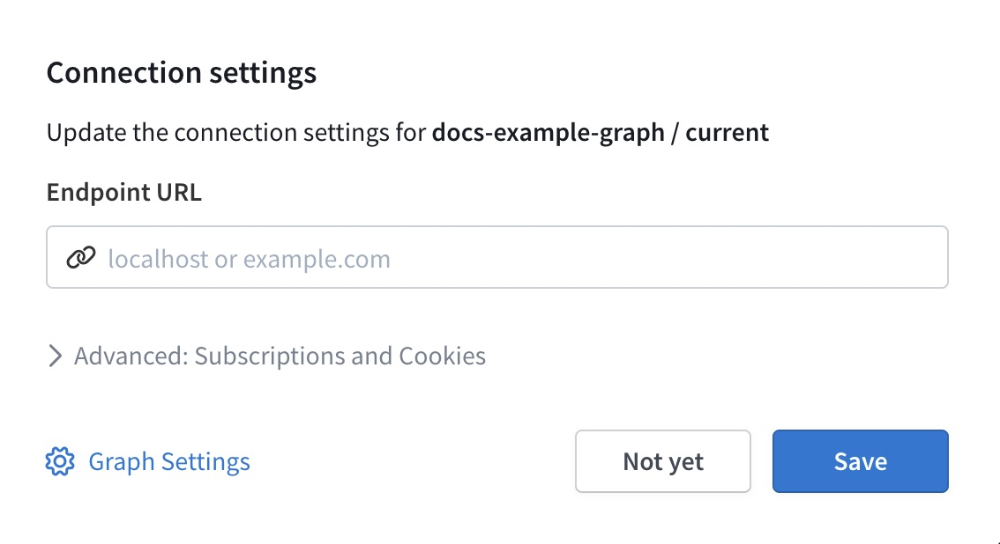

import {Button} from '@apollo/space-kit/Button';
import {Link} from 'gatsby';
import {ExpansionPanel} from 'gatsby-theme-apollo-docs';
import { VideoFrame } from 'gatsby-theme-apollo-docs';

> **Reminder:** This tutorial uses some Apollo tools and terminology that are still in **preview**, and therefore this content is not yet recommended for use in a production environment.

Thanks to our work in [Part 1](./quickstart/) and [Part 2](./quickstart-pt-2/), we have a federated gateway that fetches its supergraph schema from Apollo Studio.

Next, let's take a look at what else Apollo Studio can do for our federated graph.

## 1. Build queries with the Explorer

The Apollo Studio Explorer is a powerful web IDE for creating, running, and managing GraphQL operations:

<VideoFrame src="https://www.youtube.com/embed/j8b0Bda_TIw"/>

Let's try it out! Go to [Apollo Studio](https://studio.apollographql.com/) and open your graph's **Explorer** tab.

Because you've registered your subgraphs with Apollo, the Explorer knows about all of your supergraph schema's types and fields.

Paste the following query into the Operations editor and try to run it:

```graphql
query GetBestSellers {
  bestSellers {
    id
    title
  }
}
```

The following dialog appears, because the Explorer doesn't know where your gateway is running:



The Explorer can connect to a gateway running at any URL that's accessible from your browser, including `localhost`. Make sure your gateway is running locally and enter `http://localhost:4000` as the Endpoint URL. Then click **Save**.

Now try running the query again. This time, results appear in the right-hand panel like you'd expect!

[Learn more about the Explorer](https://www.apollographql.com/docs/studio/explorer/)

## 1. Report metrics and operations from your subgraph servers.

To take advantage of Studio’s observability and delivery capabilities you must enable request tracing.

Apollo Studio can ingest operation **traces** from your GraphQL server to provide performance metrics for your data graph. A trace corresponds to the execution of a single GraphQL operation, including a breakdown of the timing and error information for each field that's resolved as part of the operation.

Trace reporting enables you to visualize:

* Which operations are being executed
* Which clients are executing which operations
* Which parts of the schema are used most
* Which of your resolvers in the server are acting as bottlenecks

### Pushing traces from Apollo Server


## Step 8: Test a change against actual traffic with Checks!

Now that your graph is live and serving traffic, you want to be careful about any changes you make - you don’t want to make a breaking change! This is why we offer Operation Checks.

> Schema checks require a [paid plan](https://www.apollographql.com/pricing).

Before you [publish subgraph schema changes to Apollo Studio](#publishing-a-subgraph-schema-to-apollo-studio), you can [check those changes](https://www.apollographql.com/docs/studio/schema-checks/) to confirm that you aren't introducing breaking changes to your application clients.

To do so, you can run the `subgraph check` command:


```shell
# using a schema file
rover subgraph check my-graph@my-variant --schema ./schema.graphql --name accounts

# using piped input to stdin
rover subgraph introspect http://localhost:4000 \
  | rover subgraph check my-graph@my-variant \
  --schema - --name accounts
```

As shown, arguments and options are similar to [`subgraph publish`](#publishing-a-subgraph-schema-to-apollo-studio).

## Step 9: Set up CI/CD integration

You can use Rover in any CI/CD environment that uses a Rover-supported operating system (Linux, MacOS, or Windows). Most commonly, this is to run [schema checks](https://www.apollographql.com/docs/studio/schema-checks/) with [`rover graph check`](./graphs/#checking-schema-changes) or [`rover subgraph check`](./subgraphs/#checking-subgraph-schema-changes).

Rover can be installed like many other CLI tools, but the installation method varies depending on which provider you're using. We've included instructions for two of the most common CI/CD providers, [CircleCI](https://circleci.com/) and [GitHub Actions](https://github.com/features/actions).


> If you're using Rover with a CI/CD provider not listed here, we'd love for you to share the steps by opening an [issue](https://github.com/apollographql/rover/issues/new/choose) or [pull request](https://github.com/apollographql/rover/compare)!

### CircleCI 

#### Linux jobs using the `curl` installer

Normally, when installing, Rover adds the path of its executable to your `$PATH`. CircleCI, however, doesn't use the `$PATH` variable between run `step`s, so if you were to just install Rover and try to run it in the next step, you'd get a `command not found: rover` error.

To fix this, you can modify the `$PATH` and append it to [`$BASH_ENV`](https://circleci.com/docs/2.0/env-vars/#setting-an-environment-variable-in-a-shell-command). `$BASH_ENV` is executed at the beginning of each step, allowing any changes added to it to be run across steps. You can add rover to your `$PATH` using `$BASH_ENV` like this:

```bash
echo 'export PATH=$HOME/.rover/bin:$PATH' >> $BASH_ENV
```

Once installed and the `$BASH_ENV` has been modified, rover should work like normal. Dont forget, since the `rover config auth` command is interactive, you'll need to [auth using an environment variable](./configuring#with-an-environment-variable) in your project settings.

##### Full example

```yaml
# Use the latest 2.1 version of CircleCI pipeline process engine. See: https://circleci.com/docs/2.0/configuration-reference
version: 2.1

jobs:
  build:
    docker:
      - image: cimg/node:15.11.0        
    steps:
      - run:
          name: Install
          command: |
            # download and install Rover
            curl -sSL https://raw.githubusercontent.com/apollographql/rover/v0.0.6/installers/binstall/scripts/nix/install.sh | sh
            
            # This allows the PATH changes to persist to the next `run` step
            echo 'export PATH=$HOME/.rover/bin:$PATH' >> $BASH_ENV
      - checkout
      # after rover is installed, you can run it just like you would locally!
      - run: rover graph check my-graph@prod --schema ./schema.graphql
```

### GitHub Actions

#### Linux/MacOS jobs using the `curl` installer

Normally, when installing, Rover adds the path of its executable to your `$PATH`. Github Actions, however, doesn't use the `$PATH` variable between `step`s, so if you were to just install Rover and try to run it in the next step, you'd get a `command not found: rover` error.

To fix this, you can append Rover's location to the [`$GITHUB_PATH`](https://docs.github.com/en/actions/reference/workflow-commands-for-github-actions#adding-a-system-path) variable. `$GITHUB_PATH` is similar to your system's `$PATH` variable, and things added to the `$GITHUB_PATH` can be used across multiple steps. You can modify it like this:

```bash
echo "$HOME/.rover/bin" >> $GITHUB_PATH
```

Because the `rover config auth` command is interactive, you'll need to [auth using an environment variable](./configuring#with-an-environment-variable) in your project settings. GitHub actions uses [project environments](https://docs.github.com/en/actions/reference/environments) to set up secret environment variables. In your action, you choose a `build.environment` by name and set `build.env` variables using the saved secrets.

The following example is full example script, showing how to choose an `apollo` environment, and set an `APOLLO_KEY` variable.


##### Full example

```yaml
# .github/workflows/check.yml

name: Check Schema

# Controls when the action will run. Triggers the workflow on push or pull request events
on: [push, pull_request]

# A workflow run is made up of one or more jobs that can run sequentially or in parallel
jobs:
  # This workflow contains a single job called "build"
  build:
    # The type of runner that the job will run on
    runs-on: ubuntu-latest

    # https://docs.github.com/en/actions/reference/environments
    environment: apollo

    # https://docs.github.com/en/actions/reference/encrypted-secrets
    # https://docs.github.com/en/actions/reference/workflow-syntax-for-github-actions#jobsjob_idstepsenv
    env:
      APOLLO_KEY: ${{ secrets.APOLLO_KEY }}

    # Steps represent a sequence of tasks that will be executed as part of the job
    steps:
      # Checks-out your repository under $GITHUB_WORKSPACE, so your job can access it
      - uses: actions/checkout@v2

      - name: Install Rover
        run: |
          curl -sSL https://raw.githubusercontent.com/apollographql/rover/v0.0.6/installers/binstall/scripts/nix/install.sh | sh
          
          # Add Rover to the $GITHUB_PATH so it can be used in another step
          # https://docs.github.com/en/actions/reference/workflow-commands-for-github-actions#adding-a-system-path
          echo "$HOME/.rover/bin" >> $GITHUB_PATH
      - name: Run check against prod
        run: |
          rover graph check my-graph@prod --schema ./test.graphql

```

### Using With `npm`/`npx`

If you're running in a Node.js workflow, it may be easier to just use the NPM distribution of [Rover](https://www.npmjs.com/package/@apollo/rover). The advantages of doing this are that you won't need to adjust the PATH at all to run Rover, and it may fit better into your existing workflow.

You can use Rover by adding it to your `package.json` dependencies using [these instructions](./getting-started#npm-installer) and then execute it using npm scripts, similar to other workflows you may already have. If you don't want to install rover as a dependency, you can run Rover with `npx` by using the `-p` flag:

```bash
npx -p @apollo/rover rover graph check my-graph@prod --schema=./schema.graphql
```

Since most commands require you be authenticated, see the above sections for instructions on how to add environment variables for your CI/CD provider.

## 10. Advanced configuration for checks

To configure the behavior of schema checks (such as the time range of past operations to check against), see the [documentation for schema checks](https://www.apollographql.com/docs/studio/check-configurations/#using-apollo-studio-recommended).

## 11. Check and push a change through GitHub!

**TODO: flesh this out**

Open a PR in GitHub -> check

See Checks in GH

View Checks in Studio

Merge PR -> push

View History in Studio
