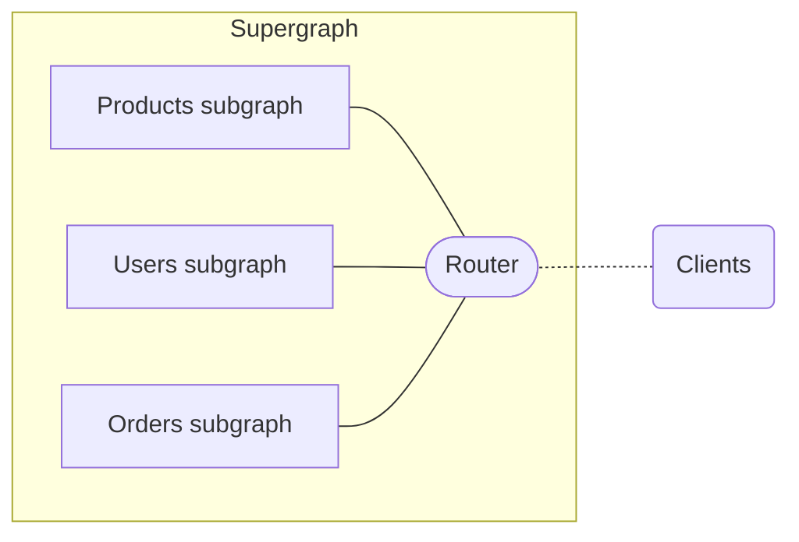
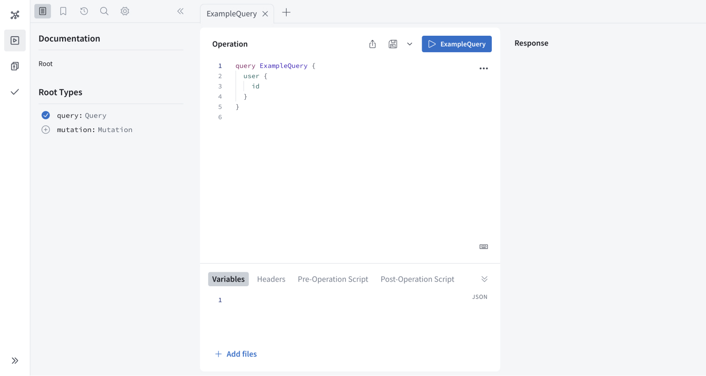
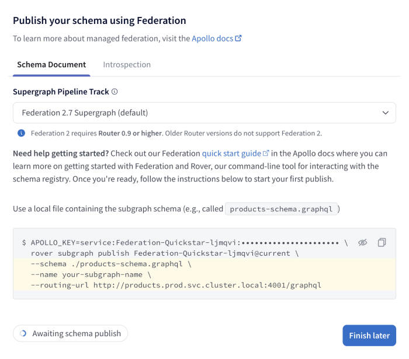
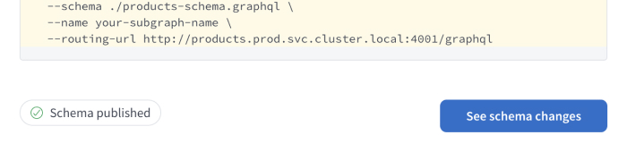
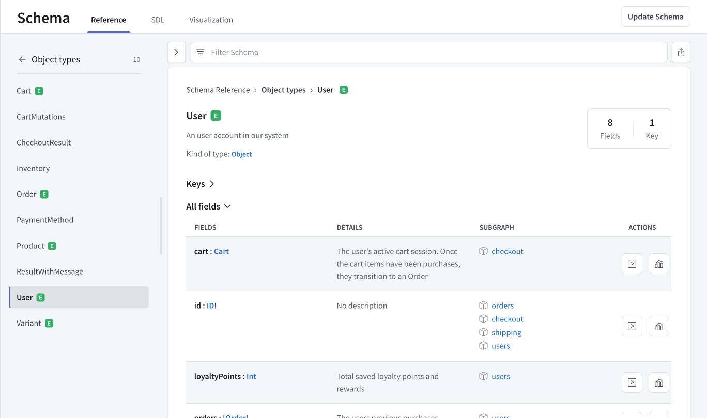
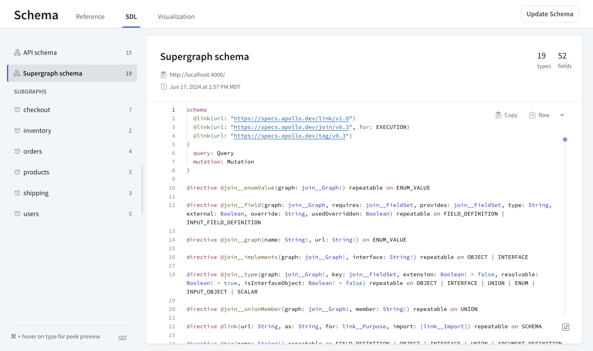
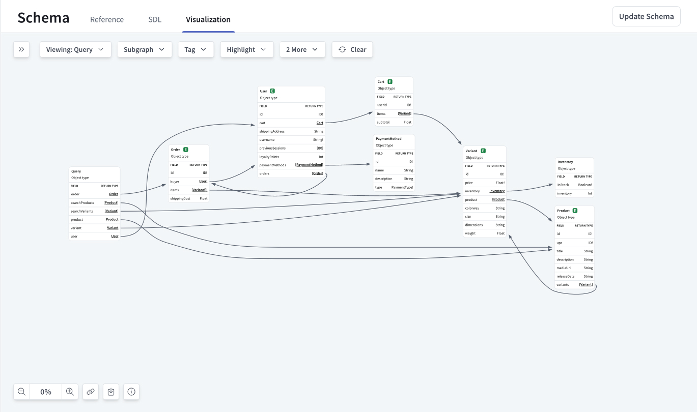
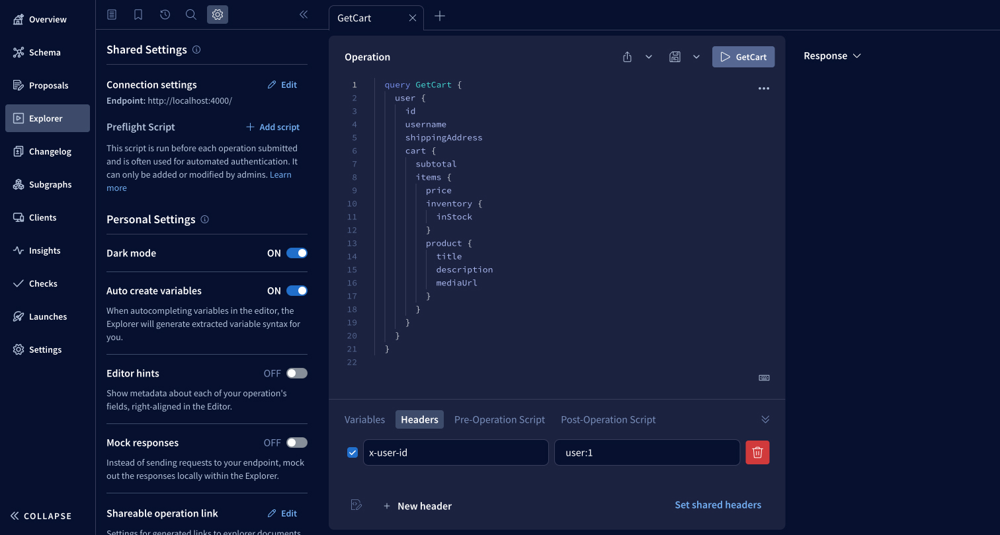
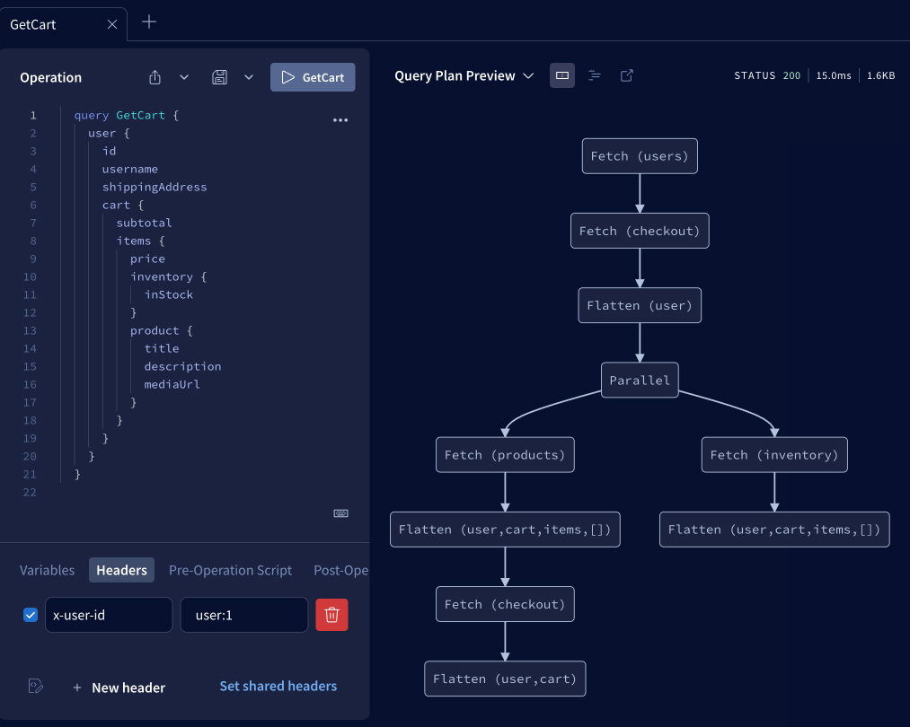
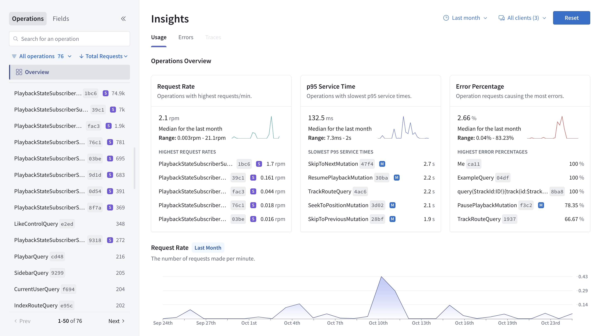

Apollo Federation combines microservices into a unified GraphQL API, enabling real-time access to all your data sources for all your client applications.
At the end of this quickstart, you will have set up a queryable federated GraphQL API that integrates data from product, user, and order services using a retail demo supergraph.

To learn more about Apollo Federation and the benefits of using it with GraphOS, check out these resources:

- [Introduction to Apollo Federation](./)
- [Introduction to GraphOS](/graphos)

## Prerequisites

To complete this quickstart, you must have the following:

- A [GraphOS Studio](https://studio.apollographql.com/?referrer=docs-content) account
- A local version of Apollo's retail demo supergraph
  - Download or clone it from its [GitHub repository](https://github.com/apollosolutions/retail-supergraph)
- The latest LTS version of [Node](https://nodejs.org/en)

If you haven't already, set these up before continuing.

## Overview

Setting up a federated GraphQL API with GraphOS takes a few steps:

1. Install the Rover CLI.
2. Start local development.
3. Publish your subgraphs.
4. Query your supergraph.

### Step 1. Install the Rover CLI

_Rover_ is Apollo's CLI for managing all kinds of graphs, including subgraphs and supergraphs. You'll use it throughout this quickstart.

<Note>

Even if you already have Rover installed, update your version by completing this step.

</Note>

Install the latest Rover release with the appropriate command for your system:

```bash title="MacOS / Unix-like" showLineNumbers=false
curl -sSL https://rover.apollo.dev/nix/latest | sh
```

```bash title="Windows" showLineNumbers=false
iwr 'https://rover.apollo.dev/win/latest' | iex
```

After installing, run `rover -V` in your terminal to confirm that it installed successfully.
Verify that the printed version number matches the [latest release](https://github.com/apollographql/rover/releases).
If it doesn't, you might need to manually delete a previous outdated installation.

You've now installed Rover and are ready to start local development with your supergraph!

### Step 2. Start local development

Running a supergraph entails running its _router_.
The router is the single access point for clients to your supergraph.
It receives incoming operations and intelligently routes them across component services before returning a unified response. 



In this step, you'll do the following:

1. Locally run the subgraphs.
2. Locally run your router.
3. Query your router to ensure it's working as expected.

#### Run subgraphs

To start local development, you must first get the subgraphs in the [retail demo supergraph](https://github.com/apollosolutions/retail-supergraph) up and running.
From the root directory, install dependencies:

```bash showLineNumbers=false
npm install
```

Then run the subgraphs:

```bash showLineNumbers=false
npm run dev:subgraphs
```

In your terminal, you should see notifications for each subgraph:

```bash showLineNumbers=false disableCopy=true
Setting up [products] subgraph at http://localhost:4001/products/graphql
Setting up [orders] subgraph at http://localhost:4001/orders/graphql
Setting up [users] subgraph at http://localhost:4001/users/graphql
...
```

Keep these subgraphs up and running so that the router can query them.

#### Run router

With your subgraphs running, you can use Rover to start the router locally.
To do so, use the `rover dev` command with the `--supergraph-config` option to provide the router's configuration.

The retail demo supergraph comes with a  `supergraph-config-dev.yaml` YAML configuration file that includes subgraph names, URLs, and schemas for the retail demo supergraph.

In a separate terminal window from the one where you ran `npm run dev:subgraphs`, run this command:

```bash showLineNumbers=false
rover dev --supergraph-config supergraph-config-dev.yaml
```

When you first start the `rover dev` process, you'll see the following steps happening in the terminal:

- Rover obtains the provided subgraph schemas and starts sessions for each of them.
- Rover uses Apollo Federation to compose a supergraph schema from the subgraph schemas.
- Rover starts a locally running router session and provides it with the supergraph schema.
- Rover starts watching the provided subgraph schema for changes. It recomposes the supergraph schema whenever it detects one. Recomposition automatically reloads the router.

Congrats! You've now got a supergraph running locally.

#### Query your router

To ensure everything works as expected, you can query your router in the Apollo Sandbox that Rover automatically starts up.

1. Open [localhost:4000](http://localhost:4000/) in a browser to access your locally running router. It should look something like this:

  

2. Run the following query by copying and pasting it into the **Operation** window:

```graphQL showLineNumbers=false
query ListAllProducts {
  id
  title
  description
  mediaUrl
  variants {
    id
    price
  }
}
```

3. Confirm that once you run the operation, you see the following response in the right window:

  <ExpansionPanel title="Click to see response">

  ```JSON showLineNumbers=false disableCopy=true
  {
    "data": {
      "to":"do"
    }
  }
  ```

  </ExpansionPanel>

Next, you'll publish your locally running subgraph schemas to Studio to make your supergraph externally accessible.

### Step 3. Publish your subgraphs

In a federated architecture, multiple services are _composed_ into a single federated supergraph.
The supergraph schema combines all subgraph schemas plus some special federation-specific metadata.

To create the supergraph schema, you individually publish each subgraph schema to GraphOS. 
Whenever you publish a subgraph schema, GraphOS attempts to compose all the latest subgraph schemas into a single supergraph schema.
If this composition succeeds, GraphOS updates your router with the result.

In this step, you'll create an empty supergraph in GraphOS Studio and then publish subgraph schemas to it using Rover.

#### Create supergraph

1. Go to [studio.apollographql.com](https://studio.apollographql.com/?referrer=docs-content) and click **+ Create New Graph**.
2. Enter a **Graph title**, for example `Federation Quickstart`. Leave the **Graph Architecture** as `Supergraph (Default)` and **Visible to Team Members** as `On`. Click **Next**.
3. A **Publish your schema using Federation** dialog appears. Copy the example code block to a local text file.
  - The protected value that appears after `APOLLO_KEY=` and beginning with `service:` is your graph API key.
  - The value that appears after `rover subgraph publish` is your graph ref. By default, it ends with `@current`.

    

    <Caution>

      API keys are secret credentials. Never share them outside your organization or commit them to version control. Delete and replace API keys that you believe are compromised.

    </Caution>

4. Leave the window open; you'll complete the setup with Rover.

#### Publish subgraph schemas

Assuming you're using the retail demo supergraph and running its subgraphs locally, you can use the following Rover commands.

1. Take the example code block you copied from Studio and replace the last three lines with the following:

    ```bash showLineNumbers=false
        --schema ./subgraphs/products/schema.graphql \
        --name products \
        --routing-url http://localhost:4001/products/graphql
    ```

    It should look something like this, with the `<GRAPH_API_KEY>` and `<GRAPH_REF>` replaced with your graph's values.

    ```bash showLineNumbers=false
    APOLLO_KEY=service:<GRAPH_API_KEY> \
    rover subgraph publish <GRAPH_REF> \
    --schema ./subgraphs/products/schema.graphql \
    --name products \
    --routing-url http://localhost:4001/products/graphql
    ```

2. In a new terminal window, paste and run your multi-line command.
    - Because the command provides a `localhost` address for the `routing-url`, the terminal will confirm that you want to publish. Enter `Y`.
    - If the command is successful, you'll see the following in your terminal:

      ```bash showLineNumbers=false disableCopy=true
      A new subgraph called 'products' was created in <GRAPH_REF>
      The supergraph schema for <GRAPH_REF> was updated,
      composed from the updated 'products' subgraph
      ```

    - After a few moments, the GraphOS Studio dialog you left open will show **Schema published** on the bottom left.

    

4. Run the `rover subgraph publish` command for the `inventory` subgraph, substituting your graph ref. You no longer need to include the first line containing your graph API key:

    ```bash showLineNumbers=false
    rover subgraph publish <GRAPH_REF> \
    --schema ./subgraphs/inventory/schema.graphql \
    --name inventory \
    --routing-url http://localhost:4001/inventory/graphql

5. Do the same for the `orders` subgraph, substituting your graph ref:

    ```bash showLineNumbers=false
    rover subgraph publish <GRAPH_REF> \
    --schema ./subgraphs/orders/schema.graphql \
    --name orders \
    --routing-url http://localhost:4001/orders/graphql
5. Do the same for the `users` subgraph, substituting your graph ref:
    ```bash showLineNumbers=false
    rover subgraph publish <GRAPH_REF> \
    --schema ./subgraphs/users/schema.graphql \
    --name users \
    --routing-url http://localhost:4001/users/graphql

6. Do the same thing for the `shipping` subgraph, substituting your graph ref:

    ```bash showLineNumbers=false
    rover subgraph publish <GRAPH_REF> \
    --schema ./subgraphs/shipping/schema.graphql \
    --name shipping \
    --routing-url http://localhost:4001/shipping/graphql
7. Do the same thing for the `checkout` subgraph, substituting your graph ref:
    ```bash showLineNumbers=false
    rover subgraph publish <GRAPH_REF> \
    --schema ./subgraphs/checkout/schema.graphql \
    --name checkout \
    --routing-url http://localhost:4001/checkout/graphql

Now, if you open the **Schema** page from the left nav in [Studio](https://studio.apollographql.com/?referrer=docs-content), you'll see all the subgraphs you've published.

  - The **Reference** tab lets you filter your schema's type and field definitions.
    
  - The **SDL** tab displays your supergraph's API schema and supergraph schema, filterable by subgraph.

    

  - The **Visualization** tab provides a filterable, navigable, graphical representation of your schema.

  

The retail demo supergraph contains other subgraphs—for example, `reviews` and `discovery` subgraphs.
The sample query in the next and final step only requires the subgraphs in the instructions, but you can publish the others to your supergraph if you want to explore their schemas and data.

### Step 4. Query your supergraph

Once you've published subgraphs and GraphOS has successfully composed your supergraph schema, you can execute queries against your supergraph. To do that, you'll use the GraphOS Studio Explorer.
The Explorer is a GraphQL IDE that provides visibility into your supergraph's entire schema and helps you build, run, and understand queries.
Querying in the Explorer may not feel that different from running the query in the Sandbox.
Sandbox has many of the same features as Explorer, such as running operations and inspecting their query plans.
Running operations on a published supergraph from the Explorer has the additional benefit of collecting and visualizing metrics on your operations.
You'll see these in action by running the sample query below.

1. In [GraphOS Studio](https://studio.apollographql.com/?referrer=docs-content), open the **Explorer** page from the left navigation.
2. Open the **Settings** tab and click **Edit** next to **Connection settings**. Enter `http://localhost:4000/` as your supergraph's **Endpoint**.
3. Copy and paste the following query into the **Operation** window, but do not run it.
  ```graphql showLineNumbers=false
  # Get the current user's cart with all the items and their product info as well as the price.
  query GetCart {
    user {
      id
      username
      shippingAddress
      cart {
        subtotal
        items {
          price
          inventory {
            inStock
          }
          product {
            title
            description
            mediaUrl
          }
        }
      }
    }
  }
  ```
  This operation retrieves a particular user's shopping cart given the user's. The operation expects the user ID to be in the request header. You can inlude request headers in the Explorer by doing the following:
    - Open the **Header** tab below **Operation**.
    - Click **+New header++**.
    - Enter `x-user-id` as the **header key** and `user:1` as the **value**.
  
  
4. Run the request by clicking the play button, now labeled **GetCart**, in the top right of the **Operation** window.
5. In the **Response** window, confirm you see the following response.
  <ExpansionPanel title="Click to see response">
  ```JSON showLineNumbers=false disableCopy=true
  {
    "data": {
      "to":"do"
    }
  }
  ```
  </ExpansionPanel>
#### Inspect query plans
The previous sample operation is powerful because it gathers data across various subgraphs: `users`, `products`, `inventory`, and more. The Explorer displays **Query Plan Previews** in the right panel to help you understand how the router intelligently orchestrates subrequests to these subgraphs.
A query plan is a blueprint for dividing a single incoming operation into one or more operations that are each resolvable by a single subgraph.
You can toggle to view the query plan instead of the response by clicking **Response** and selecting **Query Plan Preview**.

As you edit an operation, the Explorer recalculates its query plan accordingly.
#### Collect and visualize metrics
Operations you run in the Explorer are sent to the GraphOS Router that sits in front of your federated API.
The router automatically collects metrics on those operations and their fields. You can then visualize those metrics in Studio.
Go to your variant's **Insights** page, which looks something like this:

The **Insights** page should already display the `GetCart` operation you executed in the Explorer.
As your router receives more requests, they will appear here as well.
After you update your clients to query your router, this page becomes vital to monitoring your supergraph's performance.
## Next steps
Depending on your goals, you have several options for moving your supergraph closer to production or learning more about GraphOS Studio's capabilities:
- Learn about the available GraphOS insights in the [metrics and reporting documentation](/graphos/metrics).
- Learn more about Studio features, including [schema visualization](/graphos/graphs/studio-features#the-schema-page), [proposals](/graphos/delivery/schema-proposals), and [checks](/graphos/delivery/schema-checks).
- Check out the [`rover template`](/rover/commands/template) command to quickly start a new GraphQL project or explore various subgraph implementations.