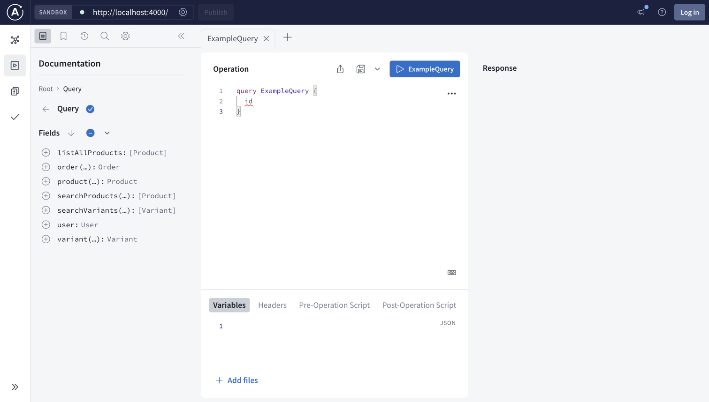

Apollo Federation streamlines the integration of microservices, enabling real-time access to your data sources for all your client applications.
At the end of this quickstart, you will have set up a federated GraphQL API that integrates data from product, user, and order services using a demo retail supergraph.

To learn more about Apollo Federation and the benefits of using it with GraphOS, check out these resources:

- [Introduction to Apollo Federation](./)
- [Introduction to GraphOS](/graphos)

## Prerequisites

To complete this quickstart, you must have the following:

- A [GraphOS Studio](https://studio.apollographql.com/?referrer=docs-content) account
- A local version of Apollo's retail demo supergraph
  - Download or clone it from its [GitHub repository](https://github.com/apollosolutions/retail-supergraph)
- The latest LTS version of [Node](https://nodejs.org/en)

If you haven't already, set these up before continuing.

## Overview

Setting up a federated GraphQL API with GraphOS takes a few steps:

1. Install and authenticate the Rover CLI.
2. Start local development.
3. Publish your subgraphs.
4. Query your supergraph.

### Step 1. Install and authenticate the Rover CLI

_Rover_ is Apollo's CLI for managing all kinds of graphs, including subgraphs and supergraphs. You'll use it throughout this quickstart.
In this step you both install and authenticate Rover with your GraphOS account.

#### Install Rover

<Note>

Even if you already have Rover installed, update your version by completing this step.

</Note>

Install the latest Rover release with the appropriate command for your system:

```bash title="MacOS / Unix-like" showLineNumbers=false
curl -sSL https://rover.apollo.dev/nix/latest | sh
```

```bash title="Windows" showLineNumbers=false
iwr 'https://rover.apollo.dev/win/latest' | iex
```

After installing, run `rover -V` in your terminal to confirm that it installed successfully.
Verify that the printed version number matches the [latest release](https://github.com/apollographql/rover/releases).
If it doesn't, you might need to manually delete a previous outdated installation.

#### Authenticate Rover

To use the Rover CLI to manage graphs in GraphOS Studio, you first need to authenticate it.
This entails obtaining an API key from Studio and providing it to Rover.

<Caution>

API keys are secret credentials. Never share them outside your organization or commit them to version control. Delete and replace API keys that you believe are compromised.

</Caution>

1. Go to [studio.apollographql.com](https://studio.apollographql.com/?referrer=docs-content) and click **+Create New Graph**.
2. Enter a **Graph title**, for example `Federation Quickstart`. Leave the **Graph Architecture** set to `Supergraph (Default)` and click **Next**.
3. Next, a **Publish your schema using Federation** dialog appears. Copy the protected value that appears after `APOLLO_KEY=` in the example code block. It begins with `service:`. This is your _graph API key_.

    

4. Copy the value that appears after `rover subgraph publish` and save it to a local text file. By default, it ends with `@current`. This is your graph ref and you'll use it in step 3. Click **Finish later**.
5. Back in your terminal, run the `config auth` command:

    ```shell showLineNumbers=false
    rover config auth
    ```
    <Note>

      The `auth` command is interactive to prevent your API key from appearing in your terminal command history.

    </Note>
6. Paste your API key into the prompt when requested.

You've now authenticated Rover with GraphOS and are ready to start local development!

### Step 2. Start local development

Running a supergraph locally entails running its _router_.
The router is the single access point to your supergraph for clients.
It receives incoming operations and intelligently routes them across component services before returning a unified response. 


In this step, you'll do the following:

1. Locally run the subgraphs.
2. Locally run your router.
3. Query your locally running router to ensure it's working as expected.


#### Run subgraphs

To start local development, you first need to get the [retail demo supergraph](https://github.com/apollosolutions/retail-supergraph) up and running.
From the root directory, install dependencies:

```bash showLineNumbers=false
npm install
```

Then run the subgraphs:

```bash showLineNumbers=false
npm run dev:subgraphs
```

#### Run router

With your subgraphs running, you can use Rover to start the supergraph locally.
The `rover dev` command specifically starts the supergraph's router.
You can use the command with the `--supergraph-config` option to provide the router's configuration.

The retail demo supergraph comes with a  `supergraph-config-dev.yaml` YAML configuration file that includes subgraph names, URLs, and schemas for the retail demo supergraph.

In a separate terminal window from the one where you ran `npm run dev:subgraphs`, run this command:

```bash showLineNumbers=false
rover dev --supergraph-config supergraph-config-dev.yaml
```

When you first start the `rover dev` process, you'll see the following steps happening in the terminal:

- Rover obtains the provided subgraph schemas and starts sessions for each of them.
- Rover uses Apollo Federation to compose a supergraph schema from the subgraph schemas.
- Rover starts a locally running router session and provides it with the supergraph schema.
- Rover starts watching the provided subgraph schema for changes. It recomposes the supergraph schema whenever it detects one. Recomposition automatically reloads the router.

Congrats! You've now got a supergraph running locally.

#### Locally query your router

To ensure everything is working as expected, you can query your router in the Apollo Sandbox that Rover automatically starts up.



1. Open [localhost:4000](http://localhost:4000/) in a browser to access your locally running router.
2. Run the following query by copying and pasting it into the **Operation** window:

```graphQL showLineNumbers=false
query ListAllProducts {
  id
  title
  description
  mediaUrl
  variants {
    id
    price
  }
}
```

3. Confirm that once you run the operation, you see this response in the right window:

```JSON showLineNumbers=false disableCopy=true
to-do
```

Next, you'll publish your locally running subgraph schemas to Studio to make your supergraph externally accessible and start recording metrics.

### Step 3. Publish your subgraphs

In a federated architecture, multiple services are _composed_ into a single federated supergraph.
The supergraph's schema is the combination of each subgraph's schema, plus some special federation-specific metadata.

To make your supergraph externally accessible, you individually publish each subgraph's schema to GraphOS. 
Whenever you publish a subgraph schema, GraphOS attempts to compose all the latest versions of your subgraph schemas into a single supergraph schema.
If this composition succeeds, your router is updated with the result.

Assuming you're using the retail demo supergraph and running its subgraphs locally, you can use the following commands:

1. In a new terminal window, paste the following multi-line command but don't run it—you must modify it first.

    ```bash showLineNumbers=false
    rover subgraph publish <GRAPH_REF> \
    --schema ./subgraphs/products/schema.graphql \
    --name products \
    --routing-url http://localhost:4001/products/graphql
    ```

2. Replace the `<GRAPH_REF>` with the graph ref you saved in [step 1](#authenticate-rover).

3. Run the modified command.
    - Because the command provides a `localhost` address for the `routing-url`, the terminal will confirm that you want to publish. Enter `Y`.
    - If the command is successful, you'll see output like the following:

      ```bash showLineNumbers=false disableCopy=true
      A new subgraph called 'products' was created in <GRAPH_REF>
      The supergraph schema for <GRAPH_REF> was updated,
      composed from the updated 'products' subgraph
      ```

    - If the command fails, make sure you've [authenticated Rover with GraphOS](#step-1-install-and-authenticate-the-rover-cli). All Rover commands that interact with GraphOS require a valid API key.

4. Do the same thing for the `orders` subgraph, again substituting your graph ref:

    ```bash showLineNumbers=false
    rover subgraph publish <GRAPH_REF> \
    --schema ./subgraphs/orders/schema.graphql \
    --name orders \
    --routing-url http://localhost:4001/orders/graphql

5. Do the same thing for the `users` subgraph, again substituting your graph ref:

    ```bash showLineNumbers=false
    rover subgraph publish <GRAPH_REF> \
    --schema ./subgraphs/users/schema.graphql \
    --name users \
    --routing-url http://localhost:4001/users/graphql

The retail demo supergraph contains other subgraphs—for example, reviews and inventory—and you can also publish these to your supergraph.
For the sample operations in the next step, only the subgraphs above are needed.

### Step 4. Query your supergraph

Once you've published subgraph schemas, you can execute queries against your supergraph. To do that, you'll use the GraphOS Studio Explorer.
The Explorer is a GraphQL IDE that provides visibility into your supergraph's entire schema and helps you build, run, and understand queries.

Querying in Explorer may not feel that different from running the query in the Sandbox.
Running operations on a published supergraph from the Explorer has a couple of additional benefits:

- Inspecting query plans
- Collecting and visualizing operation metrics

You'll see these in action by running the sample operations below.

1. In [GraphOS Studio](https://studio.apollographql.com/?referrer=docs-content), from your organization's **Graphs** tab, select your graph and open the variant you've been publishing subgraph schemas to. By default this is `@current`.

  

2. Open the **Explorer** page from the left navigation.
3. Open the **Settings** tab and click **Edit** next to **Connection settings**. Enter `http://localhost:4000/` as you supergraph's **Endpoint**.
4. Copy and paste the following query into the **Operation** window, but do not run it.

  ```graphql showLineNumbers=false
  # Get the current user's cart with all the items and their product info as well as the price.
  query GetCart {
    user {
      id
      username
      shippingAddress
      cart {
        subtotal
        items {
          price
          inventory {
            inStock
          }
          product {
            title
            description
            mediaUrl
          }
        }
      }
    }
  }
  ```

  This operation retrieves a particular user's shopping cart. It needs to know the user's ID to know which cart to retrieve, and expects this information to be in the request header. You can use the Explorer to send request headers by doing the following:
    - Open the **Header** tab below **Operation**.
    - Click **+New header++**.
    - Enter `x-user-id` as the **header key** and `user:1` as the **value**.
  
  
5. Run the request by clicking the play button, now labeled **GetCart**, in the **Operation** window.
6. In the **Response** window, confirm you see the following response.

  <ExpansionPanel title="Click to see response">

  ```JSON showLineNumbers=false disableCopy=true
  {
    "data": {
      "user": {
        "id": "user:1",
        "username": "User One",
        "shippingAddress": "123 Main St",
        "cart": {
          "subtotal": 620.37,
          "items": [
            {
              "price": 600.25,
              "inventory": {
                "inStock": false
              },
              "product": {
                "title": "Air Jordan 1 Mid",
                "description": "Air Jordan 1 Mid is a blue, grey and white sneaker from the iconic jordan brand",
                "mediaUrl": "https://sneakernews.com/wp-content/uploads/2022/06/air-jordan-1-mid-university-blue-grey-dx9276-100-6.jpg"
              }
            },
            {
              "price": 20.12,
              "inventory": {
                "inStock": true
              },
              "product": {
                "title": "Air Jordan 1 Mid",
                "description": "Air Jordan 1 Mid is a blue, grey and white sneaker from the iconic jordan brand",
                "mediaUrl": "https://sneakernews.com/wp-content/uploads/2022/06/air-jordan-1-mid-university-blue-grey-dx9276-100-6.jpg"
              }
            }
          ]
        }
      }
    }
  }
  ```

  </ExpansionPanel>

#### Inspect query plans

Sandbox dynamically displays example _query plans_ for your operations in the right-hand panel.
A query plan is a blueprint for dividing a single incoming operation into one or more operations that are each resolvable by a single subgraph.
You can toggle to view the query plan instead of the response by clicking **Response** and selecting **Query Plan Preview**.

[To-do: QP image]

As you edit an operation, the Explorer recalculates its query plan accordingly.

#### Collect and visualize metrics

Operations you run in the Explorer are sent to the GraphOS Router that sits in front of your federated API.
The router automatically collects metrics on those operations and their fields. You can then visualize those metrics in Studio.

Go to your variant's **Insights** page, which looks like this:

The **Insights** page should already display the operations you executed in the Explorer.
After you update your clients to query your router, this page becomes vital to monitoring your supergraph's performance.

## Next steps

Depending on your goals, you have several options for moving your supergraph closer to production or learning more about GraphOS Studio's capabilities:

- Learn about the available GraphOS insights in the [metrics and reporting documentation](/graphos/metrics).
- Explore other Studio features, including [schema visualization](/graphos/graphs/studio-features#the-schema-page), [proposals](/graphos/delivery/schema-proposals), and [checks](/graphos/delivery/schema-checks).
- Check out the [`rover template`](/rover/commands/template) command to quickly start a new GraphQL project or explore various subgraph implementations.