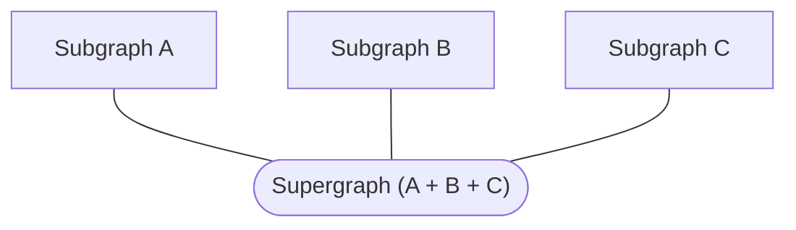

> In addition to completing this tutorial, you can [clone our example gateway on GitHub](https://github.com/apollographql/supergraph-demo). The GitHub example is **not** identical to the gateway you create in this tutorial, but it demonstrates many of the same concepts.

Hello! This tutorial gets you up and running with Apollo Federation. It currently requires [Node.js version 12 or 14](https://nodejs.org/en/download/).

## Federation concepts

In a federated architecture, multiple GraphQL APIs are **composed** into a single federated graph. The individual APIs are called **subgraphs**, and they're composed into a **supergraph**:



Usually, each subgraph corresponds to a different service in your backend. The supergraph is then represented by a **gateway**, which routes each incoming query to the appropriate combination of subgraphs and returns the combined result.

The supergraph's schema is the combination of each subgraph's schema, plus some special federation-specific directives. Each subgraph's schema can even reference and extend types that originate in a _different_ subgraph. (<a href="../entities" target="_blank">Learn more</a>)

This architecture enables clients to query data from multiple services simultaneously, just by querying the gateway.

Now that we have a high-level understanding of federation concepts, let's jump in.

## Example subgraphs

This tutorial uses two Apollo-hosted subgraphs for an example application: a Products subgraph and a Reviews subgraph. Here are their schemas for reference:

<ExpansionPanel title="Products">

```graphql:title=Products
enum CURRENCY_CODE {
  USD
}

type Department {
  category: ProductCategory
  url: String
}

type Money {
  amount: Float
  currencyCode: CURRENCY_CODE
}

"""Here are some helpful details about your type"""
type Price {
  cost: Money

  """A number between 0 and 1 signifying the % discount"""
  deal: Float
  dealSavings: Money
}

"""
This is an Entity, docs:https://www.apollographql.com/docs/federation/entities/
You will need to define a __resolveReference resolver for the type you define, docs: https://www.apollographql.com/docs/federation/entities/#resolving
"""
type Product @key(fields: "id") {
  id: ID!
  title: String
  url: String
  description: String
  price: Price
  salesRank(category: ProductCategory = ALL): Int
  salesRankOverall: Int
  salesRankInCategory: Int
  category: ProductCategory
  images(size: Int = 1000): [String]
  primaryImage(size: Int = 1000): String
}

enum ProductCategory {
  ALL
  GIFT_CARDS
  ELECTRONICS
  CAMERA_N_PHOTO
  VIDEO_GAMES
  BOOKS
  CLOTHING
}

extend type Query {
  bestSellers(category: ProductCategory = ALL): [Product]
  categories: [Department]
  product(id: ID!): Product
}
```

</ExpansionPanel>

<ExpansionPanel title="Reviews">

```graphql:title=Reviews
extend type Product @key(fields: "id") {
  id: ID! @external
  reviews: [Review]
  reviewSummary: ReviewSummary
}

"""
This is an Entity, docs:https://www.apollographql.com/docs/federation/entities/
You will need to define a __resolveReference resolver for the type you define, docs: https://www.apollographql.com/docs/federation/entities/#resolving
"""
type Review @key(fields: "id") {
  id: ID!
  rating: Float
  content: String
}

type ReviewSummary {
  totalReviews: Int
  averageRating: Float
}
```

</ExpansionPanel>

## 1. Install the Rover CLI

**Rover** is Apollo's CLI for managing graphs, including federated ones.

Install it like so:

```shell
npm install -g @apollo/rover
```

After installing, run `rover` in your terminal with no arguments to confirm that it installed successfully. We'll use various Rover commands in later steps.

## 2. Create a gateway

> You can also [clone our example gateway on GitHub](https://github.com/apollographql/supergraph-demo). The GitHub example is **not** identical to the gateway you create in this tutorial, but it demonstrates the same concepts.

As mentioned [above](#federation-concepts), your federated supergraph is represented by a **gateway** that routes queries to various subgraphs. For this tutorial, we'll use some Apollo-hosted example services as our subgraphs, and we'll set up our own gateway in front of them.

With the help of the `@apollo/gateway` library, [Apollo Server](https://www.apollographql.com/docs/apollo-server/) can act as our federated gateway.

On your development machine, first create a new project directory for your Node.js gateway. Then inside that directory, run the following to create a `package.json` file:

```shell
npm init
```

Next, install the following required libraries:

```shell
npm install apollo-server @apollo/gateway
```

Finally, create a file named `index.js` and paste the following into it as a minimal (not-yet-functional) gateway implementation:

```js{4,7}:title=index.js
const { ApolloServer } = require('apollo-server');
const { ApolloGateway } = require('@apollo/gateway');

const supergraphSdl = ''; // TODO!

const gateway = new ApolloGateway({
  supergraphSdl
});

const server = new ApolloServer({
  gateway,
});

server.listen().then(({ url }) => {
  console.log(`🚀 Gateway ready at ${url}`);
}).catch(err => {console.error(err)});
```

This code demonstrates the basic flow for creating a gateway:

1. We initialize an `ApolloGateway` instance and pass it the complete composed SDL for our supergraph.
    * _Note the `TODO`. We'll obtain the composed schema in the next section._

2. We initialize an `ApolloServer` instance and pass it our gateway via the `gateway` option.

3. We call `listen` on our server instance to begin listening for incoming requests.

If we run this code as-is with `node index.js`, we get an error:

```
GraphQLError [Object]: Syntax Error: Unexpected <EOF>.
```

That's because our `supergraphSdl` is currently empty! Next, we'll compose that schema.

## 3. Compose the supergraph schema

As a best practice, your gateway should _not_ be responsible for composing its own supergraph schema. Instead, a separate process should compose the schema and provide it to the gateway. This helps improve reliability and reduce downtime when you make changes to a subgraph.

There are multiple ways to compose a supergraph schema from our subgraph schemas:

* On our local machine using the Rover CLI (we'll start with this)
* Via managed federation in Apollo Studio (we'll switch to this in [Part 2](./quickstart-pt-2/))

Using managed federation is strongly recommended for production environments. We'll start with local composition to get up and running.

### Providing subgraph details

To compose our supergraph schema, the Rover CLI needs the following information about each of our subgraphs:

* The subgraph's schema
* The URL of the subgraph's GraphQL endpoint (which must be accessible by the gateway)

Because we're using Apollo-hosted example subgraphs, we know their endpoint URLs. And Rover can use those URLs to fetch their schemas via a special introspection query.

#### Configuration file

We provide subgraph details to the Rover CLI in a YAML file. In your project directory, create a file called `supergraph-config.yaml` and paste the following into it:

```yaml:title=supergraph-config.yaml
subgraphs:
  products:
    routing_url: https://rover.apollo.dev/quickstart/products/graphql
    schema:
      subgraph_url: https://rover.apollo.dev/quickstart/products/graphql
  reviews:
    routing_url: https://rover.apollo.dev/quickstart/reviews/graphql
    schema:
      subgraph_url: https://rover.apollo.dev/quickstart/reviews/graphql
```

As you can see, we're providing the same URL as the value of two different fields. These fields serve different purposes:

* `routing_url` is the URL the _gateway_ will use to send GraphQL operations to the subgraph at runtime.
* `schema.subgraph_url` is the URL that _Rover_ will use to fetch the subgraph schema during composition.

These URLs might theoretically differ. The YAML file also supports providing a subgraph's schema as a local file path, or as a registered graph ref that Rover can fetch from Apollo (for details, [see the Rover docs](https://www.apollographql.com/docs/rover/supergraphs/#composing-a-supergraph-schema)).

### Performing composition

Now that our configuration file is ready, we can compose our supergraph schema. To do that, we'll use Rover's `supergraph compose` command.

From your project directory, run the following command in your terminal:

```shell
rover supergraph compose --config ./supergraph-config.yaml
```

Rover outputs the following schema:

<ExpansionPanel title="Click to expand">

```graphql
schema
  @core(feature: "https://specs.apollo.dev/core/v0.2"),
  @core(feature: "https://specs.apollo.dev/join/v0.1", for: EXECUTION)
{
  query: Query
}

directive @core(feature: String!, as: String, for: core__Purpose) repeatable on SCHEMA

directive @join__field(graph: join__Graph, requires: join__FieldSet, provides: join__FieldSet) on FIELD_DEFINITION

directive @join__type(graph: join__Graph!, key: join__FieldSet) repeatable on OBJECT | INTERFACE

directive @join__owner(graph: join__Graph!) on OBJECT | INTERFACE

directive @join__graph(name: String!, url: String!) on ENUM_VALUE

enum core__Purpose {
  EXECUTION
  SECURITY
}

enum CURRENCY_CODE {
  USD
}

type Department {
  category: ProductCategory
  url: String
}

scalar join__FieldSet

enum join__Graph {
  PRODUCTS @join__graph(name: "products" url: "https://rover.apollo.dev/quickstart/products/graphql")
  REVIEWS @join__graph(name: "reviews" url: "https://rover.apollo.dev/quickstart/reviews/graphql")
}

type Money {
  amount: Float
  currencyCode: CURRENCY_CODE
}

"""Here are some helpful details about your type"""
type Price {
  cost: Money

  """A number between 0 and 1 signifying the % discount"""
  deal: Float
  dealSavings: Money
}

"""
This is an Entity, docs:https://www.apollographql.com/docs/federation/entities/
You will need to define a __resolveReference resolver for the type you define, docs: https://www.apollographql.com/docs/federation/entities/#resolving
"""
type Product
  @join__owner(graph: PRODUCTS)
  @join__type(graph: PRODUCTS, key: "id")
  @join__type(graph: REVIEWS, key: "id")
{
  category: ProductCategory @join__field(graph: PRODUCTS)
  description: String @join__field(graph: PRODUCTS)
  id: ID! @join__field(graph: PRODUCTS)
  images(size: Int = 1000): [String] @join__field(graph: PRODUCTS)
  price: Price @join__field(graph: PRODUCTS)
  primaryImage(size: Int = 1000): String @join__field(graph: PRODUCTS)
  reviewSummary: ReviewSummary @join__field(graph: REVIEWS)
  reviews: [Review] @join__field(graph: REVIEWS)
  salesRank(category: ProductCategory = ALL): Int @join__field(graph: PRODUCTS)
  salesRankInCategory: Int @join__field(graph: PRODUCTS)
  salesRankOverall: Int @join__field(graph: PRODUCTS)
  title: String @join__field(graph: PRODUCTS)
  url: String @join__field(graph: PRODUCTS)
}

enum ProductCategory {
  ALL
  BOOKS
  CAMERA_N_PHOTO
  CLOTHING
  ELECTRONICS
  GIFT_CARDS
  VIDEO_GAMES
}

type Query {
  bestSellers(category: ProductCategory = ALL): [Product] @join__field(graph: PRODUCTS)
  categories: [Department] @join__field(graph: PRODUCTS)
  product(id: ID!): Product @join__field(graph: PRODUCTS)
}

"""
This is an Entity, docs:https://www.apollographql.com/docs/federation/entities/
You will need to define a __resolveReference resolver for the type you define, docs: https://www.apollographql.com/docs/federation/entities/#resolving
"""
type Review
  @join__owner(graph: REVIEWS)
  @join__type(graph: REVIEWS, key: "id")
{
  content: String @join__field(graph: REVIEWS)
  id: ID! @join__field(graph: REVIEWS)
  rating: Float @join__field(graph: REVIEWS)
}

type ReviewSummary {
  averageRating: Float
  totalReviews: Int
}
```

</ExpansionPanel>

As you can see, this composed schema includes all of the types and fields from our subgraph schemas, along with many additional directives that the gateway uses to support our federated architecture.

Now, append ` > supergraph.graphql` to the above command to write the composed schema to a file:

```shell
rover supergraph compose --config ./supergraph-config.yaml > supergraph.graphql
```

## 4. Start the gateway

We can now edit our `index.js` file to pull in our composed schema. Replace the file's contents with the following:

```js:title=index.js
const { ApolloServer } = require('apollo-server');
const { ApolloGateway } = require('@apollo/gateway');
const { readFileSync } = require('fs');

const supergraphSdl = readFileSync('./supergraph.graphql').toString();

const gateway = new ApolloGateway({
  supergraphSdl
});

const server = new ApolloServer({
  gateway,
});

server.listen().then(({ url }) => {
  console.log(`🚀 Gateway ready at ${url}`);
}).catch(err => {console.error(err)});
```

Now with our `supergraphSdl` properly populated, let's start up the gateway again with `node index.js`. This time, there's no error!

We can quickly open our browser to [studio.apollographql.com/sandbox](https://studio.apollographql.com/sandbox) to explore our composed schema in Apollo Sandbox:


While we're here, you can even execute some test queries against the supergraph.

---

Nice job! Our supergraph gateway is running locally and communicating with our Apollo-hosted subgraphs.

Next, we'll move our supergraph composition into Apollo Studio so our gateway can pull schema changes dynamically during runtime. [On to part 2!](./quickstart-pt-2/)
