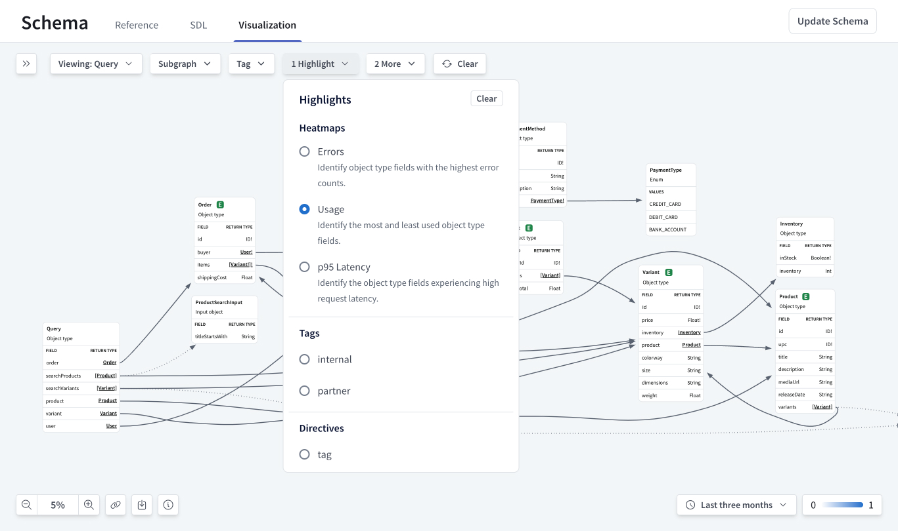

Apollo Federation combines microservices into a single GraphQL API, providing real-time access to all your data sources for all your client applications.


By the end of this quickstart, you'll have set up a federated GraphQL API—also known as a _supergraph_—that integrates data from products, users, and inventory services.
Along the way, you'll learn about tools like the Rover CLI and GraphOS Studio.

To learn more about Apollo Federation and the benefits of using it with GraphOS, check out these resources:

- [Introduction to Apollo Federation](./)
- [Introduction to GraphOS](/graphos)

## Prerequisites

To complete this quickstart, you must have the following:

- A [GraphOS Studio](https://studio.apollographql.com/?referrer=docs-content) account
- A local version of Apollo's retail demo
  - Download or clone it from its [GitHub repository](https://github.com/apollosolutions/retail-supergraph)
- The latest LTS version of [Node](https://nodejs.org/en)

If you haven't already, set these up before continuing.

## Overview

Setting up a supergraph with GraphOS takes a few steps:

1. Install the Rover CLI.
2. Start local development.
3. Publish your services—known as _subgraphs_ in the context of a supergraph—to GraphOS.

Once you've published your subgraphs, you can use GraphOS Studio to explore and better understand your supergraph.

### Step 1. Install the Rover CLI

_Rover_ is Apollo's CLI for managing all kinds of graphs, including subgraphs and supergraphs. You'll use it throughout this quickstart.

<Note>

Even if you already have Rover installed, update your version by completing this step.

</Note>

Install the latest Rover release with the appropriate command for your system:

```bash title="MacOS / Unix-like" showLineNumbers=false
curl -sSL https://rover.apollo.dev/nix/latest | sh
```

```bash title="Windows" showLineNumbers=false
iwr 'https://rover.apollo.dev/win/latest' | iex
```

After installing, run `rover -V` in your terminal to confirm it installed successfully.
Verify that the printed version number matches the [latest release](https://github.com/apollographql/rover/releases).
If it doesn't, you might need to manually delete an outdated installation.

Now that you've installed Rover, you're ready to start local development with your supergraph!

### Step 2. Start local development

Running a supergraph entails running its _router_.
The router is the single access point to your supergraph for clients.
The router receives incoming operations and intelligently routes them across component services before returning a unified response. 


In this step, you'll do the following:

1. Locally run the subgraphs.
2. Locally run your router.
3. Query your router to ensure it's working as expected.

#### Run subgraphs

To start local development, you must first get the subgraphs in the [retail demo](https://github.com/apollosolutions/retail-supergraph) up and running.
From the root directory, install dependencies:

```bash showLineNumbers=false
npm install
```

Then run the subgraphs:

```bash showLineNumbers=false
npm run dev:subgraphs
```

In your terminal, you should see notifications for each subgraph:

```bash showLineNumbers=false disableCopy=true
Setting up [products] subgraph at http://localhost:4001/products/graphql
Setting up [orders] subgraph at http://localhost:4001/orders/graphql
Setting up [users] subgraph at http://localhost:4001/users/graphql
...
```

Keep these subgraphs up and running so that the router can query them.

<Note>

The retail demo contains the code behind each of these subgraphs, including their schemas, resolvers, and mock data.
These files are provided for your reference—understanding them isn't necessary to complete this quickstart.
Check out these tutorials to learn more about [GraphQL schemas](https://www.apollographql.com/tutorials/lift-off-part1) and [resolvers](https://www.apollographql.com/tutorials/lift-off-part2).

</Note>

#### Run router

With your subgraphs running, you can use Rover to start the router locally.
To do so, use the `rover dev` command with the `--supergraph-config` and `--router-config` options.

The retail demo comes with `supergraph-config-dev.yaml` and `router-config-dev.yaml` YAML configuration files that include subgraph names, URLs, and router configurations.

In a **different terminal window** from the one where the subgraphs are running, run this command:

```bash showLineNumbers=false
rover dev \
  --supergraph-config supergraph-config-dev.yaml \
  --router-config router-config-dev.yaml
```

When you first start the `rover dev` process, you'll see the following happening in the terminal:

- Rover obtains the provided subgraph schemas and starts sessions for each of them.

  ```bash showLineNumbers=false
  🛫 starting a session with the 'discovery' subgraph
  🛫 starting a session with the 'checkout' subgraph
  🛫 starting a session with the 'users' subgraph
  🛫 starting a session with the 'inventory' subgraph
  🛫 starting a session with the 'orders' subgraph
  🛫 starting a session with the 'shipping' subgraph
  🛫 starting a session with the 'products' subgraph
  🛫 starting a session with the 'reviews' subgraph
  ```

- Rover uses Apollo Federation to compose a supergraph schema by adding subgraph schemas one at a time.

  ```bash showLineNumbers=false
  🎶 composing supergraph with Federation v2.8.0
  ✅ successfully composed after adding the 'products' subgraph
  ```

  - The order in which Rover adds subgraphs is undefined, so you might see composition errors like the following during intermediate steps.

  ```bash showLineNumbers=false
  error[E029]: Encountered 1 build error while trying to build a supergraph.
  ```

- Once composition completes successfully, Rover starts a locally running router session and provides it with the supergraph schema.

  ```bash showLineNumbers=false
  🚀 your supergraph is running! head to http://localhost:4000 to query your supergraph
  ```

- Rover starts watching the provided subgraph schemas for changes.

  ```bash showLineNumbers=false
  👀 watching ./subgraphs/products/schema.graphql for changes
  ```

  - Rover recomposes the supergraph schema whenever it detects one. Recomposition automatically reloads the router.

Nice! You've now got a supergraph running locally.

#### Query your router

To ensure everything works as expected, you can query your router in the Apollo Sandbox that Rover automatically starts up.

1. Open [localhost:4000](http://localhost:4000/) in a browser to access your locally running router. It should look something like this:

  

2. Run the following query by copying and pasting it into the **Operation** window and then clicking the play button labeled **ExampleQuery**.

```graphQL showLineNumbers=false
query ExampleQuery {
  listAllProducts {
    id
    title
    description
    mediaUrl
    variants {
      id
      price
    }
  }
}
```

3. Confirm that once you run the operation, you see the following in the **Response** panel on the right:

  <ExpansionPanel title="Click to see response">

  ```JSON showLineNumbers=false disableCopy=true
  {
    {
      "data": {
        "listAllProducts": [
          {
            "id": "product:1",
            "title": "Air Jordan 1 Mid",
            "description": "Air Jordan 1 Mid is a blue, grey and white sneaker from the iconic jordan brand",
            "mediaUrl": "https://sneakernews.com/wp-content/uploads/2022/06/air-jordan-1-mid-university-blue-grey-dx9276-100-6.jpg",
            "variants": [
              {
                "id": "variant:1",
                "price": 600.25
              },
              {
                "id": "variant:2",
                "price": 20.12
              }
            ]
          },
          {
            "id": "product:2",
            "title": "Supreme x Tiffany & Co. Box Logo Tee",
            "description": "A classic Supreme vbox t-shirt in the signature Tiffany blue.",
            "mediaUrl": "https://encrypted-tbn2.gstatic.com/shopping?q=tbn:ANd9GcQWDHD3SSS98UAVKODaql7nrDTopfL4tcTnEltW8Yqy4hyDu4i5b70Wb3Y8-wACJIo5g-ZdRULPQKUmt7JfwiaSdgiOBz4pvU_YelKHUI4nhoXmMJPeh_tyWQ",
            "variants": [
              {
                "id": "variant:4",
                "price": 600.25
              },
              {
                "id": "variant:5",
                "price": 600.25
              },
              {
                "id": "variant:6",
                "price": 600.25
              },
              {
                "id": "variant:7",
                "price": 600.25
              },
              {
                "id": "variant:8",
                "price": 600.25
              }
            ]
          },
          {
            "id": "product:3",
            "title": "THE MACKINAC 40MM",
            "description": "Established by Detroit’s historic Bayview Yacht club, the days-long Port Huron to Mackinac Island regatta is one of the longest and most grueling freshwater races in the world.\n\nNamed for this legendary competition, the Shinola Mackinac is our first watch with automatic, single-eye chronograph yacht-timer functionality.\n\nIt’s a precision instrument designed to be passed on for generations—just like the tradition that inspires it.",
            "mediaUrl": "https://shinola-m2.imgix.net/images/Products/20253783-sdt-012455107/S0120253783_F2_MAIN_01.png?h=1500&w=1500&bg=f7f7f7&auto=format,compress&fit=fillmax",
            "variants": [
              {
                "id": "variant:9",
                "price": 3499.99
              }
            ]
          },
        ]
      }
    },
    ...
  }
  ```

  </ExpansionPanel>

  This operation requests a list of all products from the products subgraph.
  You can remove fields like `mediaUrl` or add fields like `releaseDate` to the operation to see how the reponse changes.

  Next, you'll execute an operation that demonstrates the power of federation.

4. Replace the example query in the **Operation** window with the following one, but don't run it yet.

  ```graphql showLineNumbers=false
    # Get the current user's cart with all the items and their product info as well as the price.
    query GetCart {
      user {
        id
        username
        shippingAddress
        cart {
          subtotal
          items {
            price
            inventory {
              inStock
            }
            product {
              title
              description
              mediaUrl
            }
          }
        }
      }
    }
    ```

  This operation retrieves a particular user's shopping cart given the user's ID. The operation expects the user ID to be in the request header. You can include request headers in Sandbox by doing the following:
    - Open the **Headers** tab below the **Operation** editor.
    - Click **+ New header++**.
    - Enter `x-user-id` as the **header key** and `user:1` as the **value**.
  
  

5. Run the request by clicking the play button, now labeled **GetCart**, in the top right of the **Operation** window.
6. In the **Response** panel, confirm you see the following:

  <ExpansionPanel title="Click to see response">

  ```JSON showLineNumbers=false disableCopy=true
  {
    "data": {
      "user": {
        "id": "user:1",
        "username": "User One",
        "shippingAddress": "123 Main St",
        "cart": {
          "subtotal": 620.37,
          "items": [
            {
              "price": 20.12,
              "inventory": {
                "inStock": true
              },
              "product": {
                "title": "Air Jordan 1 Mid",
                "description": "Air Jordan 1 Mid is a blue, grey and white sneaker from the iconic jordan brand",
                "mediaUrl": "https://sneakernews.com/wp-content/uploads/2022/06/air-jordan-1-mid-university-blue-grey-dx9276-100-6.jpg"
              }
            },
            {
              "price": 600.25,
              "inventory": {
                "inStock": true
              },
              "product": {
                "title": "Supreme x Tiffany & Co. Box Logo Tee",
                "description": "A classic Supreme vbox t-shirt in the signature Tiffany blue.",
                "mediaUrl": "https://encrypted-tbn2.gstatic.com/shopping?q=tbn:ANd9GcQWDHD3SSS98UAVKODaql7nrDTopfL4tcTnEltW8Yqy4hyDu4i5b70Wb3Y8-wACJIo5g-ZdRULPQKUmt7JfwiaSdgiOBz4pvU_YelKHUI4nhoXmMJPeh_tyWQ"
              }
            }
          ]
        }
      }
    }
  }
  ```

    $600.25! That must be some t-shirt!

  </ExpansionPanel>

Excellent! You've used _one_ request to your router to get information from across different services.
In the last part of this local development step, you'll learn more about how the router accomplished this.

#### Inspect query plans

The `GetCart` operation is powerful because it gathers data across various subgraphs: `users`, `products`, `inventory`, and more.
Sandbox displays an operation's **Query Plan** to help you understand how the router intelligently orchestrates subrequests to these subgraphs.

A query plan is a blueprint for dividing a single incoming operation into one or more operations that are each resolvable by a single subgraph.
You can view the query plan instead of the response by clicking **Response** and selecting **Query Plan**.


Query plans are a powerful tool for understanding operations, whether they're run locally or from client applications.

In the last step of this tutorial, you'll publish your locally running subgraph schemas to GraphOS Studio to learn more about your supergraph.

### Step 3. Publish your subgraphs

To create a supergraph, you individually publish each subgraph schema to GraphOS. 
Whenever you publish a subgraph schema, GraphOS attempts to compose all the latest subgraph schemas into a single supergraph schema.
If this composition succeeds, GraphOS updates your router with the result.

In this step, you'll create an empty supergraph in GraphOS Studio and then publish subgraph schemas to it using Rover.

#### Create supergraph

1. Go to [studio.apollographql.com](https://studio.apollographql.com/?referrer=docs-content) and click **+ Create New Graph**.
2. Enter a **Graph title**, for example `Federation Quickstart`. Leave the **Graph Architecture** as `Supergraph (Default)` and **Visible to Team Members** as `On`. Click **Next**.
3. A **Publish your schema using Federation** dialog appears. Copy the example code block to a local text file.

    

    - The protected value that appears after `APOLLO_KEY=` and beginning with `service:` is your graph API key.
    - The value that appears after `rover subgraph publish` is your graph ref. By default, it ends with `@current`.

    <Caution>

      API keys are secret credentials. Never share them outside your organization or commit them to version control. Delete and replace API keys that you believe are compromised.

    </Caution>

4. Leave the dialog open; you'll complete setup with Rover.

#### Publish subgraph schemas

Complete the next steps back in your terminal:

1. Ensure your subgraphs are still [running locally](#run-subgraphs).
2. Take the example code block you copied from Studio and replace the last three lines with the following:

    ```bash showLineNumbers=false
        --schema ./subgraphs/products/schema.graphql \
        --name products \
        --routing-url http://localhost:4001/products/graphql
    ```

    It should look something like the following, with the `<GRAPH_API_KEY>` and `<GRAPH_REF>` replaced with your graph's values:

    ```bash showLineNumbers=false
    APOLLO_KEY=service:<GRAPH_API_KEY> \
    rover subgraph publish <GRAPH_REF> \
    --schema ./subgraphs/products/schema.graphql \
    --name products \
    --routing-url http://localhost:4001/products/graphql
    ```

    - The `--schema` option specifies the path to the schema file to publish. 
    - The `--name` option specifies the name of the subgraph.
    - The `--routing-url` is the address the router should send requests to.
    
    <Note>

    In a production supergraph, a subgraph's `routing-url` is generally its public endpoint.

    </Note>

2. In a new terminal window, paste and run your multi-line command.
    - Because the command provides a `localhost` address for the `routing-url`, the terminal will confirm that you want to publish. Enter `Y`.
    - If the command is successful, you'll see the following in your terminal:

      ```bash showLineNumbers=false disableCopy=true
      A new subgraph called 'products' was created in <GRAPH_REF>
      The supergraph schema for <GRAPH_REF> was updated,
      composed from the updated 'products' subgraph
      ```

    - After a few moments, the GraphOS Studio dialog you left open when creating an empty supergraph will show **Schema published** on the bottom left.

    

3. Run the `rover subgraph publish` command for the `inventory` subgraph, substituting your graph ref. You no longer need to include the first line containing your graph API key:

    ```bash showLineNumbers=false
    rover subgraph publish <GRAPH_REF> \
    --schema ./subgraphs/inventory/schema.graphql \
    --name inventory \
    --routing-url http://localhost:4001/inventory/graphql

4. Do the same for the `users` subgraph, substituting your graph ref:
    ```bash showLineNumbers=false
    rover subgraph publish <GRAPH_REF> \
    --schema ./subgraphs/users/schema.graphql \
    --name users \
    --routing-url http://localhost:4001/users/graphql

Congrats! With these subgraphs published, you can explore and interact with them and the supergraph composed of them in GraphOS Studio. 

<Note>

The retail demo contains other subgraphs—for example, the `reviews` and `shipping` subgraphs.
The three you've just published are enough to understand what GraphOS Studio has to offer, but you can publish the others if you want to explore their schemas and data.

</Note>

## Explore your supergraph

Once you've published subgraphs, open the **Schema** page from the left nav in [Studio](https://studio.apollographql.com/?referrer=docs-content) to explore the composed supergraph schema as well as individual subgraph schemas and the relationships between them.

  - The **Reference** tab lets you view and filter your schema's type and field definitions. For example, select **Objects**, then **User**, to see all of the `user` type's fields and which subgraphs provide them.

    

  - The **SDL** tab displays your supergraph's API schema and supergraph schema, filterable by subgraph. Viewing the supergraph SDL (Schema Definition Language) allows developers to see exactly how subgraph schemas are composed together.

    

  - The **Visualization** tab provides a filterable, navigable, graphical representation of your supergraph schema. Once you start collecting metrics on your supergraph, you can use the visualization tool to create heatmaps to identify fields that are most frequently used, or have the highest latency or errors.

  

GraphOS also offers tools for managing your schema, including schema proposals, checks, and linting. Additionally, GraphOS schema delivery tools help you integrate schema publication into your DevOps workflows.

Once you deploy your router, either by self-hosting it or using the Apollo-managed cloud option, you can use it to collect and export telemetry to your application performance monitoring (APM) and observability tools, including GraphOS Studio.

## Next steps

Depending on your goals, you have several options for learning more about GraphOS' capabilities or moving your supergraph closer to production:

- Learn about the different [router types](/graphos/routing) to decide which type best fits your use case.
- Learn more about Studio features, including [proposals](/graphos/delivery/schema-proposals), [linting](/graphos/delivery/schema-linter), and [checks](/graphos/delivery/schema-checks).
- Learn about GraphOS [metrics](/graphos/metrics) and [router telemetry](/router/configuration/telemetry/overview/).
- Check out the [`rover template` command](/rover/commands/template) to quickly start a new GraphQL project or explore various subgraph implementations.