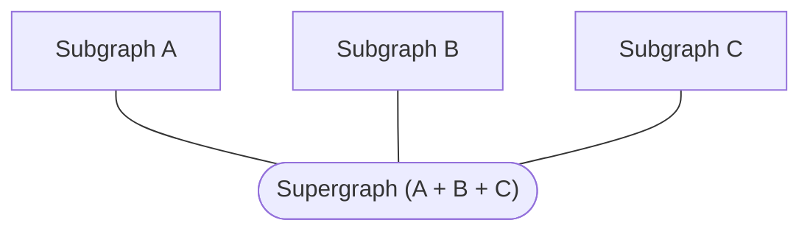

Hello! This tutorial gets you up and running quickly with an Apollo Federation 2 supergraph.

> **Related resources:**
>
> * Our [in-depth Apollo Federation course](https://www.apollographql.com/tutorials/voyage-part1) goes into greater detail on fundamental federation concepts. It walks through creating a supergraph from scratch, along with federating an existing monolith graph.
> * Our [Federation 2 demo app on GitHub](https://github.com/apollographql/supergraph-demo-fed2) is distinct from the project you create in this tutorial. It demonstrates many powerful Federation 2 features.

## Federation concepts

Before we set up our project, let's quickly cover what Apollo Federation _is_.

In a federated architecture, multiple GraphQL APIs are [composed](../federated-types/composition/) into a single federated graph. The individual APIs are called **subgraphs**, and they're composed into a **supergraph**:



Usually, each subgraph corresponds to a different service in your backend. The supergraph is then represented by another service called a **graph router**, which routes each incoming query to the appropriate set of subgraphs and returns the combined result.

The supergraph's schema is the combination of each subgraph's schema, plus some special federation-specific metadata.

This architecture enables clients to query data from _all_ subgraphs _simultaneously_, just by querying the router. It also enables different teams to own independent parts of a unified graph.

### Supergraph schema composition

As a best practice, your router _does not_ compose its own supergraph schema. Instead, a separate process composes the schema and provides it to the router. This helps improve reliability and reduce downtime when you make changes to a subgraph.

There are multiple ways to compose a supergraph schema from subgraph schemas:

* Via **managed federation** in Apollo Studio (we'll start with this)
* On our local machine with the Rover CLI (we'll do this in [Part 3](./local-composition/))

Using managed federation is strongly recommended for production environments. Meanwhile, composing with Rover can be useful for local development and CI environments.

Now that we have a high-level understanding of federation concepts, let's jump in!

## Example subgraphs

This tutorial uses two Apollo-hosted subgraphs (named Locations and Reviews) from an imaginary space tourism application called FlyBy. Here are their URLs and schemas for reference:

<ExpansionPanel title="Locations">

URL: `https://flyby-locations-sub.herokuapp.com/`

```graphql title="Locations"
extend schema
  @link(url: "https://specs.apollo.dev/federation/v2.0",
        import: ["@key"])

type Query {
  "The full list of locations presented by the Interplanetary Space Tourism department"
  locations: [Location!]!
  "The details of a specific location"
  location(id: ID!): Location
}

type Location @key(fields: "id"){
  id: ID!
  "The name of the location"
  name: String!
  "A short description about the location"
  description: String!
  "The location's main photo as a URL"
  photo: String!
}
```

</ExpansionPanel>

<ExpansionPanel title="Reviews">

URL: `https://flyby-reviews-sub.herokuapp.com/`

```graphql title="Reviews"
extend schema
  @link(url: "https://specs.apollo.dev/federation/v2.0",
        import: ["@key"])

type Query {
  "The three latest reviews submitted for FlyBy's locations"
  latestReviews: [Review!]!
}

type Mutation {
  submitReview(locationReview: LocationReviewInput): SubmitReviewResponse
}

type Location @key(fields: "id") {
  id: ID!
  "The calculated overall rating based on all reviews"
  overallRating: Float
  "All submitted reviews about this location"
  reviewsForLocation: [Review]!
}

type Review {
  id: ID!
  "Written text"
  comment: String
  "A number from 1 - 5 with 1 being lowest and 5 being highest"
  rating: Int
  "The location the review is about"
  location: Location
}

input LocationReviewInput {
  "Written text"
  comment: String!
  "A number from 1 - 5 with 1 being lowest and 5 being highest"
  rating: Int!
  "Location Id"
  locationId: String!
}

type SubmitReviewResponse {
  "Similar to HTTP status code, represents the status of the mutation"
  code: Int!
  "Indicates whether the mutation was successful"
  success: Boolean!
  "Human-readable message for the UI"
  message: String!
  "Newly created review"
  locationReview: Review
}
```

</ExpansionPanel>

## 1. Set up Apollo tools

This quickstart uses a couple of Apollo tools to get the most out of federation:

* **Apollo Studio**, a cloud platform for monitoring, managing, and collaborating on your supergraph
    * You **DON'T** need a paid Studio plan to complete this quickstart or use managed federation features!
* **The Rover CLI**, a command-line interface for interacting with graphs and their schemas

Let's set these up first!

### Sign up for Apollo Studio

Before we can use managed federation with Apollo Studio, we need a Studio account. Let's create one if you don't have one yet.

Complete the first two steps of <a href="/studio/getting-started/" target="_blank">Get started with Apollo Studio</a> (**Create your account** and **Create your first graph**), then return here.

> * Make sure the Studio graph you create is a supergraph that uses Federation 2!
> * For future steps, you'll need the ID of the supergraph you create. Make sure to have it available.

### Install the Rover CLI

**Rover** is Apollo's CLI for managing all kinds of graphs, including subgraphs and supergraphs. We'll use it throughout this quickstart.

> Even if you already have Rover installed, you should update your version now by completing this step.

Install the latest Rover release with the appropriate command for your system:

```bash title="MacOS / Unix-like"
curl -sSL https://rover.apollo.dev/nix/latest | sh
```

```bash title="Windows"
iwr 'https://rover.apollo.dev/win/latest' | iex
```

After installing, run `rover` in your terminal with no arguments to confirm that it installed successfully. Verify that the printed version number matches the [latest release](https://github.com/apollographql/rover/releases) (if it doesn't, you might need to manually delete a previous outdated installation).

### Authenticate Rover with Studio

We'll use the Rover CLI to publish our subgraph schemas to Studio. To do that, we first need to _authenticate_ Rover with Studio.

Complete the first two steps of <a href="/rover/configuring/" target="_blank">Configuring Rover</a> (**Obtain an API key** and **Provide the API key to Rover**), then return here.

## 2. Create a router project directory

As mentioned in [Federation concepts](#federation-concepts), your federated supergraph is represented by a **graph router** that routes queries to various subgraphs. For this tutorial, we'll use some Apollo-hosted example services as our subgraphs, and we'll set up **the Apollo Router** in front of them.

> **The Apollo Router** is a high-performance, precompiled Rust executable that acts as the router for a supergraph.
>
> Alternatively, _Apollo Server_ can act as your graph router, as documented in [The graph router](../gateway/). This tutorial uses the Apollo Router because it's the recommended default for all new supergraphs (for details, see [Choosing a router library](../gateway/#choosing-a-router-library)).

On your development machine, first create a new directory for your router project. Then inside that directory, run the following to install the Apollo Router:

```bash
curl -sSL https://router.apollo.dev/download/nix/latest | sh
```

This installs the `router` executable in your project directory. You can try running it with the following command:

```
./router
```

If you do, you'll get a startup error message like the following:

<ExpansionPanel title="Click to expand">

```
Apollo Router v0.12.0 // (c) Apollo Graph, Inc. // Licensed as ELv2 (https://go.apollo.dev/elv2)

⚠️  The Apollo Router requires a composed supergraph schema at startup. ⚠️

👉 DO ONE:

  * Pass a local schema file with the '--supergraph' option:

      $ ./router --supergraph <file_path>

  * Fetch a registered schema from Apollo Studio by setting
    these environment variables:

      $ APOLLO_KEY="..." APOLLO_GRAPH_REF="..." ./router

      For details, see the Apollo docs:
      https://www.apollographql.com/docs/router/managed-federation/setup

🔬 TESTING THINGS OUT?

  1. Download an example supergraph schema with Apollo-hosted subgraphs:

    $ curl -L https://supergraph.demo.starstuff.dev/ > starstuff.graphql

  2. Run the Apollo Router with the supergraph schema:

    $ ./router --supergraph starstuff.graphql
```

</ExpansionPanel>

That's because we aren't currently providing a supergraph schema to the router! We'll fix that soon.

## 3. Obtain your subgraph schemas

To compose our supergraph schema, Apollo Studio needs the following information about each of our subgraphs:

* The subgraph's schema
* The URL of the subgraph's GraphQL endpoint (which must be accessible by the router)

Fortunately, we have all of this information! Let's collect it in our project.

Do the following in your project's root directory:

1. Create a new file called `locations.graphql` and paste the following schema into it:

    <ExpansionPanel title="Locations">

    ```graphql title="locations.graphql"
    extend schema
      @link(url: "https://specs.apollo.dev/federation/v2.0",
            import: ["@key"])

    type Query {
      "The full list of locations presented by the Interplanetary Space Tourism department"
      locations: [Location!]!
      "The details of a specific location"
      location(id: ID!): Location
    }

    type Location @key(fields: "id"){
      id: ID!
      "The name of the location"
      name: String!
      "A short description about the location"
      description: String!
      "The location's main photo as a URL"
      photo: String!
    }
    ```

    </ExpansionPanel>

2. Create a new file called `reviews.graphql` and paste the following schema into it:

    <ExpansionPanel title="Reviews">

    ```graphql title="reviews.graphql"
    extend schema
      @link(url: "https://specs.apollo.dev/federation/v2.0",
            import: ["@key"])

    type Query {
      "The three latest reviews submitted for FlyBy's locations"
      latestReviews: [Review!]!
    }

    type Mutation {
      submitReview(locationReview: LocationReviewInput): SubmitReviewResponse
    }

    type Location @key(fields: "id") {
      id: ID!
      "The calculated overall rating based on all reviews"
      overallRating: Float
      "All submitted reviews about this location"
      reviewsForLocation: [Review]!
    }

    type Review {
      id: ID!
      "Written text"
      comment: String
      "A number from 1 - 5 with 1 being lowest and 5 being highest"
      rating: Int
      "The location the review is about"
      location: Location
    }

    input LocationReviewInput {
      "Written text"
      comment: String!
      "A number from 1 - 5 with 1 being lowest and 5 being highest"
      rating: Int!
      "Location Id"
      locationId: String!
    }

    type SubmitReviewResponse {
      "Similar to HTTP status code, represents the status of the mutation"
      code: Int!
      "Indicates whether the mutation was successful"
      success: Boolean!
      "Human-readable message for the UI"
      message: String!
      "Newly created review"
      locationReview: Review
    }
    ```

    </ExpansionPanel>

> 💡 **In most federated graphs,** each subgraph schema lives in the codebase for its associated subgraph. Because we're using remotely hosted example subgraphs in this tutorial, we're saving these subgraph schemas in our router project for convenience.

---

We have a Studio account, we've installed Rover, and our project directory is ready! Next, we'll start [composing our supergraph schema in Studio.](./studio-composition/)
