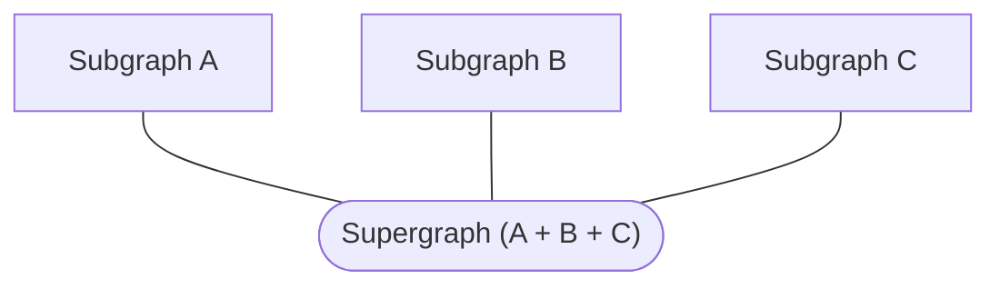

> 📣 **Federation 2 demo:** In addition to completing this tutorial, you can [clone our Federation 2 demo on GitHub](https://github.com/apollographql/supergraph-demo-fed2). The demo is distinct from the project you create in this tutorial, and it helps demonstrate many concepts of Federation 2.

Hello! This tutorial gets you up and running with Apollo Federation 2. It currently requires [Node.js version 12 or 14](https://nodejs.org/en/download/).

## Federation concepts

Before we start setting up our project, let's quickly cover what Apollo Federation _is_.

In a federated architecture, multiple GraphQL APIs are [composed](../federated-types/composition/) into a single federated graph. The individual APIs are called **subgraphs**, and they're composed into a **supergraph**:



Usually, each subgraph corresponds to a different service in your backend. The supergraph is then represented by a **gateway**, which routes each incoming query to the appropriate combination of subgraphs and returns the combined result.

The supergraph's schema is the combination of each subgraph's schema, plus some special federation-specific directives.

This architecture enables clients to query data from _all_ subgraphs _simultaneously_, just by querying the gateway. It also enables different teams to own independent parts of a unified graph.

### Supergraph schema composition

As a best practice, the gateway _does not_ compose its own supergraph schema. Instead, a separate process composes the schema and provides it to the gateway. This helps improve reliability and reduce downtime when you make changes to a subgraph.

There are multiple ways to compose a supergraph schema from subgraph schemas:

* Via **managed federation** in Apollo Studio (we'll start with this)
* On our local machine with the Rover CLI (we'll do this in [Part 3](./local-composition/))

Using managed federation is strongly recommended for production environments. Meanwhile, composing with Rover can be useful for local development and CI environments.

Now that we have a high-level understanding of federation concepts, let's jump in!

## Example subgraphs

This tutorial uses two Apollo-hosted subgraphs for an example application: a Products subgraph and a Reviews subgraph. Here are their schemas for reference:

<ExpansionPanel title="Products">

URL: `https://rover.apollo.dev/quickstart/products/graphql`

```graphql:title=Products
type Product @key(fields: "id") {
  id: ID!
  title: String
  url: String
  description: String
  price: Price
  salesRank(category: ProductCategory = ALL): Int
  salesRankOverall: Int
  salesRankInCategory: Int
  category: ProductCategory
  images(size: Int = 1000): [String]
  primaryImage(size: Int = 1000): String
}

type Price {
  cost: Money

  """A number between 0 and 1 signifying the % discount"""
  deal: Float
  dealSavings: Money
}

type Department {
  category: ProductCategory
  url: String
}

enum ProductCategory {
  ALL
  GIFT_CARDS
  ELECTRONICS
  CAMERA_N_PHOTO
  VIDEO_GAMES
  BOOKS
  CLOTHING
}

type Money {
  amount: Float
  currencyCode: CURRENCY_CODE
}

enum CURRENCY_CODE {
  USD
  EUR
}

type Query {
  bestSellers(category: ProductCategory = ALL): [Product]
  categories: [Department]
  product(id: ID!): Product
}
```

</ExpansionPanel>

<ExpansionPanel title="Reviews">

URL: `https://rover.apollo.dev/quickstart/reviews/graphql`

```graphql:title=Reviews
type Review @key(fields: "id") {
  id: ID!
  rating: Float
  content: String
}

type ReviewSummary {
  totalReviews: Int
  averageRating: Float
}

type Product @key(fields: "id") {
  id: ID! @external
  reviews: [Review]
  reviewSummary: ReviewSummary
}
```

</ExpansionPanel>

## 1. Install the Rover CLI

**Rover** is Apollo's CLI for managing graphs, including federated ones. We'll use it throughout this quickstart.

### Core binary

> ⚠️ If you already have Rover globally installed and you installed it with `npm`, first _uninstall_ that version with `npm uninstall @apollo/rover`. This is required for the Federation 2 preview.
>
> The Federation 2 preview requires Rover v0.4.5 or later.

Install the core Rover binary with the appropriate command for your system:

```bash
# MacOS / Unix-like
curl -sSL https://rover.apollo.dev/nix/latest | sh
```

```bash
# Windows
iwr 'https://rover.apollo.dev/win/latest' | iex
```

### Federation 2 plugin

To use Federation 2 schema composition, you _also_ need to install Rover's Federation 2 plugin:

```bash
# MacOS / Unix-like
curl https://rover.apollo.dev/plugins/rover-fed2/nix/latest | sh
```
```bash
# Windows
iwr https://rover.apollo.dev/plugins/rover-fed2/win/latest | iex
```

After installing, run `rover` in your terminal with no arguments to confirm that it installed successfully.

> During the Federation 2 preview, your installed versions of Rover and its Federation 2 plugin must be _identical_. If you encounter an error when using the plugin, try updating _both_ binaries to their latest version.

## 2. Create a new gateway project

As mentioned [above](#federation-concepts), your federated supergraph is represented by a **gateway** that routes queries to various subgraphs. For this tutorial, we'll use some Apollo-hosted example services as our subgraphs, and we'll set up our own gateway in front of them.

With the help of the `@apollo/gateway` library, [Apollo Server](https://www.apollographql.com/docs/apollo-server/) will act as our federated gateway.

On your development machine, first create a new project directory for your Node.js gateway. Then inside that directory, run the following to create a `package.json` file:

```shell
npm init
```

Next, install the following required libraries:

```shell
npm install apollo-server @apollo/gateway@latest-2 graphql
```

> ⚠️ To support the Federation 2 preview, you need to install `@apollo/gateway@latest-2` specifically, _not_ `@apollo/gateway`.

Finally, create a file named `index.js` and paste the following into it as a minimal (not-yet-functional) gateway implementation:

```js:title=index.js
const { ApolloServer } = require('apollo-server');
const { ApolloGateway } = require('@apollo/gateway');

const gateway = new ApolloGateway();

const server = new ApolloServer({
  gateway,
  // Subscriptions are not currently supported in Apollo Federation
  subscriptions: false
});

server.listen().then(({ url }) => {
  console.log(`🚀 Gateway ready at ${url}`);
}).catch(err => {console.error(err)});
```

This code demonstrates the necessary steps for creating a gateway:

1. We initialize an `ApolloGateway` instance.

2. We initialize an `ApolloServer` instance and pass it our gateway via the `gateway` option.

3. We call `listen` on our server instance to begin listening for incoming requests.

If we run this code as-is with `node index.js`, we get an error:

```
Error: When a manual configuration is not provided, gateway requires an Apollo configuration.
```

That's because we aren't currently providing a supergraph schema to our gateway! We'll fix that soon.

## 3. Obtain your subgraph schemas

To compose our supergraph schema, Apollo Studio needs the following information about each of our subgraphs:

* The subgraph's schema
* The URL of the subgraph's GraphQL endpoint (which must be accessible by the gateway)

Fortunately, we have all of this information! Let's collect it in our project.

Do the following in your project's root directory:

1. Create a new file called `products.graphql` and paste the following schema into it:

    <ExpansionPanel title="Products">

    ```graphql:title=products.graphql
    type Product @key(fields: "id") {
      id: ID!
      title: String
      url: String
      description: String
      price: Price
      salesRank(category: ProductCategory = ALL): Int
      salesRankOverall: Int
      salesRankInCategory: Int
      category: ProductCategory
      images(size: Int = 1000): [String]
      primaryImage(size: Int = 1000): String
    }

    type Price {
      cost: Money

      """A number between 0 and 1 signifying the % discount"""
      deal: Float
      dealSavings: Money
    }

    type Department {
      category: ProductCategory
      url: String
    }

    enum ProductCategory {
      ALL
      GIFT_CARDS
      ELECTRONICS
      CAMERA_N_PHOTO
      VIDEO_GAMES
      BOOKS
      CLOTHING
    }

    type Money {
      amount: Float
      currencyCode: CURRENCY_CODE
    }

    enum CURRENCY_CODE {
      USD
      EUR
    }

    type Query {
      bestSellers(category: ProductCategory = ALL): [Product]
      categories: [Department]
      product(id: ID!): Product
    }
    ```

    </ExpansionPanel>

2. Create a new file called `reviews.graphql` and paste the following schema into it:

    <ExpansionPanel title="Reviews">

    ```graphql:title=reviews.graphql
    type Review @key(fields: "id") {
      id: ID!
      rating: Float
      content: String
    }

    type ReviewSummary {
      totalReviews: Int
      averageRating: Float
    }

    type Product @key(fields: "id") {
      id: ID!
      reviews: [Review]
      reviewSummary: ReviewSummary
    }
    ```

    </ExpansionPanel>

> 💡 **In most federated graphs,** each subgraph schema lives inside its associated subgraph's codebase. Because we're using remotely hosted example subgraphs, we're saving these subgraph schemas in our gateway project for convenience.

## 4. Sign up for Apollo Studio

Before we can compose our supergraph schema with Apollo Studio, we need a Studio account! Let's create one if you don't have one yet.

Complete the first two steps of <a href="https://www.apollographql.com/docs/studio/getting-started/" target="_blank">Get started with Apollo Studio</a> (**Create your account** and **Create your first graph**), then return here.

> For future steps, you'll need the name of the graph you just created in Apollo Studio. Make sure to have it available.

## 5. Authenticate Rover with Studio

We're going to use the Rover CLI to publish our subgraph schemas to Studio. In order to do _that_, we first need to authenticate Rover with Studio.

Complete the first two steps of <a href="https://www.apollographql.com/docs/rover/configuring/" target="_blank">Configuring Rover</a> (**Obtain an API key** and **Provide the API key to Rover**), then return here.

---

Our gateway project is ready, we've installed Rover, and we have a Studio account! Next, we'll start [composing our supergraph schema in Studio.](./studio-composition/)
