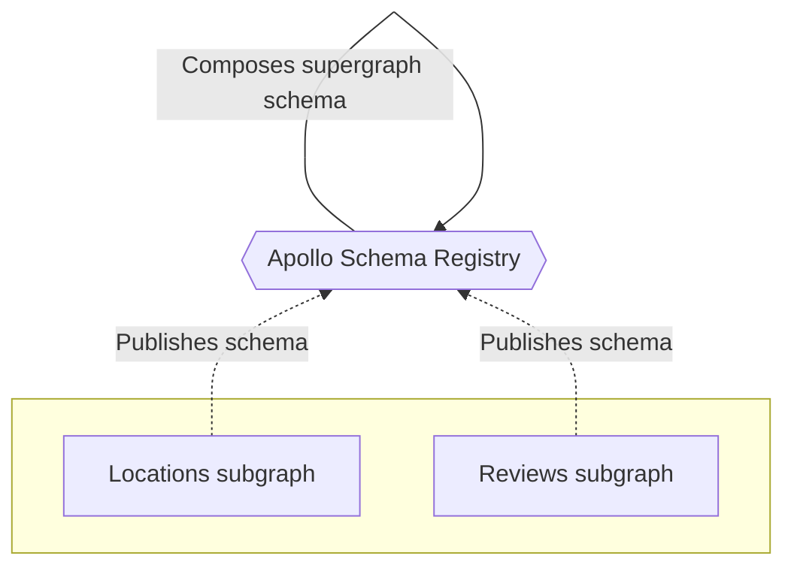
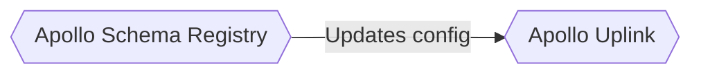
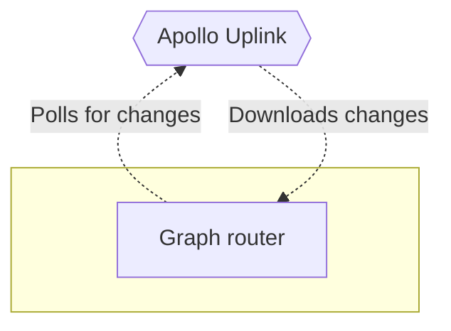

Now that our project and tools are set up, we can start composing our supergraph schema with GraphOS Studio.

## Managed federation concepts

To compose our supergraph schema with Studio, we use a feature called  _managed federation_. With managed federation, each of our subgraphs publishes its schema to Apollo. Whenever a subgraph schema changes, Apollo attempts to compose a new supergraph schema.



Whenever composition succeeds, Apollo pushes an updated supergraph schema to _Apollo Uplink_, a special endpoint that routers use to fetch their configuration:



Meanwhile, our running graph router regularly polls Uplink for changes to its supergraph schema:



Whenever an update is available, the router downloads it and automatically begins using the new supergraph schema, without requiring a restart.

We strongly recommended managed federation for reducing downtime in your production supergraph. Let's set it up!

## 1. Register your subgraph schemas

Let's return to our router project. We can now use Rover's `subgraph publish` command to register our subgraph schemas with Apollo.

Run the following from your project directory, substituting your Studio graph's _graph ref_ where indicated:

<ExpansionPanel title="What's a graph ref?">

A graph ref uniquely identifies a particular variant of a particular registered graph in GraphOS Studio. Every graph ref is a string with the following format:

`graph-id@variant-name`

If you open your graph's README page in GraphOS Studio, its graph ref is displayed as the top-level header of the page:


Every Studio graph is initially created with a single variant named `current`.

</ExpansionPanel>

```shell {1}
rover subgraph publish YOUR_GRAPH_REF \
  --routing-url https://flyby-locations-sub.herokuapp.com/ \
  --schema ./locations.graphql \
  --name locations
```

If the command is successful, you'll see output like the following:

```
A new subgraph called 'locations' for the 'docs-example-graph@current' graph was created
The gateway for the 'docs-example-graph' graph was updated with a new schema, composed from the updated 'locations' subgraph
```

Nice! If you open your graph's details in Studio now, you'll see types and fields from our `locations` subgraph listed in the Schema tab:


Now, let's do the same thing for our `reviews` subgraph, again substituting your graph ref where indicated:

```shell {1}
rover subgraph publish YOUR_GRAPH_REF \
  --routing-url https://flyby-reviews-sub.herokuapp.com/ \
  --schema ./reviews.graphql \
  --name reviews
```

If you refresh the Schema tab in Studio, you'll now see types and fields from our `reviews` service as well.

Now that we've published our subgraph schemas, GraphOS Studio automatically composes them into a supergraph schema. However, our router doesn't know how to fetch that schema from Apollo. We'll tackle that next.

## 2. Authenticate the router with GraphOS Studio

It's time to enable our router to fetch its supergraph schema from Apollo. To do that, we'll need a graph API key that we set as the value of an environment variable.

<Caution>

API keys are secret credentials. Never share them outside your organization or commit them to version control. Delete and replace API keys that you believe are compromised.

</Caution>

1. Obtain a graph API key for your Studio graph by <a href="/graphos/api-keys/" target="_blank">following these steps</a>. If you have an Enterprise plan, set the API key's role to **Contributor**.

    - Make sure to copy and paste the API key's value somewhere so you can reference it (for security, API keys are not visible in Studio after creation).

2. Paste the following terminal command into your text editor so you can make changes to it:

    ```bash
    APOLLO_KEY=your-api-key \
    APOLLO_GRAPH_REF=your-graph-id@your-variant \
    ./router
    ```

    Then, make the following changes:

    - Replace `your-api-key` with your graph API key.
    - Replace `your-graph-id@your-variant` with your graph's graph ref.
        - For a refresher on graph refs, see [Step 1](#1-register-your-subgraph-schemas).

3. Paste the edited command into your terminal and run it.

    This time there's no error, and you'll see output similar to the following:

    <ExpansionPanel title="Click to expand">

    ```
    2022-07-27T23:49:11.362235Z  INFO apollo_router::executable: Apollo Router v0.12.0 // (c) Apollo Graph, Inc. // Licensed as ELv2 (https://go.apollo.dev/elv2)
    2022-07-27T23:49:11.367689Z  INFO apollo_router::state_machine: transitioned to startup
    2022-07-27T23:49:11.368352Z  INFO apollo_router::state_machine: transitioned to startup
    2022-07-27T23:49:12.968871Z  INFO apollo_router::plugins::telemetry::metrics::apollo: GraphOS Studio usage reporting is enabled. See https://go.apollo.dev/o/data for details
    2022-07-27T23:49:12.975441Z  INFO apollo_router::router_factory: list of plugins plugin_details=[("apollo.telemetry", "apollo_router::plugins::telemetry::Telemetry"), ("experimental.include_subgraph_errors", "apollo_router::plugins::include_subgraph_errors::IncludeSubgraphErrors"), ("apollo.csrf", "apollo_router::plugins::csrf::Csrf")]
    2022-07-27T23:49:13.175090Z  INFO apollo_router::axum_http_server_factory: GraphQL endpoint exposed at http://127.0.0.1:4000/ 🚀
    2022-07-27T23:49:13.175546Z  INFO apollo_router::state_machine: transitioned to running
    ```

    </ExpansionPanel>

  <Note>
  
  By providing an API key to the router, you also automatically enable federated trace reporting to GraphOS Studio, enabling you to view helpful performance metrics. [Learn more about federated traces.](../metrics/)

  </Note>

4. Optionally, to help you keep track of your router's environment variables, consider setting up a tool like [direnv](https://direnv.net/) so you don't need to set the variables every time you run `./router`.

    (Most cloud deployment environments provide a helpful way to set environment variables, so this issue is mostly limited to local development.)

Now that our router is running, we can quickly open our browser to [localhost:4000](http://localhost:4000/) to explore our composed schema in Apollo Sandbox:


While we're here, try executing some test queries against the supergraph!

## Moving forward

Nice work! We've registered two subgraph schemas with Apollo, and we have a graph router that then fetches the composed supergraph schema.

If we now publish changes to one of our subgraph schemas, our running router automatically fetches the corresponding changes to the supergraph schema (assuming composition succeeds).

Next, let's look at how to use the Rover CLI to compose a supergraph schema locally or in a CI environment. [Go to part 3.](./local-composition/)
