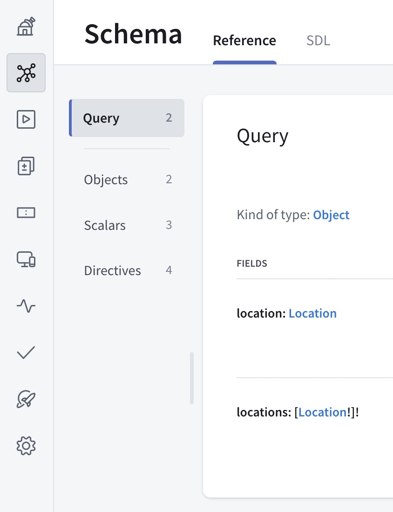
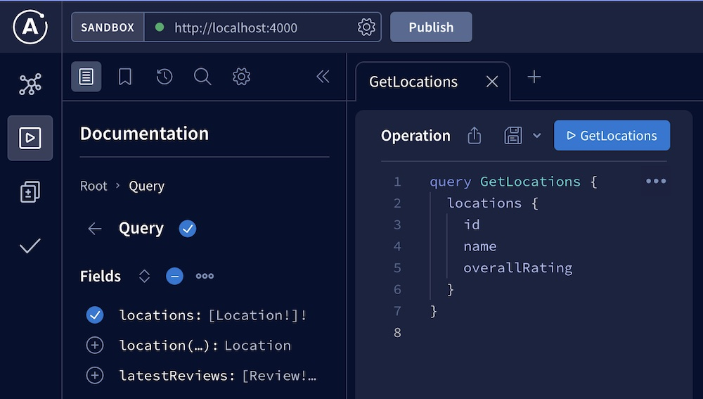

Now that our project and tools are set up, we can start composing our supergraph schema with Apollo Studio.

## Managed federation concepts

By composing our supergraph schema with Studio, we use a feature called  **managed federation**. With managed federation, each of our subgraphs registers its schema with Apollo. Whenever a subgraph schema changes, Apollo composes a new supergraph schema.


Whenever composition succeeds, Apollo pushes an updated supergraph schema to the **uplink**, a special endpoint that gateways use to fetch their configuration:


Meanwhile, our gateway regularly polls the uplink for changes to its supergraph schema:


Whenever an update is available, the gateway downloads it and automatically begins using the new supergraph schema, _without_ requiring a restart.

We strongly recommended managed federation for reducing downtime in your production supergraph. Let's set it up!

## 1. Register your subgraph schemas

Let's return to our gateway project. We can now use Rover's `subgraph publish` command to register our subgraph schemas with Apollo.

Run the following from your project directory, substituting your Studio graph's **graph ref** where indicated:

```shell {1}
rover subgraph publish ➡️YOUR_GRAPH_REF⬅️ \
  --routing-url https://rover.apollo.dev/quickstart/products/graphql \
  --schema ./products.graphql \
  --name products \
  --convert
```

<ExpansionPanel title="What's a graph ref?">

A **graph ref** uniquely identifies a particular variant of a particular registered graph in Apollo Studio. Every graph ref is a string with the following format:

`graph-id@variant`

If you open your graph's README page in Apollo Studio, its graph ref is displayed as the top-level header of the page:


Every Studio graph is initially created with a single variant named `current`.

</ExpansionPanel>

> The `--convert` option converts your Studio graph into a federated graph. You only need to provide this option once for a given Studio graph.

If the command is successful, you'll see output like the following:

```
A new subgraph called 'products' for the 'docs-example-graph' graph was created
The gateway for the 'docs-example-graph' graph was updated with a new schema, composed from the updated 'products' subgraph
```

Nice! If you open your graph's details in Studio now, you'll see types and fields from our `products` subgraph listed in the Schema tab:



Now, let's do the same thing for our `reviews` subgraph, **again substituting your graph ref where indicated**:

```shell {1}
rover subgraph publish ➡️YOUR_GRAPH_REF⬅️ \
  --routing-url https://rover.apollo.dev/quickstart/reviews/graphql \
  --schema ./reviews.graphql \
  --name reviews
```

If you refresh the Schema tab in Studio, you'll now see types and fields from our `reviews` service as well.

Now that we've published our subgraph schemas, Apollo Studio automatically composes them into a supergraph schema! However, our gateway doesn't know how to _fetch_ that schema from Apollo. We'll tackle that soon.

## 2. Enable Federation 2 support

To try out managed federation with the Federation 2 preview, you set your graph's federation version in Apollo Studio.

Open your graph's Settings page and find the Manage Variants section:


Click **Edit Build Configuration** for the variant you want to move to Federation 2. The following dialog appears:


In the Federation Version dropdown, select **Federation 2** and click **Save**.

Studio automatically begins composing your supergraph schema using Federation 2 composition logic. You can switch this back at any time.

## 3. Authenticate the gateway with Apollo Studio

It's time to enable our gateway to fetch its supergraph schema from Apollo! To do that, we'll need a **graph API key** that we set as the value of an **environment variable**.

> **API keys are secret credentials.** Never share them outside your organization or commit them to version control. Delete and replace API keys that you believe are compromised.

1. Obtain a graph API key for your Studio graph by <a href="https://www.apollographql.com/docs/studio/api-keys/#graph-api-keys" target="_blank">following these steps</a>.  Copy its value.

    _If you have an Enterprise plan, set the API key's role to `Contributor`._

2. Create a new file named `.env` in your Node.js project folder.

    * **Do not add the `.env` file to version control.** If you're working in a Git repository, add `.env` to your `.gitignore` file.

3. Paste the following into `.env`:

    ```shell
    APOLLO_KEY=your-api-key
    APOLLO_GRAPH_REF=your-graph-id@your-variant
    ```

    * Replace `your-api-key` with your graph API key.
    * Replace `your-graph-id@your-variant` with your graph's **graph ref**. (For details on graph refs, see [Step 1](#1-register-your-subgraph-schemas).)

4. Add the `dotenv` Node.js library to your project:

    ```shell
    npm install dotenv
    ```

    This library takes care of reading environment variable values from your `.env` file.

5. Add the following line to the _very top_ of `index.js`:

  ```js
  require('dotenv').config()
  ```

6. Start up your gateway with `node index.js`. This time there's no error, and you'll see output similar to the following:

    ```
    Apollo usage reporting starting! See your graph at https://studio.apollographql.com/graph/docs-example-graph@current/
    🚀 Gateway ready at http://localhost:4000/
    ```

> By providing an API key to your gateway, you also automatically enable **federated trace reporting** to Apollo Studio, enabling you to view helpful performance metrics. [Learn more about federated traces.](../metrics/)

We can quickly open our browser to [studio.apollographql.com/sandbox](https://studio.apollographql.com/sandbox) to explore our composed schema in Apollo Sandbox:



While we're here, you can even execute some test queries against the supergraph.

## Moving forward

Nice work! We've registered two **subgraph schemas** with Apollo, and we have a **federated gateway** that then fetches the composed **supergraph schema**.

If we were now to register changes to one of our subgraph schemas, our running gateway would automatically fetch the corresponding changes to the supergraph schema.

Next, let's look at how to use the Rover CLI to compose a supergraph schema locally or in a CI environment. [Go to part 3.](./local-composition/)
