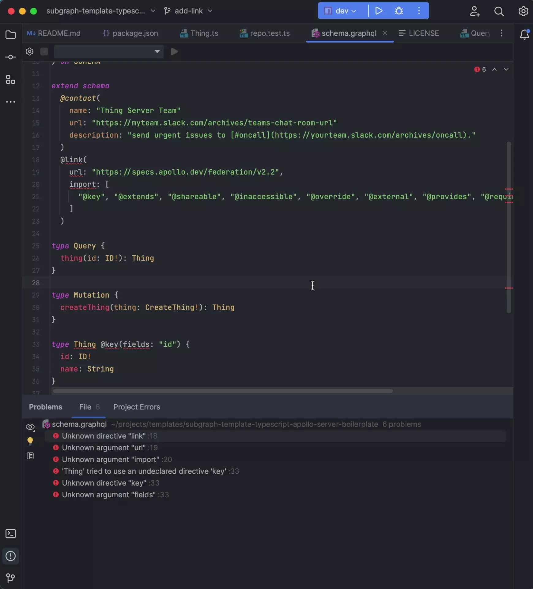

Many IDEs provide features to streamline federated GraphQL development, such as GraphQL-aware syntax highlighting, inline performance information, and autocomplete for fields, types, and federation directives. Learn how to enable federation-specific features in tools like VS Code and JetBrains IDEs.

## Visual Studio Code

Apollo's [VS Code Extension](https://marketplace.visualstudio.com/items?itemName=apollographql.vscode-apollo) provides an all-in-one tooling experience for developing apps with Apollo. See the [dedicated documentation page](/vs-code-extension) for configuration details. If you're developing with Apollo Connectors, refer to the connectors-specific [VS Code Extension page](/graphos/schema-design/connectors/vs-code).

## JetBrains

The [GraphQL Plugin for JetBrains](https://plugins.jetbrains.com/plugin/8097-graphql/) provides federation-specific development features, such as autocomplete for federation directives. However, you must enable this federation support after installing the plugin. Otherwise, your IDE might display unexpected errors while you're working with a subgraph schema.

### Setup

To enable federation support, do the following in your IDE after installing the plugin:

1. Open your IDE's **Settings** window.
2. Expand the **Languages & Frameworks** section.
3. Click **GraphQL**.
4. Check the **Federation** checkbox.

This plugin supports all IntelliJ-based IDEs, including:

- IntelliJ IDEA
- PyCharm
- PhpStorm
- WebStorm
- CLion
- RubyMine
- Rider
- GoLand

## Additional resources

If your graph uses the Apollo Router, make sure to enable [router configuration awareness](/graphos/reference/router/configuration#configuration-awareness-in-your-text-editor) in your editor.
