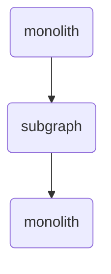
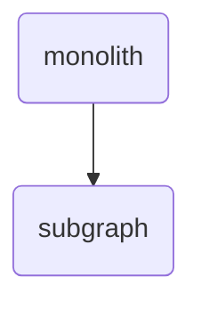
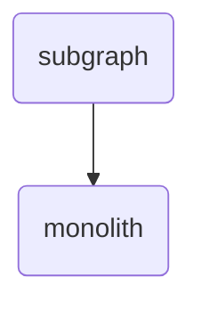

<Tip>

For a complete, step-by-step tutorial, check out [Voyage II: Federating the monolith](https://www.apollographql.com/tutorials/voyage-part2).

</Tip>

As with any monolithic service, teams can struggle to change and maintain their GraphQL API as it grows larger and receives contributions from more developers.

Breaking up the monolith into smaller GraphQL APIs might be the right strategy for your team. With Apollo Federation, you can break up a monolith without sacrificing the unified API that your client applications depend on. Each _subgraph_ can be independently updated, deployed, and scaled while contributing to a single unified schema.

Here are the steps we recommend to convert a monolithic GraphQL API into a federated GraphQL API.

## Planning and preparation

### 1. Put a router in front of your existing API

Start the process by making a "federated graph of one." Your existing monolith can act as a subgraph without any schema changes.

1. If you're not already publishing your schema to GraphOS Studio, create a new graph in your Studio organization. Choose "Supergraph" for your graph architecture.
1. Publish your monolith schema to GraphOS Studio as a subgraph with the following command (modify your `--routing-url` and `--schema` path as needed):

   ```sh
   rover subgraph publish --name monolith \
     --schema ./schema.graphql \
     --routing-url http://monolith.prod.svc.cluster.local/graphql \
     --convert # necessary if you're publishing to an existing variant
   ```

1. Deploy an instance of the GraphOS Router to your environment.
   <EnterpriseFeature>

    Self-hosting the GraphOS Router is limited to [GraphOS Enterprise plans](https://www.apollographql.com/pricing). Other plan types use [managed cloud routing with GraphOS](/graphos/cloud-routing). Check out the [pricing page](https://www.apollographql.com/pricing/) to learn more.

   </EnterpriseFeature>
1. Set up [header propagation](/router/configuration/header-propagation/) so that the monolith receives any necessary headers from the router.
1. Set up internal routing rules to redirect client requests to the router instead of your monolith.
1. Enable usage metrics reporting to GraphOS Studio.
1. Add [subgraph checks](/graphos/platform/schema-management/checks/) to your monolith's CI pipeline.

At this point, client requests go to your new router instead of the monolith, but it's serving the same schema so clients won't know the difference.

Not only are you prepared to federate your schema, you now have field-level visibility into graph usage and breaking change detection.

### 2. Identify entities

Next, look through all the types in your schema and identify possible [entities](/graphos/schema-design/federated-schemas/entities/intro#entity-overview). Entities are types that form the foundation of your data model, and they must include fields that can uniquely identify each instance of them.

Consider this schema for a travel booking site:

<ExpansionPanel title="Click to expand">

```graphql
type Account {
  id: ID!
  username: String
  user: User
  profile: Profile
}

type Address {
  line1: String
  line2: String
  city: String
  state: String
  zip: String
}

type Airline {
  id: ID!
  name: String
}

type Airplane {
  id: ID!
  class: String
}

type Airport {
  code: AirportCode!
  airlines: [Airline]
}

type Amenity {
  name: String
  description: String
  photoUrl: String
}

type Bed {
  id: ID!
  size: BedSize
  room: Room
}

type CancellationPolicy {
  text: String
  updatedAt: DateTime
}

type Flight {
  number: FlightNumber!
  airplane: Airplane
  origin: Airport
  destination: Airport
  scheduledTakeoff: DateTime
}

type Hotel {
  id: ID!
  name: String
  address: Address
}

type Profile {
  name: String
  address: Address
  phone: String
  email: String
}

type Reservation {
  account: Account
  flights: [Flight]
  hotels: [Hotel]
}

type Room {
  number: ID!
  floor: Int
  hotel: Hotel
}

type Seat {
  number: ID!
  airplane: Airplane
}

type User {
  id: ID!
  account: Account
  username: String
  reservations: [Reservation]
}

type Query {
  me: User
  searchHotels(input: SearchHotelInput!): [Hotel]
  searchFlights(input: SearchFlightInput!): [Flight]
}
```

</ExpansionPanel>

Types such as `User`, `Reservation`, `Flight`, and `Hotel` are uniquely identifiable, whereas `Profile`, ` CancellationPolicy`, and `Amenity` are basically groups of attributes attached to those entities.

### 3. Group entities

After you've identified your entities, group them by their logical domain or concern. These groups usually correspond to product boundaries, but they might also be team boundaries. This is how you'll determine how many subgraphs you'll end up with.

| Accounts domain | Flights domain | Hotels domain |
| --------------- | -------------- | ------------- |
| `Account`       | `Airplane`     | `Bed`         |
| `User`          | `Airline`      | `Hotel`       |
|                 | `Flight`       | `Reservation` |
|                 | `Reservation`  | `Room`        |
|                 | `Seat`         |               |

### 4. Rank entities by ease of migration

When you're deciding how to start migrating types to other subgraphs, it's helpful to consider a few things first:

#### How many related types will you have to migrate at the same time?

Count the number of value types associated with an entity. You'll need to copy all those types over to the new subgraph when you migrate the entity. Entities with fewer related scalars, enums, and non-entity object types will be a bit easier to migrate.

You won't need to move related entities at the same time as long as you can return an [entity reference](/graphos/schema-design/federated-schemas/entities/contribute-fields#referencing-an-entity-without-contributing-fields). For example, you can move the `Room` type if you have access to the `Hotel` foreign key:

```graphql title="Hotels subgraph"
type Room @key(fields: "number") {
  number: ID!
  floor: Int
  hotel: Hotel
}

type Hotel @key(fields: "id", resolvable: false) {
  id: ID! # comes from rooms.hotel_id in the database
}
```

It might be safer and easier to move the entire `Room` type but only a "stub" of the `Hotel` type. The query planner can fetch the rest of the `Hotel` fields from the monolith until you move that type as well.

#### How complex will your query plans become during the migration?

If you start by moving a type that's deeply interconnected with other types, you might introduce unnecessary complexity to your router's query plans. For example, consider this query:

```graphql
query MyFlights {
  me {
    reservations {
      flights {
        ...FlightDetails
      }
    }
  }
}
```

This query returns a list of `Reservation` objects belonging to a particular `User`, and each `Reservation` contains a list of `Flight`s. If you start by moving the `Reservation` type to another subgraph, this query results in an "A→B→A" query plan (fetching the `User`, then the `Reservation`, then the `Flight` in three serial subgraph fetches):



A better choice at this stage might be to move the `Flight` type so that the query plan is much more efficient, fetching both the `User` and `Reservation` together before fetching the `Flight`:



When you move a type to another subgraph, you should also move all root-level fields that return that type (such as `Query.flight(id:)`. This way, objects of that type can be returned with only a single subgraph operation in the best case. And in the general case, the query plan can fetch any additional data with fewer total subgraph operations:



Inevitably, some query plans become more complex while you're migrating types between subgraphs. By ranking your entities and moving the lowest-impact ones first, you can minimize this increase.

## Implementation

### 1. Make your monolith a real subgraph

Now that you have a migration plan, you can start making schema and code changes. The first change is to add the [Apollo Federation subgraph specification](/federation/subgraph-spec/) to the monolith. The steps involved depend on which [Apollo-Federation-compatible library](/graphos/reference/federation/compatible-subgraphs) you use with your monolith's language and framework.

The most important functionality to add is defining your entities (by adding `@key` directives) and adding their [reference resolvers](/graphos/schema-design/federated-schemas/entities/intro#defining-an-entity).

### 2. Deploy your new subgraph

Start with an empty subgraph to quickly set up your deployment and continuous integration pipelines. You can use this stub subgraph schema, which won't affect the client-facing schema:

```graphql
extend schema @link(url: "https://specs.apollo.dev/federation/v2.0", import: ["@shareable", "@inaccessible"])

type Query {
  _todo: String @shareable @inaccessible
}
```

After your new subgraph is deployed, set up [schema checks and publishes](/rover/commands/subgraphs#publishing-a-subgraph-schema-to-graphos) so that you can catch composition errors quickly and start contributing to the supergraph.

### 3. Move an entity along with related types and relevant root fields

1. Start by marking all the value types (enums and non-entity object types) you're going to move to the subgraph as `@shareable` in the monolith.
2. Copy the types and fields over to the subgraph schema and port their resolvers from the monolith.
3. Deploy the subgraph and test it by making calls to it directly. Use the [`_entities` root field](/federation/building-supergraphs/subgraphs-overview/#query_entities) to test joins between entities.

When you're satisfied with the behavior and performance of your new subgraph, you can start moving all traffic to it and cleaning up the monolith.

1. Use the [`@override`](/graphos/reference/federation/directives/#override) directive to mark fields in the subgraph with `@override(from: "monolith")`, telling the query planner to prefer the new subgraph over the monolith.
2. Remove types and fields from the monolith schema.
3. Delete unneeded resolvers from the monolith.
4. Remove `@override` directives from the subgraph.
5. Remove `@shareable` from types and fields in the subgraph when appropriate.

### 4. Migrate additional functionality out of the monolith as desired

Towards the end of the migration, you can decide whether to leave the monolith in place to handle the few entities that sit in the middle of your domain (such as `User`), or completely deconstruct the monolith into new services and decommission it. Either way, your newly federated GraphQL API is well-positioned to scale even larger in the future.
