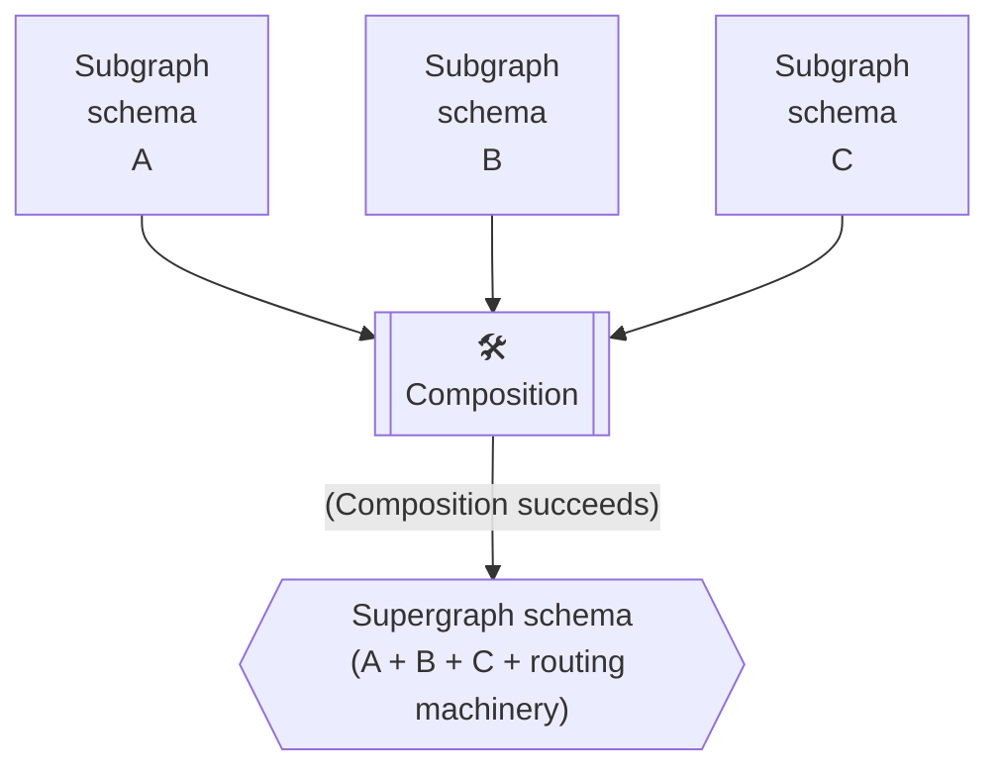
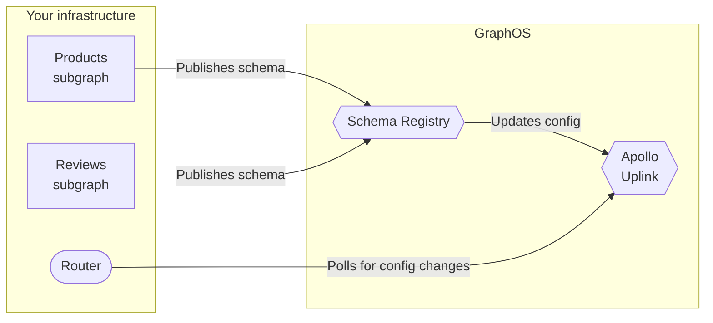

In Apollo Federation, _composition_ is the process of combining a set of subgraph schemas into a supergraph schema:



The supergraph schema includes all of the type and field definitions from your subgraph schemas. It also includes metadata that enables your router to intelligently route incoming GraphQL operations across all of your different subgraphs.

## Supported methods

You can perform schema composition with any of the following methods:

### Automatically with GraphOS

Apollo GraphOS performs composition automatically whenever you publish a subgraph schema.
This enables your running router to dynamically fetch an updated supergraph schema from Apollo as soon as it's available:



<Note>

GraphOS also provides a [schema linter](/graphos/platform/schema-management/linting) with [composition specific rules](/graphos/platform/schema-management/linting/rules#composition-rules) to help you follow best practices. You can set up schema checks for your graph in GraphOS Studio or perform one-off linting with the Rover CLI. Check out the [schema linting](/graphos/platform/schema-management/linting) docs to learn more.

</Note>

### Manually with the Rover CLI

The [Rover CLI](https://www.apollographql.com/docs/rover/) supports a `supergraph compose` command that you can use to compose a supergraph schema from a collection of subgraph schemas:

```bash showLineNumbers=false
rover supergraph compose --config ./supergraph-config.yaml
```

To learn how to install Rover and use this command, see the [Rover docs](/rover/).

## Breaking composition

Sometimes, your subgraph schemas might conflict in a way that causes composition to fail. This is called _breaking composition_.

For example, take a look at these two subgraph schemas:

<p style="margin-bottom: 0">❌</p>
<CodeColumns>

```graphql {2} title="Subgraph A"
type Event @shareable {
  timestamp: String!
}
```

```graphql {2} title="Subgraph B"
type Event @shareable {
  timestamp: Int!
}
```

</CodeColumns>

One subgraph defines `Event.timestamp` as a `String`, and the other defines it as an `Int`. Composition doesn't know which type to use, so it fails.

<Note>

For examples of valid inconsistencies in field return types, see [Differing shared field return types](/graphos/schema-design/federated-schemas/sharing-types/#return-types).

</Note>

Breaking composition is a helpful feature of federation! Whenever a team modifies their subgraph schema, those changes might conflict with another subgraph. But that conflict won't affect your router, because composition fails to generate a new supergraph schema. It's like a compiler error that prevents you from running invalid code. Refer to the [Composition Rules Reference](/graphos/reference/federation/composition-rules) for details.

## Next steps

Ready to compose your first supergraph? [Get started with GraphOS!](/graphos/get-started/guides/quickstart)
