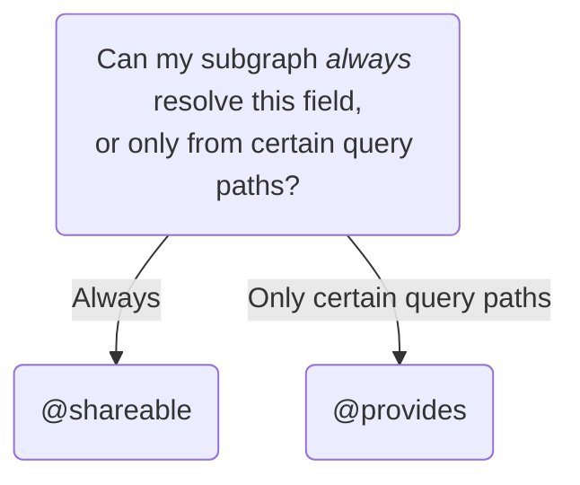

By default, exactly one subgraph resolves each field in your supergraph schema, with exceptions like entity `@key` fields.
Sometimes, multiple subgraphs can resolve a specific entity field because they share access to a data store.
For example, an Inventory subgraph and a Products subgraph might both have access to the same database that stores all product-related data.

This guide explains how you can enable different subgraphs to resolve the same field as a performance optimization.

## Enable subgraphs to resolve the same field

You can optionally enable multiple subgraphs to resolve a particular entity field.
Then, when the router plans a query's execution, it looks at which fields are available from each subgraph.
The router can optimize performance by executing the query across the fewest subgraphs needed.

To do this, use one of the following directives:

- `@shareable`
- `@provides`

Which directive you use depends on the following logic:



If you aren't sure whether your subgraph can always resolve a field, see [Using `@provides`](#using-provides) for an example of a subgraph that can't.

### Ensure resolver consistency

If multiple subgraphs can resolve a field, ensure each subgraph's resolver behaves identically for that field.
Otherwise, queries might return inconsistent results to clients depending on which subgraph resolves the field.

This consistency is especially important to enforce when changing an existing resolver.
Clients might observe inconsistent results if you don't make the resolver changes to each subgraph simultaneously.

Common inconsistent resolver behaviors to look out for include:

- Returning a different default value
- Throwing different errors in the same scenario

### Using `@shareable`

<Note>

Before using `@shareable`, see [Ensure resolver consistency](#ensure-resolver-consistency).

</Note>

The `@shareable` directive indicates that more than one subgraph can resolve a particular field.
You can use it like so:

<CodeColumns>

```graphql {3} title="Products subgraph"
type Product @key(fields: "id") {
  id: ID!
  name: String! @shareable
  price: Int
}
```

```graphql {3} title="Inventory subgraph"
type Product @key(fields: "id") {
  id: ID!
  name: String! @shareable
  inStock: Boolean!
}
```

</CodeColumns>

In this example, both the Products and Inventory subgraphs can resolve `Product.name`.
That means queries including `Product.name` can sometimes be resolved with fewer subgraph fetches.

<Note>

If a field is marked `@shareable` in any subgraph, it must be marked `@shareable` or `@external` in every subgraph that defines it. Otherwise, composition fails.

</Note>

### Using `@provides`

<Note>

Before using `@provides`, see [Ensure resolver consistency](#ensure-resolver-consistency).

</Note>

The `@provides` directive indicates that a particular field can be resolved by a subgraph at a particular query path.
For example, suppose the Inventory subgraph can resolve `Product.name`, but only when that product is part of an `InStockCount`.
You can indicate this like so:

```graphql {2,8} title="Inventory subgraph"
type InStockCount {
  product: Product! @provides(fields: "name")
  quantity: Int!
}

type Product @key(fields: "id") {
  id: ID!
  name: String! @external
  inStock: Boolean!
}
```

Notice the Inventory subgraph uses two directives:

- The `@provides` directive tells the router, "This subgraph can resolve the `name` of any `Product` object returned by `InStockCount.product`."
- The `@external` directive tells the router, "This subgraph can't resolve the `name` of a `Product` object, except wherever indicated by `@provides`."

#### Rules for using `@provides`

<Note>

Violating any of these rules causes composition to fail.

</Note>

- If a subgraph `@provides` a field that it can't always resolve, the subgraph must mark that field as `@external` and must not mark it as `@shareable`.
  - Remember, a `@shareable` field can always be resolved by a particular subgraph, which removes the need for `@provides`.
- To include a field in a `@provides` directive, that field must be marked as `@shareable` or `@external` in every subgraph that defines it.
