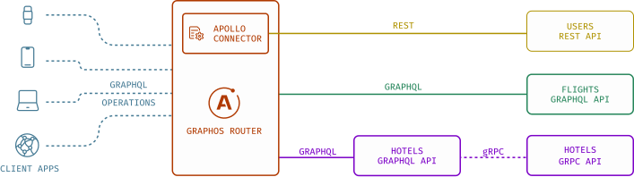
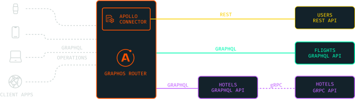
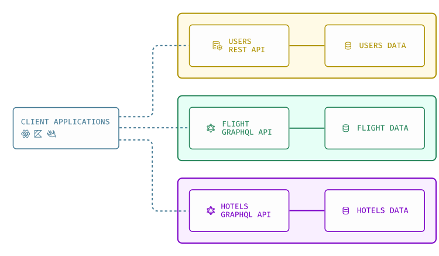
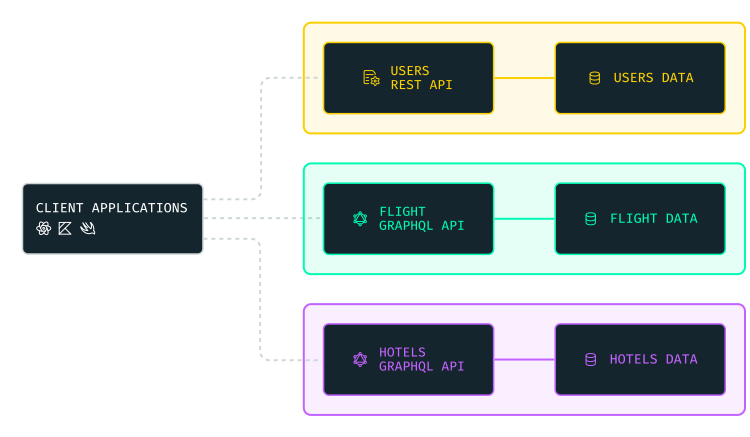
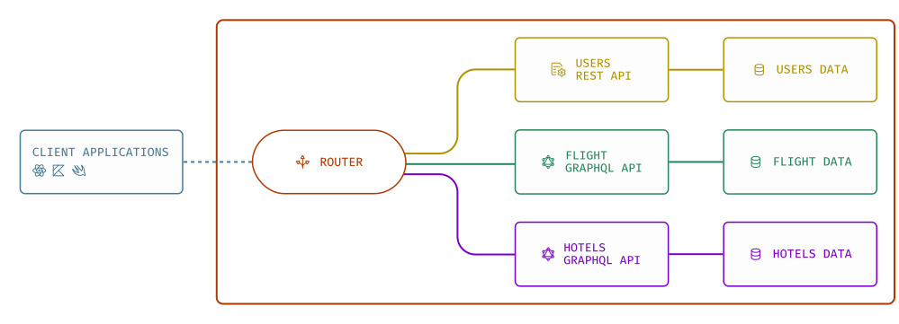
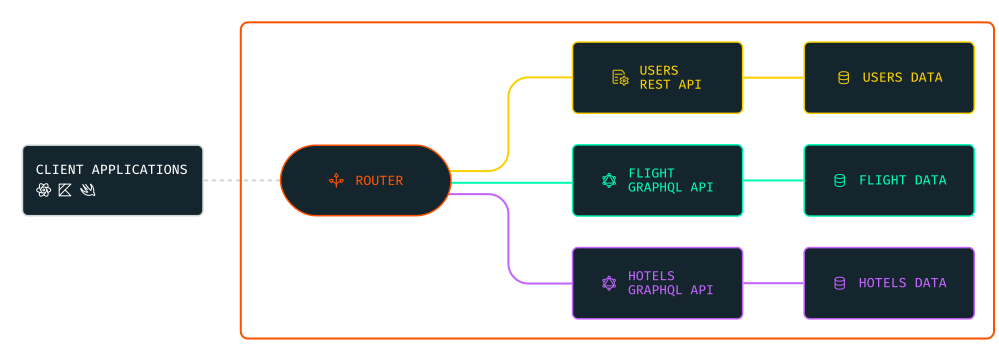
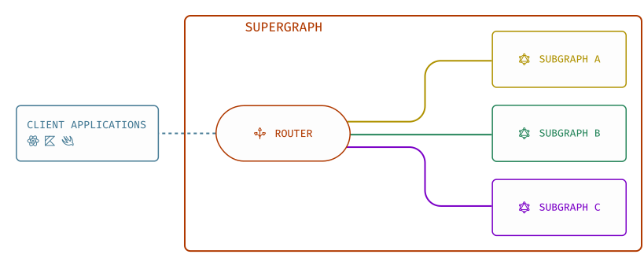
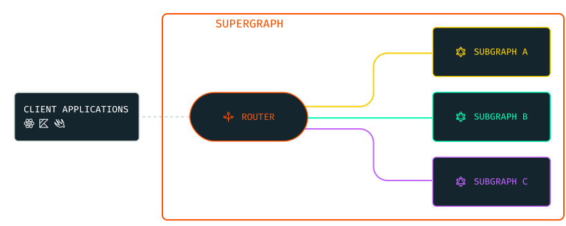

Apollo Federation enables you to declaratively combine multiple APIs into a single federated graph. A client makes a single request to this federated graph, and it orchestrates calls to multiple APIs to produce a single response.  

A client makes a request to the federated GraphQL API's single entry point called the _router_. The router intelligently orchestrates and distributes the request across your APIs and returns a unified response. For a client, the request and response cycle of querying the router looks the same as querying any GraphQL server.

Your federated GraphQL API, or _graph_, can be made of GraphQL APIs, REST APIs, and other data sources. Federation is the foundation for Apollo Connectors, where you can integrate REST APIs into your supergraph simply by declaratively defining them in you GraphQL schema.

<ExpansionPanel title="Watch the video overview">

<Wistia WistiaId="zkmzm47wxk" />

</ExpansionPanel>

## Benefits of federation

### Microservices architecture

Apollo Federation lets API teams operate in a [microservices architecture](https://www.atlassian.com/microservices/microservices-architecture/microservices-vs-monolith) while exposing a unified GraphQL API to clients. Understanding these concepts can help you get the most out of federation.

- Learn more about the [considerations and benefits of GraphQL](https://graphql.com/learn/what-is-graphql/).
- Learn more about the [considerations and benefits of microservices architecture](https://aws.amazon.com/compare/the-difference-between-monolithic-and-microservices-architecture/).

### Preserve client simplicity and performance

A client may need to make multiple requests when interacting with multiple non-federated GraphQL APIs. This can happen when an organization adopting GraphQL  has multiple teams developing APIs independently. Each team sets up a GraphQL API that provides the data used by that team. For example, a travel app may have separate GraphQL APIs for users, flights, and hotels:

 
 

With a single federated graph, you preserve a powerful advantage of GraphQL over traditional REST APIs: the ability to fetch all the data you need in a single request.

 
 

The router intelligently calls all the APIs it needs to complete requests rather than simply forwarding them.
For performance and security reasons, clients should only query the router, and only the router should query the constituent APIs.
No client-side configuration is required.

### Design schemas at scale

Some alternative approaches to combining GraphQL APIs impose limits on your schema, like adding namespaces or representing relationships with IDs instead of types. With these approaches, your individual GraphQL API schemas may look unchanged—but the resulting federated schema that clients interact with is more complex. Subsequently, it requires you to make frontend as well as backend changes.

With Apollo Federation, clients can interact with the federated schema as if it were a monolith. Consumers of your API shouldn't know or care that it's implemented as microservices.

### Maintain a single API

With federation, every team contributes directly to the overall federated GraphQL schema. Each team can work independently without needing to maintain multiple API layers. This frees your platform team to focus on the quality of your API rather than keeping it up to date.

## Next steps

Before continuing, it's helpful to know some terminology:

- When combining multiple GraphQL APIs, the single, federated graph is called a _supergraph_.
- In a supergraph, the constituent APIs are called _subgraphs_.

Different subgraphs in the same supergraph can use different server implementations and even different programming languages as long as they are [federation-compatible](../../reference/federation/compatible-subgraphs).

- _Apollo Connectors_ are a declarative programming model in GraphQL that uses federation to allow you to declaratively define REST API integrations in GraphQL schema.

Ready to get started? 

- Connect REST APIs to your graph using Apollo Connectors with the [REST quickstart](/graphos/get-started/guides/rest-quickstart).

- Create and run a federated graph with the [Quickstart](/graphos/get-started/guides/quickstart).

### Additional resources

Depending on your goals, you have several options for learning more about federation: 
- If you're new to federated architecture, this [overview article](https://graphql.com/learn/federated-architecture/) can familiarize the concepts.
- If you learn best by doing, this [interactive course](https://www.apollographql.com/tutorials/voyage-part1) teaches you to build an example supergraph using Apollo Federation.
