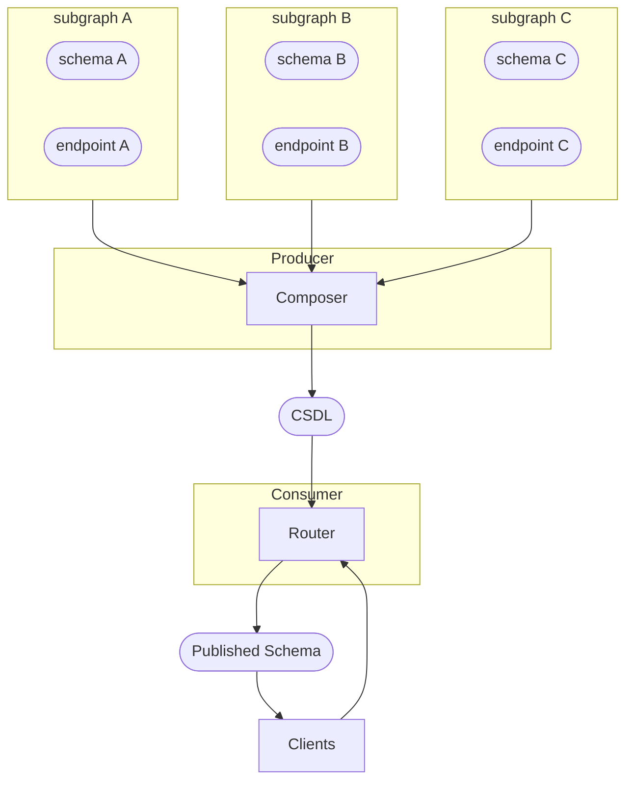

import './dark.less'

## Introduction: What is CSDL?

The Composed Schema Definition Language (CSDL) provides a way to describe a GraphQL Schema which is composed from one or more other GraphQL schemas.

The CSDL is intended to be a single artifact which can power a graph router. For example, the CSDL replaces the service list configuration of Apollo Gateway.

CSDL is a subset of the [GraphQL Schema Definition Language](https://spec.graphql.org/). It removes certain SDL features (for instance, type extensions are not permitted) while also requiring the definition of certain types and providing a suite of directives to describe graph topology. In particular, a CSDL can:
- define [subgraphs](#subgraph) and bind them to [endpoints](#endpoint) (with the required [`csdl_Graph`](#csdl_Graph) type and [`@csdl_endpoint`](#csdl_endpoint) directive)
- assign fields to subgraphs (with [`@csdl_resolve`](#resolve))
- declare additional data required and provided by subgraph field resolvers (with [`@csdl_key`](#key), and [`@csdl_resolve`](#csdl_resolve))

## How to read this document

TK, discussion of spec nomenclature
e.g.: https://html.spec.whatwg.org/multipage/introduction.html#how-to-read-this-specification

### What this document isn't

This document specifies the CSDL and only the CSDL. It does not have an opinion about how CSDL should be generated from subgraphs. A suggestion is provided in [Appendix: Basic Composition Algorithm](#appendix-suggested-composition-algorithm), but conforming implementations may choose approach they like.

## Example: Let's go to the moon

*This section is non-normative.*

We'll refer to this example throughout the document. The example consists of two example schemas—a `rockets` schema which serves data about rockets, and an `astronauts` service which services queries regarding the people flying on them—along with a CSDL that composes them.

### Rockets

<a name='ex-rockets' href='#ex-rockets' class='listing not-csdl'>Rockets example service</a>

```graphql
# Rockets Service
type Query {
  rockets: [Rocket]!
}

type Rocket @key(fields: "id") {
  id: String! 
  name: String!
  captain: Astronaut @provides(fields: "tripId")
}

extend type Astronaut @key(fields: "id") {
  id: String! @external
  tripId: String! @external
  rocket: Rocket!
}
```

### Astronauts

<a name='ex-astronauts' href='#ex-astronauts' class='listing not-csdl'>Astronauts example service</a>

```graphql
# Astronauts Service
type Query {
  astronauts: [Astronaut]!
}

type Astronaut @key(fields: "id") {
  id: String! 
  name: String!
  tripId: String!
}

extend type Rocket @key(fields: "id") {
  id: String! @external
  astronaut: Astronaut!
}
```

### CSDL: Rockets & Astronauts

This example is non-normative, and represents just one possible way to compose [rockets](#rockets) and [astronauts](#astronauts) into CSDL.

<a name='ex-rockets-and-astronauts' href='#ex-rockets-and-astronauts' class='listing'>Example CSDL composing `rockets` and `astronauts`</a>

```graphql
schema @using(spec: "https://apollo.dev/csdl/1") {
  query: Query
}

enum csdl_Graph {
  ROCKETS    @csdl_endpoint(url: "https://rockets.example.com"),
  ASTRONAUTS @csdl_endpoint(url: "https://astronauts.example.com"),
}

type Query {
  rockets: [Rocket]!       @csdl_resolve(graph: ROCKETS)
  astronauts: [Astronaut]! @csdl_resolve(graph: ASTRONAUTS)
}

type Astronaut
  @csdl_key(graph: ASTRONAUTS, repr: "{ id }")
  @csdl_key(graph: ROCKETS, repr: "{ id }")
{
  id: String!     @csdl_resolve(graph: ASTRONAUTS)
  name: String!   @csdl_resolve(graph: ASTRONAUTS)
  tripId: String! @csdl_resolve(graph: ASTRONAUTS)
  rocket: Rocket! @csdl_resolve(graph: ASTRONAUTS)
}

type Rocket 
  @csdl_key(graph: ASTRONAUTS, repr: "{ id }")
  @csdl_key(graph: ROCKETS, repr: "{ id }")
{
  id: String!           @csdl_resolve(graph: ROCKETS)
  name: String!         @csdl_resolve(graph: ROCKETS)
  astronaut: Astronaut! @csdl_resolve(graph: ASTRONAUTS)
  captain: Astronaut    @csdl_resolve(graph: ASTRONAUTS,
                                      provides: "{ tripId }")
}
```

The meaning of these directives is explored the [Directives](#directives) section.

## Composition Pipeline Roles



- **Producer** the bit that generates CSDL. spec will place requirements on composers.
- **Consumer** the bit that consumes CSDL. spec will place requirements on consumers.
- **Composer** a kind of producer which composes subgraph schemas into CSDL. (no requirements on consumers, diagrammed for clarity.)
- **Subgraphs** subgraphs which are composed by the composer (no requirements on subgraphs, diagrammed for clarity.)
- **Router** a kind of consumer which serves CSDL as a graphql endpoint. no requirements on routers, these are described in the federation spec.

## Structure

A CSDL document must be a valid [GraphQL schema definition language](https://spec.graphql.org/draft/#sec-Type-System) document.

CSDL removes certain SDL features, as described in the [divergence](#divergence-from-graphql-sdl) section. Nevertheless, CSDL consumers **should** be prepared to parse any valid GraphQL SDL. A CSDL document which contains disallowed SDL constructs **should** trigger validation errors after parsing.

CSDL introduces a suite of types and directives. All CSDL-specific types and directives are prefixed with `csdl_` as recommended in [the GraphQL specification](https://spec.graphql.org/draft/#note-ca863).

### Using this spec

CSDL documents **must** contain a `schema` declaration with a [versioned `@using` directive](./using).

```graphql
schema @using(spec: "https://apollo.dev/csdl/1")
```

### Divergence from GraphQL SDL
Formally, CSDL is a subset of the [GraphQL schema definition language](https://spec.graphql.org/draft/#sec-Type-System).

In particular, CSDL differs from GraphQL SDL in the following ways:
- **Extensions are forbidden.** You cannot `extend type` or `extend interface` within a CSDL document.
- **`schema @using(spec: "https://apollo.dev/csdl/1")` is mandatory.** 
- the CSDL must define certain types as described in the [mandatory types](#mandatory-types) section.

### Mandatory Types

A CSDL document **must** define a `csdl_Graph` enum. Each enum value defines a subgraph. Each value **must** be annotated with a `@csdl_endpoint` directive specifying the endpoint URL for the subgraph.

```graphql
enum csdl_Graph {
  ROCKETS @csdl_endpoint(url: "https://rockets.example.com"),
  ASTRONAUTS @csdl_endpoint(url: "https://astronauts.example.com"),
}
```

The `csdl_Graph` enum is used as input to csdl directives which link fields and types to subgraphs.

## Scalars

### `scalar csdl_SelectionSet`

A GraphQL selection set represented with the same syntax as defined in [the GraphQL SDL](https://spec.graphql.org/draft/#sec-Selection-Sets).

Note: Unlike the federation `_FieldSet` scalar, a `csdl_SelectionSet` must parse as a GraphQL selection set, so the selections must be surrounded by braces.

### `scalar csdl_Url`

A [URL](https://www.w3.org/Addressing/URL/url-spec.html).

## Data Model
TK, draws heavily from federation, a little more general.

### Realized types

A type is *realized* wherever a resolver from a particular *subgraph* returns that type. We use the notation `subgraph::Type` to represent `Type` realized by `subgraph` and `subgraph::Type.field` to represent the resolver for `Type.field` within `subgraph`.

<a class="listing">Query with resolvers and realized types</a>

```graphql
query {          # resolver                    | realizes
                 # ----------------------------|--------------
  rockets {      # rockets::Query.rockets     -> rockets::Rocket
    captain {    # rockets::Rocket.astronaut  -> rockets::Astronaut
      name       # astronauts::Astronaut.name -> String
      rocket {   # rockets::Astronaut.rocket  -> rockets::Rocket
        id       # rockets::Rocket.id         -> ID
      }
    }
  }

}
```

These distinctions are immaterial to the client. As far as clients are concerned, all selections on `Rocket` are the same.

This illusion is maintained by the router, which must break incoming queries into subqueries. In the example above, the path `rockets.captain` is resolved by the `rockets::Rocket.astronaut` resolver, so its selection set is realized as a `rockets::Astronaut`. However, there is no `name` field for `rockets::Astronaut`—instead, the only resolver for `Astronaut.name` is `astronauts::Astronaut.name`. To process this query, the router must "convert" a `rockets::Astronaut` to an `astronauts::Astronaut` via an `_entities` query.

### Portability
A type is *portable to* a subgraph if it has a `@csdl_key` for that subgraph.

### Free / Bound fields

Free fields can be resolved by any subgraph, bound fields can only be resolved by the subgraph they're bound to.

## Directives

### `@csdl_key`

<code class="grammar">
directive @csdl_key(graph: csdl_Graph!, repr: csdl_SelectionSet!)
  repeatable on OBJECT
</code>

Define an entity key for this type within a subgraph.

The `@csdl_key` directive tells consumers what subset of fields are necessary to identify this type of entity to a particular subgraph. It provides a way for csdl consumers to "switch graphs" when planning a query. For example:

<a name='query-port-astronaut-type' href='#query-port-astronaut-type' class='listing'>A query which requires porting the Astronaut type between services</a>

```graphql
query {          # resolver                    | realizes
                 # ----------------------------|--------------
  rockets {      # rockets::Query.rockets     -> rockets::Rocket
    captain {    # rockets::Rocket.astronaut  -> rockets::Astronaut
      name       # astronauts::Astronaut.name -> String
      rocket {   # rockets::Astronaut.rocket  -> rockets::Rocket
        id       # rockets::Rocket.id         -> ID
      }
    }
  }
  
}
```

`Astronaut.name` is provided by the `astronauts` subgraph. But the `captain` field is provided by the `rockets` subgraph.

The fields specified in `repr` will be passed to the subgraph's `Query._entities(representations:)` as an item within the `representations` list.

Multiple `@csdl_key`s can be provided for different graphs, or for the same graph.

<a name='using-csdl_key' href='#using-csdl_key' class='listing'>Using `@csdl_key` to specify subgraph keys</a>

```graphql
type Astronaut
  @csdl_key(graph: ASTRONAUTS, repr: "{ id }")
  @csdl_key(graph: ROCKETS, repr: "{ id }")
{ ... }
```

### `@csdl_endpoint`

<code class='grammar'>
directive @csdl_endpoint(url: csdl_Url) on ENUM_VALUE
</code>

Bind an endpoint URL to a subgraph. This directive is only valid on enum values within the required `csdl_Graph` enum type.

<a name='using-csdl_endpoint' href='#using-csdl_endpoint' class='listing'>Using `@csdl_endpoint` to specify subgraph endpoints</a>

```graphql
enum csdl_Graph {
  ROCKETS @csdl_endpoint(url: "https://rockets.example.com"),
  ASTRONAUTS @csdl_endpoint(url: "https://astronauts.example.com"),
}
```

### `@csdl_resolve`

<code class='grammar'>{`
directive @csdl_resolve(
  graph: csdl_Graph!,
  requires: csdl_SelectionSet,
  provides: csdl_SelectionSet) on FIELD_DEFINITION
`}</code>

Bind a subgraph resolver to this field.

Any field definitions without a `@csdl_resolve` directive are *free*. That is, the CSDL asserts they can be resolved by any subgraph in which the parent type can be found. Specifying `@csdl_resolve` binds a field to resolve in exactly one subgraph. Unless it is a root type, the enclosing type **must** be [portable](#portability) to the specified subgraph (it must have `@csdl_key`s specified for that graph).

<a name='using-csdl_resolve' href='#using-csdl_resolve' class='listing'>Using `@csdl_resolve` to specify subgraph resolvers</a>

```graphql
type Astronaut
  @csdl_key(graph: ASTRONAUTS, fields: "{ id }")
  @csdl_key(graph: ROCKETS, fields: "{ id }")
{
  id: String!     @csdl_resolve(graph: ASTRONAUTS)
  name: String!   @csdl_resolve(graph: ASTRONAUTS)
  tripId: String! @csdl_resolve(graph: ASTRONAUTS)
  rocket: Rocket! @csdl_resolve(graph: ASTRONAUTS)
}

type Rocket 
  @csdl_key(fields: "{ id }", graph: ASTRONAUTS)
  @csdl_key(fields: "{ id }", graph: ROCKETS)
{
  id: String!           @csdl_resolve(graph: ROCKETS)
  name: String!         @csdl_resolve(graph: ROCKETS)
  astronaut: Astronaut! @csdl_resolve(graph: ASTRONAUTS)
  captain: Astronaut    @csdl_resolve(graph: ASTRONAUTS,
                                      provides: "{ tripId }")
}
```

Fields on root types must always be bound to a subgraph:

<a name='using-csdl_resolve-root' href='#using-csdl_resolve-root' class='listing'>`@csdl_resolve` on root type fields</a>

```graphql
type Query {
  rockets: [Rocket]!       @csdl_resolve(graph: ROCKETS)
  astronauts: [Astronaut]! @csdl_resolve(graph: ASTRONAUTS)
}
```

## Validations

### validate all fields resolvable
### validate no extensions
### validate csdl version
### validate all fields resolvable


## Glossary
#### Endpoint
An endpoint is a running server which can resolve GraphQL queries against a schema. In this version of the spec, endpoints must be URLs, typically http/https URLs.
#### Graph Router
A GraphQL server which can resolve queries against a CSDL schema. Graph routers differ from standard GraphQL endpoints in that they are not expected to process data or communicate with (non-GraphQL) backend services on their own. Instead, graph routers receive GraphQL requests and service them by performing additional GraphQL requests.
#### Subgraph
Subgraphs are the GraphQL schemas which were composed to form the CSDL. A subgraph has:
  - a name, which must be unique within the CSDL
  - an [endpoint](#endpoint)

## Appendix: Suggested Composition Algorithm

TK
